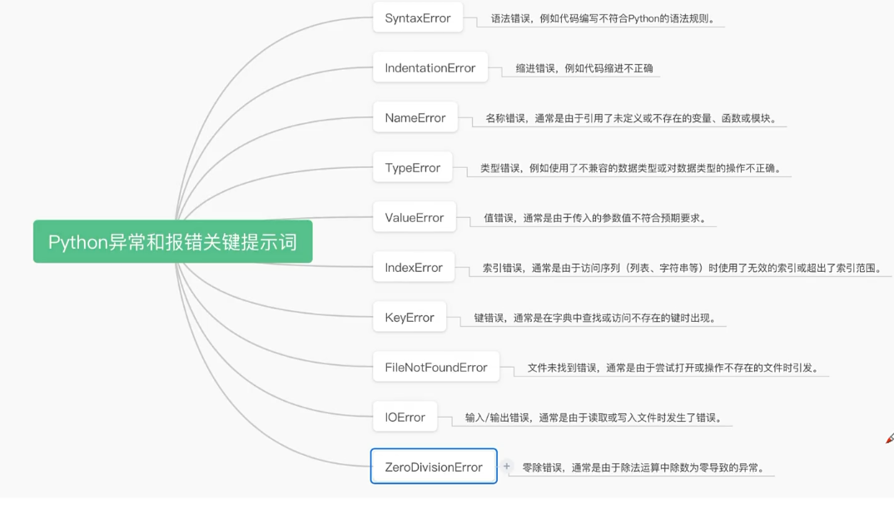
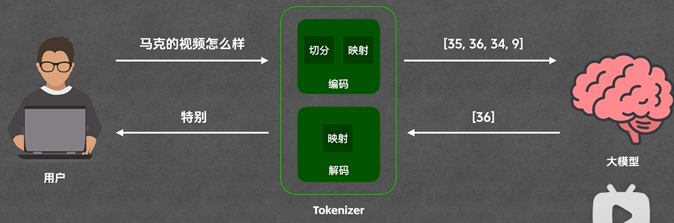
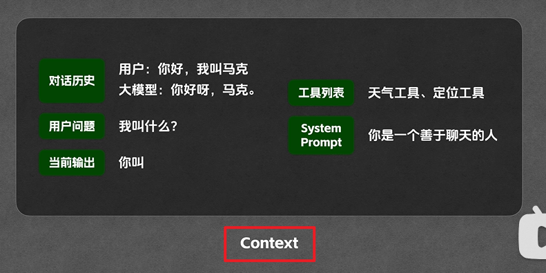
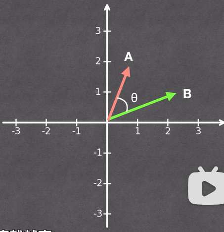
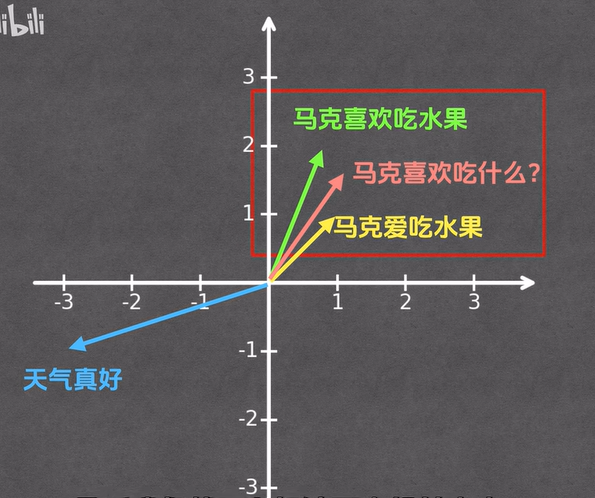
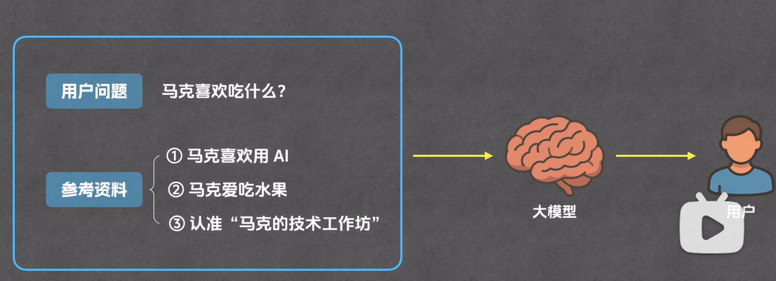

前端转 Agent 开发学习计划（综合版）

> 适用人群：有 1 年以上前端开发经验，希望转型 AI Agent 开发工程师的同学。
> 核心差异化：**从第一天就用可视化 UI 承载 Agent 完整链路**，让 Agent 行为透明、可调试、可演示。

# 目标

| 周次      | 目标                                          | 核心内容                                                     | 推荐资源                                                     |
| :-------- | :-------------------------------------------- | :----------------------------------------------------------- | :----------------------------------------------------------- |
| 第 1 周   | 建立正确认知                                  | Agent 三要素（思考 + 工具 + 记忆）；CoT/ReAct 基础推理范式；Token、流式输出、结构化 Prompt 规范 | Andrew Ng《AI Agent》公开课 / 李宏毅《Agent 发展脉络》       |
| 第 2 周   | 跑通带可视化 UI 的最简 Agent（前端特色 Demo） | LangChain JS / Vercel AI SDK Hello World；Next.js 流式对话；前端渲染 Agent 思考、工具调用状态 | Vercel AI SDK 官方文档、LangChain JS 中文教程 + B 站 "肖立新"AI Agent 系列 |
| 第 3-4 周 | 掌握双栈主流 Agent 框架（Python+JS）          | Python：LangGraph、CrewAI；JS：LangChain JS、Vercel AI SDK；记忆、工具、基础 RAG 集成 | LangGraph 官方文档、CrewAI 中文文档                          |
| 第 5-6 周 | 做出能用的 Agent                              | 自动周报/竞品搜集/简历助手                                   | 选 1-2 个真实需求改造                                        |
| 第 7 周+  | 进阶自由探索：复杂推理 + 多智能体 + 工程部署  | Plan-and-Execute 任务规划、多智能体协作；AutoGen、MetaGPT；Docker 打包、云端部署、密钥安全、日志监控 | AutoGen、MetaGPT 等                                          |


# python

## 字符串

- **第一种：普通字符串** [02:03](https://b.quark.cn/apps/5AZ7aRopS/routes/mofb35Rkb?debug=0&fid=ef717e6f379b473b81a6def3c9cbf6c1#?seek_t=123)

  - 使用单引号或双引号括起字符串内容。
  - 示例：`print("Hello")` 或 `print('World')`

- **第二种：原始字符串** [02:29](https://b.quark.cn/apps/5AZ7aRopS/routes/mofb35Rkb?debug=0&fid=ef717e6f379b473b81a6def3c9cbf6c1#?seek_t=149)

  - 使用前缀 `r` 表示原始字符串。
  - 不将反斜杠视为转义字符。
  - 示例：`print(r"C:\new\text.txt")` 输出 `C:\new\text.txt`
  - 应用于路径、正则表达式等需要保留反斜杠的场景。

- **第三种：三引号多行字符串** [05:13](https://b.quark.cn/apps/5AZ7aRopS/routes/mofb35Rkb?debug=0&fid=ef717e6f379b473b81a6def3c9cbf6c1#?seek_t=313)

  - 使用三个单引号或双引号括起内容。

  - 支持换行、包含引号。

  - 示例：

    ```python
    print('''一二三
    四五六''')
    ```

  - 可用于多行文本、文档字符串（docstring）。

- **第四种：格式化字符串（f-string）** [07:39](https://b.quark.cn/apps/5AZ7aRopS/routes/mofb35Rkb?debug=0&fid=ef717e6f379b473b81a6def3c9cbf6c1#?seek_t=459)

  - 使用前缀 `f` 或 `F`。

  - 在字符串中使用花括号 `{}` 插入变量或表达式。

  - 示例：

    python

    ```python
    name = "Tom"
    print(f"Hello, {name}")
    ```

  - 常用于动态输出信息，提升代码可读性。

- **第五种：Unicode字符串** [13:14](https://b.quark.cn/apps/5AZ7aRopS/routes/mofb35Rkb?debug=0&fid=ef717e6f379b473b81a6def3c9cbf6c1#?seek_t=794)

  - 使用前缀 `u` 表示Unicode字符串。
  - 示例：`u"你好"`
  - 用于处理非ASCII字符，避免文件编码问题。
  - 推荐配合标准库如 `codecs` 使用。

- **第六种：字节串（bytes）** [15:54](https://b.quark.cn/apps/5AZ7aRopS/routes/mofb35Rkb?debug=0&fid=ef717e6f379b473b81a6def3c9cbf6c1#?seek_t=954)

  - 使用前缀 `b` 表示字节串。

  - 示例：`b"hello"`

  - 表示二进制数据。

  - 常用于网络传输、文件操作中字节流处理。

  - 示例操作：

    python

    ```python
    data = b"hello"
    decoded = data.decode("utf-8")
    encoded = decoded.encode("utf-8")
    ```

- **Python与Java、JavaScript字符串对比** [18:12](https://b.quark.cn/apps/5AZ7aRopS/routes/mofb35Rkb?debug=0&fid=ef717e6f379b473b81a6def3c9cbf6c1#?seek_t=1092)

  - **定义方式**
    - Python：支持单引号、双引号、三引号。
    - Java：字符串用双引号表示，字符用单引号。
    - JavaScript：单引号、双引号均可，反斜杠用于换行。
  - **不可变性**
    - Python 和 Java 的字符串对象不可变，修改会创建新对象。
    - JavaScript 同样不可变。
    - Vue.js 等框架中变量可变，但不是字符串本身的特性。
  - **字符串方法**
    - Python 提供丰富内置方法（如 `split`, `replace`, `join` 等）。
    - Java 和 JavaScript 方法类似，但命名和参数略有不同。
    - 示例对比：
      - Python: `s.split()`
      - Java: `s.split("\\s+")`
      - JavaScript: `s.split(/\s+/)`
  - **格式化支持**
    - Python 有 f-string。
    - Java 使用 `String.format()` 或 `Formatter`类。
    - JavaScript 使用模板字符串（反引号 + `${}`）。
  - **多行支持**
    - Python 使用三引号。
    - JavaScript 使用反引号（`）。
    - Java 需手动拼接或使用 `\n`。

## 编码

### 一、常见字符编码标准

#### 1.1 ASCII

- 全称：美国信息交换标准代码（American Standard Code for Information Interchange）
- 包含 128 个字符，涵盖英文字母、数字、标点符号和控制字符
- **每个字符对应唯一的 7 位二进制数**
- 是最早的字符编码标准，也是许多其他编码的基础

#### 1.2 Unicode

- **使用一个二进制数值表示每个字符，确保全球范围内字符的唯一性**
- 目的是为全球所有语言字符提供统一的编码系统
- 不直接定义存储方式，只定义"字符→码点"的映射（如 `U+4E2D` = 中）

#### 1.3 UTF-8

- 可变长度 Unicode 编码方案，**使用 1 到 4 个字节表示一个字符**
- 完全兼容 ASCII，广泛用于网页设计、邮件传输等场景
- 无字节序问题，是目前的事实标准

#### 1.4 其他常见编码速查

| 编码         | 字节数   | 说明                                                       |
| ------------ | -------- | ---------------------------------------------------------- |
| UTF-8        | 1~4 字节 | 变长，兼容 ASCII，推荐首选                                 |
| UTF-16       | 2/4 字节 | Windows 内核 / JVM 内部使用，有 LE/BE 字节序               |
| GBK / GB2312 | 1~2 字节 | 中文编码，Windows 中文版默认代码页 936                     |
| Latin-1      | 1 字节   | 仅西欧字符；解码不抛异常（0x00-0xFF 全覆盖），常用于吞乱码 |

---

### 二、Python 3 编码核心机制

#### 2.1 两种数据类型

| 类型    | 含义                      | 场景         |
| ------- | ------------------------- | ------------ |
| `str`   | 内存中的 Unicode 码点序列 | 程序内部处理 |
| `bytes` | 磁盘/网络传输的字节序列   | IO 操作      |

两个方向的转换**必须显式指定编码**：

```python
# bytes → str（解码）
b'\xe4\xb8\xad'.decode('utf-8')   # '中'

# str → bytes（编码）
'中'.encode('utf-8')              # b'\xe4\xb8\xad'
```

#### 2.2 编码转换实践

**字符串 → UTF-8 字节序列**

```python
text = "你好"
byte_data = text.encode("utf-8")
print(byte_data)  # b'\xe4\xbd\xa0\xe5\xa5\xbd'
```

**UTF-8 字节序列 → 字符串**

```python
byte_data = b'\xe4\xbd\xa0\xe5\xa5\xbd'
text = byte_data.decode("utf-8")
print(text)  # 你好
```

#### 2.3 两大经典错误

| 错误                 | 原因                   | 典型场景                   |
| -------------------- | ---------------------- | -------------------------- |
| `UnicodeDecodeError` | 用错误编码解码字节流   | 用 UTF-8 读取 GBK 文件     |
| `UnicodeEncodeError` | 字符无法用目标编码表示 | `'中文'.encode('latin-1')` |

#### 2.4 编码错误处理

Python 的 `encode()` / `decode()` 支持 `errors` 参数：

| 参数                      | 行为               | 适用场景               |
| ------------------------- | ------------------ | ---------------------- |
| `errors='strict'`（默认） | 抛出异常           | 开发阶段，尽早暴露问题 |
| `errors='ignore'`         | 忽略无法处理的字符 | 数据清洗，丢弃损坏部分 |
| `errors='replace'`        | 用 `?` 替换        | 保留位置信息，便于排查 |

```python
# 示例：忽略无法解码的字节
b'\xff\xfehello'.decode('utf-8', errors='ignore')  # 'hello'

# 示例：替换无法编码的字符
'你好'.encode('latin-1', errors='replace')  # b'??'
```

#### 2.5 文件操作中的编码问题

**中文乱码根因**：文件编码与 Python 解释器默认编码不一致。

**解决方案**：统一显式使用 `encoding='utf-8'` 进行文件读写。

```python
# 读取文本文件
with open('test.txt', 'r', encoding='utf-8') as file:
    content = file.read()

# 写入文本文件
with open('output.txt', 'w', encoding='utf-8') as file:
    file.write('中文内容')

# 处理带 BOM 的 UTF-8 文件
with open('data.csv', 'r', encoding='utf-8-sig') as file:
    content = file.read()
```

#### 2.6 二进制文件处理

默认情况下 Python 将文件视为文本文件，读取二进制数据会出错（如 `\r\n` 自动转换）。二进制模式不会做任何转换：

```python
# 写入二进制数据
with open('data.bin', 'wb') as file:
    file.write(b'\x00\x01\x02\x03')

# 读取二进制数据
with open('data.bin', 'rb') as file:
    raw = file.read()
    print(raw)  # b'\x00\x01\x02\x03'
```

#### 2.7 最佳实践清单

| 场景     | 做法                                          | 反例                              |
| -------- | --------------------------------------------- | --------------------------------- |
| 文件读写 | 显式指定 `encoding='utf-8'`                   | 依赖系统 locale 默认值            |
| 源码声明 | `# -*- coding: utf-8 -*-` 放在文件头部        | 无声明                            |
| 标准 I/O | 设 `PYTHONIOENCODING=utf-8` 或 `PYTHONUTF8=1` | Windows 下不设，stdout 走 GBK     |
| CSV/JSON | 用 `encoding='utf-8-sig'` 处理带 BOM 的文件   | 不加 `-sig`，BOM 被当作内容       |
| 网络数据 | 先看 `Content-Type` / `charset`，再解码       | 盲目用 UTF-8 解所有响应           |
| 数据库   | 连接串指定 `charset=utf8mb4`                  | `utf8`（仅 3 字节，不兼容 emoji） |

---

### 三、Agent 场景下的字符编码

#### 3.1 Agent 链路中的编码陷阱

```
用户输入 → 前端 → API → LLM → 工具调用（Shell/Python/文件读写）→ 返回 → 前端渲染
```

每个环节都可能发生编码丢失或转换错误。

| 环节                 | 典型问题                                  | 根因                                              |
| -------------------- | ----------------------------------------- | ------------------------------------------------- |
| Windows 终端工具调用 | 中文文件读取后变 `è…`                     | PowerShell 默认 GBK（cp936），Agent 按 UTF-8 解析 |
| Linux/macOS Shell    | `LANG=C` 时中文变 `???`                   | locale 未设为 UTF-8                               |
| LLM 输出             | BPE tokenizer 边界切分导致 emoji/CJK 截断 | BPE 按字节切分，多字节字符可能被拆散              |
| 工具链传递           | 文件名含中文，传给 Shell 时被转义         | 参数未做 encoding 保护                            |
| 上下文污染           | 一次乱码进入 session 记忆，后续持续出错   | 乱码字节被当作合法文本存储                        |

#### 3.2 Windows Agent 乱码修复

中文 Windows 下 Agent 最常见的编码故障：

**原因**：Windows PowerShell 默认代码页 936（GBK），Agent 工具通过 Shell 执行命令时按 UTF-8 解析输出 → 中文乱码。

| 修复方法        | 命令                                                         | 作用范围     |
| --------------- | ------------------------------------------------------------ | ------------ |
| 切换代码页      | `chcp 65001`                                                 | 当前终端会话 |
| 永久修改        | 注册表 `HKCU\Console\CodePage` = 65001                       | 新打开的终端 |
| Python 环境变量 | `PYTHONIOENCODING=utf-8` + `PYTHONUTF8=1`                    | Python 进程  |
| PowerShell 配置 | `$OutputEncoding = [Console]::OutputEncoding = [Text.Encoding]::UTF8` | 当前 PS 会话 |

#### 3.3 Agent System Prompt 语言锁定

| 层级          | 方法                   | 效果                          |
| ------------- | ---------------------- | ----------------------------- |
| System Prompt | 声明语言偏好           | 最高优先级                    |
| 工具返回      | 指定英文结果翻译成中文 | 防止工具输出带偏 LLM          |
| 文件编码      | 所有读写默认 UTF-8     | 避免 Agent 读写文件时编码错误 |

---

### 四、总结

| 维度     | Python 侧                         | Agent 侧                               |
| -------- | --------------------------------- | -------------------------------------- |
| 核心问题 | str/bytes 转换编码不匹配          | 工具链多环节编码不一致                 |
| 高发场景 | 文件读写、网络请求、数据库        | Shell 输出解析、文件操作工具           |
| 根因     | 依赖系统 locale 隐式编码          | PowerShell 默认 GBK + Agent 默认 UTF-8 |
| 解法     | 所有 IO 显式传 `encoding='utf-8'` | chcp 65001 + 环境变量 + Prompt 声明    |
| 兜底     | `errors='ignore'` / `replace`     | 工具结果 try/except 编码检测容错       |

**核心记忆**：`str` 在内存，`bytes` 在 IO，两者间转换永远显式传 `encoding`。
*（内容由AI生成，仅供参考）*

## 异常



## 异步

await 和 yield 本质是两种完全不同的机制，但都能让函数"暂停再恢复"，所以容易被混淆。核心区别一句话：**yield 造迭代器/生成器，await 等待协程完成**。

**一句话记忆：yield = "我暂停，给你一个值"；await = "我暂停，等你给我一个值"。**

### 对比表

| 维度           | yield                                                        | await                                                        |
| -------------- | ------------------------------------------------------------ | ------------------------------------------------------------ |
| 所属概念       | 生成器（Generator）                                          | 协程（Coroutine）                                            |
| 定义函数       | `def`（返回生成器）                                          | `async def`（返回协程）                                      |
| **调用后得到** | 生成器对象（`<generator object>`），不执行函数体             | 协程对象，不立即执行                                         |
| **触发执行**   | [next()](vscode-file://vscode-app/Applications/Visual Studio Code.app/Contents/Resources/app/out/vs/code/electron-browser/workbench/workbench.html) / `for` 循环迭代 | `await` / [asyncio.run()](vscode-file://vscode-app/Applications/Visual Studio Code.app/Contents/Resources/app/out/vs/code/electron-browser/workbench/workbench.html) / `gather()` |
| 暂停/恢复      | 把值"吐出去"给调用方，恢复时可能收到新值（`send`）           | 等待另一个可等待对象完成，不向调用方传值                     |
| 核心用途       | 惰性生成序列、流式处理、内存友好                             | 异步 IO、并发、非阻塞等待                                    |
| 数据流向       | 双向（可 `yield` 出去，也可 `send` 进来）                    | 单向（只"取回"结果）                                         |
| 暂停时机       | 每次 [next()](vscode-file://vscode-app/Applications/Visual Studio Code.app/Contents/Resources/app/out/vs/code/electron-browser/workbench/workbench.html)/迭代时，主动让出控制权 | 遇到 IO 等待时让出事件循环                                   |
| **消费方式**   | [next(gen)](vscode-file://vscode-app/Applications/Visual Studio Code.app/Contents/Resources/app/out/vs/code/electron-browser/workbench/workbench.html) 或 [for x in gen](vscode-file://vscode-app/Applications/Visual Studio Code.app/Contents/Resources/app/out/vs/code/electron-browser/workbench/workbench.html) | `await coro()` 取返回值                                      |
| **是否阻塞**   | 不阻塞，但仍是同步执行                                       | 不阻塞，挂起时让出事件循环                                   |
| **可重复使用** | 一次性：迭代完再迭代为空 `[]`                                | 每次 `await` 都需新协程对象                                  |
| **能否组合**   | 可嵌套、可管道（`for` 接力）                                 | 可 `gather`、可 `await` 链式调用                             |

### 代码对比

**yield：惰性生成序列**

python![复制](data:image/svg+xml,%3csvg%20xmlns='http://www.w3.org/2000/svg'%20width='16'%20height='16'%20viewBox='0%200%2016%2016'%20fill='none'%3e%3cpath%20fill-rule='evenodd'%20clip-rule='evenodd'%20d='M13.3965%201.16699C14.1902%201.16726%2014.834%201.81172%2014.834%202.60547V10.7305C14.8337%2011.524%2014.19%2012.1677%2013.3965%2012.168H12.167V13.3965C12.1669%2014.1902%2011.5231%2014.8337%2010.7295%2014.834H2.60449C1.81062%2014.834%201.16608%2014.1903%201.16602%2013.3965V5.27148C1.16602%204.47758%201.81058%203.83398%202.60449%203.83398H3.83398V2.60547C3.83398%201.81156%204.47758%201.16699%205.27148%201.16699H13.3965ZM2.60449%204.83398C2.36287%204.83398%202.16699%205.02986%202.16699%205.27148V13.3965C2.16706%2013.6381%202.36291%2013.834%202.60449%2013.834H10.7295C10.9709%2013.8337%2011.1669%2013.6379%2011.167%2013.3965V5.27148C11.167%205.03002%2010.9709%204.83425%2010.7295%204.83398H2.60449ZM5.27148%202.16797C5.02986%202.16797%204.83398%202.36384%204.83398%202.60547V3.83398H10.7295C11.5232%203.83425%2012.167%204.47774%2012.167%205.27148V11.168H13.3965C13.6377%2011.1677%2013.8337%2010.9717%2013.834%2010.7305V2.60547C13.834%202.36401%2013.6379%202.16823%2013.3965%202.16797H5.27148Z'%20fill='black'%20fill-opacity='0.5'/%3e%3c/svg%3e)

```python
def countdown(n):
    while n > 0:
        yield n          # 吐出一个值，函数暂停
        n -= 1

g = countdown(3)
print(next(g))  # 3
print(next(g))  # 2
```

**g生成器对象（generator object）,生成器对象是可迭代的（iterable），可以直接放进 `for` 循环**

**await：等待异步结果**

python![复制](data:image/svg+xml,%3csvg%20xmlns='http://www.w3.org/2000/svg'%20width='16'%20height='16'%20viewBox='0%200%2016%2016'%20fill='none'%3e%3cpath%20fill-rule='evenodd'%20clip-rule='evenodd'%20d='M13.3965%201.16699C14.1902%201.16726%2014.834%201.81172%2014.834%202.60547V10.7305C14.8337%2011.524%2014.19%2012.1677%2013.3965%2012.168H12.167V13.3965C12.1669%2014.1902%2011.5231%2014.8337%2010.7295%2014.834H2.60449C1.81062%2014.834%201.16608%2014.1903%201.16602%2013.3965V5.27148C1.16602%204.47758%201.81058%203.83398%202.60449%203.83398H3.83398V2.60547C3.83398%201.81156%204.47758%201.16699%205.27148%201.16699H13.3965ZM2.60449%204.83398C2.36287%204.83398%202.16699%205.02986%202.16699%205.27148V13.3965C2.16706%2013.6381%202.36291%2013.834%202.60449%2013.834H10.7295C10.9709%2013.8337%2011.1669%2013.6379%2011.167%2013.3965V5.27148C11.167%205.03002%2010.9709%204.83425%2010.7295%204.83398H2.60449ZM5.27148%202.16797C5.02986%202.16797%204.83398%202.36384%204.83398%202.60547V3.83398H10.7295C11.5232%203.83425%2012.167%204.47774%2012.167%205.27148V11.168H13.3965C13.6377%2011.1677%2013.8337%2010.9717%2013.834%2010.7305V2.60547C13.834%202.36401%2013.6379%202.16823%2013.3965%202.16797H5.27148Z'%20fill='black'%20fill-opacity='0.5'/%3e%3c/svg%3e)

```python
import asyncio

async def fetch():
    await asyncio.sleep(1)   # 挂起自己，把控制权交回事件循环
    return "done"

async def main():
    result = await fetch()   # 等待协程完成，拿到返回值
    print(result)
```

### 一个容易混淆的点

两者可以**组合使用**——async def 里也能写 yield，得到的是**异步生成器**：

python![复制](data:image/svg+xml,%3csvg%20xmlns='http://www.w3.org/2000/svg'%20width='16'%20height='16'%20viewBox='0%200%2016%2016'%20fill='none'%3e%3cpath%20fill-rule='evenodd'%20clip-rule='evenodd'%20d='M13.3965%201.16699C14.1902%201.16726%2014.834%201.81172%2014.834%202.60547V10.7305C14.8337%2011.524%2014.19%2012.1677%2013.3965%2012.168H12.167V13.3965C12.1669%2014.1902%2011.5231%2014.8337%2010.7295%2014.834H2.60449C1.81062%2014.834%201.16608%2014.1903%201.16602%2013.3965V5.27148C1.16602%204.47758%201.81058%203.83398%202.60449%203.83398H3.83398V2.60547C3.83398%201.81156%204.47758%201.16699%205.27148%201.16699H13.3965ZM2.60449%204.83398C2.36287%204.83398%202.16699%205.02986%202.16699%205.27148V13.3965C2.16706%2013.6381%202.36291%2013.834%202.60449%2013.834H10.7295C10.9709%2013.8337%2011.1669%2013.6379%2011.167%2013.3965V5.27148C11.167%205.03002%2010.9709%204.83425%2010.7295%204.83398H2.60449ZM5.27148%202.16797C5.02986%202.16797%204.83398%202.36384%204.83398%202.60547V3.83398H10.7295C11.5232%203.83425%2012.167%204.47774%2012.167%205.27148V11.168H13.3965C13.6377%2011.1677%2013.8337%2010.9717%2013.834%2010.7305V2.60547C13.834%202.36401%2013.6379%202.16823%2013.3965%202.16797H5.27148Z'%20fill='black'%20fill-opacity='0.5'/%3e%3c/svg%3e)

```python
async def async_counter(n):
    for i in range(n):
        await asyncio.sleep(0.1)  # 异步等待
        yield i                    # 异步产出
```

这时它既是协程（能 await）又是生成器（能 async for 迭代），两者不冲突。

## json

 `json.dumps()` 将 Python 字典转为 JSON 字符串，`ensure_ascii=False` 用于保留中文，不将中文转换成 `\u4f60\u597d`。这个结果随后交给 SSE 响应组件发送给前端。

## 装饰器

Python 装饰器（Decorator）是一种特殊的函数，它可以在不修改原函数代码和调用方式的前提下，为函数增加额外的功能。

### 代码概念

```
def a_new_decorator(a_func):
 
    def wrapTheFunction():
        print("I am doing some boring work before executing a_func()")
 
        a_func()
 
        print("I am doing some boring work after executing a_func()")
 
    return wrapTheFunction
 
def a_function_requiring_decoration():
    print("I am the function which needs some decoration to remove my foul smell")
 
a_function_requiring_decoration()
#outputs: "I am the function which needs some decoration to remove my foul smell"
 
a_function_requiring_decoration = a_new_decorator(a_function_requiring_decoration)
#now a_function_requiring_decoration is wrapped by wrapTheFunction()
 
a_function_requiring_decoration()
#outputs:I am doing some boring work before executing a_func()
#        I am the function which needs some decoration to remove my foul smell
#        I am doing some boring work after executing a_func()
```

```
@a_new_decorator
def a_function_requiring_decoration():
    """Hey you! Decorate me!"""
    print("I am the function which needs some decoration to "
          "remove my foul smell")
 
a_function_requiring_decoration()
#outputs: I am doing some boring work before executing a_func()
#         I am the function which needs some decoration to remove my foul smell
#         I am doing some boring work after executing a_func()
 
#the @a_new_decorator is just a short way of saying:
a_function_requiring_decoration = a_new_decorator(a_function_requiring_decoration)
```

如果我们运行如下代码会存在一个问题：

```
print(a_function_requiring_decoration.__name__)
# Output: wrapTheFunction
```

这并不是我们想要的！Ouput输出应该是"a_function_requiring_decoration"。这里的函数被warpTheFunction替代了。它重写了我们函数的名字和注释文档(docstring)。幸运的是Python提供给我们一个简单的函数来解决这个问题，那就是functools.wraps。我们修改上一个例子来使用functools.wraps：

```
from functools import wraps
 
def a_new_decorator(a_func):
    @wraps(a_func)
    def wrapTheFunction():
        print("I am doing some boring work before executing a_func()")
        a_func()
        print("I am doing some boring work after executing a_func()")
    return wrapTheFunction
 
@a_new_decorator
def a_function_requiring_decoration():
    """Hey yo! Decorate me!"""
    print("I am the function which needs some decoration to "
          "remove my foul smell")
 
print(a_function_requiring_decoration.__name__)
# Output: a_function_requiring_decoration
```

### 应用场景

- **日志记录**：自动记录函数的调用日志、参数和返回值。
- **权限验证**：在 Web 框架中检查用户是否登录。
- **性能测试**：统计函数执行的耗时。
- **缓存数据**：保存函数的返回结果，避免重复计算（如 `functools.lru_cache`）。

## sse

### EventSourceResponse

```
 # EventSourceResponse 是 sse-starlette 提供的 SSE（Server-Sent Events）流式响应类。
    # 它会持续读取迭代器产生的数据，并通过 HTTP text/event-stream 响应逐条发送给客户端。
    return EventSourceResponse(
        stream_chat_events(
            message=req.message,
            model=req.model,
            conversation_id=req.conversation_id,
            client_request_id=req.client_request_id,
        ),
        sep="\n",
    )
```


### sse_event

`sse_event()作用是把事件名称和事件数据转换成 SSE 响应格式：

```
def sse_event(event: str, data: dict[str, Any]) -> dict[str, str]:
    return {
        'event': event,
        'data': json.dumps(data, ensure_ascii=False),
    }
```

例如调用：

```
sse_event('answer_delta', {'content': '你好'})
```

会返回类似：

```
{
  'event': 'answer_delta',
  'data': '{"content": "你好"}',
}
```


# 入门

https://www.modb.pro/db/1881156671699955712

## 机器学习

- 是人工智能的一个分支，指通过算法和统计模型从数据中自动**学习规律**，并利用这些规律进行预测或决策。
- 核心思想：从数据中提取特征并建立模型。

### 深度学习

- 是机器学习的一个子领域，基于人工神经网络（ANN）的结构和算法。
- 核心思想：通过多层神经网络（通常称为"深度"网络）自动学习数据的高层次特征。

### 总结

| 特性           | 机器学习                         | 深度学习                           |
| :------------- | :------------------------------- | :--------------------------------- |
| **特征工程**   | 需要手动设计和提取特征           | 自动从数据中学习特征               |
| **模型复杂度** | 模型较简单（如线性回归、SVM 等） | 模型复杂（多层神经网络）           |
| **数据需求**   | 数据量较小也能有效工作           | 需要大量数据才能发挥优势           |
| **计算资源**   | 对计算资源要求较低               | 对计算资源要求较高（GPU 加速）     |
| **应用场景**   | 结构化数据（如表格数据）         | 非结构化数据（如图像、语音、文本） |

## 自然语言处理（NLP）

‌自然语言处理（NLP）是人工智能领域的重要分支‌，旨在使计算机能够理解、解释和生成人类语言，实现人机之间的自然交互。其核心任务包括语言翻译、情感分析、文本生成等，广泛应用于机器翻译、问答系统、聊天机器人等领域


## Token

> **通常情况下，中文比英文更节省token。**

Token是指在自然语言处理（NLP）模型中，输入文本被分割成的最小单位（通常是单词、子词或字符），这些单位被称为 **Token**。

1个英文字符≈0.3个token。1个中文字符≈0.6个token。

1 个 token 对应字符数

| **英文** | 约 **3.3 个字符** |
| -------- | ----------------- |
| **中文** | 约 **1.7 个字符** |

### 原理



- 在大语言模型（如 GPT 系列、BERT 等）中，输入文本会被分词器（Tokenizer）拆分为 Token 序列。
- 分词器会根据预定义的词汇表（Vocabulary）将文本映射为对应的 Token ID，这些 ID 是模型可以理解的数字表示。

假设我们有以下文本：

```
Hello, how are you doing today?
```

**分词过程**

1. 使用分词器将文本拆分为 Token：

   ```
   ["Hello", ",", "how", "are", "you", "doing", "today", "?"]
   ```

2. 将每个 Token 映射为 Vocabulary 中的唯一 ID：

   ```
   [123, 456, 789, 1011, 1213, 1415, 1617, 1819]
   ```

**输入到模型**

- 模型接收到的是 Token ID 序列 `[123, 456, 789, 1011, 1213, 1415, 1617, 1819]`。
- 模型通过分析这些 Token 的关系和上下文生成输出。

### 作用

- **表示输入信息**：上下文 Token 是模型接收输入的主要形式。模型通过分析这些 Token 的序列来理解输入内容。
- **控制上下文长度**：模型对上下文 Token 的数量有限制（例如 GPT-3 的最大上下文长度为 2048 Token，GPT-4 支持更长的上下文，如 32K Token）。
- **生成输出**：模型基于输入的上下文 Token 生成新的 Token 序列作为输出。

### context

**大模型每次处理任务时所接收到的信息总和**



> 虽然现代模型支持 128K 甚至 192K 的上下文长度，但在编码场景下，这些上下文往往仍然不足。像Claude Code这类的工具，在上下文做了很多优化（后续会分享一些），但是上下文越长，**AI 生成代码出现幻觉的概率就越高**，后续修正过程会消耗更多资源。

- **影响模型性能**：**上下文 Token 的数量决定了模型能够"记住"多少信息。**更多的 Token 意味着模型可以利用更丰富的上下文进行推理。
- **成本因素**：上下文 Token 越多，计算资源需求越高，使用成本也越高。
- **应用场景**：对于需要处理长文档的任务（如法律文件分析、科学论文总结），支持更多上下文 Token 的模型更具优势。

### context window

大模型的Context最多能够存储的Token量

## RAG

### 背景 

**context 过多**

- 模型无法读取所有内容
- 模型推理成本高
- 模型推理慢
- **会导致LLM产生幻觉**

### 知识

#### RAG的原理

- 检索（Retrieval）：当用户提出问题时，系统会从外部的知识库中检索出与用户输入相关的内容。
  - 检索（Retrieval）的详细过程：
    - 准备外部知识库：外部知识库可能来自本地的文件、搜索引擎结果、API 等等。
    - 通过Embedding（嵌入）模型，对知识库文件进行解析：**Embedding的主要作用是将自然语言转化为机器可以理解的高维向量**，并且通过这一过程捕获到文本背后的语义信息（比如不同文本之间的相似度关系）；
    - 通过Embedding（嵌入）模型，对用户的提问进行处理：用户的输入同样会经过嵌入（Embedding）处理，生成一个高维向量。
    - 拿用户的提问去匹配本地知识库：使用这个用户输入生成的这个高纬向量，去查询知识库中相关的文档片段。在这个过程中，系统会**利用某些相似度度量（如余弦相似度）去判断相似度。**
  - 模型的分类：Chat模型、Embedding模型；
  - 简而言之：Embedding模型是用来对你上传的附件进行解析的；
- 增强（Augmentation）：系统将检索到的信息与用户的输入结合，扩展模型的上下文。然后再传给生成模型（也就是Deepseek）；
- 生成（Generation）：生成模型基于增强后的输入生成最终的回答。由于这一回答参考了外部知识库中的内容，因此更加准确可读。

#### 微调

微调技术和RAG技术：

- 微调：在已有的预训练模型基础上，再结合特定任务的数据集进一步对其进行训练，使得模型在这一领域中表现更好（考前复习）；

- RAG：在生成回答之前，通过信息检索从外部知识库中查找与问题相关的知识，增强生成过程中的信息来源，从而提升生成的质量和准确性（考试带小抄）。
- 共同点：都是为了赋予模型某个领域的特定知识，解决大模型的幻觉问题。

#### 向量

概念：有大小有方向的量
示例：[1.0，2.3，5.76，5.8，10.1，-3.6]

#### 向量相似度计算

- 余弦相似度，夹角越小相似度越高

  

- 欧氏距离：距离越小相似度越高

  

- 点积：通过代数（Ａ垂直Ｂ点到原点的距离＊Ｂ到原点的距离），不仅是方向还有长度

  

### 流程


#### 准备过程

##### 分片

- 字数
- 段落
- 章节
- 页码

##### 索引

- 通过 Embedding 将片段文本转换为向量

  含义相近的文本在进入Embedding 后，对应的向量是相近的

  

- 将片段文本和片段向量存入向量数据库中

  一般的向量数据库表格里面至少都会有原始文本和向量

  

  

#### 回答过程

##### 召回

根据相似度大小，取十份相似度最高的


##### 重排

从十份相似度最高的的向量中取３份


###### rank 模型

‌Rank 模型‌（排序模型）是信息检索、推荐系统和 RAG（检索增强生成）等 AI 应用中的关键组件，负责对初步检索或召回得到的候选结果进行‌精细化重排序‌，以提升最终输出的相关性与准确性。

##### 生成




#  LLM

## LLM 概述

### 定义

LLM（大语言模型）是一类基于深度学习的人工智能模型，旨在处理和生成自然语言文本。通过在大规模文本数据上进行训练，大语言模型能够理解并生成与人类语言相似的文本，执行各类自然语言处理任务。

### 应用场景

大语言模型具有强大的泛化能力，能够处理多种任务。典型的应用场景包括：

- 文本生成
- 机器翻译
- 摘要生成
- 对话系统
- 情感分析

## LLM 的训练与使用

### 训练阶段

#### 预训练阶段

模型在大规模未标注文本数据上进行自监督学习，学习通用的语言表示。

#### 微调阶段

模型在特定任务的标注数据上进行有监督学习，调整模型参数以适应具体任务需求。

### 基于 LLM 的 Agent 框架

#### 核心组件

- **LLM**：对标人类大脑，思考如何解决问题、给出怎样的回答。
- **记忆**：包含长期记忆与短期记忆。即智能体使用的历史记录、系统数据，以及智能体执行过程中产生的各种中间信息。
- **规划技能**：涵盖提示词编排、意图理解、任务分解、自我反思。
- **工具使用**：智能体在执行任务中可能会使用到的各种工具接口。

## 整体架构概览

### 架构流程

LLM 的整体架构流程为：Tokenizer（分词器）→ Embedding（嵌入层）→ Transformer（核心处理层）→ Output（输出层）。

#### Tokenizer（分词器）

将输入文本切分成 Token，并为每个 Token 分配唯一整数 ID。不同模型使用不同的 Tokenizer 规则。

#### Embedding（嵌入层）

将 Token ID 转换为高维向量，赋予语义含义。维度越多，表示越复杂细致。同时编码位置信息。

#### Transformer（核心处理层）

作为 LLM 的大脑，通过 Self-Attention 机制让 Token 之间相互"交流"，计算注意力权重。输入 Embedding 被转化为 Q（Query）、K（Key）、V（Value）三种形态，通过矩阵运算理解上下文语境。

#### Output（输出层）

将 Transformer 处理后的结果转化为概率分布，预测下一个最可能出现的 Token。

## 训练阶段的底层计算（Training）

### 什么是训练

#### 训练过程

训练时，模型一次性看到完整的上下文序列，并行计算所有位置的预测。训练过程会把不同 token 同时出现的概率存入"神经网络"文件。保存的数据就是"参数"，也叫"权重"。大模型阅读了人类说过的所有的话，这就是"机器学习"。

### Causal Mask 的作用

#### 实现机制

在训练时，使用因果掩码（Causal Mask）确保模型只能看到当前位置及之前的 Token，不能看到未来的 Token。

- **实现方式**：在注意力得分矩阵上，将上三角部分（未来位置）设置为负无穷，经过 softmax 后对应位置概率为 0。
- **目的**：这样训练出来的模型才能正确地进行自回归生成。

## 推理阶段的底层计算（Inference）

### 什么是推理

#### 推理过程

给推理程序若干 token，程序会加载大模型权重，算出概率最高的下一个 token 是什么。用生成的 token 再加上上文，就能继续生成下一个 token。以此类推，生成更多文字。

### 推理 ≠ 训练

#### 核心区别

- 训练时是并行计算所有位置，推理时是逐个 Token 生成。
- 训练需要完整序列和标签，推理只需要前面的上下文。

## 自回归与注意力机制（Autoregressive & Attention）

### 自回归的本质

#### 串行生成特性

自回归（Autoregressive）模型的本质是：生成第 n+1 个 Token 时，模型需要把前面所有内容（提示词 M 个 + 已输出 n 个）都当作输入重新计算一遍，才能预测下一个词。因为下一步必须依赖上一步的结果，所以无法并行，只能串行。

#### 具体过程

- 生成第 1 个 Token 时：输入 = M 个提示词 Token
- 生成第 2 个 Token 时：输入 = M + 1 个 Token
- 生成第 3 个 Token 时：输入 = M + 2 个 Token
- ...
- 生成第 n+1 个 Token 时：输入 = M + n 个 Token

### 注意力机制：Q/K/V 的含义

#### 核心概念

- **Q（Query）**：当前 Token 的"查询"，表示"我想找什么"。
- **K（Key）**：每个 Token 的"索引键"，表示"我有什么线索"。
- **V（Value）**：每个 Token 的"实际内容"，表示"我的内容是什么"。

#### 计算逻辑

通过计算 Q 和所有 K 的相似度，得到"该关注谁"的权重（softmax 归一化），再对 V 做加权求和，得到"结合上下文后的新表示"。Multi-head 就是并行做多组注意力，让模型能同时学到多种关系（语法、指代、主题等）。

### Causal Mask 原理

#### 保证因果性

在自回归推理时，Causal Mask 确保每个位置只能关注到自身及之前的位置。

- **实现**：在注意力计算时，对当前行之后的位置（未来位置）的得分设为负无穷，使 softmax 后概率为 0。
- **作用**：这保证了推理时的因果性——生成第 t 个 Token 时，不会"偷看"到第 t+1 个及之后的 Token。

## 推理的两个阶段：预填充 vs 解码

预填充阶段：
┌─────────────────────────────────────────┐
│  输入: [你, 好, ，, 今, 天]              │
│       ↓ 一次性并行                      │
│  Q: [q1, q2, q3, q4, q5]               │
│  K: [k1, k2, k3, k4, k5]  ← 全部算出    │
│  V: [v1, v2, v3, v4, v5]  ← 全部算出    │
│       ↓                                 │
│  Attention: 5×5 矩阵一次性算              │
│       ↓                                 │
│  输出: 5 个位置的预测 + KV Cache 存入显存 │
└─────────────────────────────────────────┘

解码阶段（生成第 6 个 Token）：
┌─────────────────────────────────────────┐
│  输入: [怎]  ← 只输入一个新 Token         │
│       ↓                                 │
│  Q: [q6]         ← 只算 1 个             │
│  K: [k1..k5] + [k6]  ← 前5个读缓存，新算1个│
│  V: [v1..v5] + [v6]  ← 前5个读缓存，新算1个│
│       ↓                                 │
│  Attention: 1×6 向量计算                  │
│       ↓                                 │
│  输出: 预测下一个 Token                   │
└─────────────────────────────────────────┘

### 预填充（Prefill）

#### 阶段概述

预填充等于首次把提示词完整过一遍模型（并行、高效），同时建立 KV Cache，为后续逐 Token 的解码铺路。

#### 在 Transformer 中的操作

把整段提示词一次性输入 Transformer，做一次完整的前向传播。所有 Token 同时算，矩阵乘法一次完成。提示词的所有 Token 并行输入，每层 Transformer 中先做注意力计算，再做前馈网络计算，同时把所有 Token 的 K、V 向量存入 KV Cache。

#### 流程示意

- 输入: [你, 好, ，, 今, 天]
- 一次性并行 → Q/K/V 全部算出 → Attention 5×5 矩阵一次性算 → 输出 5 个位置的预测 + KV Cache 存入显存

### 解码（Decode）

#### 阶段概述

每生成一个新 Token，就把它的信息喂进同一个 Transformer，再算一次前向传播，得到下一个 Token 的概率分布。如此循环，直到输出结束。

#### 在 Transformer 中的操作

每生成一个新 Token，就把这个 Token 输入 Transformer，做一次前向传播。只算新 Token 的注意力，复用之前缓存的 K/V。解码的瓶颈在显存数据传输，而非计算。

#### 流程示意（生成第 6 个 Token）

- 输入: [怎] ← 只输入一个新 Token
- Q: [q6] ← 只算 1 个
- K: [k1..k5] + [k6] ← 前5个读缓存，新算1个
- V: [v1..v5] + [v6] ← 前5个读缓存，新算1个
- Attention: 1×6 向量计算 → 输出: 预测下一个 Token

### 预填充 vs 解码 对比表

| 对比项     | 输入（Prefill） | 输出（Decode）         |
| :--------- | :-------------- | :--------------------- |
| 计算方式   | 一次性并行      | 逐个串行               |
| 计算量     | O(M)            | O(N×M + N²)            |
| GPU 利用率 | 高              | 低（显存带宽瓶颈）     |
| 计费策略   | 通常较便宜      | 通常较贵（尤其长输出） |
| 优化空间   | 可用缓存加速    | 可用投机解码等加速     |

- 输出越长，每次计算都要带上更长的上文，成本越滚越大
- 所以很多模型对超长输出**加价计费**——这不是玄学，是物理上算力成本决定的
- 这也解释了为什么 **Prompt 尽量短、输出别太长**，能明显省成本

一句话总结：**预填充可以并行、便宜；解码必须串行且成本随输出长度平方增长**，所以模型对长输出收更贵。

## KV Cache 与前缀缓存（Prompt Caching）

### 工作原理

#### 核心原理

Token 缓存（Prompt Caching / 前缀缓存）的核心原理是复用自注意力机制中计算好的 Key (K) 和 Value (V) 矩阵，也就是 KV Cache。

#### 避免重复计算（Prefill 阶段优化）

大模型在处理输入的 Prompt 时，需要进行大规模的矩阵运算来计算每个 Token 的 Q、K、V。如果多次请求拥有相同的公共前缀（如固定的 System Prompt、长代码库、长文档等），系统会将第一次计算好的各层 K 和 V 向量保存在 GPU 显存或持久化存储中。

#### 前缀匹配（Prefix Matching）

当新的请求到达时，推理引擎（如 vLLM、SGLang 或云厂商 API 后端）会检查新请求的 Token 序列是否与缓存的前缀完全一致。如果一致，则直接加载显存中现成的 KV 缓存，跳过这部分长文本的 Transformer 前向计算（Prefill 阶段），从而大幅降低首字延迟（TTFT）并显著节省算力和费用。

#### 显存占用计算

KV Cache 的显存占用计算公式：`cache_size = l × 4 × h × seq_len × bytes_per_element`（其中 l 为模型层数，h 为隐藏维度）。以 FP16 为例，Llama 2 70B 在 4096 token 序列长度下，单请求 KV Cache 约为 10.7 GB。

### 前缀匹配规则

#### 必须"完全一致"的原因


Transformer 的计算具有强上下文依赖性。任何一个字符、空格、时间戳或 JSON 字段顺序的变化，都会导致 Token 化（Tokenizer）后的数值发生改变，进而引发"蝴蝶效应"，让后续所有位置的 K 和 V 矩阵计算结果全部失效（Cache Miss）。缓存是前缀匹配的，哪怕修改了一个字，后面的部分也都需要重新计算。此外，缓存通常具有一定的有效期，一般几分钟到几小时就会失效。

### 缓存命中

#### 命中机制

模型的输入除了用户的提示词以外，往往还会包含系统提示词等内容，这部分在每次模型运行的过程中都是相同的。通过提示词缓存技术可以将这段前缀提示词计算的结果保存在高速缓存中，在下次预填充的时候，如果前缀一样则直接可以把这部分结果从高速缓存中读取出来，而不需要重复计算。此时的成本仅包含缓存的存储和加载开销，对 GPU 算力几乎没有占用，因此这部分价格会很低。

### 最佳实践

#### 优化策略

- **静态前置，动态后置**：将长期不变的内容（如系统设定、角色人设、长背景文档、工具定义）放在 Prompt 的最前面；将每次都变的内容（如用户当前提问、实时时间戳、RAG 检索结果）放在最后面。
- **保持序列化稳定**：在 Function Calling 中，保持 tools 列表和 JSON 字段的顺序完全一致。
- **提示词长度要求**：提示词要够长（通常 ≥ 1024 tokens 才会开始命中）。
- **多轮对话/Agent 注意事项**：消息数组要"只追加，不改历史"；工具定义必须完全一致，顺序也要一致。

### 常见踩坑清单

#### 避坑指南

- 把时间戳/随机 ID 放在 system 开头：每次都变，等于主动让缓存失效。
- JSON 序列化不稳定：同一份 tool schema 如果字段顺序、空格、换行变化，token 序列可能变 → miss。
- 指令在每次请求里微调一两个字：看似小改动，可能让前 1024 tokens 出现差异，直接从"高命中"变成"全 miss"。

### 缓存有效期

#### 各平台策略

- **Azure OpenAI**：缓存通常在空闲 5–10 分钟清理，最晚 1 小时内移除。
- **OpenAI**：提供 prompt_cache_retention（默认 in_memory，也可选 24h 做更长保留）。
- **Anthropic Claude**：通过在特定内容块上标注 cache_control 来启用/控制缓存。

### PagedAttention

#### 内存分页思想

vLLM 提出的 PagedAttention 借鉴操作系统的虚拟内存分页思想，将 KV Cache 切分为固定大小的 Block（通常每块容纳 16 个 token 的 KV 数据）。

#### 优势与性能

- **效果**：按需分配无内部碎片；Block 大小统一消除外部碎片；相同前缀的多个请求可直接映射到同一组物理 Block，实现零成本共享。
- **写时复制（Copy-on-Write）**：多个请求初始共享只读的物理 Block，当某请求在共享前缀后发生分叉时才复制对应 Block。
- **性能提升**：vLLM vs HuggingFace Transformers 吞吐提升 14×–24×；PagedAttention 将可用显存利用率提升至 90% 以上。

### RadixAttention

#### 压缩前缀树

SGLang 和较新版本的 vLLM 将请求前缀组织为 Radix 树（压缩前缀树），节点存储对应的 KV Block。新请求到达时沿树匹配最长公共前缀，自动复用缓存块。吞吐量最多提升 6.4 倍。

### 实际应用场景

#### 典型用例

- **多轮对话（Chatbot）**：前 20 轮的历史记录就是"Cached Token"。
- **文档问答（RAG）**：上传 PDF 后，只要文件没变，第二个问题开始就不需要重新处理。
- **代码助手（Coding Agent）**：将整个项目的代码库结构作为 Prompt，适合缓存。
- **角色扮演/Agent**：复杂的 System Prompt 通常很长且固定，缓存后每次调用都极快。

## 成本对比与优化建议

### 为什么输出比输入贵

#### 计算量分析

因为历史上下文常常会被反复带上重新计算。

- 算第 n+1 个 Token 的计算量 = (M + n) × P（P 为模型参数规模，M 为提示词长度，n 为已输出长度）
- 输出全部 N 个 Token 的总计算量 = Σ(i=1 to N) (M + i) × P = P × [N×M + N(N+1)/2] ≈ P × (N×M + N²/2)
- 总计算量中有一个 N² 的项——输出长度越长，成本呈二次方（平方级）增长，而非线性。

### 成本对比表

| 对比项     | 输入（Prefill） | 输出（Decode）         |
| :--------- | :-------------- | :--------------------- |
| 计算方式   | 一次性并行      | 逐个串行               |
| 计算量     | O(M)            | O(N×M + N²)            |
| GPU 利用率 | 高              | 低（显存带宽瓶颈）     |
| 计费策略   | 通常较便宜      | 通常较贵（尤其长输出） |
| 优化空间   | 可用缓存加速    | 可用投机解码等加速     |

### 实用建议

#### 降本策略

- Prompt 尽量短、输出别太长，能明显省成本。
- 将静态内容（System Prompt、Tools）置顶，动态内容（User Query、Time）置底，利用缓存降低输入成本。
- 缓存的输入 token 在成本上比常规输入 token 便宜 10 倍（OpenAI 和 Anthropic 数据）。
- 监控缓存命中率（Cache Hit Rate）指标，确保不是在做负优化。

### 一句话总结

预填充可以并行、便宜；解码必须串行且成本随输出长度平方增长，所以模型对长输出收更贵。

# 技术栈和流程架构

## 全景图

```
┌─────────────────────────────────────────────────────┐
│                     前端层                           │
│  Next.js 14+  │  Vercel AI SDK  │  TypeScript       │
│  流式渲染 UI  │  Agent 可视化   │  管理后台          │
├─────────────────────────────────────────────────────┤
│                     API 层                           │
│  FastAPI（Python）  │  Next.js API Routes（JS）     │
├─────────────────────────────────────────────────────┤
│                    Agent 框架层                       │
│  LangChain  │  LangGraph  │  CrewAI  │  AutoGen     │
├─────────────────────────────────────────────────────┤
│                   基础设施层                          │
│  LLM API（OpenAI/DeepSeek/Claude）                  │
│  向量数据库（Pinecone/Milvus/Chroma）                │
│  工具 API（搜索/天气/Git/网页爬取）                   │
└─────────────────────────────────────────────────────┘
```

## 大模型应用技术架构


| 决策问题         | 是 → 结果                | 否 → 下一步      |
| :--------------- | :----------------------- | :--------------- |
| 是否要补充知识？ | RAG                      | 要对接其它系统？ |
| 要对接其它系统？ | Function Calling         | 值得尝试微调？   |
| 值得尝试微调？   | 用历史数据做 Fine-tuning | —                |

### 纯prompt

### function calling

**Function Calling** 是让 LLM 能够"调用外部函数"的机制：模型不直接执行代码，而是输出一个结构化的函数调用请求（函数名 + 参数 JSON），由你的程序实际执行，再把结果返回给模型。

---

#### 流程示意

```
用户: 北京今天几度？
  ↓
LLM: → { function: "getWeather", args: { city: "北京" } }   ← 模型决定调哪个函数
  ↓
你的代码: 调天气 API，拿到 26°C
  ↓
LLM: → "北京今天 26°C，晴转多云"                           ← 模型把结果转成人话
```

---

#### 跟普通 API 调用的区别

|                  | 普通代码调用              | Function Calling                     |
| ---------------- | ------------------------- | ------------------------------------ |
| **谁决定调什么** | 程序员写死 `if / switch`  | LLM 理解语义后自主选择               |
| **参数怎么填**   | 代码从用户输入里正则/解析 | LLM 从自然语言中提取并填 JSON        |
| **适用场景**     | 规则明确的固定流程        | 用户说话方式不固定、工具数量多的场景 |

---

#### 为什么是 Agent 的基础

Agent = LLM + 工具 + 决策循环。Function Calling 解决了核心一环：让模型在合适的时机、用合适的参数去调工具。Vercel AI SDK 里对应的就是 `tool()` + `maxSteps`，LangChain.js 里对应 `tool()` + Agent Executor。

一句话：**LLM 的手，你的工具箱**。

### rag

RAG (Retrieval-Augmented Generation)

- Embeddings:把文字转换为更易于相似度计算的编码。这种编码叫向量

- 向量数据库:把向量存起来，方便查找

- 向量搜索:根据输入向量，找到最相似的向量

### fine-tuning（微调）


# langchain

## 开源库

<font style="color:rgb(28, 30, 33);">LangChain 简化了LLM应用程序生命周期的每个阶段：</font>

+ **<font style="color:rgb(28, 30, 33);">开发</font>**<font style="color:rgb(28, 30, 33);">：使用LangChain的开源构建模块和组件构建您的应用程序。利用第三方集成和模板快速启动。</font>
+ **<font style="color:rgb(28, 30, 33);">生产部署</font>**<font style="color:rgb(28, 30, 33);">：使用</font>[<font style="color:rgb(28, 30, 33);">LangSmith</font>](https://docs.smith.langchain.com/)<font style="color:rgb(28, 30, 33);">检查、监控和评估您的链，以便您可以持续优化并自信地部署。</font>
+ **<font style="color:rgb(28, 30, 33);">部署</font>**<font style="color:rgb(28, 30, 33);">：使用</font>[<font style="color:rgb(28, 30, 33);">LangServe</font>](http://www.aidoczh.com/langchain/v0.2/docs/langserve/)<font style="color:rgb(28, 30, 33);">将任何链转换为API。</font>


具体而言，该框架包括以下开源库：

- **langchain-core**：基本抽象和 LangChain 表达语言。
- langchain-community：第三方集成。
  - 合作伙伴包（例如 langchain-openai、langchain-anthropic 等）：一些集成已进一步拆分为仅依赖于 langchain-core 的轻量级包。
- **langchain**：构成应用程序认知架构的链、代理和检索策略。
- **[langgraph](https://langchain-ai.github.io/langgraph)**：通过将步骤建模为图中的边缘和节点，使用 LLMs 构建稳健且有状态的多参与者应用程序。
- **[langserve](http://www.aidoczh.com/langchain/v0.2/docs/langserve/)**：将 LangChain 链部署为 REST API。
- **[LangSmith](https://docs.smith.langchain.com/)**：一个开发平台，可让您调试、测试、评估和监控 LLM 应用程序。


# 跑通最简单的 Agent

## 背景

### 一、前端背景切入 Agent 的可行性

前端背景直接切入应用层 Agent（调 API、搭工具链、做交互）完全够用，Node.js 生态足以支撑。Python 可以边做边学，哪天需要做模型微调或深入框架源码时再补，上手很快。

### 二、方向与语言选型

| 方向                                      | 需要 Python？ | 说明                                                         |
| :---------------------------------------- | :------------ | :----------------------------------------------------------- |
| **Agent 应用开发**（调 API、搭 Workflow） | 不必          | 用 TypeScript/Node.js 即可，LangChain.js、Vercel AI SDK、Mastra 等生态已成熟 |
| **Agent 框架/底层开发**                   | 建议学        | LangChain、AutoGPT、CrewAI 等主流框架以 Python 为主，社区和教程也最丰富 |
| **模型微调 / 训练**                       | 必须          | PyTorch、Transformers、数据管线几乎全是 Python 生态          |
| **提示工程 / Agent 产品设计**             | 不必          | 核心是逻辑设计和评测思维，语言不限                           |

## 核心目标

复用前端技术栈，完成带可视化交互的对话 Agent，**区别于纯命令行 Python 脚本 Demo**。

| 方向                     | 说明                                                 |
| ------------------------ | ---------------------------------------------------- |
| **思考状态可视化**       | 展示模型思考 loading 动画 + 思考文本流式输出         |
| **工具调用可视化**       | 弹窗 / 卡片展示工具调用的参数和返回结果              |
| **消息样式区分**         | 用户消息、模型思考文本、工具返回数据三种独立 UI 样式 |
| **Token 流监控**（进阶） | 实时显示 Token 消耗和响应时间                        |

## 技术栈组合

`Next.js 14+` + `Vercel AI SDK` + `OpenAI/DeepSeek API` + TypeScript

## 分步落地流程

| 步骤 | 内容                                                         | 预估时间 |
| ---- | ------------------------------------------------------------ | -------- |
| 1    | 搭建 Next.js 项目，接入 Vercel AI SDK，实现流式打字对话 UI   | 1 天     |
| 2    | 接入工具调用：天气 API / 搜索 API，完成基础 Tool Use 逻辑    | 1.5 天   |
| 3    | 前端渲染 Agent 完整链路：思考 loading → 工具调用卡片 → 最终回复 | 1.5 天   |
| 4    | 区分三种 UI 样式：用户消息 / 模型思考文本 / 工具返回数据     | 1 天     |


# 做出能用的 Agent

### 实战项目一：AI 周报小助理（推荐首选）

| 维度     | 说明                                                         |
| -------- | ------------------------------------------------------------ |
| 难度     | ★★☆☆☆                                                        |
| 技术栈   | 后端：Python + CrewAI + FastAPI；前端：Next.js + Vercel AI SDK |
| 核心技能 | 工具调用、对话记忆、多步骤规划、输出纠错、向量存储、前后端联调 |

**项目目标**：自动拉取 Git 提交记录 + 手动录入本周工作 → Agent 整理标准化周报 → 支持复制 / 发送企业微信 / 邮件

**分步落地流程**：

1. Python 端使用 CrewAI 官方模板搭建「信息收集研究员 + 周报撰写写手」双角色智能体
2. 自定义工具函数：对接 GitLab/GitHub API 拉取个人提交记录
3. 定制提示词：适配公司周报固定模板，约束输出格式
4. 封装 FastAPI 接口，把 Agent 能力暴露给前端
5. Next.js 搭建管理页面：支持选择时间范围、查看 Git 记录预览、一键生成周报、历史周报存储查看

### 实战项目二：竞品信息搜集 Agent

| 维度     | 说明                                       |
| -------- | ------------------------------------------ |
| 难度     | ★★★☆☆                                      |
| 核心能力 | 网页爬取、信息结构化、对比分析、RAG 知识库 |

自动爬取竞品官网 / 资讯，整理竞品动态、价格、功能对比文档，支持定期自动更新。

### 实战项目三：简历优化助手

| 维度     | 说明                                        |
| -------- | ------------------------------------------- |
| 难度     | ★★☆☆☆                                       |
| 核心能力 | PDF 解析、Prompt 工程、多轮对话、结构化输出 |

上传简历 PDF，Agent 结合岗位 JD 优化简历、生成面试高频问答，支持多轮迭代修改。

### 备选方向：RAG 问答助手

- **目标**：跑通"文档解析 → 向量化 → 检索 → 生成"全链路
- **技术栈**：Next.js + LangChain + ChromaDB + Vercel AI SDK
- **产出**：支持多文档上传、带引用来源的垂直领域知识库问答系统

---

# 进阶自由探索

### 1. 推理范式深挖

- **ReAct**：Reasoning + Acting 交替循环，适合需要工具调用的任务
- **Plan-and-Execute**：先规划后执行，适合复杂多步骤任务
- **Self-Reflection**：自校验纠错机制，Agent 对输出进行自我审查和改进
- 理解不同范式的适用场景与局限，能根据任务特点选择最佳推理策略

### 2. 多智能体系统

- **AutoGen**：事件驱动的多角色协作框架，适合企业级应用
- **MetaGPT**：模拟软件公司的多角色分工（产品、架构师、开发、测试 Agent）
- **CrewAI**：角色抽象简洁，适合快速原型和业务对齐
- 实现多角色分工协作，理解 Agent 间通信协议与任务编排

### 3. 工程化落地能力

| 模块               | 内容                                                         |
| ------------------ | ------------------------------------------------------------ |
| **向量数据库进阶** | Pinecone / Milvus 云端向量库选型与接入；混合检索（Hybrid Search）、重排序（Rerank） |
| **RAG 优化**       | 文本分块策略（Chunking）、查询改写、上下文压缩、引用溯源     |
| **容器化部署**     | Docker 打包 Next.js + FastAPI；云服务器部署；环境变量密钥隔离 |
| **监控与优化**     | LangSmith / Arize Phoenix 链路追踪；Token 消耗统计；上下文截断优化；输出安全过滤 |
| **前端工程化**     | 用 Zustand/Redux 管理 Agent 上下文；用 CI/CD 经验部署 Agent 服务（前端工程师优势） |

### 4. 前沿探索方向

- **本地私有大模型 + Agent**：Ollama + LangChain，数据不出本地的安全方案
- **浏览器端离线 Agent**：WebLLM / Transformers.js，完全在浏览器运行的 Agent
- **AI 工具插件开发**：Chrome Extension + Agent，Figma 插件 + Agent
- **Copilot 模式**：在 IDE 中集成 Agent，实现代码补全、测试生成、文档自动化

---

## 阶段性自检清单

### 第 1 周完成标准

- [ ] 能用自己的话解释 Agent 三要素
- [ ] 能画出 ReAct 循环的流程图
- [ ] 理解 Token、Temperature、System Prompt 的作用
- [ ] 产出：Agent 概念笔记或脑图

### 第 2 周完成标准

- [ ] 对话页面能流式输出模型回复
- [ ] 至少接入 1 个外部工具并能正确调用
- [ ] 页面能区分展示思考过程、工具调用和最终回复
- [ ] 产出：可浏览器打开的对话网页 Demo

### 第 3-4 周完成标准

- [ ] 能用 LangGraph 实现一个包含条件分支的 Agent 工作流
- [ ] 能用 CrewAI 搭建至少 2 个角色的协作 Agent
- [ ] 理解 Memory 机制并能实现带记忆的多轮对话
- [ ] 产出：2 个框架 Demo 仓库（JS + Python 各一）

### 第 5-6 周完成标准

- [ ] 项目前后端完整打通，可本地运行演示
- [ ] Agent 输出质量稳定，错误情况有兜底处理
- [ ] 有基本的日志和错误追踪
- [ ] 产出：完整可演示的 Agent 项目

### 第 7 周+ 完成标准

- [ ] 理解并能实现至少 2 种推理范式
- [ ] 能独立选型框架并解释理由
- [ ] 项目具备基本的工程化能力（部署、监控、安全）
- [ ] 产出：进阶项目或技术文章

---

## 风险与应对

| 风险                     | 影响                  | 应对措施                                                   |
| ------------------------ | --------------------- | ---------------------------------------------------------- |
| LLM API 费用过高         | 无法大量调试          | 优先使用 DeepSeek 等性价比模型；本地调试用 Ollama 跑小模型 |
| 框架版本迭代快           | Demo 代码快速过时     | 锁定版本号；优先看官方文档而非第三方教程                   |
| 前端转 Python 的学习曲线 | 阶段三进度延迟        | 第 3 周先 JS 线建立信心，第 4 周再切入 Python              |
| 实战项目需求不明确       | 项目做一半失去方向    | 选择自己日常真正需要的场景（如周报自动化）                 |
| Token 上下文限制         | 长对话/大文档处理失败 | 学习上下文窗口管理、摘要压缩、分块处理策略                 |
| RAG 召回准确率低         | Agent 回答质量差      | 学习混合检索、Rerank、查询改写等优化技术                   |

---

## 给前端转 Agent 的 3 条核心建议

### 1. 把"可视化"作为核心竞争力

后端开发者往往忽略 UI，而你可以将 Agent 的"思考黑盒"变成可视化的白盒。将 Token 流、工具调用 JSON、报错重试过程通过精致的 React 组件展示出来，**这在面试和作品展示中极具杀伤力**。

### 2. 不要害怕 Python，但也不要抛弃 JS

前期全部用 JS（Vercel AI SDK）能让你快速获得成就感。但到了复杂的 RAG 和多 Agent 阶段，Python 生态（LangGraph / CrewAI）更成熟。**将 Python 视为"提供 AI 能力的后端 BFF 层"，用 FastAPI 暴露接口给 Next.js 调用即可**。

### 3. 用前端工程化思维做 AI

利用你擅长的组件化、状态管理（Zustand / Redux）来管理复杂的 Agent 上下文与消息历史；利用 Docker 和 CI/CD 经验来部署 Agent 服务，**这是传统算法工程师相对薄弱的环节**。

---

## 推荐资源汇总

| 类型   | 资源                           | 说明                               |
| ------ | ------------------------------ | ---------------------------------- |
| 公开课 | Andrew Ng《AI Agent》          | 概念入门首选                       |
| 公开课 | 李宏毅《Agent 发展脉络》       | 中文讲解，脉络清晰                 |
| 文档   | Vercel AI SDK 官方文档         | **前端 Agent 开发必读**            |
| 文档   | LangChain / LangGraph 官方文档 | Python 框架权威参考                |
| 文档   | CrewAI 中文文档                | 多 Agent 快速上手                  |
| 文档   | OpenAI 官方 Agent 文档         | 理解 Function Calling 最佳实践     |
| 视频   | B 站"肖立新" AI Agent 系列     | 中文实战教程                       |
| 框架   | AutoGen / MetaGPT              | 进阶多智能体                       |
| 工具   | Ollama + Open WebUI            | 本地模型调试环境                   |
| 工具   | LangSmith                      | Agent 链路追踪与调试               |
| 社区   | GitHub Agent 相关开源项目      | 研读 MetaGPT、ChatDev、Dify 等源码 |

---

*文档版本：v1.0（综合版）| 基于四份前端转 Agent 学习计划文档整合而成*
*（内容由AI生成，仅供参考）*