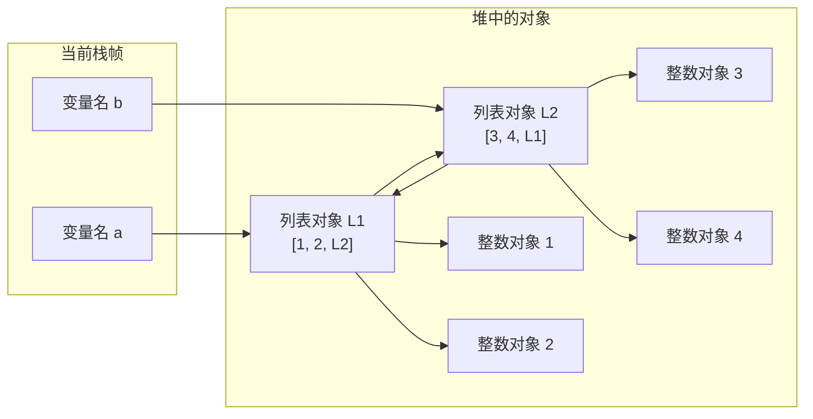
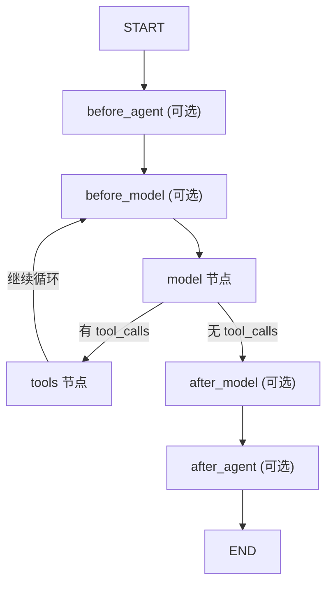
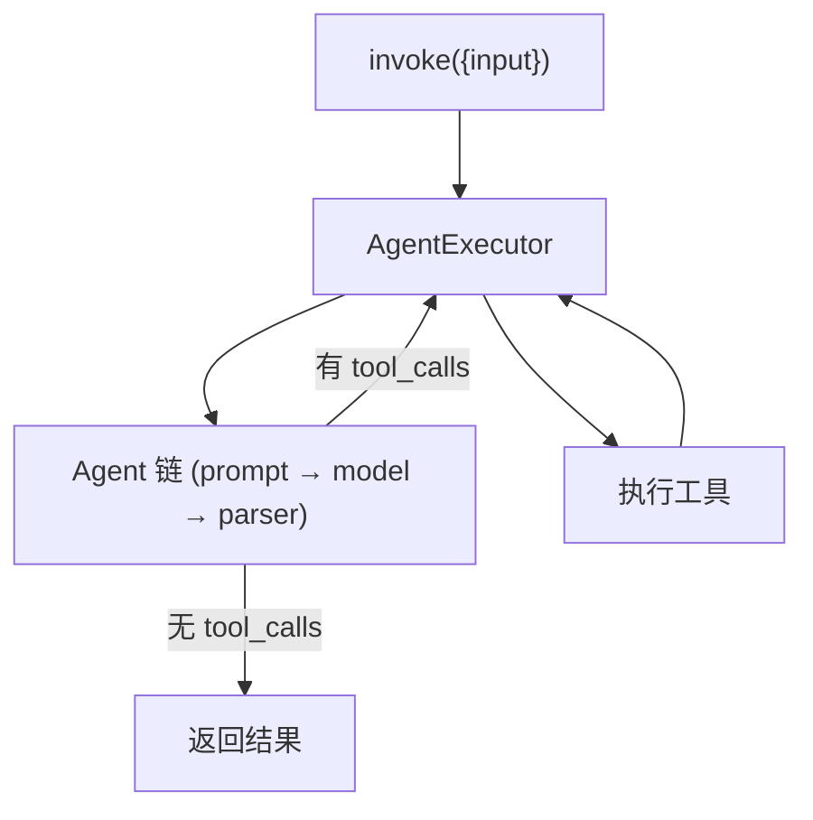

前端转 Agent 开发学习计划（综合版）

> 适用人群：有 1 年以上前端开发经验，希望转型 AI Agent 开发工程师的同学。
> 核心差异化：**从第一天就用可视化 UI 承载 Agent 完整链路**，让 Agent 行为透明、可调试、可演示。

# 目标

| 周次      | 目标                             | 核心内容                                                                       | 推荐资源                                                        |
| :------ | :----------------------------- | :------------------------------------------------------------------------- | :---------------------------------------------------------- |
| 第 1 周   | 建立正确认知                         | Agent 三要素（思考 + 工具 + 记忆）；CoT/ReAct 基础推理范式；Token、流式输出、结构化 Prompt 规范          | Andrew Ng《AI Agent》公开课 / 李宏毅《Agent 发展脉络》                    |
| 第 2 周   | 跑通带可视化 UI 的最简 Agent（前端特色 Demo） | LangChain JS / Vercel AI SDK Hello World；Next.js 流式对话；前端渲染 Agent 思考、工具调用状态 | Vercel AI SDK 官方文档、LangChain JS 中文教程 + B 站 "肖立新"AI Agent 系列 |
| 第 3-4 周 | 掌握双栈主流 Agent 框架（Python+JS）     | Python：LangGraph、CrewAI；JS：LangChain JS、Vercel AI SDK；记忆、工具、基础 RAG 集成      | LangGraph 官方文档、CrewAI 中文文档                                  |
| 第 5-6 周 | 做出能用的 Agent                    | 自动周报/竞品搜集/简历助手                                                             | 选 1-2 个真实需求改造                                               |
| 第 7 周+  | 进阶自由探索：复杂推理 + 多智能体 + 工程部署      | Plan-and-Execute 任务规划、多智能体协作；AutoGen、MetaGPT；Docker 打包、云端部署、密钥安全、日志监控      | AutoGen、MetaGPT 等                                           |


# python

## API

### print

`flush=True` 用于**立即刷新标准输出缓冲区**，让 `print(text)` 的内容及时显示到终端。

在异步流式输出中，如果不设置 `flush=True`，多个分片可能会先积存在缓冲区，直到缓冲区满或程序结束才显示；设置后每次收到模型输出就立即打印。

## 编码

### 一、常见字符编码标准

#### 1.1 ASCII

- 全称：美国信息交换标准代码（American Standard Code for Information Interchange）
- 包含 128 个字符，涵盖英文字母、数字、标点符号和控制字符
- **每个字符对应唯一的 7 位二进制数**
- 是最早的字符编码标准，也是许多其他编码的基础

#### 1.2 Unicode

- **使用一个二进制数值表示每个字符，确保全球范围内字符的唯一性**
- 目的是为全球所有语言字符提供统一的编码系统
- 不直接定义存储方式，只定义"字符→码点"的映射（如 `U+4E2D` = 中）

#### 1.3 UTF-8

- 可变长度 Unicode 编码方案，**使用 1 到 4 个字节表示一个字符**
- 完全兼容 ASCII，广泛用于网页设计、邮件传输等场景
- 无字节序问题，是目前的事实标准

#### 1.4 其他常见编码速查

| 编码         | 字节数   | 说明                                                       |
| ------------ | -------- | ---------------------------------------------------------- |
| UTF-8        | 1~4 字节 | 变长，兼容 ASCII，推荐首选                                 |
| UTF-16       | 2/4 字节 | Windows 内核 / JVM 内部使用，有 LE/BE 字节序               |
| GBK / GB2312 | 1~2 字节 | 中文编码，Windows 中文版默认代码页 936                     |
| Latin-1      | 1 字节   | 仅西欧字符；解码不抛异常（0x00-0xFF 全覆盖），常用于吞乱码 |

---

### 二、Python 3 编码核心机制

#### 2.1 两种数据类型

| 类型    | 含义                      | 场景         |
| ------- | ------------------------- | ------------ |
| `str`   | 内存中的 Unicode 码点序列 | 程序内部处理 |
| `bytes` | 磁盘/网络传输的字节序列   | IO 操作      |

两个方向的转换**必须显式指定编码**：

```python
# bytes → str（解码）
b'\xe4\xb8\xad'.decode('utf-8')   # '中'

# str → bytes（编码）
'中'.encode('utf-8')              # b'\xe4\xb8\xad'
```

#### 2.2 编码转换实践

**字符串 → UTF-8 字节序列**

```python
text = "你好"
byte_data = text.encode("utf-8")
print(byte_data)  # b'\xe4\xbd\xa0\xe5\xa5\xbd'
```

**UTF-8 字节序列 → 字符串**

```python
byte_data = b'\xe4\xbd\xa0\xe5\xa5\xbd'
text = byte_data.decode("utf-8")
print(text)  # 你好
```

#### 2.3 两大经典错误

| 错误                 | 原因                   | 典型场景                   |
| -------------------- | ---------------------- | -------------------------- |
| `UnicodeDecodeError` | 用错误编码解码字节流   | 用 UTF-8 读取 GBK 文件     |
| `UnicodeEncodeError` | 字符无法用目标编码表示 | `'中文'.encode('latin-1')` |

#### 2.4 编码错误处理

Python 的 `encode()` / `decode()` 支持 `errors` 参数：

| 参数                      | 行为               | 适用场景               |
| ------------------------- | ------------------ | ---------------------- |
| `errors='strict'`（默认） | 抛出异常           | 开发阶段，尽早暴露问题 |
| `errors='ignore'`         | 忽略无法处理的字符 | 数据清洗，丢弃损坏部分 |
| `errors='replace'`        | 用 `?` 替换        | 保留位置信息，便于排查 |

```python
# 示例：忽略无法解码的字节
b'\xff\xfehello'.decode('utf-8', errors='ignore')  # 'hello'

# 示例：替换无法编码的字符
'你好'.encode('latin-1', errors='replace')  # b'??'
```

#### 2.5 文件操作中的编码问题

**中文乱码根因**：文件编码与 Python 解释器默认编码不一致。

**解决方案**：统一显式使用 `encoding='utf-8'` 进行文件读写。

```python
# 读取文本文件
with open('test.txt', 'r', encoding='utf-8') as file:
    content = file.read()

# 写入文本文件
with open('output.txt', 'w', encoding='utf-8') as file:
    file.write('中文内容')

# 处理带 BOM 的 UTF-8 文件
with open('data.csv', 'r', encoding='utf-8-sig') as file:
    content = file.read()
```

#### 2.6 二进制文件处理

默认情况下 Python 将文件视为文本文件，读取二进制数据会出错（如 `\r\n` 自动转换）。二进制模式不会做任何转换：

```python
# 写入二进制数据
with open('data.bin', 'wb') as file:
    file.write(b'\x00\x01\x02\x03')

# 读取二进制数据
with open('data.bin', 'rb') as file:
    raw = file.read()
    print(raw)  # b'\x00\x01\x02\x03'
```

#### 2.7 最佳实践清单

| 场景     | 做法                                          | 反例                              |
| -------- | --------------------------------------------- | --------------------------------- |
| 文件读写 | 显式指定 `encoding='utf-8'`                   | 依赖系统 locale 默认值            |
| 源码声明 | `# -*- coding: utf-8 -*-` 放在文件头部        | 无声明                            |
| 标准 I/O | 设 `PYTHONIOENCODING=utf-8` 或 `PYTHONUTF8=1` | Windows 下不设，stdout 走 GBK     |
| CSV/JSON | 用 `encoding='utf-8-sig'` 处理带 BOM 的文件   | 不加 `-sig`，BOM 被当作内容       |
| 网络数据 | 先看 `Content-Type` / `charset`，再解码       | 盲目用 UTF-8 解所有响应           |
| 数据库   | 连接串指定 `charset=utf8mb4`                  | `utf8`（仅 3 字节，不兼容 emoji） |

---

### 三、Agent 场景下的字符编码

#### 3.1 Agent 链路中的编码陷阱

```
用户输入 → 前端 → API → LLM → 工具调用（Shell/Python/文件读写）→ 返回 → 前端渲染
```

每个环节都可能发生编码丢失或转换错误。

| 环节                 | 典型问题                                  | 根因                                              |
| -------------------- | ----------------------------------------- | ------------------------------------------------- |
| Windows 终端工具调用 | 中文文件读取后变 `è…`                     | PowerShell 默认 GBK（cp936），Agent 按 UTF-8 解析 |
| Linux/macOS Shell    | `LANG=C` 时中文变 `???`                   | locale 未设为 UTF-8                               |
| LLM 输出             | BPE tokenizer 边界切分导致 emoji/CJK 截断 | BPE 按字节切分，多字节字符可能被拆散              |
| 工具链传递           | 文件名含中文，传给 Shell 时被转义         | 参数未做 encoding 保护                            |
| 上下文污染           | 一次乱码进入 session 记忆，后续持续出错   | 乱码字节被当作合法文本存储                        |

#### 3.2 Windows Agent 乱码修复

中文 Windows 下 Agent 最常见的编码故障：

**原因**：Windows PowerShell 默认代码页 936（GBK），Agent 工具通过 Shell 执行命令时按 UTF-8 解析输出 → 中文乱码。

| 修复方法        | 命令                                                         | 作用范围     |
| --------------- | ------------------------------------------------------------ | ------------ |
| 切换代码页      | `chcp 65001`                                                 | 当前终端会话 |
| 永久修改        | 注册表 `HKCU\Console\CodePage` = 65001                       | 新打开的终端 |
| Python 环境变量 | `PYTHONIOENCODING=utf-8` + `PYTHONUTF8=1`                    | Python 进程  |
| PowerShell 配置 | `$OutputEncoding = [Console]::OutputEncoding = [Text.Encoding]::UTF8` | 当前 PS 会话 |

#### 3.3 Agent System Prompt 语言锁定

| 层级          | 方法                   | 效果                          |
| ------------- | ---------------------- | ----------------------------- |
| System Prompt | 声明语言偏好           | 最高优先级                    |
| 工具返回      | 指定英文结果翻译成中文 | 防止工具输出带偏 LLM          |
| 文件编码      | 所有读写默认 UTF-8     | 避免 Agent 读写文件时编码错误 |

---

### 四、总结

| 维度     | Python 侧                         | Agent 侧                               |
| -------- | --------------------------------- | -------------------------------------- |
| 核心问题 | str/bytes 转换编码不匹配          | 工具链多环节编码不一致                 |
| 高发场景 | 文件读写、网络请求、数据库        | Shell 输出解析、文件操作工具           |
| 根因     | 依赖系统 locale 隐式编码          | PowerShell 默认 GBK + Agent 默认 UTF-8 |
| 解法     | 所有 IO 显式传 `encoding='utf-8'` | chcp 65001 + 环境变量 + Prompt 声明    |
| 兜底     | `errors='ignore'` / `replace`     | 工具结果 try/except 编码检测容错       |

**核心记忆**：`str` 在内存，`bytes` 在 IO，两者间转换永远显式传 `encoding`。
*（内容由AI生成，仅供参考）*

## 数据类型

### 字符串

#### 一、Python 字符串的六种类型

Python 通过不同前缀和引号区分六种字符串字面量。

##### 1. 普通字符串

使用单引号或双引号括起，最基础的类型。

```python
print("Hello")
print('World')
```

- 单引号和双引号完全等价，可互相嵌套避免转义：`"It's ok"` 或 `'He said "Hi"'`
- 反斜杠 `\` 转义：`\n`（换行）、`\t`（制表符）、`\\`（反斜杠本身）

##### 2. 原始字符串（`r` 前缀）

前缀 `r` / `R`，不将反斜杠视为转义字符。

```python
print(r"C:\new\text.txt")   # C:\new\text.txt
print("C:\\new\\text.txt")  # 普通字符串需双写反斜杠
```

- 用于**文件路径**和**正则表达式**等需要保留反斜杠的场景
- 注意：不能以单个反斜杠结尾（`r"abc\"` 报错）

```python
import re
pattern = r"\d+\.\d+"   # 比 "\\d+\\.\\d+" 清晰得多
```

##### 3. 三引号多行字符串

三个单引号 `'''` 或三个双引号 `"""`，支持换行和任意引号。

```python
s = '''一二三
四五六'''
print(s)
# 一二三
# 四五六
```

**用途：** 多行文本、文档字符串（docstring）

```python
def greet(name):
    """向指定的人打招呼。"""
    return f"Hello, {name}"
```

##### 4. Unicode 字符串（`u` 前缀）

前缀 `u` 表示 Unicode 字符串。

```python
s = u"你好"
```

- Python 3 中所有字符串**默认就是 Unicode**，`u` 前缀可省略（兼容 Python 2 保留）

##### 5. 字节串（`b` 前缀）

前缀 `b` 表示 bytes，即二进制数据。

```python
data = b"hello"
print(type(data))   # <class 'bytes'>
print(data[0])       # 104（ASCII 码值，不是字符）
```

编解码：

```python
data = b"hello"
decoded = data.decode("utf-8")   # bytes → str
encoded = decoded.encode("utf-8") # str → bytes
```

常用于**网络传输**、**文件二进制操作**、**序列化**。

##### 6. 格式化字符串（`f` 前缀，f-string）

前缀 `f` / `F`，花括号 `{}` 中直接嵌入变量或表达式。详见下文"格式化方式"。

```python
name = "Tom"
print(f"Hello, {name}")   # Hello, Tom
```

---

#### 二、字符串的不可变性

Python 字符串是**不可变对象**，一旦创建就不能修改。任何"修改"操作都创建新字符串。

```python
s = "hello"
s = s + " world"   # 看似修改，实际创建了新字符串
s[0] = "H"          # TypeError: 'str' object does not support item assignment
```

---

#### 三、常用字符串方法

| 方法 | 作用 | 示例 |
|------|------|------|
| `s.split(sep)` | 分割 | `"a,b,c".split(",")` → `['a','b','c']` |
| `s.join(iter)` | 拼接 | `",".join(['a','b'])` → `"a,b"` |
| `s.strip()` | 去两端空白 | `" hi ".strip()` → `"hi"` |
| `s.replace(old, new)` | 替换 | `"abc".replace("b","x")` → `"axc"` |
| `s.find(sub)` | 查找位置 | `"hello".find("l")` → `2` |
| `s.startswith(p)` | 以...开头 | `"hello".startswith("he")` → `True` |
| `s.endswith(p)` | 以...结尾 | `"hello".endswith("lo")` → `True` |
| `s.upper()` / `s.lower()` | 大小写 | `"Hi".lower()` → `"hi"` |
| `s.isdigit()` | 是否全数字 | `"123".isdigit()` → `True` |
| `len(s)` | 长度 | `len("abc")` → `3` |

---

#### 四、格式化方式

##### % 格式化（旧式，C 风格）

**语法：** `"格式化字符串" % (值1, 值2, ...)`

| 占位符 | 含义 |
|--------|------|
| `%s` | 字符串（自动调用 `str()`） |
| `%d` | 十进制整数 |
| `%f` | 浮点数 |
| `%x` | 十六进制整数 |
| `%r` | 原始表示（`repr()`） |
| `%%` | 百分号本身 |

```python
name, age, score = "张三", 25, 92.5
print("姓名：%s" % name)                       # 姓名：张三
print("姓名：%s，年龄：%d" % (name, age))       # 姓名：张三，年龄：25
print("分数：%.2f" % score)                     # 分数：92.50

data = {"name": "张三", "age": 25}
print("姓名：%(name)s，年龄：%(age)d" % data)   # 字典方式
```

**缺点：** 类型不匹配易报错、需严格对应位置、可读性差，已不推荐。

##### str.format()（新式）

Python 2.6+，更灵活。

**语法：**

```python
"{} {}".format(值1, 值2)           # 按位置
"{0} {1}".format(值1, 值2)         # 按索引（可重复）
"{key}".format(key=值)             # 按关键字
name, age = "张三", 25
print("姓名：{}，年龄：{}".format(name, age))
print("{0} 今年 {1} 岁，{0} 来自北京".format(name, age))
print("姓名：{name}，年龄：{age}".format(name="张三", age=25))

# 解包字典
data = {"name": "张三", "age": 25}
print("姓名：{name}，年龄：{age}".format(**data))
```

**格式规范（`:` 后面）：**

```python
print("{:.2f}".format(3.14159))          # 3.14（浮点精度）
print("{:>10}".format("hello"))          # '     hello'（右对齐）
print("{:*^10}".format("hello"))         # '**hello***'（填充+居中）
print("{:,}".format(1234567))            # 1,234,567（千位分隔）
print("{:.1%}".format(0.852))            # 85.2%（百分比）
print("{:b}".format(10))                 # 1010（二进制）

from datetime import datetime
print("{:%Y-%m-%d %H:%M:%S}".format(datetime.now()))
```

##### f-string

Python 3.6+，六种类型之一，最简洁高效。

```python
name, age = "张三", 25
print(f"姓名：{name}，年龄：{age}")          # 直接嵌入变量
print(f"明年 {name} {age + 1} 岁")          # 嵌入表达式
print(f"姓名大写：{name.upper()}")           # 调用函数

# 格式规范（同 format()）
pi = 3.14159
print(f"π ≈ {pi:.2f}")                      # π ≈ 3.14
print(f"|{'hello':>10}|")                    # |     hello|
print(f"{1234567:,}")                        # 1,234,567

# 等号调试（Python 3.8+）
x, y = 10, 20
print(f"{x + y = }")                         # x + y = 30

# 多行 f-string
s = f"""姓名：{name}
年龄：{age}"""
```

---

##### 三种格式化方式对比

| 特性 | `%s` | `format()` | `f-string` |
|------|------|-----------|------------|
| Python 版本 | 所有 | 2.6+ | 3.6+ |
| 可读性 | ⭐⭐ | ⭐⭐⭐ | ⭐⭐⭐⭐⭐ |
| 性能 | 慢 | 中等 | 最快 |
| 表达式支持 | ❌ | ❌ | ✅ |
| 推荐程度 | 不推荐 | 兼容旧版 | ⭐ 首选 |

**选择建议：**

- **新项目**：优先 `f-string`
- **兼容 Python 3.5-**：用 `format()`
- **运行时动态模板**：用 `format()` 或 `Template`
- **日志模块**：用 `%s`（`logging` 推荐惰性求值）

## 基础

### 字符串

- **第一种：普通字符串** [02:03](https://b.quark.cn/apps/5AZ7aRopS/routes/mofb35Rkb?debug=0&fid=ef717e6f379b473b81a6def3c9cbf6c1#?seek_t=123)

  - 使用单引号或双引号括起字符串内容。
  - 示例：`print("Hello")` 或 `print('World')`

- **第二种：原始字符串** [02:29](https://b.quark.cn/apps/5AZ7aRopS/routes/mofb35Rkb?debug=0&fid=ef717e6f379b473b81a6def3c9cbf6c1#?seek_t=149)

  - 使用前缀 `r` 表示原始字符串。
  - 不将反斜杠视为转义字符。
  - 示例：`print(r"C:\new\text.txt")` 输出 `C:\new\text.txt`
  - 应用于路径、正则表达式等需要保留反斜杠的场景。

- **第三种：三引号多行字符串** [05:13](https://b.quark.cn/apps/5AZ7aRopS/routes/mofb35Rkb?debug=0&fid=ef717e6f379b473b81a6def3c9cbf6c1#?seek_t=313)

  - 使用三个单引号或双引号括起内容。

  - 支持换行、包含引号。

    ```python
  print('''一二三
    四五六''')
    ```
  
  - 可用于多行文本、文档字符串（docstring）。

- **第四种：格式化字符串（f-string）** [07:39](https://b.quark.cn/apps/5AZ7aRopS/routes/mofb35Rkb?debug=0&fid=ef717e6f379b473b81a6def3c9cbf6c1#?seek_t=459)

  - 使用前缀 `f` 或 `F`。

  - 在字符串中使用花括号 `{}` 插入变量或表达式。

    ```python
    name = "Tom"
    print(f"Hello, {name}")
    ```
  
  - 常用于动态输出信息，提升代码可读性。
  
- **第五种：Unicode字符串** [13:14](https://b.quark.cn/apps/5AZ7aRopS/routes/mofb35Rkb?debug=0&fid=ef717e6f379b473b81a6def3c9cbf6c1#?seek_t=794)

  - 使用前缀 `u` 表示Unicode字符串。
  - 示例：`u"你好"`
  - 用于处理非ASCII字符，避免文件编码问题。
  - 推荐配合标准库如 `codecs` 使用。

- **第六种：字节串（bytes）** [15:54](https://b.quark.cn/apps/5AZ7aRopS/routes/mofb35Rkb?debug=0&fid=ef717e6f379b473b81a6def3c9cbf6c1#?seek_t=954)

  - 使用前缀 `b` 表示字节串。

  - 示例：`b"hello"`

  - 表示二进制数据。

  - 常用于网络传输、文件操作中字节流处理。

    ```python
    data = b"hello"
    decoded = data.decode("utf-8")
    encoded = decoded.encode("utf-8")
    ```
  
- **Python与Java、JavaScript字符串对比** [18:12](https://b.quark.cn/apps/5AZ7aRopS/routes/mofb35Rkb?debug=0&fid=ef717e6f379b473b81a6def3c9cbf6c1#?seek_t=1092)

  - **定义方式**
    - Python：支持单引号、双引号、三引号。
    - Java：字符串用双引号表示，字符用单引号。
    - JavaScript：单引号、双引号均可，反斜杠用于换行。
  - **不可变性**
    - Python 和 Java 的字符串对象不可变，修改会创建新对象。
    - JavaScript 同样不可变。
    - Vue.js 等框架中变量可变，但不是字符串本身的特性。
  - **字符串方法**
    - Python 提供丰富内置方法（如 `split`, `replace`, `join` 等）。
    - Java 和 JavaScript 方法类似，但命名和参数略有不同。
    - 示例对比：
      - Python: `s.split()`
      - Java: `s.split("\\s+")`
      - JavaScript: `s.split(/\s+/)`
  - **格式化支持**
    - Python 有 f-string。
    - Java 使用 `String.format()` 或 `Formatter`类。
    - JavaScript 使用模板字符串（反引号 + `${}`）。
  - **多行支持**
    - Python 使用三引号。
    - JavaScript 使用反引号（`）。
    - Java 需手动拼接或使用 `\n`。

### json

 `json.dumps()` 将 Python 字典转为 JSON 字符串，`ensure_ascii=False` 用于保留中文，不将中文转换成 `\u4f60\u597d`。这个结果随后交给 SSE 响应组件发送给前端。

### 异常


### 模块化

#### 一、模块

模块就是一个 `.py` 文件，用于组织和复用代码。

```python
# math_utils.py
def add(a, b):
  return a + b
```

导入模块：

```python
import math_utils

math_utils.add(1, 2)
```

导入指定内容：

```python
from math_utils import add

add(1, 2)
```

使用别名：

```python
import math_utils as mu
```

不建议使用：

```python
from math_utils import *
```

因为名称来源不清晰，可能覆盖已有变量。

#### 二、包

包是用于组织多个模块的目录：

```text
app/
├── __init__.py
├── user.py
└── order/
  ├── __init__.py
  └── service.py
```

- `user.py`：模块
- `order`：子包
- `service.py`：子包中的模块

包的作用是按功能划分代码，形成清晰的目录结构。

#### 三、`__init__.py`

`__init__.py` 是包的初始化文件，主要用于：

- 标记目录为 Python 包
- 执行包初始化代码
- 统一导出公共对象
- 简化导入路径

例如：

```python
# user/__init__.py
from .service import create_user

__all__ = ["create_user"]
```

外部可以直接导入：

```python
from user import create_user
```

而不必写：

```python
from user.service import create_user
```

现代 Python 在部分场景下允许没有 `__init__.py` 的命名空间包，但普通项目通常仍然保留该文件。

#### 四、导入方式

##### 1. 绝对导入

从项目顶层路径开始：

```python
from app.core.config import settings
```

##### 2. 相对导入

以当前包为基准：

```python
from .service import create_user
from ..core.config import settings
```

- `.`：当前包
- `..`：上一级包

相对导入通常要求代码处于包环境中，直接运行文件可能出现导入错误。

#### 五、直接运行和被导入

`__name__` 可以区分模块是被直接运行，还是被其他模块导入：

```python
def main():
  print("程序启动")


if __name__ == "__main__":
  main()
```

- 直接运行文件：`__name__ == "__main__"`
- 被导入：`__name__` 通常是模块名

这样可以避免模块被导入时自动执行启动逻辑。

#### 六、模块化原则

- **单一职责**：一个模块主要负责一类功能
- **高内聚**：模块内部代码相互关联
- **低耦合**：模块之间减少不必要的依赖
- **信息隐藏**：只暴露必要的公共接口
- **依赖接口**：调用方不依赖具体实现细节

示例：

```text
user_model.py       # 数据结构
user_service.py     # 业务逻辑
user_repository.py  # 数据访问
```

#### 七、`pyproject.toml` 的关系

`__init__.py` 负责 Python 包的组织和导出；`pyproject.toml` 负责项目构建、依赖和打包配置。

例如：

```toml
[tool.setuptools]
py-modules = ["main"]

[tool.setuptools.packages.find]
include = ["api*", "core*", "models*"]
```

- `py-modules`：指定独立的 Python 文件
- `packages.find`：指定需要打包的包

#### 八、核心关系

```text
.py 文件       → 模块
模块目录       → 包
__init__.py    → 包入口和导出位置
import         → 导入模块或包
pyproject.toml → 构建和打包配置
```

一句话理解：

> 模块是文件，包是目录，`__init__.py` 负责包的入口和导出，模块化负责让代码清晰、复用和易维护。

## 垃圾回收机制



上面是**循环引用**之内存泄漏问题，a,b相互引用，即使del a/b，引用计数任然不为0

### del

`del` 删除的是变量名和引用，不是强制销毁对象。

### 标记清除

标记清除用于处理**循环引用**。

假设：

```
a = [1, 2]
b = [3, 4]
a.append(b)
b.append(a)
```

引用关系：

```
a ──> b
↑     │
└─────┘
```

执行：

```
del a
del b
```

变量名虽然被删除了，但两个列表仍然互相引用。

标记清除会：

1. 从程序仍然可访问的对象开始标记；
2. 找出无法从程序根对象访问到的对象；
3. 清除这些不可达对象。

因此这个循环引用最终会被回收。

------

### 分代回收

分代回收的思想是：

> 对象存活时间越长，越可能继续存活。

Python 会把对象分成不同“代”：

新对象 → 年轻代

存活一段时间 → 老年代

垃圾回收时：

- 年轻代：经常检查；
- 老年代：较少检查；
- 存活越久的对象，检查频率越低。

这样可以减少每次扫描所有对象的开销。

------

### 和引用计数的关系

CPython 主要结合三种机制：

```
引用计数：及时回收普通对象
标记清除：处理循环引用
分代回收：提高循环引用检查效率
```

例如：

```
a = [1, 2]
b = [3, 4]

a.append(b)
b.append(a)

del a
del b
```

`del` 后，循环引用使引用计数没有归零；之后由循环垃圾回收器发现这两个对象已经无法从程序访问，并将它们回收。可以手动触发回收：

```
import gc
gc.collect()
# `gc.collect()` 的返回值表示本次回收的对象数量：
count = gc.collect()
print(count)
```


## 异步与事件循环

### 异步基础

#### 同步与异步

同步执行时，当前任务必须完成后，程序才能继续执行后面的任务。异步执行时，任务遇到网络请求、文件读写等 I/O 等待，可以暂时让出执行权，由事件循环执行其他任务。

异步主要解决的是 I/O 等待期间的并发问题，并不等于创建多个线程。

#### `async` 的作用

`async` 用于定义异步函数：

```python
async def get_answer():
	return "天空是蓝色的"
```

调用异步函数时，得到的是协程对象；函数体通常要由事件循环调度执行。

#### `await` 的作用

`await` 用于等待一个可等待对象完成：

```python
async def chat():
	response = await get_answer()
	return response
```

等待期间，当前异步任务暂停，事件循环可以执行其他任务。

### 事件循环

#### 什么是事件循环

事件循环负责管理和调度异步任务。它会不断检查任务是否可以继续执行：

```text
执行任务
	↓
遇到 await，等待 I/O
	↓
切换到其他任务
	↓
I/O 完成后恢复原任务
```

#### 事件循环与线程的关系

常见关系如下：

```text
线程
	└── 事件循环
				└── 异步任务
							└── async 函数
```

事件循环通常运行在线程中，一个线程可以通过协作式调度运行多个异步任务。异步任务之间通过 `await` 主动让出执行权。

#### `asyncio.run()` 的作用

`asyncio.run()` 适合在普通同步脚本的入口启动异步程序：

```python
asyncio.run(main())
```

它会在当前线程中创建事件循环，运行 `main()`，结束后关闭事件循环。它通常不会创建新线程。

#### 普通脚本如何运行异步代码

普通脚本一般没有正在运行的事件循环，因此需要手动启动：

```python
import asyncio

async def main():
		print("开始执行")

asyncio.run(main())
```

#### FastAPI 如何管理事件循环

FastAPI 运行在 Uvicorn、Hypercorn 等 ASGI 服务器中。ASGI 服务器负责启动和管理事件循环，并将异步请求处理函数交给事件循环执行。

因此，FastAPI 异步路由中不需要再次调用 `asyncio.run()`。

### 异步函数与异步生成器

#### `async def`

`async def` 定义异步函数。函数内部可以使用 `await`，调用它会产生协程对象。

#### `async for`

`async for` 用于遍历异步迭代器：

```python
async for chunk in model.astream("天空是什么颜色？"):
	print(chunk.content)
```

每次获取下一个元素时，都可能发生异步等待。

#### `async def` + `yield`

异步函数中使用 `yield`，就会形成异步生成器：

```python
async def event_generator():
	yield {"event": "started"}
	yield {"event": "finished"}
```

它不会一次性返回全部数据，而是可以逐个产生结果。

#### 异步任务的暂停与恢复

当异步任务执行到 `await` 或等待异步迭代器数据时，事件循环可以暂停它；条件满足后，再从暂停位置继续执行。

这种切换通常发生在同一个线程中，不等于创建新的线程。

### FastAPI 异步执行流程

#### ASGI 服务器与 Uvicorn

ASGI 是 Python 异步 Web 应用与服务器之间的接口规范，Uvicorn 是常用的 ASGI 服务器实现。

```text
Uvicorn Worker
	└── 事件循环
				└── FastAPI 请求任务
```

#### 异步路由

```python
@router.post("/stream")
async def chat_stream(req: ChatRequest):
		result = await service.chat(req.message)
		return result
```

请求到达后，ASGI 服务器会在已有事件循环中调度 `chat_stream()`。

#### 为什么不需要 `asyncio.run()`

因为 Uvicorn 已经启动了事件循环。在正在运行的事件循环中再次调用 `asyncio.run()`，可能产生事件循环嵌套错误。

#### 阻塞代码对事件循环的影响

如果异步函数中直接执行耗时的同步阻塞代码，事件循环会被卡住，其他异步任务也无法及时运行。阻塞任务应根据情况放入线程池或进程池。

## LangChain 流式调用

### LangChain 调用方式

#### `invoke()`

同步调用模型，并等待完整结果：

```python
response = model.invoke(messages)
print(response.content)
```

它通常会发起一次模型请求，返回一个完整的 `AIMessage`。

#### `ainvoke()`

异步调用模型，并等待完整结果：

```python
response = await model.ainvoke(messages)
```

它仍然是一次性返回完整结果，但调用方式可以融入异步程序。

#### `stream()`

同步流式调用，模型生成内容时逐块返回：

```python
for chunk in model.stream(messages):
		print(chunk.content, end="")
```

#### `astream()`

异步流式调用，需要使用 `async for`：

```python
async for chunk in model.astream(messages):
		print(chunk.content, end="")
```

#### 完整响应与流式响应的区别

```text
invoke / ainvoke
	请求 → 等待 → 返回完整响应

stream / astream
	请求 → 返回片段 → 返回片段 → 返回片段 → 完成
```

`invoke()` 与 `stream()` 的区别是返回时机；`ainvoke()` 与 `astream()` 的区别是是否使用异步流式迭代。

## SSE 流式接口

### SSE 基础

#### SSE 是什么

SSE（Server-Sent Events）是一种由服务器向客户端持续推送文本事件的机制。客户端建立连接后，服务器可以不断发送事件，直到流结束或连接断开。

#### `EventSourceResponse`

`EventSourceResponse` 将生成器产生的事件转换成 `text/event-stream` 响应，并按照 SSE 格式持续发送给客户端。

```
 # EventSourceResponse 是 sse-starlette 提供的 SSE（Server-Sent Events）流式响应类。
    # 它会持续读取迭代器产生的数据，并通过 HTTP text/event-stream 响应逐条发送给客户端。
    return EventSourceResponse(
        stream_chat_events(
            message=req.message,
            model=req.model,
            conversation_id=req.conversation_id,
            client_request_id=req.client_request_id,
        ),
        sep="\n",
    )
```


#### 服务端如何持续推送事件

服务端可以使用生成器逐个产生事件：

```python
async def event_generator():
	async for event in stream_chat_events():
		yield event
```

#### 客户端如何接收事件

客户端保持 HTTP 连接，并在收到新的 SSE 事件时触发处理逻辑。与普通 HTTP 请求等待完整响应不同，SSE 可以及时显示服务端已经生成的内容。

### FastAPI SSE 实现

#### `event_generator()`

`event_generator()` 是异步生成器，负责包装底层事件流，并在流结束或连接断开时执行清理逻辑。

#### `stream_chat_events()`

`stream_chat_events()` 负责产生聊天过程中的事件，例如创建流、开始消息、输出内容和结束消息。

#### `async for` 获取事件

```python
async for event in stream_chat_events(...):
		yield event
```

路由不会一次性等待全部事件，而是异步获取一个、转发一个。

#### `yield event` 发送事件

`yield event` 将当前事件交给 `EventSourceResponse`。响应对象再将它编码为 SSE 数据并发送给客户端。

#### `finally` 执行清理逻辑

```python
finally:
		await idempotency_store.mark_completed(request_id)
```

无论流正常结束、发生异常还是客户端断开，只要生成器被关闭，就会执行 `finally` 中的清理逻辑。

完整关系如下：

```text
客户端请求
	↓
FastAPI 异步路由
	↓
EventSourceResponse
	↓
event_generator()
	↓
async for 获取事件
	↓
yield event
	↓
SSE 推送给客户端
```


## 装饰器

Python 装饰器（Decorator）是一种特殊的函数，它可以在不修改原函数代码和调用方式的前提下，为函数增加额外的功能。

### 代码概念

```
def a_new_decorator(a_func):
 
    def wrapTheFunction():
        print("I am doing some boring work before executing a_func()")
 
        a_func()
 
        print("I am doing some boring work after executing a_func()")
 
    return wrapTheFunction
 
def a_function_requiring_decoration():
    print("I am the function which needs some decoration to remove my foul smell")
 
a_function_requiring_decoration()
#outputs: "I am the function which needs some decoration to remove my foul smell"
 
a_function_requiring_decoration = a_new_decorator(a_function_requiring_decoration)
#now a_function_requiring_decoration is wrapped by wrapTheFunction()
 
a_function_requiring_decoration()
#outputs:I am doing some boring work before executing a_func()
#        I am the function which needs some decoration to remove my foul smell
#        I am doing some boring work after executing a_func()
```

```
@a_new_decorator
def a_function_requiring_decoration():
    """Hey you! Decorate me!"""
    print("I am the function which needs some decoration to "
          "remove my foul smell")
 
a_function_requiring_decoration()
#outputs: I am doing some boring work before executing a_func()
#         I am the function which needs some decoration to remove my foul smell
#         I am doing some boring work after executing a_func()
 
#the @a_new_decorator is just a short way of saying:
a_function_requiring_decoration = a_new_decorator(a_function_requiring_decoration)
```

如果我们运行如下代码会存在一个问题：

```
print(a_function_requiring_decoration.__name__)
# Output: wrapTheFunction
```

这并不是我们想要的！Ouput输出应该是"a_function_requiring_decoration"。这里的函数被warpTheFunction替代了。它重写了我们函数的名字和注释文档(docstring)。幸运的是Python提供给我们一个简单的函数来解决这个问题，那就是functools.wraps。我们修改上一个例子来使用functools.wraps：

```
from functools import wraps
 
def a_new_decorator(a_func):
    @wraps(a_func)
    def wrapTheFunction():
        print("I am doing some boring work before executing a_func()")
        a_func()
        print("I am doing some boring work after executing a_func()")
    return wrapTheFunction
 
@a_new_decorator
def a_function_requiring_decoration():
    """Hey yo! Decorate me!"""
    print("I am the function which needs some decoration to "
          "remove my foul smell")
 
print(a_function_requiring_decoration.__name__)
# Output: a_function_requiring_decoration
```

### 应用场景

- **日志记录**：自动记录函数的调用日志、参数和返回值。
- **权限验证**：在 Web 框架中检查用户是否登录。
- **性能测试**：统计函数执行的耗时。
- **缓存数据**：保存函数的返回结果，避免重复计算（如 `functools.lru_cache`）。

## 项目搭建和配置

### 项目初始化

uv init

通常会生成：

```
pyproject.toml
README.md
.python-version
```

### 同步环境

uv sync

### 添加依赖

```
uv python install 3.11
\# 将项目默认 Python 固定为 3.11
uv python pin 3.11
```

uv add langchain-chroma

### 运行代码

uv run python main.py


# 入门

https://www.modb.pro/db/1881156671699955712

## 机器学习

- 是人工智能的一个分支，指通过算法和统计模型从数据中自动**学习规律**，并利用这些规律进行预测或决策。
- 核心思想：从数据中提取特征并建立模型。

### 深度学习

- 是机器学习的一个子领域，基于人工神经网络（ANN）的结构和算法。
- 核心思想：通过多层神经网络（通常称为"深度"网络）自动学习数据的高层次特征。

### 总结

| 特性           | 机器学习                         | 深度学习                           |
| :------------- | :------------------------------- | :--------------------------------- |
| **特征工程**   | 需要手动设计和提取特征           | 自动从数据中学习特征               |
| **模型复杂度** | 模型较简单（如线性回归、SVM 等） | 模型复杂（多层神经网络）           |
| **数据需求**   | 数据量较小也能有效工作           | 需要大量数据才能发挥优势           |
| **计算资源**   | 对计算资源要求较低               | 对计算资源要求较高（GPU 加速）     |
| **应用场景**   | 结构化数据（如表格数据）         | 非结构化数据（如图像、语音、文本） |

## 自然语言处理（NLP）

‌自然语言处理（NLP）是人工智能领域的重要分支‌，旨在使计算机能够理解、解释和生成人类语言，实现人机之间的自然交互。其核心任务包括语言翻译、情感分析、文本生成等，广泛应用于机器翻译、问答系统、聊天机器人等领域


## Token

> **通常情况下，中文比英文更节省token。**

Token是指在自然语言处理（NLP）模型中，输入文本被分割成的最小单位（通常是单词、子词或字符），这些单位被称为 **Token**。

1个英文字符≈0.3个token。1个中文字符≈0.6个token。

1 个 token 对应字符数

| **英文** | 约 **3.3 个字符** |
| -------- | ----------------- |
| **中文** | 约 **1.7 个字符** |

### 原理


- 在大语言模型（如 GPT 系列、BERT 等）中，输入文本会被分词器（Tokenizer）拆分为 Token 序列。
- 分词器会根据预定义的词汇表（Vocabulary）将文本映射为对应的 Token ID，这些 ID 是模型可以理解的数字表示。

假设我们有以下文本：

```
Hello, how are you doing today?
```

**分词过程**

1. 使用分词器将文本拆分为 Token：

   ```
   ["Hello", ",", "how", "are", "you", "doing", "today", "?"]
   ```

2. 将每个 Token 映射为 Vocabulary 中的唯一 ID：

   ```
   [123, 456, 789, 1011, 1213, 1415, 1617, 1819]
   ```

**输入到模型**

- 模型接收到的是 Token ID 序列 `[123, 456, 789, 1011, 1213, 1415, 1617, 1819]`。
- 模型通过分析这些 Token 的关系和上下文生成输出。

### 作用

- **表示输入信息**：上下文 Token 是模型接收输入的主要形式。模型通过分析这些 Token 的序列来理解输入内容。
- **控制上下文长度**：模型对上下文 Token 的数量有限制（例如 GPT-3 的最大上下文长度为 2048 Token，GPT-4 支持更长的上下文，如 32K Token）。
- **生成输出**：模型基于输入的上下文 Token 生成新的 Token 序列作为输出。

### context

**大模型每次处理任务时所接收到的信息总和**


> 虽然现代模型支持 128K 甚至 192K 的上下文长度，但在编码场景下，这些上下文往往仍然不足。像Claude Code这类的工具，在上下文做了很多优化（后续会分享一些），但是上下文越长，**AI 生成代码出现幻觉的概率就越高**，后续修正过程会消耗更多资源。

- **影响模型性能**：**上下文 Token 的数量决定了模型能够"记住"多少信息。**更多的 Token 意味着模型可以利用更丰富的上下文进行推理。
- **成本因素**：上下文 Token 越多，计算资源需求越高，使用成本也越高。
- **应用场景**：对于需要处理长文档的任务（如法律文件分析、科学论文总结），支持更多上下文 Token 的模型更具优势。

### context window

大模型的Context最多能够存储的Token量

## RAG

### 背景 

**context 过多**

- 模型无法读取所有内容
- 模型推理成本高
- 模型推理慢
- **会导致LLM产生幻觉**

### 知识

#### RAG的原理

- 检索（Retrieval）：当用户提出问题时，系统会从外部的知识库中检索出与用户输入相关的内容。
  - 检索（Retrieval）的详细过程：
    - 准备外部知识库：外部知识库可能来自本地的文件、搜索引擎结果、API 等等。
    - 通过Embedding（嵌入）模型，对知识库文件进行解析：**Embedding的主要作用是将自然语言转化为机器可以理解的高维向量**，并且通过这一过程捕获到文本背后的语义信息（比如不同文本之间的相似度关系）；
    - 通过Embedding（嵌入）模型，对用户的提问进行处理：用户的输入同样会经过嵌入（Embedding）处理，生成一个高维向量。
    - 拿用户的提问去匹配本地知识库：使用这个用户输入生成的这个高纬向量，去查询知识库中相关的文档片段。在这个过程中，系统会**利用某些相似度度量（如余弦相似度）去判断相似度。**
  - 模型的分类：Chat模型、Embedding模型；
  - 简而言之：Embedding模型是用来对你上传的附件进行解析的；
- 增强（Augmentation）：系统将检索到的信息与用户的输入结合，扩展模型的上下文。然后再传给生成模型（也就是Deepseek）；
- 生成（Generation）：生成模型基于增强后的输入生成最终的回答。由于这一回答参考了外部知识库中的内容，因此更加准确可读。

#### 微调

微调技术和RAG技术：

- 微调：在已有的预训练模型基础上，再结合特定任务的数据集进一步对其进行训练，使得模型在这一领域中表现更好（考前复习）；

- RAG：在生成回答之前，通过信息检索从外部知识库中查找与问题相关的知识，增强生成过程中的信息来源，从而提升生成的质量和准确性（考试带小抄）。
- 共同点：都是为了赋予模型某个领域的特定知识，解决大模型的幻觉问题。

#### 向量

概念：有大小有方向的量
示例：[1.0，2.3，5.76，5.8，10.1，-3.6]

#### 向量相似度计算

- 余弦相似度，夹角越小相似度越高

  

- 欧氏距离：距离越小相似度越高

  

- 点积：通过代数（Ａ垂直Ｂ点到原点的距离＊Ｂ到原点的距离），不仅是方向还有长度

  

### 流程


#### 准备过程

##### 分片

- 字数
- 段落
- 章节
- 页码

##### 索引

- 通过 Embedding 将片段文本转换为向量

  含义相近的文本在进入Embedding 后，对应的向量是相近的

  

- 将片段文本和片段向量存入向量数据库中

  一般的向量数据库表格里面至少都会有原始文本和向量

  

  

#### 回答过程

##### 召回

根据相似度大小，取十份相似度最高的


##### 重排

从十份相似度最高的的向量中取３份


###### rank 模型

‌Rank 模型‌（排序模型）是信息检索、推荐系统和 RAG（检索增强生成）等 AI 应用中的关键组件，负责对初步检索或召回得到的候选结果进行‌精细化重排序‌，以提升最终输出的相关性与准确性。

##### 生成


#  LLM

## LLM 概述

### 定义

LLM（大语言模型）是一类基于深度学习的人工智能模型，旨在处理和生成自然语言文本。通过在大规模文本数据上进行训练，大语言模型能够理解并生成与人类语言相似的文本，执行各类自然语言处理任务。

### 应用场景

大语言模型具有强大的泛化能力，能够处理多种任务。典型的应用场景包括：

- 文本生成
- 机器翻译
- 摘要生成
- 对话系统
- 情感分析

## LLM 的训练与使用

### 训练阶段

#### 预训练阶段

模型在大规模未标注文本数据上进行自监督学习，学习通用的语言表示。

#### 微调阶段

模型在特定任务的标注数据上进行有监督学习，调整模型参数以适应具体任务需求。

### 基于 LLM 的 Agent 框架

#### 核心组件

- **LLM**：对标人类大脑，思考如何解决问题、给出怎样的回答。
- **记忆**：包含长期记忆与短期记忆。即智能体使用的历史记录、系统数据，以及智能体执行过程中产生的各种中间信息。
- **规划技能**：涵盖提示词编排、意图理解、任务分解、自我反思。
- **工具使用**：智能体在执行任务中可能会使用到的各种工具接口。

## 整体架构概览

### 架构流程

LLM 的整体架构流程为：Tokenizer（分词器）→ Embedding（嵌入层）→ Transformer（核心处理层）→ Output（输出层）。

#### Tokenizer（分词器）

将输入文本切分成 Token，并为每个 Token 分配唯一整数 ID。不同模型使用不同的 Tokenizer 规则。

#### Embedding（嵌入层）

将 Token ID 转换为高维向量，赋予语义含义。维度越多，表示越复杂细致。同时编码位置信息。

#### Transformer（核心处理层）

作为 LLM 的大脑，通过 Self-Attention 机制让 Token 之间相互"交流"，计算注意力权重。输入 Embedding 被转化为 Q（Query）、K（Key）、V（Value）三种形态，通过矩阵运算理解上下文语境。

#### Output（输出层）

将 Transformer 处理后的结果转化为概率分布，预测下一个最可能出现的 Token。

## 训练阶段的底层计算（Training）

### 什么是训练

#### 训练过程

训练时，模型一次性看到完整的上下文序列，并行计算所有位置的预测。训练过程会把不同 token 同时出现的概率存入"神经网络"文件。保存的数据就是"参数"，也叫"权重"。大模型阅读了人类说过的所有的话，这就是"机器学习"。

### Causal Mask 的作用

#### 实现机制

在训练时，使用因果掩码（Causal Mask）确保模型只能看到当前位置及之前的 Token，不能看到未来的 Token。

- **实现方式**：在注意力得分矩阵上，将上三角部分（未来位置）设置为负无穷，经过 softmax 后对应位置概率为 0。
- **目的**：这样训练出来的模型才能正确地进行自回归生成。

## 推理阶段的底层计算（Inference）

### 什么是推理

#### 推理过程

给推理程序若干 token，程序会加载大模型权重，算出概率最高的下一个 token 是什么。用生成的 token 再加上上文，就能继续生成下一个 token。以此类推，生成更多文字。

### 推理 ≠ 训练

#### 核心区别

- 训练时是并行计算所有位置，推理时是逐个 Token 生成。
- 训练需要完整序列和标签，推理只需要前面的上下文。

## 自回归与注意力机制（Autoregressive & Attention）

### 自回归的本质

#### 串行生成特性

自回归（Autoregressive）模型的本质是：生成第 n+1 个 Token 时，模型需要把前面所有内容（提示词 M 个 + 已输出 n 个）都当作输入重新计算一遍，才能预测下一个词。因为下一步必须依赖上一步的结果，所以无法并行，只能串行。

#### 具体过程

- 生成第 1 个 Token 时：输入 = M 个提示词 Token
- 生成第 2 个 Token 时：输入 = M + 1 个 Token
- 生成第 3 个 Token 时：输入 = M + 2 个 Token
- ...
- 生成第 n+1 个 Token 时：输入 = M + n 个 Token

### 注意力机制：Q/K/V 的含义

#### 核心概念

- **Q（Query）**：当前 Token 的"查询"，表示"我想找什么"。
- **K（Key）**：每个 Token 的"索引键"，表示"我有什么线索"。
- **V（Value）**：每个 Token 的"实际内容"，表示"我的内容是什么"。

#### 计算逻辑

通过计算 Q 和所有 K 的相似度，得到"该关注谁"的权重（softmax 归一化），再对 V 做加权求和，得到"结合上下文后的新表示"。Multi-head 就是并行做多组注意力，让模型能同时学到多种关系（语法、指代、主题等）。

### Causal Mask 原理

#### 保证因果性

在自回归推理时，Causal Mask 确保每个位置只能关注到自身及之前的位置。

- **实现**：在注意力计算时，对当前行之后的位置（未来位置）的得分设为负无穷，使 softmax 后概率为 0。
- **作用**：这保证了推理时的因果性——生成第 t 个 Token 时，不会"偷看"到第 t+1 个及之后的 Token。

## 推理的两个阶段：预填充 vs 解码

预填充阶段：
┌─────────────────────────────────────────┐
│  输入: [你, 好, ，, 今, 天]              │
│       ↓ 一次性并行                      │
│  Q: [q1, q2, q3, q4, q5]               │
│  K: [k1, k2, k3, k4, k5]  ← 全部算出    │
│  V: [v1, v2, v3, v4, v5]  ← 全部算出    │
│       ↓                                 │
│  Attention: 5×5 矩阵一次性算              │
│       ↓                                 │
│  输出: 5 个位置的预测 + KV Cache 存入显存 │
└─────────────────────────────────────────┘

解码阶段（生成第 6 个 Token）：
┌─────────────────────────────────────────┐
│  输入: [怎]  ← 只输入一个新 Token         │
│       ↓                                 │
│  Q: [q6]         ← 只算 1 个             │
│  K: [k1..k5] + [k6]  ← 前5个读缓存，新算1个│
│  V: [v1..v5] + [v6]  ← 前5个读缓存，新算1个│
│       ↓                                 │
│  Attention: 1×6 向量计算                  │
│       ↓                                 │
│  输出: 预测下一个 Token                   │
└─────────────────────────────────────────┘

### 预填充（Prefill）

#### 阶段概述

预填充等于首次把提示词完整过一遍模型（并行、高效），同时建立 KV Cache，为后续逐 Token 的解码铺路。

#### 在 Transformer 中的操作

把整段提示词一次性输入 Transformer，做一次完整的前向传播。所有 Token 同时算，矩阵乘法一次完成。提示词的所有 Token 并行输入，每层 Transformer 中先做注意力计算，再做前馈网络计算，同时把所有 Token 的 K、V 向量存入 KV Cache。

#### 流程示意

- 输入: [你, 好, ，, 今, 天]
- 一次性并行 → Q/K/V 全部算出 → Attention 5×5 矩阵一次性算 → 输出 5 个位置的预测 + KV Cache 存入显存

### 解码（Decode）

#### 阶段概述

每生成一个新 Token，就把它的信息喂进同一个 Transformer，再算一次前向传播，得到下一个 Token 的概率分布。如此循环，直到输出结束。

#### 在 Transformer 中的操作

每生成一个新 Token，就把这个 Token 输入 Transformer，做一次前向传播。只算新 Token 的注意力，复用之前缓存的 K/V。解码的瓶颈在显存数据传输，而非计算。

#### 流程示意（生成第 6 个 Token）

- 输入: [怎] ← 只输入一个新 Token
- Q: [q6] ← 只算 1 个
- K: [k1..k5] + [k6] ← 前5个读缓存，新算1个
- V: [v1..v5] + [v6] ← 前5个读缓存，新算1个
- Attention: 1×6 向量计算 → 输出: 预测下一个 Token

### 预填充 vs 解码 对比表

| 对比项     | 输入（Prefill） | 输出（Decode）         |
| :--------- | :-------------- | :--------------------- |
| 计算方式   | 一次性并行      | 逐个串行               |
| 计算量     | O(M)            | O(N×M + N²)            |
| GPU 利用率 | 高              | 低（显存带宽瓶颈）     |
| 计费策略   | 通常较便宜      | 通常较贵（尤其长输出） |
| 优化空间   | 可用缓存加速    | 可用投机解码等加速     |

- 输出越长，每次计算都要带上更长的上文，成本越滚越大
- 所以很多模型对超长输出**加价计费**——这不是玄学，是物理上算力成本决定的
- 这也解释了为什么 **Prompt 尽量短、输出别太长**，能明显省成本

一句话总结：**预填充可以并行、便宜；解码必须串行且成本随输出长度平方增长**，所以模型对长输出收更贵。

## KV Cache 与前缀缓存（Prompt Caching）

### 工作原理

#### 核心原理

Token 缓存（Prompt Caching / 前缀缓存）的核心原理是复用自注意力机制中计算好的 Key (K) 和 Value (V) 矩阵，也就是 KV Cache。

#### 避免重复计算（Prefill 阶段优化）

大模型在处理输入的 Prompt 时，需要进行大规模的矩阵运算来计算每个 Token 的 Q、K、V。如果多次请求拥有相同的公共前缀（如固定的 System Prompt、长代码库、长文档等），系统会将第一次计算好的各层 K 和 V 向量保存在 GPU 显存或持久化存储中。

#### 前缀匹配（Prefix Matching）

当新的请求到达时，推理引擎（如 vLLM、SGLang 或云厂商 API 后端）会检查新请求的 Token 序列是否与缓存的前缀完全一致。如果一致，则直接加载显存中现成的 KV 缓存，跳过这部分长文本的 Transformer 前向计算（Prefill 阶段），从而大幅降低首字延迟（TTFT）并显著节省算力和费用。

#### 显存占用计算

KV Cache 的显存占用计算公式：`cache_size = l × 4 × h × seq_len × bytes_per_element`（其中 l 为模型层数，h 为隐藏维度）。以 FP16 为例，Llama 2 70B 在 4096 token 序列长度下，单请求 KV Cache 约为 10.7 GB。

### 前缀匹配规则

#### 必须"完全一致"的原因


Transformer 的计算具有强上下文依赖性。任何一个字符、空格、时间戳或 JSON 字段顺序的变化，都会导致 Token 化（Tokenizer）后的数值发生改变，进而引发"蝴蝶效应"，让后续所有位置的 K 和 V 矩阵计算结果全部失效（Cache Miss）。缓存是前缀匹配的，哪怕修改了一个字，后面的部分也都需要重新计算。此外，缓存通常具有一定的有效期，一般几分钟到几小时就会失效。

### 缓存命中

#### 命中机制

模型的输入除了用户的提示词以外，往往还会包含系统提示词等内容，这部分在每次模型运行的过程中都是相同的。通过提示词缓存技术可以将这段前缀提示词计算的结果保存在高速缓存中，在下次预填充的时候，如果前缀一样则直接可以把这部分结果从高速缓存中读取出来，而不需要重复计算。此时的成本仅包含缓存的存储和加载开销，对 GPU 算力几乎没有占用，因此这部分价格会很低。

### 最佳实践

#### 优化策略

- **静态前置，动态后置**：将长期不变的内容（如系统设定、角色人设、长背景文档、工具定义）放在 Prompt 的最前面；将每次都变的内容（如用户当前提问、实时时间戳、RAG 检索结果）放在最后面。
- **保持序列化稳定**：在 Function Calling 中，保持 tools 列表和 JSON 字段的顺序完全一致。
- **提示词长度要求**：提示词要够长（通常 ≥ 1024 tokens 才会开始命中）。
- **多轮对话/Agent 注意事项**：消息数组要"只追加，不改历史"；工具定义必须完全一致，顺序也要一致。

### 常见踩坑清单

#### 避坑指南

- 把时间戳/随机 ID 放在 system 开头：每次都变，等于主动让缓存失效。
- JSON 序列化不稳定：同一份 tool schema 如果字段顺序、空格、换行变化，token 序列可能变 → miss。
- 指令在每次请求里微调一两个字：看似小改动，可能让前 1024 tokens 出现差异，直接从"高命中"变成"全 miss"。

### 缓存有效期

#### 各平台策略

- **Azure OpenAI**：缓存通常在空闲 5–10 分钟清理，最晚 1 小时内移除。
- **OpenAI**：提供 prompt_cache_retention（默认 in_memory，也可选 24h 做更长保留）。
- **Anthropic Claude**：通过在特定内容块上标注 cache_control 来启用/控制缓存。

### PagedAttention

#### 内存分页思想

vLLM 提出的 PagedAttention 借鉴操作系统的虚拟内存分页思想，将 KV Cache 切分为固定大小的 Block（通常每块容纳 16 个 token 的 KV 数据）。

#### 优势与性能

- **效果**：按需分配无内部碎片；Block 大小统一消除外部碎片；相同前缀的多个请求可直接映射到同一组物理 Block，实现零成本共享。
- **写时复制（Copy-on-Write）**：多个请求初始共享只读的物理 Block，当某请求在共享前缀后发生分叉时才复制对应 Block。
- **性能提升**：vLLM vs HuggingFace Transformers 吞吐提升 14×–24×；PagedAttention 将可用显存利用率提升至 90% 以上。

### RadixAttention

#### 压缩前缀树

SGLang 和较新版本的 vLLM 将请求前缀组织为 Radix 树（压缩前缀树），节点存储对应的 KV Block。新请求到达时沿树匹配最长公共前缀，自动复用缓存块。吞吐量最多提升 6.4 倍。

### 实际应用场景

#### 典型用例

- **多轮对话（Chatbot）**：前 20 轮的历史记录就是"Cached Token"。
- **文档问答（RAG）**：上传 PDF 后，只要文件没变，第二个问题开始就不需要重新处理。
- **代码助手（Coding Agent）**：将整个项目的代码库结构作为 Prompt，适合缓存。
- **角色扮演/Agent**：复杂的 System Prompt 通常很长且固定，缓存后每次调用都极快。

## 成本对比与优化建议

### 为什么输出比输入贵

#### 计算量分析

因为历史上下文常常会被反复带上重新计算。

- 算第 n+1 个 Token 的计算量 = (M + n) × P（P 为模型参数规模，M 为提示词长度，n 为已输出长度）
- 输出全部 N 个 Token 的总计算量 = Σ(i=1 to N) (M + i) × P = P × [N×M + N(N+1)/2] ≈ P × (N×M + N²/2)
- 总计算量中有一个 N² 的项——输出长度越长，成本呈二次方（平方级）增长，而非线性。

### 成本对比表

| 对比项     | 输入（Prefill） | 输出（Decode）         |
| :--------- | :-------------- | :--------------------- |
| 计算方式   | 一次性并行      | 逐个串行               |
| 计算量     | O(M)            | O(N×M + N²)            |
| GPU 利用率 | 高              | 低（显存带宽瓶颈）     |
| 计费策略   | 通常较便宜      | 通常较贵（尤其长输出） |
| 优化空间   | 可用缓存加速    | 可用投机解码等加速     |

### 实用建议

#### 降本策略

- Prompt 尽量短、输出别太长，能明显省成本。
- 将静态内容（System Prompt、Tools）置顶，动态内容（User Query、Time）置底，利用缓存降低输入成本。
- 缓存的输入 token 在成本上比常规输入 token 便宜 10 倍（OpenAI 和 Anthropic 数据）。
- 监控缓存命中率（Cache Hit Rate）指标，确保不是在做负优化。

### 一句话总结

预填充可以并行、便宜；解码必须串行且成本随输出长度平方增长，所以模型对长输出收更贵。

# 技术栈和流程架构

## 全景图

```
┌─────────────────────────────────────────────────────┐
│                     前端层                           │
│  Next.js 14+  │  Vercel AI SDK  │  TypeScript       │
│  流式渲染 UI  │  Agent 可视化   │  管理后台          │
├─────────────────────────────────────────────────────┤
│                     API 层                           │
│  FastAPI（Python）  │  Next.js API Routes（JS）     │
├─────────────────────────────────────────────────────┤
│                    Agent 框架层                       │
│  LangChain  │  LangGraph  │  CrewAI  │  AutoGen     │
├─────────────────────────────────────────────────────┤
│                   基础设施层                          │
│  LLM API（OpenAI/DeepSeek/Claude）                  │
│  向量数据库（Pinecone/Milvus/Chroma）                │
│  工具 API（搜索/天气/Git/网页爬取）                   │
└─────────────────────────────────────────────────────┘
```

## 大模型应用技术架构


| 决策问题         | 是 → 结果                | 否 → 下一步      |
| :--------------- | :----------------------- | :--------------- |
| 是否要补充知识？ | RAG                      | 要对接其它系统？ |
| 要对接其它系统？ | Function Calling         | 值得尝试微调？   |
| 值得尝试微调？   | 用历史数据做 Fine-tuning | —                |

### 纯prompt

### function calling

**Function Calling** 是让 LLM 能够"调用外部函数"的机制：模型不直接执行代码，而是输出一个结构化的函数调用请求（函数名 + 参数 JSON），由你的程序实际执行，再把结果返回给模型。

---

#### 流程示意

```
用户: 北京今天几度？
  ↓
LLM: → { function: "getWeather", args: { city: "北京" } }   ← 模型决定调哪个函数
  ↓
你的代码: 调天气 API，拿到 26°C
  ↓
LLM: → "北京今天 26°C，晴转多云"                           ← 模型把结果转成人话
```

---

#### 跟普通 API 调用的区别

|                  | 普通代码调用              | Function Calling                     |
| ---------------- | ------------------------- | ------------------------------------ |
| **谁决定调什么** | 程序员写死 `if / switch`  | LLM 理解语义后自主选择               |
| **参数怎么填**   | 代码从用户输入里正则/解析 | LLM 从自然语言中提取并填 JSON        |
| **适用场景**     | 规则明确的固定流程        | 用户说话方式不固定、工具数量多的场景 |

---

#### 为什么是 Agent 的基础

Agent = LLM + 工具 + 决策循环。Function Calling 解决了核心一环：让模型在合适的时机、用合适的参数去调工具。Vercel AI SDK 里对应的就是 `tool()` + `maxSteps`，LangChain.js 里对应 `tool()` + Agent Executor。

一句话：**LLM 的手，你的工具箱**。

### rag

RAG (Retrieval-Augmented Generation)

- Embeddings:把文字转换为更易于相似度计算的编码。这种编码叫向量

- 向量数据库:把向量存起来，方便查找

- 向量搜索:根据输入向量，找到最相似的向量

### fine-tuning（微调）


# langchain

## 依赖库

<font style="color:rgb(28, 30, 33);">LangChain 简化了LLM应用程序生命周期的每个阶段：</font>

+ **开发：使用LangChain的开源**构建模块和组件**构建您的应用程序。利用第三方集成和模板快速启动。
+ **<font style="color:rgb(28, 30, 33);">生产部署</font>**<font style="color:rgb(28, 30, 33);">：使用</font>[<font style="color:rgb(28, 30, 33);">LangSmith</font>](https://docs.smith.langchain.com/)<font style="color:rgb(28, 30, 33);">检查、监控和评估您的链，以便您可以持续优化并自信地部署。</font>
+ **部署使用**：LangServe将任何链转换为API。


具体而言，该框架包括以下开源库：

| 库                      | 一句话作用             | 类比                   | 依赖谁           |
| ----------------------- | ---------------------- | ---------------------- | ---------------- |
| **langchain-core**      | 基础零件 + 拼接语法    | 乐高标准积木           | 无（地基）       |
| **langchain-community** | 第三方接口统一封装     | 转接头超市             | langchain-core   |
| **langchain-openai 等** | 最常用集成的轻量小包   | 常用转接头单独打包     | langchain-core   |
| **langchain**           | 现成的链/代理/检索骨架 | 拼好的半成品流水线     | core + community |
| **langgraph**           | 画流程图式状态机       | 带分支循环的全流程调度 | langchain-core   |
| **langserve**           | 一键部署成 REST API    | 端上外卖平台           | langchain        |
| **LangSmith**           | 调试/评估/监控平台     | 行车记录仪 + 仪表盘    | 独立平台         |

## Prompt Templates

### 1. 概念

Prompt Template（提示模板）用于定义如何将固定说明、动态变量和上下文信息组合成模型输入。它将一次性的提示词字符串转变为可复用、可维护的结构。

Prompt Templates 主要由以下核心组件构成：

- 字符串模板：将变量填充到单段文本中
- 聊天模板：将变量填充到带角色信息的消息列表中
- 消息占位符：在指定位置插入历史消息或动态消息
- Few-shot 模板：在当前输入前插入参考示例
- 示例选择器：从候选示例中动态选择相关内容
- 输出解析器：将模型输出转换为下游可使用的结构

Prompt Template 的处理过程包括：

1. 定义固定文本、消息角色和动态变量。
2. 接收变量、历史消息或参考示例。
3. 渲染为字符串提示词或消息列表。
4. 调用模型并处理模型响应。

其中，模板负责组织模型输入，聊天模型负责生成响应，输出解析器负责处理响应。Few-shot Selector 属于 Few-shot 模板的动态示例选择能力。

### 2. 支持场景

Prompt Templates 适用于需要重复使用提示结构、动态替换输入或控制模型上下文的场景：
- 文本生成：根据主题、语气或格式生成内容
- 聊天问答：区分系统指令、用户问题和对话上下文
- 历史对话：将历史消息插入当前对话的指定位置
- 少样本学习：通过参考示例约束模型的任务理解和输出格式
- 动态选例：从大量示例中选择与当前输入最相关的少量示例
- 结构化输出：将模型结果转换为字符串、列表或对象
- 多任务复用：通过变量和模板组合支持不同业务输入

当提示结构简单且只使用一次时，直接使用字符串即可；当提示需要复用、维护、组合或校验时，应优先使用模板。

### 3. API 说明

#### PromptTemplate

用于格式化单个字符串。模板变量必须与调用时传入的数据字段一致。

```python
from langchain_core.prompts import PromptTemplate

prompt_template = PromptTemplate.from_template(
    "Tell me a joke about {topic}"
)

prompt_value = prompt_template.invoke({"topic": "cats"})
```

#### 消息对象（Message）

LangChain 使用消息对象表示对话中的不同角色和内容。常见消息类型包括：

| 消息类型            | 含义                |
| --------------- | ----------------- |
| `SystemMessage` | 系统指令，用于设定模型的行为和规则 |
| `HumanMessage`  | 用户输入              |
| `AIMessage`     | 模型生成的回复           |
| `ToolMessage`   | 工具调用返回的结果         |

`AIMessage` 不是 API 接口，而是一个用于封装模型回复的消息对象。模型调用通常返回 `AIMessage`，可以通过 `.content` 获取回复文本：

```python
from langchain_core.messages import AIMessage

message = AIMessage(content="这是模型生成的回答")
print(message)
# content='这是模型生成的回答'

print(message.content)
# 这是模型生成的回答
```

`AIMessage(...)` 返回的是一个完整的消息对象，不是普通字符串。`message.content` 才是消息正文，类型为 `str`；消息对象还可以包含角色、响应元数据等信息。

#### ChatPromptTemplate

用于格式化消息列表。每条消息包含角色和消息内容，适合聊天模型输入。

```python
from langchain_core.prompts import ChatPromptTemplate

prompt_template = ChatPromptTemplate.from_messages([
    ("system", "You are a helpful assistant"),
    ("user", "Tell me a joke about {topic}"),
])

messages = prompt_template.invoke({"topic": "cats"})
```

调用后会生成系统消息和用户消息，其中用户消息中的 `{topic}` 会被输入参数替换。

#### MessagesPlaceholder

用于在消息模板的指定位置插入一组消息，适合**注入历史对话**、外部上下文或运行时消息。

```python
from langchain_core.prompts import (
    ChatPromptTemplate,
    MessagesPlaceholder,
)

prompt_template = ChatPromptTemplate.from_messages([
    ("system", "You are a helpful assistant"),
    MessagesPlaceholder("msgs"),
])
```

也可以使用占位符语法：

```python
prompt_template = ChatPromptTemplate.from_messages([
    ("system", "You are a helpful assistant"),
    ("placeholder", "{msgs}"),
])
```

传入的消息列表会按照原有顺序插入占位位置。

`msgs` 需要传入消息列表，参数名必须与 `MessagesPlaceholder("msgs")` 中的占位符名称一致：

```python
from langchain_core.messages import HumanMessage, AIMessage

messages = prompt_template.invoke({
    "msgs": [
        HumanMessage(content="我叫小明"),
        AIMessage(content="你好，小明！"),
        HumanMessage(content="我叫什么？"),
    ]
})
```

也可以使用元组简写：

```python
messages = prompt_template.invoke({
    "msgs": [
        ("human", "我叫小明"),
        ("ai", "你好，小明！"),
        ("human", "我叫什么？"),
    ]
})
```

最终消息会按照以下顺序插入：系统消息、用户消息、助手消息、用户消息。`msgs` 必须是消息列表，不能直接传入单条字符串。

#### Few-shot 模板与示例选择

##### FewShotPromptTemplate

用于将多个参考示例和当前输入组合成完整提示词。它可以接收固定示例，也可以使用 `example_selector` 动态选择示例。

基本使用流程是：先准备示例数据，再定义每个示例的格式，最后把当前输入拼接到示例后面。

###### 接口概述

FewShotPromptTemplate 负责格式化参考示例，并将示例与当前输入组合成最终提示词。

###### 请求参数

| 参数 | 类型 | 说明 |
| --- | --- | --- |
| `examples` | `list[dict]` | 固定参考示例集合，与 `example_selector` 二选一 |
| `example_prompt` | `PromptTemplate` | 单个示例的格式模板 |
| `prefix` | `str` | 所有示例之前的固定说明 |
| `suffix` | `str` | 所有示例之后的当前输入模板 |
| `input_variables` | `list[str]` | 模板需要接收的变量 |
| `example_selector` | `ExampleSelector` | 动态选择示例，与 `examples` 二选一 |

###### 响应参数

返回组合了参考示例和当前输入的提示词，通常是 `PromptValue` 对象。

##### SemanticSimilarityExampleSelector

用于根据当前输入的语义相似度，从候选示例中动态选择 Top-K 示例。它依赖 Embedding 模型将文本转换为向量，再通过向量存储执行相似度检索。

###### 初始化参数

| 参数 | 类型 | 说明 |
| --- | --- | --- |
| `examples` | `list[dict]` | 候选示例集合 |
| `embeddings` | `Embedding` | 文本向量化模型 |
| `vectorstore_cls` | `VectorStore` | 向量存储实现 |
| `k` | `int` | 返回的示例数量 |

###### 选择方法

先通过 `from_examples()` 创建选择器，再调用 `select_examples()` 获取与当前输入最相关的示例：

```python
selector = SemanticSimilarityExampleSelector.from_examples(
    examples=examples,
    embeddings=embeddings,
    vectorstore_cls=VectorStore,
    k=2,
)

selected_examples = selector.select_examples(
    {"input": current_input}
)
```

###### 处理流程

```text
候选示例
    -> Embedding 向量化
    -> 写入向量存储
    -> 当前输入向量化
    -> 相似度检索
    -> 选择 Top-K 示例
    -> 注入 Few-shot 模板
```

##### 动态示例选择与调用示例

```python
from langchain_core.example_selectors import SemanticSimilarityExampleSelector
from langchain_core.prompts import FewShotPromptTemplate, PromptTemplate

# 对话示例：input 表示用户消息，output 表示助手回复
examples = [
    {"input": "我叫小明。", "output": "你好，小明！"},
]

example_prompt = PromptTemplate.from_template(
    "用户：{input}\n助手：{output}"
)

# embeddings 和 VectorStore 需要根据实际项目进行配置
selector = SemanticSimilarityExampleSelector.from_examples(
    examples=examples,
    embeddings=embeddings,
    vectorstore_cls=VectorStore,
    k=1,
)

prompt = FewShotPromptTemplate(
    example_selector=selector,
    example_prompt=example_prompt,
    prefix="请参考下面的用户与助手对话示例：\n\n",
    suffix="用户：{input}\n助手：",
    input_variables=["input"],
)

prompt_value = prompt.invoke({"input": "我叫什么？"})
print(prompt_value.to_string())
```

生成的聊天提示词大致如下：

```text
请参考下面的用户与助手对话示例：

用户：我叫小明。
助手：你好，小明！
用户：我叫什么？
助手：
```

模型根据示例理解对话格式后，可能生成：

```text
你叫小明。
```

这里由 `selector` 根据当前输入动态选择示例，再由 `FewShotPromptTemplate` 格式化并拼接最终提示词。`examples` 和 `example_selector` 通常二选一。

##### 错误码与注意事项

该组件通常直接抛出运行时异常，没有统一的业务错误码。业务层可以根据实际需要封装以下错误类型：

| 错误类型 | 说明 |
| --- | --- |
| `INVALID_INPUT` | 当前输入为空，或缺少模板所需字段 |
| `INVALID_K` | `k` 不是正整数 |
| `EMBEDDING_ERROR` | Embedding 模型调用失败 |
| `VECTORSTORE_ERROR` | 向量存储初始化或检索失败 |
| `NO_MATCHED_EXAMPLES` | 没有检索到可用示例 |

相似度只表示文本在向量空间中的相关程度，不代表示例内容一定正确。示例质量、字段一致性和数据分布会影响最终结果。

#### OutputParser

OutputParser 用于接收模型输出并转换为目标格式。简单文本可以使用 `StrOutputParser`，结构化结果则应根据目标数据类型选择解析器。

| 类型 | 解析结果 | 常见解析器 |
| --- | --- | --- |
| 普通文本 | `str` | `StrOutputParser` |
| JSON 对象/数组 | `dict` / `list` | `JsonOutputParser` |
| Pydantic 模型 | 强类型对象 | `PydanticOutputParser` |
| 结构化字段 | 字段化字典 | `StructuredOutputParser` |
| 逗号分隔列表 | `list[str]` | `CommaSeparatedListOutputParser` |
| XML | XML 结构 | `XMLOutputParser` |
| 自定义格式 | 任意类型 | 自定义 Runnable 或解析函数 |

##### StrOutputParser

`StrOutputParser` 用于将模型的输出转换为普通字符串。聊天模型通常返回一个 `AIMessage` 对象，解析器会提取其中的 `content` 内容，方便后续代码直接使用文本。

```python
from langchain_core.messages import AIMessage
from langchain_core.output_parsers import StrOutputParser

parser = StrOutputParser()

model_response = AIMessage(content="这是模型生成的回答。")
result = parser.invoke(model_response)

print(result)
# 这是模型生成的回答。
```

##### JsonOutputParser

`JsonOutputParser` 用于将模型输出的 JSON 文本解析为 Python 字典或列表，适合处理结构化结果。

```python
from langchain_core.messages import AIMessage
from langchain_core.output_parsers import JsonOutputParser

parser = JsonOutputParser()

model_response = AIMessage(
    content='{"title": "LangChain 入门", "level": "beginner"}'
)
result = parser.invoke(model_response)

print(result)
# {'title': 'LangChain 入门', 'level': 'beginner'}
```

在实际链路中，通常将提示模板、模型和输出解析器连接起来：

```python
chain = prompt_template | model | StrOutputParser()

answer = chain.invoke({"topic": "cats"})
print(answer)
```

执行顺序是：提示模板生成输入，模型生成 `AIMessage`，`StrOutputParser` 提取消息内容并返回字符串。

如果需要结构化 JSON 结果，可以将链末尾的 `StrOutputParser` 替换为 `JsonOutputParser`。

如果模型原生支持函数调用或工具调用，结构化数据通常优先使用模型提供的结构化能力，而不是完全依赖文本解析。

#### Pydantic

Pydantic 是 Python 中用于数据校验、类型转换和结构化建模的库。它可以通过 Python 类型注解定义数据结构，并在运行时校验输入数据。

##### 基本用法

```python
from pydantic import BaseModel

class User(BaseModel):
    name: str
    age: int

user = User(name="小明", age="18")

print(user.age)             # 18，自动转换为 int
print(user.model_dump())    # {"name": "小明", "age": 18}
```

##### 与 TypeScript 的对比

Pydantic 可以类比 TypeScript，但两者的作用时机不同：

| Pydantic | TypeScript |
| --- | --- |
| 运行时校验数据 | 主要在编译期进行类型检查 |
| 使用 `BaseModel` 定义数据结构 | 使用 `interface` 或 `type` 定义类型 |
| 可以自动转换和校验输入 | 通常不会自动校验运行时 JSON |
| 可以生成字典和 JSON Schema | 主要用于类型推导和编辑器提示 |

简单来说，TypeScript 主要保证代码编写时的类型安全；Pydantic 主要保证程序运行时接收到的数据符合预期。

##### 在 LangChain 中的使用

在 LangChain 中，`PydanticOutputParser` 可以将模型输出的 JSON 解析为指定的 Pydantic 对象。相比直接得到 `dict`，Pydantic 对象具有明确的字段结构和类型约束。

```python
from langchain_core.messages import AIMessage
from langchain_core.output_parsers import PydanticOutputParser
from pydantic import BaseModel

class Movie(BaseModel):
    title: str
    year: int

parser = PydanticOutputParser(pydantic_object=Movie)
result = parser.invoke(
    AIMessage(content='{"title": "LangChain 入门", "year": 2026}')
)

print(result.title)  # LangChain 入门
print(result.year)   # 2026
```

### 6. 组件协作与数据流

各组件之间的职责边界如下：

| 组件                      | 职责           |
| ----------------------- | ------------ |
| `PromptTemplate`        | 格式化字符串提示词    |
| `ChatPromptTemplate`    | 格式化角色消息列表    |
| `MessagesPlaceholder`   | 插入动态消息列表     |
| `FewShotPromptTemplate` | 组合参考示例与当前输入  |
| `Example Selector`      | 选择与当前输入相关的示例 |
| `Embedding`             | 将文本转换为向量     |
| `Vector Store`          | 保存向量并执行相似度检索 |
| `Chat Model`            | 根据最终上下文生成响应  |
| `Output Parser`         | 将响应转换为目标格式   |

完整数据流如下：

```text
业务输入
    -> Prompt Template 读取变量
    -> Selector 选择相关示例
    -> MessagesPlaceholder 注入历史消息
    -> 生成字符串或消息列表
    -> Chat Model 生成响应
    -> Output Parser 转换结果
    -> 下游业务使用
```

组件之间应通过明确的数据结构协作，避免在模板中混入业务查询、向量检索或结果持久化等无关职责。

## LCEL 与 Runnable 接口

### 概念

这几个概念可以先理解为：

| 概念                        | 说明                          |
| ------------------------- | --------------------------- |
| 组件                        | 执行具体任务的对象，例如提示模板、模型或输出解析器，并提供 `invoke`、`stream`、`batch` 等调用方法 |
| `Runnable`                | 组件遵循的统一调用协议                 |
| LCEL                      | 用于组合多个 `Runnable` 的声明式表达式语法 |

组件负责具体工作，`Runnable` 负责统一调用方式，LCEL 负责将多个组件组合成可执行的链。

### LCEL

LCEL 的英文全称是 LangChain Expression Language，即 LangChain 表达式语言。它是一种声明式语法，用于组合提示模板、聊天模型、输出解析器、检索器和工具等 `Runnable` 组件。

LCEL 的核心作用是描述多个 `Runnable` 组件之间的数据流转关系，并将它们组合成一条可执行的链。最常见的组合方式是使用 `|` 运算符：

```python
chain = prompt | model | parser
```

这里的 `|` 是 LCEL 提供的组合语法；组合后的 `chain` 本身仍然是一个 `Runnable`。具体的同步、异步、流式和批量调用方式，参见下方的「Runnable」章节。

### Runnable

`Runnable` 不是某一个具体的模型或链，而是一套统一的调用协议。只要一个组件实现了 `Runnable`，就可以用相同的方法调用它、组合它，并获取它的输入输出模式。

聊天模型、普通 LLM、提示模板、输出解析器、检索器和工具等组件都可以实现这个协议。因此，LCEL 能够把不同类型的组件连接成一条链，而不需要为每个组件学习完全不同的调用方式。

这里的“组件”可以理解为一个职责明确、可以独立使用或与其他模块组合的功能单元。例如：

- **提示模板**：根据输入变量生成模型需要的提示词。
- **聊天模型**：接收消息并生成聊天回复。
- **输出解析器**：将模型返回的文本或消息转换为指定格式。
- **检索器**：根据问题查找相关文档。
- **工具**：执行搜索、计算或访问外部系统等具体操作。

#### 案例

组件通常只负责一件事，通过 `Runnable` 提供统一的调用方式，再使用 LCEL 将多个组件连接起来。例如：

```text
输入 → 提示模板 → 聊天模型 → 输出解析器 → 最终结果
```

下面以翻译为例，观察三个组件如何协同工作：

```python
from langchain_core.output_parsers import StrOutputParser
from langchain_core.prompts import ChatPromptTemplate
from langchain_openai import ChatOpenAI

prompt = ChatPromptTemplate.from_template("请将以下内容翻译成中文：{text}")
model = ChatOpenAI(model="gpt-4o-mini")
parser = StrOutputParser()

chain = prompt | model | parser
result = chain.invoke({"text": "Apple"})

print(result)  # 苹果
```

这段代码中的 `prompt`、`model` 和 `parser` 都是组件：

- `prompt` 是提示模板组件，接收字典输入，将 `text` 填入模板后生成模型消息。
- `model` 是聊天模型组件，接收提示消息并请求模型服务，返回 `AIMessage`。
- `parser` 是输出解析器组件，接收 `AIMessage`，提取其中的文本内容，返回字符串。

通过 `|`，三个组件被 LCEL 连接成一条链。数据依次经过：

```text
{"text": "Apple"}
   ↓
prompt：生成翻译提示
   ↓
model：生成 AIMessage
   ↓
parser：提取文本
   ↓
"苹果"
```

每个组件都可以单独调用，也可以组合调用：

```python
prompt_result = prompt.invoke({"text": "Apple"})
model_result = model.invoke(prompt_result)
result = parser.invoke(model_result)
```

这三次调用与下面的链式调用效果相同：

```python
result = (prompt | model | parser).invoke({"text": "Apple"})
```

三者之间的关系如下：

```text
prompt、model、parser：具体的组件
          ↓ 遵循
       Runnable：统一的调用协议
          ↓ 提供
invoke、stream、batch 等调用方法
```

因此，`invoke` 和 `stream` 不是组件本身，而是组件遵循 `Runnable` 规范后提供的调用方法。`model` 是聊天模型组件，`model.invoke(...)` 和 `model.stream(...)` 分别表示以完整结果或流式数据块的方式调用这个组件。

#### API

最常用的同步方法包括：

- `invoke`：调用一次并返回完整结果。
- `stream`：以数据块的形式流式返回结果。
- `batch`：对一组输入执行调用。

异步调用适合模型请求、向量检索和外部工具调用等 I/O 密集型操作。当程序等待这些操作返回时，可以将执行权交给事件循环，处理其他任务，从而提高并发处理能力。异步调用不会自动让单次请求变快，主要收益体现在同时处理多个请求时。

对应的异步方法包括：

- `ainvoke`：异步调用一次并返回完整结果。
- `astream`：异步流式返回结果。
- `abatch`：异步处理一组输入。
- `astream_log`：流式返回中间步骤和最终结果。
- `astream_events`：流式返回链执行过程中的事件。

不同组件的输入和输出类型不同：

| 组件       | 输入类型                         | 输出类型      |
| ---------- | -------------------------------- | ------------- |
| 提示模板   | 字典                             | `PromptValue` |
| 聊天模型   | 字符串、消息列表或 `PromptValue` | 聊天消息      |
| LLM        | 字符串、消息列表或 `PromptValue` | 字符串        |
| 输出解析器 | LLM 或聊天模型的输出             | 由解析器决定  |
| 检索器     | 字符串                           | 文档列表      |
| 工具       | 字符串或字典                     | 由工具决定    |

所有 `Runnable` 都提供输入输出模式：

- `input_schema`：表示组件输入结构的 Pydantic 模型。
- `output_schema`：表示组件输出结构的 Pydantic 模型。

#### 自定义 Runnable

LCEL 中，**Runnable 是可组合的最小执行单元**。自定义实现通常继承 `Runnable[Input, Output]`，至少实现 `invoke()`；框架会默认提供 `batch()`、`ainvoke()` 和非增量 `stream()`。

##### 概念关系

“自定义 Runnable”和 `Runnable[Input, Output]` 不是两个不同的概念：前者说明组件是由开发者自行实现的 Runnable，后者说明这个 Runnable 的输入和输出类型。

自定义 Runnable 用于补充框架没有提供的确定性转换，例如给输入增加指令、清洗文本或格式化模型输出。

当前示例中的 `PrefixRunnable` 接收一段文本，并在文本前拼接固定前缀。

##### 输入输出契约

`Runnable[Input, Output]` 使用泛型明确约束输入和输出类型：

```python
Runnable[str, str]
```

第一个 `str` 表示输入类型，第二个 `str` 表示输出类型。因此，`PrefixRunnable` 的 `invoke()` 接收字符串，并返回拼接前缀后的字符串。

实现 Runnable 时，`invoke()` 是最基本的调用入口：

```python
result = runnable.invoke("苹果")
```

`result` 的类型应与 `Runnable` 声明的输出类型一致。

##### 最小可运行示例

```python
from typing import Any

from langchain_core.runnables import Runnable, RunnableConfig


class PrefixRunnable(Runnable[str, str]):
    def __init__(self, prefix: str) -> None:
        self.prefix = prefix

    def invoke(
        self,
        input: str,
        config: RunnableConfig | None = None,
        **kwargs: Any,
    ) -> str:
        return f"{self.prefix}{input}"
```

`prefix` 是创建对象时传入的固定前缀。`input` 是每次调用时传入的业务文本。`config` 用于接收 Runnable 的运行配置，`invoke()` 返回最终的转换结果。

调用示例：

```python
runnable = PrefixRunnable("请翻译为英文：")
result = runnable.invoke("苹果")

print(result)
```

输出为 `请翻译为英文：苹果`。

##### 接入 LCEL 链

Runnable 可以通过 `|` 组成执行链，前一个节点的输出会传给后一个节点：

```python
chain = PrefixRunnable("请翻译为英文：") | model | StrOutputParser()

print(chain.invoke("苹果"))
```

数据依次经过三个节点：

```text
苹果 → PrefixRunnable → ChatOpenAI → StrOutputParser → 英文翻译结果
```

`PrefixRunnable` 生成提示文本；`model` 根据提示调用模型；`StrOutputParser` 从模型响应中取出字符串内容。

##### 异步、批处理与流式扩展

只实现 `invoke()` 时，Runnable 已具备最基础的同步调用能力。LangChain 还提供以下调用方式：

| 方法 | 使用场景 |
| --- | --- |
| `ainvoke()` | 异步执行单次调用 |
| `batch()` | 对多个输入进行批量调用 |
| `stream()` | 按增量持续产出结果 |

当自定义逻辑只是简单的同步转换时，只实现 `invoke()` 即可。只有底层业务本身支持原生异步、批量接口或持续输出时，才需要重写对应方法。


### `invoke` 与 `stream` 的区别

对于聊天模型，`invoke` 和 `stream` 的输入可以是字符串、消息列表或 `PromptValue`。二者的主要区别是返回时机和返回类型。

| 方法 | 返回形式 | 适用场景 |
| --- | --- | --- |
| `invoke` | 一个完整的 `AIMessage` | 普通问答、翻译、需要完整结果的调用 |
| `stream` | 多个 `AIMessageChunk` | 聊天窗口、打字机效果、长文本生成 |

#### `invoke`

`invoke` 会等待模型生成完成，然后一次性返回完整的消息：

```python
response = model.invoke(messages)
print(response.content)
```

调用过程可以理解为：

```text
发送请求 → 等待模型生成完成 → 返回完整 AIMessage
```

#### `stream`

`stream` 返回一个迭代器，需要通过 `for` 循环逐块读取：

```python
for chunk in model.stream(messages):
   print(chunk.content, end="", flush=True)
```

调用过程可以理解为：

```text
发送请求 → 返回第一个 chunk → 返回后续 chunk → 输出完成
```

每个 `chunk` 只是最终消息的一部分，例如：

```text
content='你'
content='好'
content='！'
```

因此，下面的写法只能打印迭代器对象，不能直接得到模型文本：

```python
response = model.stream(messages)
print(response)
```

如果模型或底层接口不支持流式调用，`stream` 可能退化为调用 `invoke`，最终一次性返回完整结果。

### 异步调用

异步方法需要配合 `asyncio` 和 `await` 使用：

```python
response = await model.ainvoke(messages)
print(response.content)
```

异步流式调用示例：

```python
async for chunk in model.astream(messages):
   print(chunk.content, end="", flush=True)
```

### 流式方法的层次

Runnable 接口中的流式方法主要分为两类：

1. `stream` 和 `astream`：流式传输链的**最终输出**。
2. `astream_events` 和 `astream_log`：流式传输链的**中间步骤、执行事件和最终输出**。

因此，只有需要实时显示最终文本时，通常使用 `stream` 或 `astream`；需要观察提示模板、检索器、模型和解析器等中间步骤时，则使用 `astream_events` 或 `astream_log`。

## Chains（链式调用）

Chain 用于将多个处理步骤组合成一个可复用的工作流。在 LangChain 中，每个步骤通常都遵循统一的 `Runnable` 接口，因此可以通过链式组合的方式连接提示模板、模型、输出解析器、检索器和工具。

在 LCEL 中，`|` 是管道运算符，用于按照从左到右的顺序连接多个 `Runnable`。例如：

```python
chain = model | parser
```

这条链包含两个步骤：

1. `model` 接收输入并生成模型响应，通常是字符串或 `AIMessage`。
2. `parser` 接收模型响应，并将其转换为下游需要的格式，例如普通字符串。

调用链时，输入会依次传递给每个步骤：

```text
输入
    -> Chat Model
    -> Output Parser
    -> 最终结果
```

Chain 的输入类型和输出类型由组成它的各个步骤共同决定。使用 LangSmith 可以查看每个步骤的执行过程、输入输出和耗时，便于调试和监控。

[https://smith.langchain.com/public/f1bdf656-2739-42f7-ac7f-0f1dd712322f/r](https://smith.langchain.com/public/f1bdf656-2739-42f7-ac7f-0f1dd712322f/r)

### 调用示例

```python
from langchain_openai import ChatOpenAI
from langchain_core.messages import HumanMessage, SystemMessage
from langchain_core.output_parsers import StrOutputParser

model = ChatOpenAI(model="gpt-4o-mini")

messages = [
    SystemMessage(content="将以下内容从英语翻译成中文"),
    HumanMessage(content="Let's go for a run"),
]
parser = StrOutputParser()

# 使用管道运算符组合模型和输出解析器
chain = model | parser
response = chain.invoke(messages)
print(response)
# 我们去跑步吧
```

## 事件

<font style="color:rgb(28, 30, 33);">下面是一个参考表，显示各种可运行对象可能发出的一些事件。</font>

当流式传输正确实现时，对于可运行项的输入直到输入流完全消耗后才会知道。这意味着`inputs`通常仅包括`end`事件，而不包括`start`事件。

| 事件                | 名称         | 块                             | 输入                                          | 输出                                            |
| ------------------- | ------------ | ------------------------------ | --------------------------------------------- | ----------------------------------------------- |
| on_chat_model_start | [模型名称]   |                                | {"messages": [[SystemMessage, HumanMessage]]} |                                                 |
| on_chat_model_end   | [模型名称]   |                                | {"messages": [[SystemMessage, HumanMessage]]} | AIMessageChunk(content="hello world")           |
| on_llm_start        | [模型名称]   |                                | {'input': 'hello'}                            |                                                 |
| on_llm_stream       | [模型名称]   | 'Hello'                        |                                               |                                                 |
| on_llm_end          | [模型名称]   |                                | 'Hello human!'                                |                                                 |
| on_chain_start      | format_docs  |                                |                                               |                                                 |
| on_chain_stream     | format_docs  | "hello world!, goodbye world!" |                                               |                                                 |
| on_chain_end        | format_docs  |                                | [Document(...)]                               | "hello world!, goodbye world!"                  |
| on_tool_start       | some_tool    |                                | {"x": 1, "y": "2"}                            |                                                 |
| on_tool_end         | some_tool    |                                |                                               | {"x": 1, "y": "2"}                              |
| on_retriever_start  | [检索器名称] |                                | {"query": "hello"}                            |                                                 |
| on_retriever_end    | [检索器名称] |                                | {"query": "hello"}                            | [Document(...), ..]                             |
| on_prompt_start     | [模板名称]   |                                | {"question": "hello"}                         |                                                 |
| on_prompt_end       | [模板名称]   |                                | {"question": "hello"}                         | ChatPromptValue(messages: [SystemMessage, ...]) |

## 调试

### 为什么需要调试 LangChain

LangChain 的一次请求可能经过模型、提示词、Agent 和工具多个环节。只查看最终答案，无法确认：

- 是否调用了工具；
- 工具传入了什么参数；
- Agent 执行了几轮；
- 错误发生在哪一步。

调试日志可以展示完整执行过程，帮助定位问题。

### 模型、工具、Agent 的关系

```text
用户问题 → Agent 判断 → 模型决策 → 调用工具 → 模型整理结果 → 最终答案
```

- **模型**：理解问题并生成回答。
- **工具**：提供搜索、数据库查询等外部能力。
- **Agent**：根据任务决定是否调用工具，并组织执行流程。


### `verbose` 和 `debug` 的概念与区别

`verbose` 用于输出更详细的普通运行日志：

```python
from langchain_core.globals import set_verbose

set_verbose(True)
```

`debug` 用于观察 Agent 图的节点执行、状态更新和流程转换：

```python
from langchain.agents import create_agent

agent = create_agent(model, tools=tools, debug=True)
```

| 配置 | 作用范围 | 适用场景 |
|---|---|---|
| `set_verbose(True)` | 全局 | 查看模型、链和工具的调用日志 |
| `set_debug(True)` | 全局 | 调试旧版或全局执行流程 |
| `debug=True` | 当前 Agent | 调试 LangChain 1.x Agent 图 |

三者都用于调试，但作用范围和输出重点不同，并不完全等价。

### LangSmith 如何监听 LangChain

LangSmith 的接入主要通过环境变量完成，不需要在业务代码中显式调用 `langsmith`：

```dotenv
LANGSMITH_TRACING=true
LANGSMITH_API_KEY=你的 LangSmith API Key
LANGSMITH_PROJECT=day4-langchain-debug
```

- `LANGSMITH_TRACING`：开启或关闭自动追踪；
- `LANGSMITH_API_KEY`：用于 LangSmith 身份认证，不负责单独开启追踪；
- `LANGSMITH_PROJECT`：指定 trace 归属的项目。

运行 `AgentExecutor.invoke()` 后，LangChain 内部的 Runnable 和 Callback 系统会将 Agent、模型、工具等执行节点交给 LangSmith Tracer，再上传到指定项目：

```text
AgentExecutor.invoke()
    ↓
LangChain Runnable / Callback
    ↓
LangSmith Tracer
    ↓
LangSmith 项目
```

脚本需要在创建模型和执行 Agent 之前加载 `.env`：

```python
from pathlib import Path
from dotenv import load_dotenv

load_dotenv(Path(__file__).resolve().parents[3] / ".env")
```

这样可以在 LangSmith 控制台查看提示词、模型输入输出、工具参数、工具返回值和 Agent 的完整执行链路。

### 旧版 Agent 与 LangChain 1.x 的演进

旧版 Agent 的结构是：

```text
ChatPromptTemplate → create_tool_calling_agent → AgentExecutor
```

旧版通常使用 `input` 调用：

```python
agent_executor.invoke({"input": "请回答问题"})
```

#### 提示词模板数据来源

`ChatPromptTemplate.from_messages()` 只是定义消息模板，模板中的变量由不同环节提供：

| 模板变量 | 数据来源 |
|---|---|
| `system` | 当前代码中直接写入的系统提示词 |
| `{input}` | 调用 `invoke()` 时传入的用户问题 |
| `{chat_history}` | 调用者传入的历史消息；未传入时通常为空 |
| `{agent_scratchpad}` | `create_tool_calling_agent()` 和 `AgentExecutor` 自动生成的工具调用中间过程 |

例如：

```python
agent_executor.invoke({
    "input": "继续刚才的问题",
    "chat_history": [
        ("human", "你好"),
        ("ai", "你好，有什么可以帮你？"),
    ],
})
```

当 Agent 决定调用工具时，工具参数、工具返回结果以及后续推理过程会被写入 `agent_scratchpad`，再交给模型生成最终答案。

在当前 LangChain 1.x 中，旧版 API 从 `langchain.agents` 迁移到了 `langchain_classic.agents`：

```python
from langchain_classic.agents import AgentExecutor, create_tool_calling_agent
```

新版推荐使用 `create_agent`：

```python
from langchain.agents import create_agent

agent = create_agent(
    model,
    tools=tools,
    system_prompt="你是一位得力的助手。",
    debug=True,
)

response = agent.invoke({
    "messages": [
        {"role": "user", "content": "请回答问题"}
    ]
})
```

新版使用 `messages` 输入，并从返回结果的消息列表中读取答案：

```python
print(response["messages"][-1].content)
```

### Agent 调试思路

1. **确认环境**：检查 Python 解释器、依赖和环境变量。
2. **单独测试模型**：确认模型接口和密钥有效。
3. **单独测试工具**：确认 Tavily 配置和网络正常。
4. **开启日志**：使用 `set_verbose(True)` 或 `debug=True`。
5. **观察执行过程**：确认 Agent 是否调用了预期工具。
6. **检查返回结果**：确认新版结果中存在 `messages`。

不要直接修改多个地方，应先根据日志定位具体失败环节。

## agent

### Agent 的作用

Agent 是一种能够根据用户目标自主决策并执行任务的程序。它通常由模型、工具和执行流程组成：模型负责理解问题与规划下一步动作，工具负责访问外部信息或执行具体操作，Agent 则负责在模型与工具之间循环调度，直到得到最终结果。

在 LangChain 中，Agent 主要用于：

- **理解用户意图**：将自然语言需求转换为可执行任务。
- **选择和调用工具**：根据任务需要调用搜索、数据库、计算器或自定义函数。
- **维护执行过程**：保存消息、工具结果和中间状态。
- **循环处理结果**：根据工具返回内容决定继续调用工具，还是直接生成最终答案。
- **扩展复杂能力**：通过中间件、结构化输出、持久化和人工审批等机制构建复杂应用。

因此，创建 Agent 的 API 不只是创建一个模型实例，而是负责组装模型、工具、状态和执行逻辑。

### `create_agent`（新版）

#### 作用

`create_agent` 是 LangChain **当前推荐**的 Agent 创建 API，基于 `StateGraph` 构建，内置完整的 Agent 执行循环（模型 ↔ 工具），无需额外的 `AgentExecutor`。

#### 核心能力

| 特性 | 说明 |
|------|------|
| **执行循环** | 内置，`StateGraph` 自动管理模型调用 → 工具执行 → 结果返回的循环 |
| **中间件（Middleware）** | 7 种钩子：`before_agent`、`after_agent`、`before_model`、`after_model`、`wrap_model_call`、`wrap_tool_call`、`awrap_tool_call` |
| **结构化输出** | 原生 `response_format`，支持 `ToolStrategy`、`ProviderStrategy`、Pydantic 模型 |
| **流式处理** | `graph.stream()` 原生支持多种流模式 |
| **状态持久化** | `checkpointer`（单会话）+ `store`（跨会话） |
| **中断/恢复** | `interrupt_before` / `interrupt_after` 支持人工审批 |
| **子图嵌套** | 可作为子图嵌入多 Agent 系统 |

#### 基本用法

```python
from langchain.agents import create_agent

graph = create_agent(
    model="deepseek:deepseek-chat",
    tools=[search_tool, calculator_tool],
    system_prompt="你是一位得力的助手。",
    middleware=[...],          # 可选：中间件
    response_format=MySchema,  # 可选：结构化输出
    checkpointer=...,          # 可选：持久化
)

# 同步调用
result = graph.invoke({"messages": [{"role": "user", "content": "你好"}]})

# 流式调用
for chunk in graph.stream({"messages": [...]}, stream_mode="updates"):
    print(chunk)
```

#### 执行流程



---

### `create_tool_calling_agent`（旧版）

#### 作用

`create_tool_calling_agent` 是 LangChain **旧版** API，只创建一条 prompt + model + output parser 的 `Runnable` 链，**不包含**执行循环。必须配合 `AgentExecutor` 使用才能完成工具调用和循环。

#### 核心能力

| 特性 | 说明 |
|------|------|
| **执行循环** | ❌ 无内置循环，需 `AgentExecutor` 外挂 |
| **中间件** | ❌ 不支持 |
| **结构化输出** | ❌ 不支持原生 `response_format` |
| **流式处理** | 通过 `agent_executor.stream()` |
| **状态持久化** | 需自行实现 |
| **中断/恢复** | 不支持 |

#### 基本用法

```python
from langchain_classic.agents import create_tool_calling_agent, AgentExecutor
from langchain_core.prompts import ChatPromptTemplate

prompt = ChatPromptTemplate.from_messages([
    ("system", "你是一位得力的助手。"),
    ("placeholder", "{chat_history}"),
    ("human", "{input}"),
    ("placeholder", "{agent_scratchpad}"),
])

# 只创建 Agent 链（Runnable），不含执行循环
agent = create_tool_calling_agent(model, tools, prompt)

# 必须用 AgentExecutor 包装才能执行
agent_executor = AgentExecutor(agent=agent, tools=tools)
response = agent_executor.invoke({"input": "谁执导了《奥本海默》？"})
```

#### 执行流程



---

### 3. 对比总结

| 维度 | `create_agent`（新） | `create_tool_calling_agent`（旧） |
|------|---------------------|----------------------------------|
| **所属包** | `langchain.agents` | `langchain_classic.agents` |
| **执行循环** | ✅ 内置 StateGraph | ❌ 需 AgentExecutor |
| **中间件** | ✅ 7 种钩子 | ❌ 不支持 |
| **结构化输出** | ✅ response_format | ❌ 不支持 |
| **流式处理** | `graph.stream()` | `agent_executor.stream()` |
| **状态持久化** | checkpointer + store | 需自行实现 |
| **多 Agent** | 可作为子图 | 不支持 |
| **复杂度** | 较高（概念多） | 较低（上手快） |
| **推荐度** | ⭐⭐⭐⭐⭐ | ⭐⭐（维护模式） |

---

### 4. 迁移建议

如果你正在使用旧版 `create_tool_calling_agent`，建议迁移到 `create_agent`：

```python
# 旧版写法
agent = create_tool_calling_agent(model, tools, prompt)
agent_executor = AgentExecutor(agent=agent, tools=tools)
result = agent_executor.invoke({"input": "..."})

# 新版写法
graph = create_agent(
    model=model,
    tools=tools,
    system_prompt="你是一位得力的助手。",
)
result = graph.invoke({"messages": [{"role": "user", "content": "..."}]})
```

关键变化：
- 输入格式从 `{"input": "..."}` 变为 `{"messages": [{"role": "user", "content": "..."}]}`
- 不再需要 `ChatPromptTemplate` 和 `AgentExecutor`
- 系统提示词直接通过 `system_prompt` 参数传入


# 跑通最简单的 Agent

## 背景

### 一、前端背景切入 Agent 的可行性

前端背景直接切入应用层 Agent（调 API、搭工具链、做交互）完全够用，Node.js 生态足以支撑。Python 可以边做边学，哪天需要做模型微调或深入框架源码时再补，上手很快。

### 二、方向与语言选型

| 方向                                      | 需要 Python？ | 说明                                                         |
| :---------------------------------------- | :------------ | :----------------------------------------------------------- |
| **Agent 应用开发**（调 API、搭 Workflow） | 不必          | 用 TypeScript/Node.js 即可，LangChain.js、Vercel AI SDK、Mastra 等生态已成熟 |
| **Agent 框架/底层开发**                   | 建议学        | LangChain、AutoGPT、CrewAI 等主流框架以 Python 为主，社区和教程也最丰富 |
| **模型微调 / 训练**                       | 必须          | PyTorch、Transformers、数据管线几乎全是 Python 生态          |
| **提示工程 / Agent 产品设计**             | 不必          | 核心是逻辑设计和评测思维，语言不限                           |

## 核心目标

复用前端技术栈，完成带可视化交互的对话 Agent，**区别于纯命令行 Python 脚本 Demo**。

| 方向                     | 说明                                                 |
| ------------------------ | ---------------------------------------------------- |
| **思考状态可视化**       | 展示模型思考 loading 动画 + 思考文本流式输出         |
| **工具调用可视化**       | 弹窗 / 卡片展示工具调用的参数和返回结果              |
| **消息样式区分**         | 用户消息、模型思考文本、工具返回数据三种独立 UI 样式 |
| **Token 流监控**（进阶） | 实时显示 Token 消耗和响应时间                        |

## 技术栈组合

`Next.js 14+` + `Vercel AI SDK` + `OpenAI/DeepSeek API` + TypeScript

## 分步落地流程

| 步骤 | 内容                                                         | 预估时间 |
| ---- | ------------------------------------------------------------ | -------- |
| 1    | 搭建 Next.js 项目，接入 Vercel AI SDK，实现流式打字对话 UI   | 1 天     |
| 2    | 接入工具调用：天气 API / 搜索 API，完成基础 Tool Use 逻辑    | 1.5 天   |
| 3    | 前端渲染 Agent 完整链路：思考 loading → 工具调用卡片 → 最终回复 | 1.5 天   |
| 4    | 区分三种 UI 样式：用户消息 / 模型思考文本 / 工具返回数据     | 1 天     |


# 做出能用的 Agent

### 实战项目一：AI 周报小助理（推荐首选）

| 维度     | 说明                                                         |
| -------- | ------------------------------------------------------------ |
| 难度     | ★★☆☆☆                                                        |
| 技术栈   | 后端：Python + CrewAI + FastAPI；前端：Next.js + Vercel AI SDK |
| 核心技能 | 工具调用、对话记忆、多步骤规划、输出纠错、向量存储、前后端联调 |

**项目目标**：自动拉取 Git 提交记录 + 手动录入本周工作 → Agent 整理标准化周报 → 支持复制 / 发送企业微信 / 邮件

**分步落地流程**：

1. Python 端使用 CrewAI 官方模板搭建「信息收集研究员 + 周报撰写写手」双角色智能体
2. 自定义工具函数：对接 GitLab/GitHub API 拉取个人提交记录
3. 定制提示词：适配公司周报固定模板，约束输出格式
4. 封装 FastAPI 接口，把 Agent 能力暴露给前端
5. Next.js 搭建管理页面：支持选择时间范围、查看 Git 记录预览、一键生成周报、历史周报存储查看

### 实战项目二：竞品信息搜集 Agent

| 维度     | 说明                                       |
| -------- | ------------------------------------------ |
| 难度     | ★★★☆☆                                      |
| 核心能力 | 网页爬取、信息结构化、对比分析、RAG 知识库 |

自动爬取竞品官网 / 资讯，整理竞品动态、价格、功能对比文档，支持定期自动更新。

### 实战项目三：简历优化助手

| 维度     | 说明                                        |
| -------- | ------------------------------------------- |
| 难度     | ★★☆☆☆                                       |
| 核心能力 | PDF 解析、Prompt 工程、多轮对话、结构化输出 |

上传简历 PDF，Agent 结合岗位 JD 优化简历、生成面试高频问答，支持多轮迭代修改。

### 备选方向：RAG 问答助手

- **目标**：跑通"文档解析 → 向量化 → 检索 → 生成"全链路
- **技术栈**：Next.js + LangChain + ChromaDB + Vercel AI SDK
- **产出**：支持多文档上传、带引用来源的垂直领域知识库问答系统

---

# 进阶自由探索

### 1. 推理范式深挖

- **ReAct**：Reasoning + Acting 交替循环，适合需要工具调用的任务
- **Plan-and-Execute**：先规划后执行，适合复杂多步骤任务
- **Self-Reflection**：自校验纠错机制，Agent 对输出进行自我审查和改进
- 理解不同范式的适用场景与局限，能根据任务特点选择最佳推理策略

### 2. 多智能体系统

- **AutoGen**：事件驱动的多角色协作框架，适合企业级应用
- **MetaGPT**：模拟软件公司的多角色分工（产品、架构师、开发、测试 Agent）
- **CrewAI**：角色抽象简洁，适合快速原型和业务对齐
- 实现多角色分工协作，理解 Agent 间通信协议与任务编排

### 3. 工程化落地能力

| 模块               | 内容                                                         |
| ------------------ | ------------------------------------------------------------ |
| **向量数据库进阶** | Pinecone / Milvus 云端向量库选型与接入；混合检索（Hybrid Search）、重排序（Rerank） |
| **RAG 优化**       | 文本分块策略（Chunking）、查询改写、上下文压缩、引用溯源     |
| **容器化部署**     | Docker 打包 Next.js + FastAPI；云服务器部署；环境变量密钥隔离 |
| **监控与优化**     | LangSmith / Arize Phoenix 链路追踪；Token 消耗统计；上下文截断优化；输出安全过滤 |
| **前端工程化**     | 用 Zustand/Redux 管理 Agent 上下文；用 CI/CD 经验部署 Agent 服务（前端工程师优势） |

### 4. 前沿探索方向

- **本地私有大模型 + Agent**：Ollama + LangChain，数据不出本地的安全方案
- **浏览器端离线 Agent**：WebLLM / Transformers.js，完全在浏览器运行的 Agent
- **AI 工具插件开发**：Chrome Extension + Agent，Figma 插件 + Agent
- **Copilot 模式**：在 IDE 中集成 Agent，实现代码补全、测试生成、文档自动化

---

## 阶段性自检清单

### 第 1 周完成标准

- [ ] 能用自己的话解释 Agent 三要素
- [ ] 能画出 ReAct 循环的流程图
- [ ] 理解 Token、Temperature、System Prompt 的作用
- [ ] 产出：Agent 概念笔记或脑图

### 第 2 周完成标准

- [ ] 对话页面能流式输出模型回复
- [ ] 至少接入 1 个外部工具并能正确调用
- [ ] 页面能区分展示思考过程、工具调用和最终回复
- [ ] 产出：可浏览器打开的对话网页 Demo

### 第 3-4 周完成标准

- [ ] 能用 LangGraph 实现一个包含条件分支的 Agent 工作流
- [ ] 能用 CrewAI 搭建至少 2 个角色的协作 Agent
- [ ] 理解 Memory 机制并能实现带记忆的多轮对话
- [ ] 产出：2 个框架 Demo 仓库（JS + Python 各一）

### 第 5-6 周完成标准

- [ ] 项目前后端完整打通，可本地运行演示
- [ ] Agent 输出质量稳定，错误情况有兜底处理
- [ ] 有基本的日志和错误追踪
- [ ] 产出：完整可演示的 Agent 项目

### 第 7 周+ 完成标准

- [ ] 理解并能实现至少 2 种推理范式
- [ ] 能独立选型框架并解释理由
- [ ] 项目具备基本的工程化能力（部署、监控、安全）
- [ ] 产出：进阶项目或技术文章

---

## 风险与应对

| 风险                     | 影响                  | 应对措施                                                   |
| ------------------------ | --------------------- | ---------------------------------------------------------- |
| LLM API 费用过高         | 无法大量调试          | 优先使用 DeepSeek 等性价比模型；本地调试用 Ollama 跑小模型 |
| 框架版本迭代快           | Demo 代码快速过时     | 锁定版本号；优先看官方文档而非第三方教程                   |
| 前端转 Python 的学习曲线 | 阶段三进度延迟        | 第 3 周先 JS 线建立信心，第 4 周再切入 Python              |
| 实战项目需求不明确       | 项目做一半失去方向    | 选择自己日常真正需要的场景（如周报自动化）                 |
| Token 上下文限制         | 长对话/大文档处理失败 | 学习上下文窗口管理、摘要压缩、分块处理策略                 |
| RAG 召回准确率低         | Agent 回答质量差      | 学习混合检索、Rerank、查询改写等优化技术                   |

---

## 给前端转 Agent 的 3 条核心建议

### 1. 把"可视化"作为核心竞争力

后端开发者往往忽略 UI，而你可以将 Agent 的"思考黑盒"变成可视化的白盒。将 Token 流、工具调用 JSON、报错重试过程通过精致的 React 组件展示出来，**这在面试和作品展示中极具杀伤力**。

### 2. 不要害怕 Python，但也不要抛弃 JS

前期全部用 JS（Vercel AI SDK）能让你快速获得成就感。但到了复杂的 RAG 和多 Agent 阶段，Python 生态（LangGraph / CrewAI）更成熟。**将 Python 视为"提供 AI 能力的后端 BFF 层"，用 FastAPI 暴露接口给 Next.js 调用即可**。

### 3. 用前端工程化思维做 AI

利用你擅长的组件化、状态管理（Zustand / Redux）来管理复杂的 Agent 上下文与消息历史；利用 Docker 和 CI/CD 经验来部署 Agent 服务，**这是传统算法工程师相对薄弱的环节**。

---

## 推荐资源汇总

| 类型   | 资源                           | 说明                               |
| ------ | ------------------------------ | ---------------------------------- |
| 公开课 | Andrew Ng《AI Agent》          | 概念入门首选                       |
| 公开课 | 李宏毅《Agent 发展脉络》       | 中文讲解，脉络清晰                 |
| 文档   | Vercel AI SDK 官方文档         | **前端 Agent 开发必读**            |
| 文档   | LangChain / LangGraph 官方文档 | Python 框架权威参考                |
| 文档   | CrewAI 中文文档                | 多 Agent 快速上手                  |
| 文档   | OpenAI 官方 Agent 文档         | 理解 Function Calling 最佳实践     |
| 视频   | B 站"肖立新" AI Agent 系列     | 中文实战教程                       |
| 框架   | AutoGen / MetaGPT              | 进阶多智能体                       |
| 工具   | Ollama + Open WebUI            | 本地模型调试环境                   |
| 工具   | LangSmith                      | Agent 链路追踪与调试               |
| 社区   | GitHub Agent 相关开源项目      | 研读 MetaGPT、ChatDev、Dify 等源码 |

---

*文档版本：v1.0（综合版）| 基于四份前端转 Agent 学习计划文档整合而成*
*（内容由AI生成，仅供参考）*
