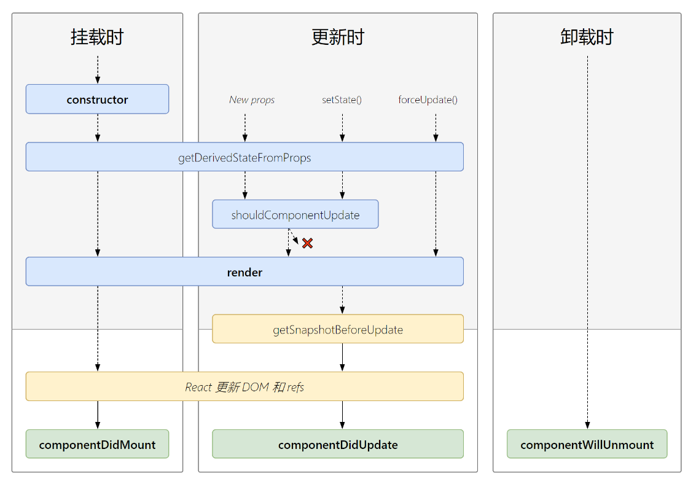

# 核心依赖

## react

react包含了生成虚拟DOM的函数react.createElement，及Component类。

### createElement

在 react 中，如要要创建 DOM 元素了，只能使用 React 提供的 JS API 来创建，不能【直接】像 Vue 中那样，手写 HTML 元素

React.createElement() 方法，用于创建 虚拟DOM 对象，它接收 3个及以上的参数

- 参数1： 是个字符串类型的参数，表示要创建的元素类型

- 参数2： 是一个属性对象，表示 创建的这个元素上，有哪些属性

- 参数3： 元素的子节点

```react
var myDiv = React.createElement('div', { title: 'this is a div', id: 'mydiv' }, '这是一个div', myH1)
//<div title="this is a div" id="mydiv">这是一个div</div>
```

由于，React官方，发现，如果直接让用户手写 JS 代码创建元素，用户会疯掉的，然后，用户就开始寻找新的前端框架了，于是，React 官方，就提出了一套 JSX 语法规范，能够让我们在 JS 文件中，书写类似于 HTML 那样的代码，快速定义虚拟DOM结构；

问题： JSX（符合 XML 规范的 JS 语法）的原理是什么？

JSX内部在运行的时候，也是先把类似于HTML 这样的标签代码，转换为了 React.createElement 的形式；（JSX是一个对程序员友好的语法糖）

在JSX创建DOM的时候，所有的节点，必须有唯一的根元素进行包裹；

## react-dom

包的核心功能就是把这些虚拟DOM渲染到文档中变成实际DOM

### render

全局定义将组件App放置在`id='App'`的容器里

```react
import React from 'react'
import ReactDom from 'react-dom'
import App from './app.jsx'
// ReactDOM.render('要渲染的虚拟DOM元素', '要渲染到页面上的哪个位置中')
// 注意： ReactDOM.render() 方法的第二个参数，和vue不一样，不接受 "#app" 这样的字符串，而是需要传递一个原生的 DOM 对象
ReactDom.render(
    <App/>,
    document.getElementById('App')
)
```

## react-router-dom

HashRouter, Route, Link


# 组件的生命周期

https://react.docschina.org/docs/react-component.html

https://m.html.cn/qa/react/14367.html

https://juejin.cn/post/7285540804734468150#heading-0

生命周期的描述如下：

- 挂载期：一个组件实例初次创建的过程。
- 更新期：组件在创建后再次渲染的过程。
- 卸载期：组件在使用完后被销毁的过程。



## 组件初始化阶段

**组件实例创建阶段的生命周期函数，在组件的一辈子中，只执行一次**；

### constructor(props)

实例过程中自动调用的方法，在方法内部通过 super 关键字获取来自父组件的 props

通常用于初始化组件的状态和绑定方法。

- this.state初始化
- 为事件处理函数绑定实例

```
constructor(props) { 
		//调用父类React Component的构造函数，⽤来将⽗组件传来的 props 绑定到这个类中
    super(props);
    this.state = { count: 0 }; 
    this.handleClick = this.handleClick.bind(this); 
}

```

### ~~componentWillMount~~

组件将要被挂载，此时还没有开始渲染虚拟DOM，无法获取到页面上的任何元素，因为虚拟DOM和页面都还没有开始渲染呢。

- 进⾏ajax请求，作者一开始也喜欢在React的willMount函数中进行异步获取数据（认为这可以减少白屏的时间），后来发现其实应该在didMount中进行。

- 可以修改state

### getDerivedStateFromProps（新增）

### render

> 它是一个纯函数，其中不应该包含任何副作用或改变状态的操作。

创建虚拟dom，当render执行完，内存中就有了完整的虚拟DOM了

### componentDidMount

这个函数是在组件挂载到DOM后执行的，可以在这里获取数据、进行一些异步请求或DOM操作。

- 网络请求获取数据
- 对DOM进行操作
- 这个方法是比较适合添加订阅的地方。如果添加了订阅，请不要忘记在 `componentWillUnmount()` 里取消订阅  

## 组件更新阶段

### 触发更新条件

- 组件的state
- 组件的props
- 父组件重新render

### ~~componentWillReceiveProps~~

组件将要接收新属性props，此时，只要这个方法被触发，就证明父组件为当前子组件传递了新的属性值；

如果我们使用 this.props 来获取属性值，这个属性值，不是最新的，是上一次的旧属性值

```jsx
componentWillReceiveProps(nextProps){    
    console.log(this.props.pmsg + ' ---- ' + nextProps.pmsg
);}
```

### getDerivedStateFromProps（新增）

### shouldComponentUpdate

组件是否需要被更新，此时，组件尚未被更新，但是，state 和 props 肯定是最新的。 首次渲染或使用 `forceUpdate()` 时不会调用该方法。 

```
shouldComponentUpdate(nextProps, nextState)
```

### ~~componentWillUpdate~~

组件将要被更新，此时，尚未开始更新，内存中的虚拟DOM树还是旧的，页面上的 DOM 元素 也是旧的

### render

根据最新的 state 和 props 重新渲染一棵内存中的 虚拟DOM树，当 render 调用完毕，内存中的旧DOM树，已经被新DOM树替换了！**此时页面还是旧的**

### getSnapshotBeforeUpdate

### componentDidUpdate

`componentDidUpdate(prevProps,prevState,snapshot)`：它在组件更新（即`render()` 方法执行后）后被调用。它接收三个参数：`prevProps`、`prevState`、`snapshot`。与旧的钩子函数相比，多了一个参数`snapshot`。

```jsx
componentDidUpdate(prevProps, prevState, snapshot) {
    if (this.props.data !== prevProps.data) {
      console.log('this.props中的数据变了');
    }

    // 使用getSnapshotBeforeUpdate()的返回值
    if (snapshot !== null) {
      console.log('Snapshot from getSnapshotBeforeUpdate:', snapshot);
    }
}
```

> 说明：如果`getSnapshotBeforeUpdate()`有返回值，它会成为`componentDidUpdate()`的第三个参数，你可以在这里使用它。


## 组件销毁阶段

这个函数是在组件卸载前执行的，此时组件还可以正常使用；可以在这里进行一些清理工作，比如取消订阅、清除定时器、取消异步请求或移除事件监听器等。

**也有一个显著的特点，一辈子只执行一次**

### componentWillUnmount

## 新旧生命周期对比


当组件实例被创建并插入 DOM 中时，其生命周期调用顺序如下：

- constructor()
- static getDerivedStateFromProps()
- render()
- componentDidMount()

当组件的 props 或 state 发生变化时会触发更新。组件更新的生命周期调用顺序如下：

- static getDerivedStateFromProps()
- shouldComponentUpdate()
- render()
- getSnapshotBeforeUpdate()
- componentDidUpdate()

### 废弃的生命周期

#### 为什么废弃

`React`废弃`componentWillMount`和`componentWillReceiveProps`这两个[生命周期方法](https://so.csdn.net/so/search?q=生命周期方法&spm=1001.2101.3001.7020)的原因主要涉及到`React的内部机制变更、性能优化以及未来特性的支持`。以下是对这两个问题的详细解答

- **与Fiber架构的调和过程不兼容**：**fiber算法是异步渲染**，异步的渲染，很可能因为高优先级任务的出现而打断现有任务导致它们就可能执行多次，具体是在`render()`生成虚拟 `dom` 阶段可以打断重来， 这就会导致在dom挂载之前或是被更新之前的所有任务都会重复操作，所以`componentWillMount()`、·`componentWillReceiveProps()` `componentWIllUpdate()`方法可能会执行多次。

- **容易引起混淆和使用不当**：旧版Will生命周期方法在执行异步操作（如数据请求、订阅等）时，**由于不明确的调用时机，可能导致状态更新不一致或副作用不可预测**。这增加了代码的复杂性和出错的可能性，使得开发者难以维护和调试。

  

#### componentWillMount

**新版本中官方推荐将初始化的操作放在`constructor()`中， 将请求异步数据、订阅事件源、监听事件的操作放在`componentDidMount()`**

> 不推荐使用的原因主要是它的执行时机可能会导致一些问题。具体来说，如果你在`componentWillMount()` 中触发了异步操作，可能会导致在组件卸载前仍然执行未完成的操作，这可能会引发潜在的错误。

#### componentWillUpdate

> 与`componentWillReceiveProps()`类似，这个方法也容易导致状态不一致。

#### componentWillReceiveProps

在老版本的`React`中，如果组件自身的state与其props密切相关的话，我们就会用到`componentWillReceiveProps(nextProps)`。

这个生命周期方法被不推荐使用，因为它容易导致状态不一致的问题。常见的业务场景比如，tabs的激活状态，一般我们会在组件自身内通过state维持，但是当我们从其他页面返回时，想要保持离开之前时的tabs状态，这时我们可以通过props来传递，（**破坏了数据源的单一性**）

```react
//previous 
componentWillReceiveProps(nextProps, nextContext) {
   if(nextProps.activeIndex !== this.state.activeIndex) {
     this.setState({activeIndex: nextProps.activeIndex})
     this.fetchData() //因异步中断，可能会重复操作
   }
 }

/** next 
*将更新state与触发逻辑的操作分成两部分来执行，state更新部分在getDerivedStateFromProps中完成， 逻辑部分操作
*在componentDidUpdate()中完成
*/
static getDerivedStateFromProps(nextProps, prevState) { //此方法不能获取组件实例
   if(nextProps.activeIndex !== prevState.activeIndex) {
     return {activeIndex: nextProps.activeIndex}
   }
 }
componentDidUpdate() {
  this.fetchData() //可以确保只执行一次
}
```

该生命周期函数按照上面图谱中应该是在props属性改变之后调用，但其实只要父组件重新渲染，无论子组件的props有没有更新，子组件都会调用`componentWillReceiveProps` **注意这里可能会造成死循环，即当子组件在该方法中调用了父组件通过props传递过来的函数时， 恰巧该函数中有能让父组件重新渲染的逻辑，就会造成死循环**

```react
class Parent extends Component {
    render() {
        return (
            <div>
          			{/* 迫使父组件更新, 子组件就会调用componentWillReceiveProps */}
                <div onClick={() => this.forceUpdate()}> re-render </div> 
                <Child parentFun={() => this.setState({})} />
            </div>
        )
    }
}

class Child extends Component {
    componentWillReceiveProps(nextProps, nextContext) {
      {/*  子组件调用了父组件通过props传递过来的函数，该函数会使父组件重新渲染，造成死循环 */}
        nextProps.parentFun()
    }
    render() {
        return (
            <div> child component </div>
        );
    }
}
```


### 新增

#### getDerivedStateFromProps

> **使用getDerivedStateFromProps代替了旧的componentWillReceiveProps**

`getDerivedStateFromProps` 是 React 生命周期中的一个静态方法，**主要用于在组件接收到新的 props 时更新 state**。这个方法在组件的初始渲染和后续的每次更新（即每次接收到新的 props 或 state）时都会被调用。

- 使用方式
  - **静态方法**：这意味着你不能在这个方法中使用 `this` 关键字。它的第一个参数是新的 props，第二个参数是当前的 state。
  - **不触发副作用**：与`componentDidUpdate()` 不同，`getDerivedStateFromProps()` 不应执行副作用，如发起网络请求。它只用于计算state。
- **返回值**：`getDerivedStateFromProps` 必须返回一个对象来更新 state，或者返回 `null` 表示不需要更新 state。
- **作用**：这个方法的主要作用是确保组件的 state 总是与 props 保持一致。这是一个非常罕见的需求，因为通常我们希望 props 只是初始数据来源，而不是 state 的来源。然而，在某些特殊的场景中，可能需要根据 props 的变化来更新 state。

nextProps：与componentWillReceiveProps的nextProps参数相同。即改变后的Props

preState：发生改变前的state中各数据的值。

```
class MyComponent extends React.Component { 
    static getDerivedStateFromProps(nextProps, prevState) { 
        // 根据 nextProps 和 prevState 计算并返回新的 state 
        if (nextProps.value !== prevState.value) { 
            return { value: nextProps.value }; 
        } 
        return null; // 如果不需要更新 state，返回 null 
    } 
    
    constructor(props) { 
        super(props); 
        this.state = { 
            value: props.value, 
        }; 
    }
    
    render() { 
        return <div>{this.state.value}</div>; 
    } 
}

```

#### getSnapshotBeforeUpdate

> getSnapshotBeforeUpdate代替了旧的componentWillUpdate。

`getSnapshotBeforeUpdate(nextProps,prevState)`：它在组件更新之前触发。它允许你**捕获组件更新前**的一些信息（例如，滚动位置），并在组件更新后使用这些信息。

示例中，`getSnapshotBeforeUpdate()` 用于捕获滚动位置，然后在`componentDidUpdate()` 中使用snapshot来恢复滚动位置，以确保用户在滚动列表时不会在更新后失去滚动位置。

```react
class MyComponent extends React.Component {
	constructor(props) {
	  super(props);
	  this.myRef = React.createRef();
	}
  
	getSnapshotBeforeUpdate(prevProps, prevState) {
	  // 捕获组件更新前的滚动位置
	  if (prevProps.items.length < this.props.items.length) {
		const scrollHeight = this.myRef.current.scrollHeight;
		const scrollTop = this.myRef.current.scrollTop;
		return { scrollHeight, scrollTop };
	  }
	  return null;
	}
  
	componentDidUpdate(prevProps, prevState, snapshot) {
	  // 使用snapshot来恢复滚动位置
	  if (snapshot !== null) {
		this.myRef.current.scrollTop = snapshot.scrollTop + (this.myRef.current.scrollHeight - snapshot.scrollHeight);
	  }
	}
  
	render() {
	  // 使用ref来获取DOM元素的引用
	  return <div ref={this.myRef}>{/* 组件内容 */}</div>;
	}
}

```

主要特点和用法：

> - **触发时机**：`getSnapshotBeforeUpdate()` 在`render()` 方法被调用后、组件DOM更新前触发，通常用于在更新前捕获一些DOM信息。
> - **接收两个参数**：这个生命周期方法接收两个参数：`prevProps`、`prevState`。你可以使用这些参数来比较前后的props和state。
> - **返回值**：`getSnapshotBeforeUpdate()` 方法应该返回一个值（通常是一个对象），它将成为`componentDidUpdate()` 方法的第三个参数。这个返回值通常用于保存一些DOM相关的信息，比如滚动位置。
> - **通常和componentDidUpdate()一起使用**：`getSnapshotBeforeUpdate()` 结合`componentDidUpdate(prevProps, prevState, snapshot)` 使用，snapshot参数是`getSnapshotBeforeUpdate()` 的返回值。你可以在`componentDidUpdate()` 中使用snapshot来执行DOM操作或其他一些操作。

作

#### getDerivedStateFromError

```
static getDerivedStateFromError(error)
```

此生命周期会在后代组件抛出错误后被调用。 它将抛出的错误作为参数，并返回一个值以更新 state

```
class ErrorBoundary extends React.Component {
  constructor(props) {
    super(props);
    this.state = { hasError: false };
  }

  static getDerivedStateFromError(error) {    // 更新 state 使下一次渲染可以显降级 UI    return { hasError: true };  }
  render() {
    if (this.state.hasError) {      // 你可以渲染任何自定义的降级  UI      return <h1>Something went wrong.</h1>;    }
    return this.props.children; 
  }
}
```

## forceUpdate

默认情况下，当组件的 state 或 props 发生变化时，组件将重新渲染。如果 `render()` 方法依赖于其他数据，则可以调用 `forceUpdate()` 强制让组件重新渲染。

调用 `forceUpdate()` 将致使组件调用 `render()` 方法，**此操作会跳过该组件的 `shouldComponentUpdate()`。但其子组件会触发正常的生命周期方法，包括 `shouldComponentUpdate()` 方法**。如果标记发生变化，React 仍将只更新 DOM。

## useEffect模拟生命周期

| 类组件生命周期方法      | useEffect 实现方式                         |
| :---------------------- | :----------------------------------------- |
| `componentDidMount`     | `useEffect(fn, [])`                        |
| `componentDidUpdate`    | `useEffect(fn)` 或 `useEffect(fn, [deps])` |
| `componentWillUnmount`  | `useEffect(() => { return () => {} }, [])` |
| `shouldComponentUpdate` | `React.memo` + `useMemo`                   |

# 核心概念

## jsx

### 条件渲染

```ts
function Greeting(props) {
  const isLoggedIn = props.isLoggedIn;
  if (isLoggedIn) {
    return <UserGreeting />;
  }
  return <GuestGreeting />;
}
//或者
function Greeting(props) {
  const isLoggedIn = props.isLoggedIn;
  return (
  	{isLoggedIn?<UserGreeting />:<GuestGreeting />}
  )
}
ReactDOM.render(
  // Try changing to isLoggedIn={true}:
  <Greeting isLoggedIn={false} />,
  document.getElementById('root')
);
```

### 列表 & Key

key为每个元素加上唯一的标识，这样在执行diff的时候会加快位置的确定

  ```js
function NumberList(props) {
  const numbers = props.numbers;
  const listItems = numbers.map((number) =>
    <li key={number.toString()}>
      {number}
    </li>
  );
  return (
    <ul>{listItems}</ul>
  );
}

const numbers = [1, 2, 3, 4, 5];
ReactDOM.render(
  <NumberList numbers={numbers} />,
  document.getElementById('root')
);
  ```

 **在 JSX 中嵌入 map()**

  ```js
function NumberList(props) {
  const numbers = props.numbers;
  return (
    <ul>
      {numbers.map((number) =>
        <ListItem key={number.toString()}
                  value={number} />
      )}
    </ul>
  );
}
  ```

key 帮助 React 识别哪些元素改变了，比如被添加或删除。因此你应当给数组中的每一个元素赋予一个确定的标识。一个元素的 key 最好是这个元素在列表中拥有的一个独一无二的字符串。

**如果使用数组索引，那么在对dom进行添加或删除，会出问题**：


页面渲染好了之后，3 个 input 输入框依次输入随机内容，当我们用 index 作为 key 的时候，点击删除第一项按钮会发现，左侧文字正确改变，input 输入框最后一项没了，这不是我们希望的样子。 因为当我们使用 index 作为 key 时，此时 key 为 0、1、2，删掉第一项后 key 变为 0、1，此时 react 在执行 diff 算法过程中，任务 key=0 存在，只需要**更新**子节点的值，所以左侧的 name 成功改变，而 **input 的值非受控，不会更新**。同时在对比计算中少了 key=2 这项，删除了最后一项。

### 添加样式的方式

**第一种：行内样式**

想给虚拟dom添加行内样式，需要使用表达式传入样式对象的方式来实现：

```javascript
// 注意这里的两个括号，第一个表示我们在要JSX里插入JS了，第二个是对象的括号
 <p style={{color:'red', fontSize:'14px'}}>Hello world</p>
```

**动态添加样式**

```javascript
<div style={{display: (index===this.state.currentIndex) ? "block" : "none"}}>此标签是否隐藏</div>
```

```javascript
<div className={index===this.state.currentIndex?"active":null}>此标签是否选中</div>
```

**第二种：内嵌样式**

```javascript
<style>{`.operafor4{margin-top:42px !important}`}</style>
```

**第三种：css modules**

https://www.ruanyifeng.com/blog/2016/06/css_modules.html

CSS的规则都是全局的，任何一个组件的样式规则，都对整个页面有效。例如：父组件和子组件使用相同的class，父组件的class会覆盖子组件的样式

产生局部作用域的唯一方法，就是使用一个独一无二的`class`的名字，不会与其他选择器重名。这就是 CSS Modules 的做法。

css Modules 添加多个className

```css
<div className={`${styles.sAll} ${styles.s1}`}>aaaaaa</div>
```

CSS Modules 允许使用`:global(.className)`的语法，声明一个全局规则。

```css
.title {
  color: red;
}

:global(.title) {
  color: green;
}
```

**第四种：样式组件（styled-components）**

styled-components是针对React写的一套css-in-js框架，简单来讲就是在js中写css。
styled-components是一个第三方包，要安装。**Material框架**中的样式也是如此

## css

| 方案                                        | 原理                        | 优点                                                         | 缺点                                       | 适用场景                                     |
| :------------------------------------------ | :-------------------------- | :----------------------------------------------------------- | :----------------------------------------- | :------------------------------------------- |
| **CSS Modules**                             | 自动生成唯一类名，避免冲突  | 局部样式隔离，编译时生成，相对安全                           | 类名需要用驼峰或中括号访问                 | 组件库开发，中大型项目                       |
| **CSS-in-JS** (styled-components / Emotion) | 在JS中写CSS，动态生成样式   | 动态样式能力强，可访问JS变量，无全局污染                     | 运行时性能开销，包体积增加，调试相对麻烦   | 需要高度动态主题的项目，或追求开发体验的团队 |
| **Tailwind CSS**                            | 原子化CSS，通过类名组合样式 | 开发效率极高，一致性有保障，最终包体积小（未使用的样式会被Purge） | 类名多的时候可读性会下降，需要熟悉原子类名 | 追求开发效率的新项目，团队有规范意识的场景   |

### **CSS Modules**

```
// Button.js
import styles from './Button.module.css';

function Button() {
  return <button className={styles.primary}>点击</button>;
}

/* Button.module.css */
.primary {
  background: blue;
  color: white;
}
```

### **Tailwind CSS**

如果你追求极致的开发效率和一致性，Tailwind会让你的开发体验上一个台阶。它特别适合团队协作，因为大家都用同一套设计系统，不用纠结类名怎么起。

### **styled-components** 

适合动态样式和组件化

```
import styled from 'styled-components';

const Button = styled.button`
  background: ${props => props.primary ? 'blue' : 'gray'};
  color: white;
  padding: 10px 20px;
`;

function App() {
  return <Button primary>点击</Button>;
}
```


### class动态

#### 使用内联样式

如果你的类名变化是基于某些条件，你可以直接在JSX中使用内联样式，并通过条件表达式来决定是否应用某个样式类。

```jsx
const MyComponent = ({ isActive }) => {
  return (
    <div style={{ backgroundColor: isActive ? 'green' : 'red' }}>
      {isActive ? 'Active' : 'Inactive'}
    </div>
  );
};
```

#### 使用条件渲染

对于更复杂的类名变化，你可以在JSX中直接使用条件渲染来添加或移除类名。

```jsx
const MyComponent = ({ isActive }) => {
  return (
    <div className={isActive ? 'active' : 'inactive'}>
      {isActive ? 'Active' : 'Inactive'}
    </div>
  );
};
```

#### 使用模板字符串

如果你需要根据更复杂的逻辑动态生成类名，你可以使用ES6的模板字符串功能。

```jsx
const MyComponent = ({ status }) => {
  const className = `status-${status}`; // 根据status动态生成类名
  return (
    <div className={className}>Status: {status}</div>
  );
};
```

#### 使用库

`clsx` 是 `classnames` 的一个**现代、轻量、高性能的替代品**。如果你现在要开始一个新项目，**`clsx` 通常是更推荐的选择**。

| 对比维度             | **clsx**                                                     | **classnames**                               |
| :------------------- | :----------------------------------------------------------- | :------------------------------------------- |
| **包大小 (gzip)**    | **极简 (约 239B)**                                           | 稍大 (约 1.5KB)                              |
| **性能**             | **更快**，专为性能优化，在各类浏览器中均有优势               | 表现良好，但相对稍慢                         |
| **API 与语法**       | **完全兼容** `classnames` 的日常用法                         | 经典的、功能全面的 API                       |
| **对嵌套数组的处理** | **设计上只扁平化一层**。对于深层嵌套（超过3层）的数组，行为可能与 `classnames` 略有不同，但这在实际开发中极少遇到 | **递归扁平化**所有层级的嵌套数组，处理更彻底 |
| **适用场景**         | **新项目首选**，对性能有要求，希望包体积尽可能小             | **维护旧项目**，或团队对深层嵌套有硬性要求   |

##### classnames库

`classnames`库可以帮助你更方便地处理多个条件，尤其是当你有多个类名需要基于多个条件变化时。首先，你需要安装`classnames`：

```bash
npm install classnames
```

然后在你的组件中使用它：

```jsx
import classNames from 'classnames';
 
const MyComponent = ({ isActive, hasError }) => {
  return (
    <div className={classNames({
      'active': isActive,
      'error': hasError,
      'default': !(isActive || hasError) // 默认类名，当没有其他类名激活时使用
    })}>
      {isActive ? 'Active' : hasError ? 'Error' : 'Default'}
    </div>
  );
};
```

##### clsx库

`clsx` 非常灵活，支持多种写法，可以应对各种复杂的类名组合场景。

| 输入类型         | 语法示例                                        | 说明                                                         |
| :--------------- | :---------------------------------------------- | :----------------------------------------------------------- |
| **字符串**       | `clsx('foo', 'bar')`                            | 多个字符串会拼接起来，返回 `"foo bar"`。                     |
| **对象**         | `clsx({ foo: true, bar: false })`               | 对象的键，只有当其值为 `true` 时才会被包含。返回 `"foo"`。   |
| **对象（混合）** | `clsx({ foo: true }, { bar: true })`            | 支持传入多个对象参数，最终合并。返回 `"foo bar"`。           |
| **数组**         | `clsx(['foo', 'bar'])`                          | 数组会被展开。返回 `"foo bar"`。                             |
| **条件表达式**   | `clsx('foo', isActive && 'bar')`                | 利用逻辑与，当 `isActive` 为 `true` 时，`'bar'` 被包含。     |
| **过滤假值**     | `clsx('foo', null, undefined, 0, false, 'bar')` | 所有假值（`null`, `undefined`, `false`, `0`, `NaN`, `''`）都会被自动忽略。返回 `"foo bar"`。 |

#### 使用Styled Components:

首先，安装Styled Components：

```bash
npm install styled-components
```

然后，你可以这样使用它：

```jsx
import styled from 'styled-components';
 
const StatusDiv = styled.div`
  background-color: ${props => props.isActive ? 'green' : 'red'}; // 动态背景色
`;
 
const MyComponent = ({ isActive }) => {
  return (
    <StatusDiv isActive={isActive}>{isActive ? 'Active' : 'Inactive'}</StatusDiv>
  );
};
```

## 表单和受控组件

https://juejin.cn/post/6858276396968951822#heading-7

- 非受控组件
  - 由DOM本身维护 state
  - 控制能力较弱，但更加方便快捷，代码量少

- 受控组件：大部分时候推荐使用受控组件来实现表单

  - 表单数据由 React 组件负责处理，通常保存在组件的 state 属性中，并且只能通过使用 [`setState()`](https://react.docschina.org/docs/react-component.html#setstate)来更新。

    **对于受控组件来说，输入的值始终由 React 的 state 驱动**

  - 性能弱，可控制强

### 受控组件

```tsx
class TestComponent extends React.Component {
  constructor (props) {
    super(props);
    this.state = { username: 'lindaidai' };
  }
  render () {
    return <input name="username" value={this.state.username} />
  }
}

```

输入框的内容取决的是`input`中的`value`属性，那么我们可以在`this.state`中定义一个名为`username`的属性，并将`input`上的`value`指定为这个属性

但是这时候你会发现`input`的内容是只读的，因为`value`会被我们的`this.state.username`所控制，当用户输入新的内容时，`this.state.username`并不会自动更新，这样的话`input`内的内容也就不会变了。可以用一个`onChange`事件来监听输入内容的改变并使用`setState`更新`this.state.username`

```
class TestComponent extends React.Component {
  constructor (props) {
    super(props);
    this.state = {
      username: "lindaidai"
    }
  }
  onChange (e) {
    console.log(e.target.value);
    this.setState({
      username: e.target.value
    })
  }
  render () {
    return <input name="username" value={this.state.username} onChange={(e) => this.onChange(e)} />
  }
}

```

### 非受控组件

对于受控组件，我们需要为每个`状态更新`(例如`this.state.username`)编写一个`事件处理程序`(例如`this.setState({ username: e.target.value })`)。

那么还有一种场景是：我们仅仅是想要获取某个表单元素的值，而不关心它是如何改变的。

**可以用获取`DOM`元素信息的方式来获取表单元素的值**

```
import React, { Component } from 'react';

export class UnControll extends Component {
  constructor (props) {
    super(props);
    this.inputRef = React.createRef();
  }
  handleSubmit = (e) => {
    console.log('我们可以获得input内的值为', this.inputRef.current.value);
    e.preventDefault();
  }
  render () {
    return (
      <form onSubmit={e => this.handleSubmit(e)}>
        <input defaultValue="lindaidai" ref={this.inputRef} />
        <input type="submit" value="提交" />
      </form>
    )
  }
}

```

### 特殊的文件file标签

**对于file类型的表单控件它始终是一个不受控制的组件，因为它的值只能由用户设置，而不是以编程方式设置。**

例如我现在想要通过状态更新来控制它：

```jsx
jsx 代码解读复制代码import React, { Component } from 'react';

export default class UnControll extends Component {
  constructor (props) {
    super(props);
    this.state = {
      files: []
    }
  }
  handleSubmit = (e) => {
    e.preventDefault();
  }
  handleFile = (e) => {
    console.log(e.target.files);
    const files = [...e.target.files];
    console.log(files);
    this.setState({
      files
    })
  }
  render () {
    return (
      <form onSubmit={e => this.handleSubmit(e)}>
        <input type="file" value={this.state.files} onChange={(e) => this.handleFile(e)} />
        <input type="submit" value="提交" />
      </form>
    )
  }
}
```

在选择了文件之后，我试图用`setState`来更新，结果却报错了：


所以我们应当使用非受控组件的方式来获取它的值，可以这样写：

```jsx
jsx 代码解读复制代码import React, { Component } from 'react';

export default class FileComponent extends Component {
  constructor (props) {
    super(props);
    this.fileRef = React.createRef();
  }
  handleSubmit = (e) => {
    console.log('我们可以获得file的值为', this.fileRef.current.files);
    e.preventDefault();
  }
  render () {
    return (
      <form onSubmit={e => this.handleSubmit(e)}>
        <input type="file" ref={this.fileRef} />
        <input type="submit" value="提交" />
      </form>
    )
  }
}
```


## props

```jsx
function Welcome(props) {  return <h1>Hello, {props.name}</h1>;
}

const element = <Welcome name="Sara" />;ReactDOM.render(
  element,
  document.getElementById('root')
);
```

### defaultProps

无论是函数组件还是 class 组件，都拥有 `defaultProps` 属性。可以通过配置特定的 `defaultProps` 属性来定义 `props` 的默认值

```jsx
class Greeting extends React.Component {
  render() {
    return (
      <h1>Hello, {this.props.name}</h1>
    );
  }
}

// 指定 props 的默认值：
Greeting.defaultProps = {
  name: 'Stranger'
};

// 渲染出 "Hello, Stranger"：
ReactDOM.render(
  <Greeting />,
  document.getElementById('example')
);
```

### PropTypes类型检查

PropTypes 进行类型检查,可用于确保组件接收到的props数据类型是有效的

导入包

```jsx
import PropTypes from 'prop-types';
```

编写组件

```jsx
class Greeting extends React.Component {
    render() {
        return <h1>Hello, {this.props.name}</h1>
    }
}
```

新增类型检查

```cpp
Greeting.propTypes = {
// 你可以将属性声明为 JS 原生类型，默认情况下
  // 这些属性都是可选的。
  optionalArray: PropTypes.array,
  optionalBool: PropTypes.bool,
  optionalFunc: PropTypes.func,
  optionalNumber: PropTypes.number,
  optionalObject: PropTypes.object,
  optionalString: PropTypes.string,
  optionalSymbol: PropTypes.symbol,

  // 任何可被渲染的元素（包括数字、字符串、元素或数组）
  // (或 Fragment) 也包含这些类型。
  optionalNode: PropTypes.node,

  // 一个 React 元素。
  optionalElement: PropTypes.element,

  // 一个 React 元素类型（即，MyComponent）。
  optionalElementType: PropTypes.elementType,

  // 你也可以声明 prop 为类的实例，这里使用
  // JS 的 instanceof 操作符。
  optionalMessage: PropTypes.instanceOf(Message),

  // 你可以让你的 prop 只能是特定的值，指定它为
  // 枚举类型。
  optionalEnum: PropTypes.oneOf(['News', 'Photos']),

  // 一个对象可以是几种类型中的任意一个类型
  optionalUnion: PropTypes.oneOfType([
    PropTypes.string,
    PropTypes.number,
    PropTypes.instanceOf(Message)
  ]),

  // 可以指定一个数组由某一类型的元素组成
  optionalArrayOf: PropTypes.arrayOf(PropTypes.number),

  // 可以指定一个对象由某一类型的值组成
  optionalObjectOf: PropTypes.objectOf(PropTypes.number),

  // 可以指定一个对象由特定的类型值组成
  optionalObjectWithShape: PropTypes.shape({
    color: PropTypes.string,
    fontSize: PropTypes.number
  }),
  
  // An object with warnings on extra properties
  optionalObjectWithStrictShape: PropTypes.exact({
    name: PropTypes.string,
    quantity: PropTypes.number
  }),   

  // 你可以在任何 PropTypes 属性后面加上 `isRequired` ，确保
  // 这个 prop 没有被提供时，会打印警告信息。
  requiredFunc: PropTypes.func.isRequired,

  // 任意类型的数据
  requiredAny: PropTypes.any.isRequired,

  // 你可以指定一个自定义验证器。它在验证失败时应返回一个 Error 对象。
  // 请不要使用 `console.warn` 或抛出异常，因为这在 `onOfType` 中不会起作用。
  customProp: function(props, propName, componentName) {
    if (!/matchme/.test(props[propName])) {
      return new Error(
        'Invalid prop `' + propName + '` supplied to' +
        ' `' + componentName + '`. Validation failed.'
      );
    }
  },

  // 你也可以提供一个自定义的 `arrayOf` 或 `objectOf` 验证器。
  // 它应该在验证失败时返回一个 Error 对象。
  // 验证器将验证数组或对象中的每个值。验证器的前两个参数
  // 第一个是数组或对象本身
  // 第二个是他们当前的键。
  customArrayProp: PropTypes.arrayOf(function(propValue, key, componentName, location, propFullName) {
    if (!/matchme/.test(propValue[key])) {
      return new Error(
        'Invalid prop `' + propFullName + '` supplied to' +
        ' `' + componentName + '`. Validation failed.'
      );
    }
  })
}
```

### this.props.children 

> 类型vue的插槽

如果当前组件没有子节点，它就是 undefined ;

如果有一个子节点，数据类型是 Object；

如果有多个子节点，数据类型就是 Array。

优点

1. 组件全部放在顶层，数据来源直接在顶层定义，方便快捷
2. 结构更加明确，使用简单，没有更多层次的组件引用
3. 充分的认识 React 本质和 React.Children + props.children API

```
import React from 'react';
 
const Wrapper = (props) => {
  return (
    <div className="wrapper">
      {props.children}
    </div>
  );
};
 
const App = () => {
  return (
    <Wrapper>
      <h1>Hello, World!</h1>
      <p>This is a sample text.</p>
    </Wrapper>
  );
};
 
export default App;
```

`Wrapper` 组件使用 `props.children` 来访问并渲染其子元素。无论传递什么元素，`props.children` 都可以接收到并在组件内进行渲染。

```
// main.js
import React from "react";
import ReactDOM from "react-dom";
import "./index.css";
import App from "./App";

// components
import About from "./components/About";

ReactDOM.render(
  <React.StrictMode>
    <App>
      <About name='name'></About>
      <About name='fisrtName'></About>
    </App>
  </React.StrictMode>,
  document.getElementById("root")
);

```

```
import React from 'react';

export default function About(props){
  return <div>{props.name}-{props.haxi}</div>
}
```


## 状态state

### setState

1. ‌**传入对象**‌：将新状态与当前状态进行浅合并。

   ```
   javascriptCopy Code
   
   
   
   this.setState({ count: this.state.count + 1 });
   ```

2. ‌**传入函数**‌：当新状态依赖于旧状态时，推荐使用函数形式，确保获取到最新的状态值。

   ```
   javascriptCopy Codethis.setState((prevState) => ({
     count: prevState.count + 1
   }));
   ```

3. ‌**使用回调函数**‌：在状态更新并重新渲染后执行代码，确保获取到最新状态。

   ```
   javascriptCopy Codethis.setState({ count: this.state.count + 1 }, () => {
     console.log('更新后的状态:', this.state.count);
   });
   ```

### useState

用于为函数组件引入状态（state）。纯函数不能有状态，所以把状态放在钩子里面。

#### 基本使用

```
const [state, setState] = useState(initialState);
```

- `initialState`: 状态的初始值，可以是任何类型（数字、字符串、对象、数组、函数等）
  - 如果传递函数作为 `initialState`，则它将被视为 **初始化函数**。它应该是纯函数，不应该接受任何参数，并且应该返回一个任何类型的值。当初始化组件时，React 将调用你的初始化函数，并将其返回值存储为初始状态

- `state`: 当前的状态值
- `setState`: 更新状态的函数

#### 更新状态方式

1. **直接设置新值**:

   ```
   setCount(10);
   ```

2. **基于前一个状态更新**:

   ```
   setCount(prevCount => prevCount + 1);
   ```

   假设 `age` 为 `42`，这个处理函数三次调用 `setAge(age + 1)`：

   ```
   function handleClick() {
     setAge(age + 1); // setAge(42 + 1)
     setAge(age + 1); // setAge(42 + 1)
     setAge(age + 1); // setAge(42 + 1)
   }
   ```

   然而，点击一次后，`age` 将只会变为 `43` 而不是 `45`！这是因为调用 `set` 函数 [不会更新](https://react.docschina.org/learn/state-as-a-snapshot) 已经运行代码中的 `age` 状态变量。因此，每个 `setAge(age + 1)` 调用变成了 `setAge(43)`。

   为了解决这个问题，**你可以向 `setAge` 传递一个 \*更新函数\***，而不是下一个状态：

   ```
   function handleClick() {
     setAge(a => a + 1); // setAge(42 => 43)
     setAge(a => a + 1); // setAge(43 => 44)
     setAge(a => a + 1); // setAge(44 => 45)
   }
   ```

3. **更新对象或数组**:

   ```
   const [user, setUser] = useState({ name: 'John', age: 30 });
   // 🚩 不要像下面这样改变一个对象：
   user.age = 'Taylor';
   // 通过创建一个新对象来替换整个对象
   setUser(prevUser => ({ ...prevUser, age: 31 }));
   ```

##### mutation

在 React 中，"mutation"（突变）指的是直接修改数据或状态，而不是创建新的副本。理解这个概念对于正确管理 React 的状态非常重要。

Mutation 是指直接更改对象或数组的内容，而不是创建一个新的对象或数组。在 React 中，**直接突变状态是被禁止的**，因为这会导致不可预测的行为和性能问题。

**为什么 React 反对 Mutation**

1. **不可预测性**：直接突变可能导致组件不按预期重新渲染
2. **性能优化**：React 依赖不可变性来高效地确定何时需要重新渲染
3. **时间旅行调试**：像 Redux 这样的工具依赖不可变性来实现调试功能
4. **并发模式**：React 的未来功能依赖于状态更新的可预测性

**避免 Mutation 的工具**

1. **展开运算符 (`...`)**：用于对象和数组的浅拷贝

2. **数组方法**：`map`, `filter`, `concat`, `slice` 等不改变原数组的方法

   | 避免使用 (会改变原始数组) | 推荐使用 (会返回一个新数组）  |                                                              |
   | ------------------------- | ----------------------------- | ------------------------------------------------------------ |
   | 添加元素                  | `push`，`unshift`             | `concat`，`[...arr]` 展开语法（[例子](https://react.docschina.org/learn/updating-arrays-in-state#adding-to-an-array)） |
   | 删除元素                  | `pop`，`shift`，`splice`      | `filter`，`slice`（[例子](https://react.docschina.org/learn/updating-arrays-in-state#removing-from-an-array)） |
   | 替换元素                  | `splice`，`arr[i] = ...` 赋值 | `map`（[例子](https://react.docschina.org/learn/updating-arrays-in-state#replacing-items-in-an-array)） |
   | 排序                      | `reverse`，`sort`             | 先将数组复制一份（[例子](https://react.docschina.org/learn/updating-arrays-in-state#making-other-changes-to-an-array)） |

3. **第三方库**：

   - Immer：简化不可变更新逻辑

     ```
     import produce from 'immer';
     
     const [user, setUser] = useState({
       name: 'Alice',
       profile: { age: 25 }
     });
     
     // 使用 Immer 可以"看似"直接修改，但实际上创建了新对象
     setUser(produce(draft => {
       draft.profile.age = 26;
     }));
     ```

   - Immutable.js：提供持久化数据结构


### 执行机制

https://juejin.cn/post/6850418109636050958

https://juejin.cn/post/7062162951108558855

#### 批处理

**批处理**是 React 将多个状态更新合并为一次重新渲染的优化机制（如果每次调用setState都会触发更新，那么性能消耗就大）。简单说：**多个 setState 调用 → 一次渲染更新**。**将 `setState()` 视为请求而不是立即更新组件的命令。** 

| 特性       | React 17   | React 18+ |
| :--------- | :--------- | :-------- |
| 事件处理   | ✅ 批处理   | ✅ 批处理  |
| Promise    | ❌ 不批处理 | ✅ 批处理  |
| setTimeout | ❌ 不批处理 | ✅ 批处理  |
| 原生事件   | ❌ 不批处理 | ✅ 批处理  |
| fetch 回调 | ❌ 不批处理 | ✅ 批处理  |

##### **React 17**

**在 React 17 中，批处理是"选择性"的**

```
function React17Example() {
  const [count, setCount] = useState(0);
  const [flag, setFlag] = useState(false);
  
  console.log('渲染了', count, flag);
  
  // ✅ 会在 React 事件处理函数中批处理
  const handleClick = () => {
    setCount(c => c + 1);
    setFlag(f => !f);
    // 只触发 1 次重新渲染
  };
  
  // ❌ 不会在 Promise、setTimeout 中批处理
  const handleAsync = () => {
    setTimeout(() => {
      setCount(c => c + 1);  // 第1次渲染
      setFlag(f => !f);       // 第2次渲染
      // 总共触发 2 次重新渲染
    }, 1000);
  };
  
  // ❌ 不会在 fetch 回调中批处理
  const handleFetch = () => {
    fetch('/api/data').then(() => {
      setCount(c => c + 1);  // 第1次渲染
      setFlag(f => !f);       // 第2次渲染
    });
  };
  
  return (
    <div>
      <button onClick={handleClick}>同步更新</button>
      <button onClick={handleAsync}>异步更新</button>
    </div>
  );
}
```


##### **React 18**

**React 18 中，几乎所有场景都会批处理**

```
function React18Example() {
  const [count, setCount] = useState(0);
  const [flag, setFlag] = useState(false);
  
  console.log('渲染了'); // 所有场景都只打印一次！
  
  // ✅ Promise 中也能批处理
  const handlePromise = () => {
    Promise.resolve().then(() => {
      setCount(c => c + 1);
      setFlag(f => !f);
      // React 18: 1 次渲染
    });
  };
  
  // ✅ setTimeout 中也能批处理
  const handleTimeout = () => {
    setTimeout(() => {
      setCount(c => c + 1);
      setFlag(f => !f);
      // React 18: 1 次渲染
    }, 1000);
  };
  
  // ✅ 原生事件中也能批处理
  useEffect(() => {
    const button = document.getElementById('my-btn');
    button.addEventListener('click', () => {
      setCount(c => c + 1);
      setFlag(f => !f);
      // React 18: 1 次渲染
    });
  }, []);
  
  return (
    <div>
      <button onClick={handlePromise}>Promise</button>
      <button onClick={handleTimeout}>Timeout</button>
      <button id="my-btn">原生事件</button>
    </div>
  );
}
```

##### **unstable_batchedUpdates手动批处理**

```jsx
  function handleClick3() {
    // 手动批处理
    setTimeout(() => {
      unstable_batchedUpdates(() => {
        setCount1(count1 + 1);
        console.log(count1);
        setFlag((f) => !f);
      });
    }, 10);
    // React 只会在最后重新渲染一次（这是批处理！）
  }
```

## ref

### 回调 Ref

> 支持在函数组件和类组件内部使用

回调ref是子组件绑定ref并将ref注入到子组件中的某个元素上，从而在父组件中获取子组件元素的操作

```
 <FatherWatchChild iptRef={(el) => (this.ref3 = el)} />
 
 export default function FatherWatchChild(props) {
  return (
    <div>
      <Input name="iptRef" type="text" ref={ props.iptRef }/>
    </div>
  );
}
```

### createRef

> **支持在类组件和元素dom中使用**

```jsx
import React from 'react';
export default class MyInput extends React.Component {
    constructor(props) {
        super(props);
        //分配给实例属性
        this.inputRef = React.createRef(null);
    }
    componentDidMount() {
        //通过 this.inputRef.current 获取对该节点的引用
        this.inputRef && this.inputRef.current.focus();
    }
    render() {
        //把 <input> ref 关联到构造函数中创建的 `inputRef` 上
        return (
            <input type="text" ref={this.inputRef}/>
        )
    }
}
```

**React.createRef() 创建的 ref 的值根据节点的类型而有所不同：**

- 当 `ref` 属性用于 HTML 元素时，接收底层 DOM 元素作为其 `current` 属性。

- 当 `ref` 属性用于自定义 class 组件时，`ref` 接收**组件实例**作为其 `current` 属性

- **不能挂载到函数组件上，因为函数组件没有实例（instance）**

  但是，你可以在函数式组件中使用ref属性，就像你引用DOM元素和类组件一样。

### useRef

**只能在函数组件中使用**

- 访问 DOM 元素/组件
- `useRef` 可以存储任何可变值
  - useRef更新时不会导致组件重新渲染
  - 更新时不会导致useRef存储的值被再次初始化。

useRef 的特性：

- useRef 返回一个可变的 ref 对象，其 .current 属性被初始化为传入的参数
- ref 对象在组件的整个生命周期内保持不变
- 修改 .current 属性不会触发组件重新渲染
- 由于 ref 对象本身不变，所有引用它的地方都会访问到最新的 .current 值
  解决方案机制：

1. 我们创建 apiConfigRef 来跟踪最新的 apiConfig
2. 使用 useEffect 在 apiConfig 变化时同步更新 apiConfigRef.current
3. 在 onConfirm 回调中使用 apiConfigRef.current 而不是 apiConfig
   这样无论何时调用 onConfirm ，它都能通过 apiConfigRef.current 访问到最新的 API 配置值，而不是创建回调时捕获的旧值。

### createRef和useRef区别

useRef 用法类似于React.createRef()，区别：https://zhuanlan.zhihu.com/p/105276393

**createRef 每次渲染都会返回一个新的引用，而 useRef 每次都会返回相同的引用**

```jsx
import React, { createRef, useEffect, useState } from "react";
import { Button, Input } from "antd";
const Different = () => {
  const [renderIndex, setRenderIndex] = React.useState(1);
  const refFromUseRef = React.useRef();
  const refFromCreateRef = createRef();
  //renderIndex改变后再次render，refFromUseRef.current的值是不会重置
  if (!refFromUseRef.current) {
    refFromUseRef.current = renderIndex;
  }
  if (!refFromCreateRef.current) {
    refFromCreateRef.current = renderIndex;
  }
  return (
    <div>
      <p>Current render index: {renderIndex}</p>
      <p>
        <b>refFromUseRef</b> value: {refFromUseRef.current}
      </p>
      <p>
        <b>refFromCreateRef</b> value:{refFromCreateRef.current}
      </p>
      <Button onClick={() => setRenderIndex((prev) => prev + 1)}>
        Cause re-render
      </Button>
      {refFromCreateRef.current
        ? "可以看出createRef 每次渲染都会返回一个新的引用，而 useRef 每次都会返回相同的引用"
        : ""}
    </div>
  );
};

export default Different;

```


### forwardRef 转发/传递

https://github.com/pro-collection/interview-question/issues/741

forwardRef 是一个函数，它接收一个[渲染函数](https://so.csdn.net/so/search?q=渲染函数&spm=1001.2101.3001.7020)作为参数。这个渲染函数接收 props 和 ref 作为参数，并返回一个 React 节点。

```js
React.forwardRef((props, ref) => {
  return <div ref={ref} />;
});
```

`forwardRef` 的作用

- **访问子组件的 DOM 节点：** 当需要直接访问子组件中的 DOM 元素（例如，需要管理焦点或测量尺寸）时，可以使用 `forwardRef`。
- **在高阶组件（HOC）中转发 refs:** 封装组件时，通过 `forwardRef` 可以将 ref 属性透传给被封装的组件，这样父组件就能够通过 ref 访问到实际的子组件实例或 DOM 节点。
- **在函数组件中使用 refs(React 16.8+）：** 在引入 Hook 之前，函数组件不能直接与 refs 交互。但是，引入了 `forwardRef` 和 `useRef` 之后，函数组件可以接受 ref 并将它透传给子节点。


#### 使用场景

##### 1. 访问子组件的 DOM 节点

假设你有一个 `FancyButton` 组件，你想从父组件中直接访问这个按钮的 DOM 节点。

```
const FancyButton = React.forwardRef((props, ref) => (
  <button ref={ref} className="FancyButton">
    {props.children}
  </button>
));

// 现在你可以从父组件中直接获取DOM引用
const ref = React.createRef();
<FancyButton ref={ref}>Click me!</FancyButton>;
```


##### 2. 在高阶组件中转发 refs

一个常见的模式是为了抽象或修改子组件行为的高阶组件（HOC）。`forwardRef`可以用来确保 ref 可以传递给包装组件：

```
const withLogger = (WrappedComponent) => {
  return React.forwardRef((props, ref) => {
    useEffect(() => {
      console.log('Component mounted');
    }, []);
    
    return <WrappedComponent {...props} ref={ref} />;
  });
}
```


##### 3. 在函数组件中使用 ref

在 Hook 出现之前，函数组件不能够直接与 `ref` 交云。现在可以这样做：

```
const MyFunctionalComponent = React.forwardRef((props, ref) => {
  return <input type="text" ref={ref} />;
});

const ref = React.createRef();
<MyFunctionalComponent ref={ref} />;
```


当你需要在父组件中控制子组件中的 DOM 元素或组件实例的行为时，`forwardRef` 是非常有用的工具。不过，如果可行的话，通常最好通过状态提升或使用 context 来管理行为，只在没有其他替代的情况下才选择使用 refs。

#### useImperativeHandle

> 在forwarRef中使用

```javascript
useImperativeHandle(ref, createHandle, [deps])
```

- 参数1: 父组件传递的ref属性
- 参数2: 返回一个对象, 以供给父组件中通过ref.current调用该对象中的方法

useImperativeHandle使用简单总结:

- 作用:  **减少暴露给父组件获取的DOM元素属性, 只暴露给父组件需要用到的DOM方法**

```jsx
import React, { useRef, forwardRef, useImperativeHandle } from 'react'

const JMInput = forwardRef((props, ref) => {
  const inputRef = useRef()
  // 作用: 减少父组件获取的DOM元素属性,只暴露给父组件需要用到的DOM方法
  // 参数1: 父组件传递的ref属性
  // 参数2: 返回一个对象,父组件通过ref.current调用对象中方法
  useImperativeHandle(ref, () => ({
    focus: () => {
      inputRef.current.focus()
    },
  }))
  return <input type="text" ref={inputRef} />
})

export default function ImperativeHandleDemo() {
  // useImperativeHandle 主要作用:用于减少父组件中通过forward+useRef获取子组件DOM元素暴露的属性过多
  // 为什么使用: 因为使用forward+useRef获取子函数式组件DOM时,获取到的dom属性暴露的太多了
  // 解决: 使用uesImperativeHandle解决,在子函数式组件中定义父组件需要进行DOM操作,减少获取DOM暴露的属性过多
  const inputRef = useRef()

  return (
    <div>
      <button onClick={() => inputRef.current.focus()}>聚焦</button>
      <JMInput ref={inputRef} />
    </div>
  )
}
```

```jsx
import React, { forwardRef, useImperativeHandle, useEffect, useRef } from 'react'

const TestRef = forwardRef((props, ref) => {
  useImperativeHandle(ref, () => ({
    open() {
      console.log("open")
    }
  }))
})
//或者
const TestRef = ((props) => {
  const { ref } = props;
  useImperativeHandle(ref, () => ({
    open() {
      console.log("open")
    }
  }))
})
function App () {
  const ref = useRef()
  useEffect(() => {
    ref.current.open()
  },[])
  
  return(
    <>
      <div>石小阳</div>
      <TestRef ref={ref}></TestRef>
    </>
  )
}
export default App
```

### ~~findDOMNode()~~

当组件加载到页面上之后（mounted），你都可以通过 `react-dom` 提供的 `findDOMNode()` 方法拿到组件对应的 DOM 元素。

```javascript
import { findDOMNode } from 'react-dom';

// Inside Component class
componentDidMound() {
  const el = findDOMNode(this);
}
```

`findDOMNode()` 不能用在无状态组件上。

## 事件处理

在 JavaScript 中，class 的方法默认不会[绑定](https://developer.mozilla.org/en/docs/Web/JavaScript/Reference/Global_objects/Function/bind) `this`。如果你忘记绑定 `this.handleClick` 并把它传入了 `onClick`，当你调用这个函数的时候 `this` 的值为 `undefined`。

### 绑定this

- 在constructor中用bind绑定

- 定义阶段使用箭头函数

- render中使用箭头函数

  ```
  class LoggingButton extends React.Component {
    handleClick() {
      console.log('this is:', this);
    }
  
    render() {
      // 此语法确保 `handleClick` 内的 `this` 已被绑定。
      return (
        <button onClick={() => this.handleClick()}>
          Click me
        </button>
      );
    }
  }
  ```

### 事件顺序


```
原生事件：子元素 DOM 事件监听！
原生事件：父元素 DOM 事件监听！
React 事件：子元素事件监听！
React 事件：父元素事件监听！
原生事件：document DOM 事件监听！
```

可以得出以下结论：

- 会先执行原生事件，然后处理 React 事件
  - 当真实DOM元素触发事件，会冒泡到document对象后，再处理React事件
  - React所有事件都挂载在document对象上

- 最后真正执行 document 上挂载的事件

## 错误处理

当渲染过程，生命周期，或子组件的构造函数中抛出错误时，会调用如下方法：

抛出错误后，请使用 static getDerivedStateFromError（）渲染备用 UI，使用 componentDidCatch（）打印错误信息

- try,catch

- static getDerivedStateFromError()
- componentDidCatch()

```
class ErrorBoundary extends React.Component {
  constructor(props) {
    super(props);
    this.state = { hasError: false };
  }


  static getDerivedStateFromError(error) {
    // 更新 state 使下-次渲染能够显示降级后的UI
    return { hasError: true };
  }

  componentDidCatch(error, errorInfo) {
    // 你同样可以将错误日志上报给服务器
    logErrorToMyService(error, errorInfo);
  }
  render() {

    if (this.state.hasError) {
      // 你可以自定义降级后的  UI 并渲染
      return <h1>Something went wrong.</h1>;
    }

    return this.props.children;
  }
}	
```

## 闭包

https://blog.csdn.net/2302_80706750/article/details/156606678


### 闭包原因

React 函数组件的运行机制（本质上就是个普通的 JavaScript 函数）

1. 每次状态更新（比如 setCount）、props 变化、强制刷新时，函数都会被重新执行一次；
2. 每次执行都会创建一个「全新的函数作用域」，里面的变量（状态、普通变量、函数）都是新的「副本」；
3. 页面展示的状态是「当前最新作用域」里的，而闭包捕获的是「创建它时那个作用域」里的状态。

> React 闭包 为什么更新usestate中的变量使得函数组件更新，对应的闭包函数不应该重新生成吗，里面使用的变量不应该是最新值吗
>
> 组件重新渲染 → 函数重新执行 → 创建新的闭包函数 → 应该访问新值
>
> **但实际上，当你调用一个旧函数时，它永远只能访问它被创建时的值！**

### 闭包案例解析

```
import { useEffect, useState } from 'react';

export default function App() {
  // 声明状态变量 count，初始值 0，setCount 用于更新状态
  const [count, setCount] = useState(0);

  // 组件每次渲染时都会执行，打印当前 count
  console.log(count, '/////');

  // 副作用钩子：模拟组件挂载后启动定时器
  useEffect(() => {
    // 定义定时器，每隔 1 秒打印 count
    const timer = setInterval(() => {
      console.log('Current count:', count);
    }, 1000);

    // 清理函数：组件卸载时清除定时器，防止内存泄漏
    return () => {
      clearInterval(timer);
    };
  }, []); // 空依赖数组：表示只在挂载时执行一次

  // 渲染页面：展示 count 并提供更新按钮
  return (
    <>
      <p>{count}</p>
      <button onClick={() => setCount(count + 1)}>count + 1</button>
    </>
  );
}

```

运行效果：

- 点击按钮时，页面上的 count 会正常从 0→1→2... 递增，控制台的 console.log(count, '/////') 也会同步打印最新值；
- 但是！定时器里的 console.log('Current count:', count) 却像被「冻住」了一样，始终打印 0，无论点多少次按钮都不变。

分析

- 执行 const [count, setCount] = useState(0)：React 在「堆内存」里保存 count 的初始值 0，当前函数作用域的 count 变量指向这个堆内存地址（类似指针）；
- 执行 console.log(count, '/////')：直接访问当前作用域的 count，打印 0 /////；
- 执行 useEffect 钩子：
  - 因为依赖数组是空的 []，所以只在挂载时执行一次；
  - 定时器的回调函数是嵌套在 useEffect 里的内部函数，它遵循「词法作用域」—— 书写时就绑定了「首次挂载的 App 函数作用域」；
  - 回调函数引用了当前作用域的 count，形成闭包：即使 App 函数执行完出栈，回调依然保留对「首次作用域中 count」的引用（也就是指向堆内存中 0 的地址）；
    

```
function Counter() {
  const [count, setCount] = useState(0);
  const handleClick = () => {
    setCount(count + 1); // 依赖于当前渲染的 count
  };

  const handleAlert = () => {
    setTimeout(() => {
      alert('Current count: ' + count); // 🚨 陷阱所在！捕获的是定义时的 count
    }, 3000);
  };

  return (
    <div>
      <p>Count: {count}</p>
      <button onClick={handleClick}>Increment</button>
      <button onClick={handleAlert}>Show Alert (in 3s)</button>
    </div>
  );
}

```

**操作步骤与问题：**

1. 初始渲染：`count = 0`。
2. 点击 “Increment” 按钮 3 次，`count` 变为 3。
3. 立即点击 “Show Alert” 按钮，并点击“Increment” 按钮 3 次
4. 3 秒后，弹出的警告框显示的是 **`Current count: 3`**，而不是预期的 `6`！

### 核心形成条件

闭包陷阱的形成需要「三大要素」：

- 存在嵌套函数结构（闭包基础） ：组件内部有定时器、setTimeout、事件回调、Promise 回调等，且这些内部函数引用了组件状态 / 变量；
- 依赖固化（核心触发条件） ：useEffect、useCallback 等钩子用了「空依赖数组 []」或「不完整的依赖数组」，导致钩子只执行一次，内部闭包捕获的状态永远停留在某一时刻；
- 词法作用域与重渲染的叠加 ：组件重渲染会创建新作用域，但闭包只认「创建时的作用域」，不会自动切换到新作用域，导致状态不一致。

### 解决方案

- 方案 1：将 count 加入 useEffect 依赖数组（最直观）
- 方案 2：使用 useRef 保存最新 count（避免频繁更 新定时器）

### 批处理和闭包

```
// 异步回调（Promise + setTimeout）导致的闭包问题
function AsyncCallbackBug() {
  const [count, setCount] = useState(0);

  const handleClick = () => {
    setCount(count + 1); // React 只是记录一条“把 count 从 X 改成 X+1”的更新，暂时不立刻重渲染组件
    console.log('Click count:', count); 
  };

  const handleAsync = () => {
    // 模拟一个 3 秒后才返回结果的异步请求
    request
      .get("/common/setTimeOut",)
      .then((res) => {
        // 🚨 问题：then 回调闭包里捕获的是调用 handleAsync 时的 count
        alert('Async callback count (BUG): ' + count);
      })
      .catch((err) => {
        console.log("login error", err);
      });
  };

  return (
    <div style={{ marginTop: 12 }}>
      <p>AsyncCallbackBug Count: {count}</p>
      <button onClick={handleClick}>Increment</button>
      <button onClick={handleAsync} style={{ marginLeft: 8 }}>Async Request</button>
      <div style={{ color: '#999', marginTop: 6 }}>说明：先点 Async Request，再在 3 秒内多次点击 Increment，弹框会显示旧的 count。</div>
    </div>
  );
}
```

- 批处理

  ```
  const handleClick = () => {
    setCount(count + 1);      // 1. 这里只是把“要把 count+1”这件事，放进 React 的更新队列
    console.log('Click count:', count); // 2. 这里还是当前这次渲染里的旧 count
  };
  ```

  在这一次点击事件里发生的是：

  1. React 先执行 [handleClick](vscode-file://vscode-app/d:/software/front/Microsoft VS Code/072586267e/resources/app/out/vs/code/electron-browser/workbench/workbench.html) 函数；
  2. 遇到setCount(count + 1)：
     - React 只是记录一条“把 count 从 X 改成 X+1”的更新，**暂时不立刻重渲染组件**；
  3. 继续往下执行console.log('Click count:', count)：
     - 这里读取的是这次渲染闭包里的 [count](vscode-file://vscode-app/d:/software/front/Microsoft VS Code/072586267e/resources/app/out/vs/code/electron-browser/workbench/workbench.html)，还没应用上一步的更新，所以是旧值；
  4. 整个事件处理结束后，React 看这轮事件里所有的 `setState`，**一起批量计算新 state，然后触发一次渲染**。

- 闭包

  ```
  const handleAsync = () => {
    // 1. 这里的 count 是当前这次渲染里的值
    request
      .get("/common/setTimeOut")
      .then((res) => {
        // 2. then 这个回调在定义的那一刻，就把上面的 count 闭包进来了
        alert('Async callback count (BUG): ' + count);
      });
  };
  ```

  操作顺序是这样的：

  1. 你点击 “Async Request” 时，组件处在某一轮渲染，[count](vscode-file://vscode-app/d:/software/front/Microsoft VS Code/072586267e/resources/app/out/vs/code/electron-browser/workbench/workbench.html) 比如是 0；
  2. [handleAsync](vscode-file://vscode-app/d:/software/front/Microsoft VS Code/072586267e/resources/app/out/vs/code/electron-browser/workbench/workbench.html) 在这轮渲染里执行，`.then(() => {...})` 这个函数被创建，它的闭包里记录的是当时的 [count = 0](vscode-file://vscode-app/d:/software/front/Microsoft VS Code/072586267e/resources/app/out/vs/code/electron-browser/workbench/workbench.html)；
  3. 接下来你点 “Increment”，`setCount(count + 1)` 触发多次重新渲染，UI 上的 [count](vscode-file://vscode-app/d:/software/front/Microsoft VS Code/072586267e/resources/app/out/vs/code/electron-browser/workbench/workbench.html) 变成了 1、2、3……，这是新的渲染和新的 [count](vscode-file://vscode-app/d:/software/front/Microsoft VS Code/072586267e/resources/app/out/vs/code/electron-browser/workbench/workbench.html)；
  4. 一段时间后，网络请求返回，[.then](vscode-file://vscode-app/d:/software/front/Microsoft VS Code/072586267e/resources/app/out/vs/code/electron-browser/workbench/workbench.html) 里的回调才被调用，但它用的还是“创建那一刻”的闭包环境，所以看到的还是旧的 [count](vscode-file://vscode-app/d:/software/front/Microsoft VS Code/072586267e/resources/app/out/vs/code/electron-browser/workbench/workbench.html)（当时是 0）。

  也就是说：

  - React 的状态早就更新完了（UI 上已经是最新值），
  - 之所以 alert 出旧值，是 **then 回调对应的那个函数是“旧渲染里创建的”，闭包里装的是旧的 count**。

### 案例

protable中**Column**配置，操作项使用动态接口函数配置，tab切换时动态切换接口函数

- 问题：接口函数还是之前的接口

- 原因：apiConfig 使用的是闭包中的旧值，而不是最新的状态值。这是因为 **React 的闭包特性导致的**

  ```
  const [apiConfig, setApiConfig] = React.useState(apis[activeTab.key]);
  ```

- 解决：

  ```
  const [apiConfig, setApiConfig] = React.useState(apis[activeTab.key]);
  const apiConfigRef = React.useRef(apis[activeTab.key]);
  
  // 同步更新 ref
  React.useEffect(() => {
  	apiConfigRef.current = apiConfig;
  }, [apiConfig]);
  ```

  

# 组件

## 命名规则

组件的首字母必须是大写

React在解析所有的标签的时候，是以标签的首字母来区分的，如果标签的首字母是小写，那么就按照 普通的 HTML 标签来解析，如果 首字母是大写，则按照 组件的形式去解析渲染

## 状态组件

### 状态组件对比

使用 function 创建的组件，叫做【无状态组件】；使用 class 创建的组件，叫做【有状态组件】

有状态组件和无状态组件，最本质的区别：

- 状态管理：有无 state 状态属性；在 hooks 出来之前，函数组件就是无状态组件，不能保管组件的状态，不像类组件中调用 setState。如果想要管理 state 状态，可以使用 useState
  - 使用 function 构造函数创建的组件，内部没有 state 私有数据，只有一个props来接收外界传递过来的数据

  - 使用 class创建的组件，内部，除了有 this.props 这个只读属性之外，还有一个 专门用于存放自己私有数据的this.state 属性，这个 state 是可读可写的！

- 生命周期：class 创建的组件，有自己的生命周期函数，但是，function 创建的 组件，没有自己的生命周期函数；

问题来了：什么时候使用 有状态组件，什么时候使用无状态组件呢？？？

1. 如果一个组件需要存放自己的私有数据，或者需要在组件的不同阶段执行不同的业务逻辑，此时，非常适合用 class 创建出来的有状态组件；

   2. 如果一个组件，只需要根据外界传递过来的 props，渲染固定的页面结构就完事儿了，此时，非常适合使用 function 创建出来的 无状态组件；（使用无状态组件的小小好处： 由于剔除了组件的生命周期，所以，运行速度会相对快一丢丢）

### class组件

**用class关键字创建出来的组件：“有状态组件”**

```js
// 使用 class 创建的类，通过 extends 关键字，继承了 React.Component 之后，这个类，就是一个组件的模板了
// 如果想要引用这个组件，可以把 类的名称， 以标签形式，导入到 JSX 中使用
export default class Hello2 extends React.Component {
  constructor(props) {
    // 注意： 如果使用 extends 实现了继承，那么在 constructor 的第一行，一定要显示调用一下 super()
    //  super() 表示父类的构造函数
    super(props)
    // 在 constructor 中，如果想要访问 props 属性，不能直接使用 this.props， 而是需要在 constructor 的构造器参数列表中，显示的定义 props 参数来接收，才能正常使用；
    // 注意： 这是固定写法，this.state 表示 当前组件实例的私有数据对象，就好比 vue 中，组件实例身上的 data(){ return {} } 函数  
    this.state = {
      msg: '这是 Hello2 组件的私有msg数据',
      info: '瓦塔西***'
    }
  }
  // 保存信息1： No `render` method found on the returned component instance: you may have forgotten to define `render`.
  // 通过分析以上报错，发现，提示我们说，在 class 实现的组件内部，必须定义一个 render 函数
  render() {
    // 报错信息2： Nothing was returned from render. This usually means a return statement is missing. Or, to render nothing, return null.
    // 通过分析以上报错，发现，在 render 函数中，还必须 return 一个东西，如果没有什么需要被return 的，则需要 return null

    // 虽然在 React dev tools 中，并没有显示说 class 组件中的 props 是只读的，但是，经过测试得知，其实 只要是 组件的 props，都是只读的；
    // this.props.address = '123'
    return <div>
      <h1>这是 使用 class 类创建的组件</h1>
      <h3>外界传递过来的数据是： {this.props.address} --- {this.props.info}</h3>
      <h5>{this.state.msg}</h5>

      //React中，提供的事件绑定机制，使用的 都是驼峰命名
      //     在为 React 事件绑定 处理函数的时候，需要通过 this.函数名， 来把 函数的引用交给 事件 
      <input type="button" value="修改 msg" id="btnChangeMsg" onClick={this.changeMsg} />
      <br />
    </div>
  }

  changeMsg = () => {
    // 注意： 这里不是传统网页，所以 React 已经帮我们规定死了，在 方法中，默认this 指向 undefined，并不是指向方法的调用者

    // 直接使用 this.state.msg = '123' 为 state 上的数据重新赋值，可以修改 state 中的数据值，但是，页面不会被更新；
    // 所以这种方式，React 不推荐，以后尽量少用；
    // 如果要为 this.state 上的数据重新赋值，那么，React 推荐使用 this.setState({配置对象}) 来重新为 state 赋值
    // 注意： this.setState 方法，只会重新覆盖那些 显示定义的属性值，如果没有提供最全的属性，则没有提供的属性值，不会被覆盖；
    /* this.setState({
      msg: '123'
    }) */

    // this.setState 方法，也支持传递一个 function，如果传递的是 function，则在 function 内部，必须return 一个 对象；
    // 在 function 的参数中，支持传递两个参数，其中，第一个参数是 prevState，表示为修改之前的 老的 state 数据
    // 第二个参数，是 外界传递给当前组件的 props 数据
    this.setState(function (prevState, props) {
      return {
        msg: '123'
      }
    }, function () {
      // 由于 this.setState 是异步执行的，所以，如果想要立即拿到最新的修改结果，最保险的方式， 在回调函数中去操作最新的数据
      console.log(this.state.msg)
    })
  }
}
```

### 函数组件

函数/无状态组件是一个纯函数，它可接受接受参数，并返回react元素。这些都是**没有任何副作用的纯函数**。这些组件没有状态或生命周期方法

```js
// 组件的首字母必须是大写
function Hello(props) {
  // 在组件中，如果想要使用外部传递过来的数据，必须，显示的在 构造函数参数列表中，定义 props 属性来接收；
  // 通过 props 得到的任何数据都是只读的，不能从新赋值
  return <div>
    <h1>这是在Hello组件中定义的元素 --- {props.name}</h1>
  </div>
}
```


## 组件渲染

### 渲染条件

#### 初始渲染

当组件首次被挂载到DOM中时，`render`方法会被调用来生成初始的UI结构，通常发生在`componentDidMount`生命周期方法之前。

#### props或state的变化

组件的props或state发生变化，React会重新调用`render`方法来根据新的props和state生成新的UI结构。

#### 上下文（Context）变化

```
const ThemeContext = createContext('light');

function ThemedButton() {
  const theme = useContext(ThemeContext);
  // 当 Context 值变化时重新渲染
}
```

#### 父组件重新渲染

即使子组件的 props 没有变化，当父组件重新渲染时，默认情况下子组件也会重新渲染。

#### 强制更新

- 在React类组件中，你可以通过调用这个方法，强制重渲染一个组件：

  this.forceUpdate();

- **使用React Hooks时的变化**在React函数组件中，`forceUpdate`函数是无法使用的。你可以使用如下方式强制更新组件，并且不更改组件的state：

  ```
  const [state, updateState] = React.useState();
  const forceUpdate = React.useCallback(() => updateState({}), []);
  ```

  

### 判断更新和渲染优化

#### shouldComponentUpdate (用于类组件)

https://blog.csdn.net/deng1456694385/article/details/88746797

```jsx
class demo extent Component {
    state = {
        name: ''
    }
    componentDidMount() {
        this.setState({name: ''})
    }
    render() {
        console.log('render')
        return <div>haha</div>
    }
}
```

上面的组件会在`this.setState`调用后就会重新传染一次,但是我们可以看出`name`状态并没有没被我们用到,也没有改变,这种渲染就是无效渲染,所以为了优化我们通常会使用钩子函数`shouldComponentUpdate`来做一些逻辑判断,来确定是否要重新`render`一次

```jsx
class demo extent Component {    
    state = {        
        name: ''    
    }
    componentDidMount() {	
        this.setState({name: ''})
    }
    shouldComponentUpdate(nextProps,nextState) {    
        if(this.state.name === nextState.name) {        
            return false    
        }else {        
            return true    
        }
    }
	render <div>haha</div>
}
```

这样就可以避免无效渲染,优化性能,但是如果这种判断逻辑多到一定程度,光判断逻辑就很复杂,而且每次都要判断也会影响性能,所以才有了 `PureComponent`

#### PureComponent(用于类组件)

当使用component时，父组件的state或prop更新时，无论子组件的state、prop是否更新，都会触发子组件的更新，这会形成很多没必要的render，浪费很多性能；pureComponent的优点在于：pureComponent在shouldComponentUpdate只进行浅层的比较，只要外层对象没变化，就不会触发render,减少了不必要的render，当遇到复杂数据结构时，可以将一个组件拆分成多个pureComponent，以这种方式来实现复杂数据结构

```
import React, { PureComponent } from 'react'
export default class List extends PureComponent {
    render() {
        console.log('list render')
        return(
            <div>{this.props.list.title}</div>
        )
    }
}

```


##### 浅比较

```
if (this._compositeType === CompositeTypes.PureClass) {
	shouldUpdate = !shallowEqual(prevProps, nextProps) || ! shallowEqual(in st.state, nextState);
}
```

浅比较通过一个`shallowEqual`函数来完成：

```js
function is(x, y) {
  if (x === y) {
    return x !== 0 || y !== 0 || 1 / x === 1 / y;
  } else {
    return x !== x && y !== y;
  }
}
function shallowEqual(objA: mixed, objB: mixed): boolean {
  // 首先对基本数据类型的比较
  // !! 若是同引用便会返回 true
  //其中is函数是自己实现的一个Object.is的功能，排除了===两种不符合预期的情况：
  // +0 === -0  // true
  // NaN === NaN // false
  if (is(objA, objB)) {
    return true;
  }
  // 只有一种情况是误判的，那就是object,所以在判断两个对象都不是object
  // 之后，就可以返回false了
  if (typeof objA !== 'object' || objA === null || typeof objB !== 'object' || objB === null) {
    return false;
  }
  // 过滤掉基本数据类型之后，就是对对象的比较了
  const keysA = Object.keys(objA);
  const keysB = Object.keys(objB);

  // 首先拿出key值，对key的长度进行对比
  if (keysA.length !== keysB.length) {
    return false;
  }

  // key相等的情况下，在去循环比较
  for (let i = 0; i < keysA.length; i++) {
    // key值相等的时候
    // 借用原型链上真正的 hasOwnProperty 方法，判断ObjB里面是否有A的key的key值
    // 属性的顺序不影响结果也就是{name:'daisy', age:'24'} 跟{age:'24'，name:'daisy' }是一样的
    // 最后，对对象的value进行一个基本数据类型的比较，返回结果
    if (!hasOwnProperty.call(objB, keysA[i]) || !is(objA[keysA[i]], objB[keysA[i]])) {
      return false;
    }
  }
  return true;
}
```


#### memo (用于函数组件)

https://www.runoob.com/react/react-memo.html

**`React.memo` 仅检查 props 变更。** 

适用于以下场景：

- **静态数据展示**：组件接收的 `props` 很少变化，但组件本身较为复杂，重新渲染成本高。
- **性能优化**：在大列表或表格中，每个项目都是独立的组件，使用 `React.memo` 可以避免不必要的重新渲染。
- **避免深度相等检查**：自定义比较函数可以避免深度相等检查，特别是在 `props` 包含大量数据时。

注意事项

- **浅比较**：默认情况下，`React.memo` 进行浅比较，这意味着它只会比较 `props` 的一级内容，嵌套对象需要自定义比较函数。
- **状态和上下文**：`React.memo` 只关注 `props` 的变化，组件内部的状态和上下文的变化不会触发重新渲染。

#### useMemo

**useMemo(factory, [dependencies])** - 缓存计算值，以便在依赖项变化时避免重复计算。

```
import React, { useMemo } from 'react';

function ExpensiveComponent({ data }) {
 const expensiveValue = useMemo(() => {
  return computeExpensiveValue(data);
 }, [data]);

 return <div>Expensive value: {expensiveValue}</div>;
}
```

#### useCallback

**useCallback(callback, [dependencies])** - 缓存一个回调函数，以便在依赖项变化时避免重复创建。

#### 强制渲染

- 使用 key 属性强制重新渲染

## 内置组件

### Fragment

无论是函数组件还是类组件，return 的 React 元素的语法必须是由一个标签包裹起来的所有虚拟 DOM 内容

一种是使用一个 div 标签将其包裹起来，另外一种方式就是使用 React 提供的 `<React.Fragment>` 将其包裹起来。但是我们不期望，增加额外的`dom`节点，所以`react`提供`Fragment`碎片概念，能够让一个组件返回多个元素。

```
render() {
  return (
    <React.Fragment>
      Some text.
      <h2>A heading</h2>
    </React.Fragment>
  );
}
```

### Suspense

允许在子组件完成加载前展示后备方案。

```
<Suspense fallback={<Loading />}>
  <SomeComponent />
</Suspense>
```

## 组件通信

### 父组件->子组件

父组件将需要传递的参数通过`key={xxx}`方式传递至子组件，子组件通过`this.props.key`获取参数.

### 子组件->父组件

利用 props callback 通信，父组件传递一个 callback 到子组件，当事件触发时将参数放置到 callback 带回给父组件.

```react
// 父组件
import React from 'react'
import Son from './son'
class Father extends React.Component {
  constructor(props) {
    super(props)
  }
  state = {
    info: '',
  }
  callback = (value) => {
    // 此处的value便是子组件带回
    this.setState({
      info: value,
    })
  }
  render() {
    return (
      <div>
        <p>{this.state.info}</p>
        <Son callback={this.callback} />
      </div>
    )
  }
}
export default Father

// 子组件
import React from 'react'
interface IProps {
  callback: (string) => void
}
class Son extends React.Component<IProps> {
  constructor(props) {
    super(props)
    this.handleChange = this.handleChange.bind(this)
  }
  handleChange = (e) => {
    // 在此处将参数带回
    this.props.callback(e.target.value)
  }
  render() {
    return (
      <div>
        <input type='text' onChange={this.handleChange} />
      </div>
    )
  }
}
export default Son
```

### 后代组件Context

#### 概念

https://zh-hans.react.dev/learn/passing-data-deeply-with-context

数据是通过 props 属性自上而下（由父及子）进行传递的 ，必须通过许多中间组件向下传递 props。**Context** 允许父组件向其下层无论多深的任何组件提供信息，而无需通过 props 显式传递。

```jsx
// context.js
import React from 'react'
//创建一个 Context 对象，并暴露Consumer和Provide
const { Consumer, Provider } = React.createContext(null) 
export { Consumer, Provider }

//Father.js
import { Provider } from './context'
import React from 'react'
import Son from './son'
<Provider value={this.state.info}>
    <div>
        <p>{this.state.info}</p>
        <Son />
    </div>
</Provider>
    
//Son.js
import React from 'react'
import GrandSon from './grandson'
import { Consumer } from './context'
<Consumer>
{(info) => (
// 通过Consumer直接获取父组件的值
    <div>
    <p>父组件的值:{info}</p>
    <GrandSon />
    </div>
    )}
</Consumer>
```

**当 Provider 的 `value` 值发生变化时，它内部的所有消费组件都会重新渲染。**从 Provider 到其内部 consumer 组件（包括 [.contextType](https://zh-hans.reactjs.org/docs/context.html#classcontexttype) 和 [useContext](https://zh-hans.reactjs.org/docs/hooks-reference.html#usecontext)）的传播不受制于  `shouldComponentUpdate` 函数，因此当 consumer 组件在其祖先组件跳过更新的情况下也能更新。 

#### 子组件修改context值

**子组件本身不能直接修改 Context 的值，但可以通过传递修改函数来实现修改。**

#### reducer 和 context结合

https://zh-hans.react.dev/learn/scaling-up-with-reducer-and-context#combining-a-reducer-with-context

### 跨级

状态管理器

## 高阶函数与组件

高阶组件即`高阶函数`，前面我们讲到，React遵循函数式开发，而高阶组件这个概念其实是React社区繁衍出来的概念。把通用的逻辑放在高阶组件中，对组件实现一致的处理，从而实现代码的复用

在这里我们要谨记这一句话，**组件 = 函数**。高阶函数，通俗的讲，就是把函数当作参数，传入另外一个函数当中，再返回一个函数。

### 实际应用场景

#### 权限按钮

```react
import React, { FC } from 'react';
import { useAccess } from '../../../hooks/useAccess';
import { message } from 'antd';

/**
 * 权限高阶组件，使用示例：
 * 
 * import WithAccess from '@components/WithAccess';
 * 
 * const WithAccessBtn = WithAccess(你的组件, 可选'button' | 'menu' 默认为button);
 * 
 * <WithAccessBtn permission='permission' />
 * 
 * @param Comp 组件
 * @param type 鉴权类型 按钮：button，菜单：menu
 * @returns 
 */
const WithAccess = (Comp, type = 'button') => {
  const Access = props => {
    const { getPermission } = useAccess();
    const { permission, name, icon, onClick } = props;
    //showVisible是否展示, available是否有权限
    const { showVisible, available } = getPermission(permission, type) || {};
    let initProps = props
    console.log(props);
    const config = () => {
      if (available === 0) {
        return {
          onClick: () => {
            message.info('按钮没有权限')
          }
        }
      }
    }
    return showVisible ? <Comp {...initProps} {...config()}>{name}</Comp> : null;
  }

  return Access;
}

export default WithAccess;
```

使用高阶组件

```react
import React from "react";
import usePermissionModel from "../../hox/access";
import WithAccess from './components'
import { Button, message } from 'antd';
import { LaptopOutlined } from "@ant-design/icons";

const WithAccessBtnYes = WithAccess(Button)
const WithAccessBtnNo = WithAccess(Button)
export default function AHooks(props) {
  const { menus, set } = usePermissionModel();
  console.log(menus, set)
  return <div>
    <WithAccessBtnYes permission='account:authorization:yes' name='按钮' icon={<LaptopOutlined />} onClick={() => { message.success('按钮有权限') }}></WithAccessBtnYes>
    <WithAccessBtnNo permission='account:authorization:no' name='按钮' icon={<LaptopOutlined />} onClick={() => { message.success('按钮有权限') }}></WithAccessBtnNo>
  </div>;
}
```

# Hooks

http://www.ruanyifeng.com/blog/2019/09/react-hooks.html

- 纯函数组件**没有状态**
- 纯函数组件**没有生命周期**
- 纯函数组件没有`this`

这就注定，我们所推崇的函数组件，只能做UI展示的功能，涉及到状态的管理与切换，我们不得不用类组件或者redux，但我们知道类组件的也是有缺点的，比如，遇到简单的页面，你的代码会显得很重，并且每创建一个类组件，都要去继承一个React实例，至于Redux,更不用多说，很久之前Redux的作者就说过，“能用React解决的问题就不用Redux”,等等一系列的话。关于**React类组件r**edux的作者又有话说

> - 大型组件很难拆分和重构，也很难测试。
> - 业务逻辑分散在组件的各个方法之中，导致重复逻辑或关联逻辑。
> - 组件类引入了复杂的编程模式，比如 render props 和高阶组件。

**Hooks 优势**

1. 能优化类组件的三大问题
2. 能在无需修改组件结构的情况下复用状态逻辑（自定义 Hooks ）
3. 能将组件中相互关联的部分拆分成更小的函数（比如设置订阅或请求数据）

**React Hooks 的意思是，组件尽量写成纯函数，如果需要外部功能和副作用，就用钩子把外部代码"钩"进来。**而React Hooks 就是我们所说的“钩子”。


## useContext():共享状态钩子

如果需要在层层组件之间共享状态，可以使用`useContext()`。

第一步就是使用 React Context API，在组件外部建立一个 Context。

```javascript
 const AppContext = React.createContext({});
```

组件封装代码如下。

```
// 使用一个 Provider 来将当前的 theme 传递给以下的组件树。
// 无论多深，任何组件都能读取这个值。
<AppContext.Provider value={{
username: 'superawesome'
}}>
<div className="App">
<Navbar/>
<Messages/>
</div>
</AppContext.Provider>
```

上面代码中，`AppContext.Provider`提供了一个 Context 对象，这个对象可以被子组件共享。

Navbar 组件的代码如下。

```
const Navbar = () => {
const { username } = useContext(AppContext);
return (
 <div className="navbar">
   <p>AwesomeSite</p>
   <p>{username}</p>
 </div>
);
}
```


### **在传递对象和函数时优化重新渲染** 

你可以通过 context 传递任何值，包括对象和函数。

```
function MyApp() {
  const [currentUser, setCurrentUser] = useState(null);
  function login(response) {
    storeCredentials(response.credentials);
    setCurrentUser(response.user);
  }
  return (
    <AuthContext.Provider value={{ currentUser, login }}>
      <Page />
    </AuthContext.Provider>
  );
}
```

此处，context value 是一个具有两个属性的 JavaScript 对象，其中一个是函数。每当 `MyApp` 出现重新渲染（例如，路由更新）时，这里将会是一个 **不同的** 对象指向 **不同的** 函数，因此 React 还必须重新渲染树中调用 `useContext(AuthContext)` 的所有组件。

在较小的应用程序中，这不是问题。但是，如果基础数据如 `currentUser` 没有更改，则不需要重新渲染它们。为了帮助 React 利用这一点，你可以使用 [`useCallback`](https://reactjs.p2hp.com/reference/react/useCallback) 包装 `login` 函数，并将对象创建包装到 [`useMemo`](https://reactjs.p2hp.com/reference/react/useMemo) 中。这是一个性能优化的例子：

```
import { useCallback, useMemo } from 'react';


function MyApp() {

  const [currentUser, setCurrentUser] = useState(null);


  const login = useCallback((response) => {

    storeCredentials(response.credentials);

    setCurrentUser(response.user);

  }, []);


  const contextValue = useMemo(() => ({

    currentUser,

    login

  }), [currentUser, login]);


  return (

    <AuthContext.Provider value={contextValue}>

      <Page />

    </AuthContext.Provider>

  );

}
```

根据以上改变，即使 `MyApp` 需要重新渲染，调用 `useContext(AuthContext)` 的组件也不需要重新渲染，除非 `currentUser` 发生了变化。

## useReducer()钩子

> **`useReducer`是`useState`的升级版，而非替代品。选择权在于状态管理的复杂度。**

**useReducer适用于引用类型，而useState适合值类型**

```
const [state, dispatch] = useReducer(reducer, initialArg, init)
```

- useReducer 接收三个参数，**第一个参数为一个 reducer 函数，第二个参数是reducer的初始值，第三个参数为可选参数，值为一个函数，可以用来惰性提供初始状态。**

  reducer 接受两个参数一个是 state 另一个是 action ，用法原理和 redux 中的 reducer 一致

- useReducer 返回一个数组，数组中包含一个 state 和 dispath，state 是返回状态中的值，而 dispatch 是一个可以发布事件来更新 state 的函数。

### 原理

**useReucer 也是 useState 的内部实现**

```jsx
let memoizedState
function useReducer(reducer, initialArg, init) {
    let initState = void 0
    if (typeof init === 'function') {
        initState = init(initialArg)
    } else {
        initState = initialArg
    }
    function dispatch(action) {
        memoizedState = reducer(memoizedState, action)
        // React的渲染
        // render()
    }
    memoizedState = memoizedState || initState
    return [memoizedState, dispatch]
}

function useState(initState) {
    return useReducer((oldState, newState) => {
        if (typeof newState === 'function') {
            return newState(oldState)
        }
        return newState
    }, initState)
}

```

### 实例

```js
const initialState = {count: 0};

function reducer(state, action) {
  switch (action.type) {
    case 'increment':
      return {count: state.count + 1};
    case 'decrement':
      return {count: state.count - 1};
    default:
      throw new Error();
  }
}

function Counter() {
  const [state, dispatch] = useReducer(reducer, initialState);
  return (
    <>
      Count: {state.count}
      <button onClick={() => dispatch({type: 'decrement'})}>-</button>
      <button onClick={() => dispatch({type: 'increment'})}>+</button>
    </>
  );
}

```

### 对比 `useState` 和 `useReducer` 

Reducer 并非没有缺点！以下是比较它们的几种方法：

- **代码体积：** 通常，在使用 `useState` 时，一开始只需要编写少量代码。而 `useReducer` 必须提前编写 reducer 函数和需要调度的 actions。但是，当多个事件处理程序以相似的方式修改 state 时，`useReducer` 可以减少代码量。
- **可读性：** 当状态更新逻辑足够简单时，`useState` 的可读性还行。但是，一旦逻辑变得复杂起来，它们会使组件变得臃肿且难以阅读。在这种情况下，`useReducer` 允许你将状态更新逻辑与事件处理程序分离开来。
- **可调试性：** 当使用 `useState` 出现问题时, 你很难发现具体原因以及为什么。 而使用 `useReducer` 时， 你可以在 reducer 函数中通过打印日志的方式来观察每个状态的更新，以及为什么要更新（来自哪个 `action`）。 如果所有 `action` 都没问题，你就知道问题出在了 reducer 本身的逻辑中。 然而，与使用 `useState` 相比，你必须单步执行更多的代码。
- **可测试性：** reducer 是一个不依赖于组件的纯函数。这就意味着你可以单独对它进行测试。一般来说，我们最好是在真实环境中测试组件，但对于复杂的状态更新逻辑，针对特定的初始状态和 `action`，断言 reducer 返回的特定状态会很有帮助。
- **个人偏好：** 并不是所有人都喜欢用 reducer，没关系，这是个人偏好问题。你可以随时在 `useState` 和 `useReducer` 之间切换，它们能做的事情是一样的！

如果你在修改某些组件状态时经常出现问题或者想给组件添加更多逻辑时，我们建议你还是使用 reducer。当然，你也不必整个项目都用 reducer，这是可以自由搭配的。你甚至可以在一个组件中同时使用 `useState` 和 `useReducer`。

## useEffect()：副作用钩子

纯函数只能进行数据计算，那些不涉及计算的操作（比如ajax 请求、访问原生dom 元素、本地持久化缓存、绑定/解绑事件、添加订阅、设置定时器、记录日志）应该写在哪里呢？

**`useEffect()`的用法如下：**

参数 

- `setup`：处理 Effect 的函数。setup 函数选择性返回一个 **清理（cleanup）** 函数。当组件被添加到 DOM 的时候，React 将运行 setup 函数。在每次依赖项变更重新渲染后，React 将首先**使用旧值运行 cleanup 函数**（如果你提供了该函数），然后**使用新值运行 setup 函数**。在组件从 DOM 中移除后，React 将最后一次运行 cleanup 函数。
  - cleanup 主要功能
    1. **清理副作用：在组件卸载或依赖项变化导致 effect 重新执行前，清除上一次 effect 产生的副作用**
    2. **防止内存泄漏**：取消未完成的异步操作，避免组件卸载后仍执行状态更新
    3. **取消订阅**：移除事件监听器、定时器等
- **可选** `dependencies`：`setup` 代码中引用的所有响应式值的列表。响应式值包括 props、state 以及所有直接在组件内部声明的变量和函数。如果你的代码检查工具 [配置了 React](https://reactjs.p2hp.com/learn/editor-setup#linting)，那么它将验证是否每个响应式值都被正确地指定为一个依赖项。依赖项列表的元素数量必须是固定的，并且必须像 `[dep1, dep2, dep3]` 这样内联编写。React 将使用 [`Object.is`](https://developer.mozilla.org/zh-CN/docs/Web/JavaScript/Reference/Global_Objects/Object/is) 来比较每个依赖项和它先前的值。如果省略此参数，则在每次重新渲染组件之后，将重新运行 Effect 函数。如果你想了解更多，请参见 [传递依赖数组、空数组和不传递依赖项之间的区别](https://reactjs.p2hp.com/reference/react/useEffect#examples-dependencies)。

```
useEffect(()  =>  {
 // Async Action
 //return 则是在页面被卸载时调用.返回一个函数来指定如何“清除”副作用
 return fn;
}, [dependencies])
```

`useEffect()`接受两个参数。

- 第一个参数是一个函数，异步操作的代码放在里面。
- 第二个参数是一个数组，用于给出 Effect 的依赖项，只要这个数组发生变化，`useEffect()`就会执行。第二个参数可以省略，这时每次组件渲染时，就会执行`useEffect()`。

**它的常见用途有下面几种：**

- 获取数据（data fetching）
- 事件监听或订阅（setting up a subscription）
- 改变 DOM（changing the DOM）
- 输出日志（logging）

**tips**

- **它在第一次渲染之后和每次更新之后都会执行**

- 使用`useEffect()`时，有一点需要注意。如果有多个副效应，应该调用多个`useEffect()`，而不应该合并写在一起。

- 在useEffect中，不仅会请求后端的数据，还会通过调用setData来更新本地的状态，这样会触发view的更新。

  但是，运行这个程序的时候，会出现无限循环的情况。useEffect在组件**mount**时执行，但也会在组件**更新**时执行。因为我们在每次请求数据之后都会设置本地的状态，所以组件会更新，因此useEffect会再次执行，因此出现了无限循环的情况。**我们只想在组件mount时请求数据。**我们可以传递一个空数组作为useEffect的第二个参数，这样就能避免在组件更新执行useEffect，只会在组件mount时执行。

  ```js
  import React, { useState, useEffect } from 'react';
  import axios from 'axios';
  
  function App() {
    const [data, setData] = useState({ hits: [] });
  
    useEffect(async () => {
      const result = await axios(
        'http://localhost/api/v1/search?query=redux',
      );
  
      setData(result.data);
    }, []);
  
    return (
      <ul>
        {data.hits.map(item => (
          <li key={item.objectID}>
            <a href={item.url}>{item.title}</a>
          </li>
        ))}
      </ul>
    );
  }
  
  export default App;
  ```

  升级加载loading 

  ```js
  import React, { Fragment, useState, useEffect } from 'react';
  import axios from 'axios';
  
  function App() {
    const [data, setData] = useState({ hits: [] });
    const [query, setQuery] = useState('redux');
    const [url, setUrl] = useState(
      'http://hn.algolia.com/api/v1/search?query=redux',
    );
    const [isLoading, setIsLoading] = useState(false);
  
    useEffect(() => {
      const fetchData = async () => {
        setIsLoading(true);
  
        const result = await axios(url);
  
        setData(result.data);
        setIsLoading(false);
      };
  
      fetchData();
    }, [url]);
    return (
      <Fragment>
        <input
          type="text"
          value={query}
          onChange={event => setQuery(event.target.value)}
        />
        <button
          type="button"
          onClick={() =>
            setUrl(`http://localhost/api/v1/search?query=${query}`)
          }
        >
          Search
        </button>
  
        {isLoading ? (
          <div>Loading ...</div>
        ) : (
          <ul>
            {data.hits.map(item => (
              <li key={item.objectID}>
                <a href={item.url}>{item.title}</a>
              </li>
            ))}
          </ul>
        )}
      </Fragment>
    );
  }
  
  export default App;
  ```


## uselayoutEffect

https://juejin.cn/post/7462618506350641161

`useEffect` 和 `useLayoutEffect` 是 React 中用于处理副作用的两个 Hook，它们的主要区别在于**执行时机**和**使用场景**。理解它们的区别对于优化性能和避免 UI 问题非常重要。

------

1. **共同点**

- 两者都用于在函数组件中执行副作用操作（如数据获取、DOM 操作、订阅等）。
- 两者的 API 完全相同，接收两个参数：
  - 一个副作用函数。
  - 一个依赖项数组（可选）。

**区别**

1. 执行时机

- **`useEffect`**：
  - 副作用函数在浏览器完成**渲染之后异步执行**。
  - 不会阻塞浏览器的渲染过程。
  - 适合大多数副作用操作，尤其是那些不需要立即更新 DOM 的场景。
- **`useLayoutEffect`**：
  - 副作用函数在浏览器完成**渲染之前同步执行**。
  - 会阻塞浏览器的渲染过程，直到副作用函数执行完毕。
  - 适合需要**同步更新 DOM** 的场景，例如在渲染之前测量 DOM 元素或更新布局。

2. 使用场景

- **`useEffect`**：
  - 数据获取（如调用 API）。
  - 订阅事件。
  - 不需要立即更新 DOM 的操作。
- **`useLayoutEffect`**：
  - 需要同步更新 DOM 的操作（如调整元素尺寸或位置）。
  - 在渲染之前测量 DOM 元素。
  - 避免 UI 闪烁（例如，在渲染之前更新样式）。

**性能影响**：

- `useLayoutEffect` 是同步执行的，可能会阻塞浏览器的渲染，导致性能问题。除非必要，否则应优先使用 `useEffect`。

**服务端渲染（SSR）**：

- 在服务端渲染时，`useLayoutEffect` 不会执行，因为此时没有 DOM。如果需要在 SSR 中使用，可以考虑使用 `useEffect` 或在 `useLayoutEffect` 中添加条件判断。

**避免 UI 闪烁**：

- 如果某些操作（如更新样式）在 `useEffect` 中执行会导致 UI 闪烁，可以尝试将其移到 `useLayoutEffect` 中。

## useCallback和useMemo

https://www.xiaye0.com/?p=113

https://www.jianshu.com/p/014ee0ebe959

**useCallback和useMemo**都会在组件第一次渲染的时候执行，之后会在其**依赖的变量**发生改变时再次执行；并且这两个hooks都返回**缓存**，**useMemo返回缓存的变量，useCallback返回缓存的函数。**

```js
type DependencyList = ReadonlyArray<any>;

function useCallback<T extends (...args: any[]) => any>(callback: T, deps: DependencyList): T;

function useMemo<T>(factory: () => T, deps: DependencyList | undefined): T;
```

> **React 中当组件的 props 或 state 变化时，会重新渲染视图**

### useCallback

> 父组件给子组件传递属性（**函数**），父组件重新渲染并重新创建函数，对应函数地址改变，传给子组件的属性发生了变化，导致子组件渲染。
>

useCallback参数 

- `fn`：想要缓存的函数。此函数可以接受任何参数并且返回任何值。React 将会在初次渲染而非调用时返回该函数。当进行下一次渲染时，如果 `dependencies` 相比于上一次渲染时没有改变，那么 React 将会返回相同的函数。否则，React 将返回在最新一次渲染中传入的函数，并且将其缓存以便之后使用。React 不会调用此函数，而是返回此函数。你可以自己决定何时调用以及是否调用。
- `dependencies`：有关是否更新 `fn` 的所有响应式值的一个列表。响应式值包括 props、state，和所有在你组件内部直接声明的变量和函数。如果你的代码检查工具 [配置了 React](https://reactjs.p2hp.com/learn/editor-setup#linting)，那么它将校验每一个正确指定为依赖的响应式值。依赖列表必须具有确切数量的项，并且必须像 `[dep1, dep2, dep3]` 这样编写。React 使用 [`Object.is`](https://developer.mozilla.org/zh-CN/docs/Web/JavaScript/Reference/Global_Objects/Object/is) 比较每一个依赖和它的之前的值。

```js
const TextCell = memo(function(props:any) {
  console.log('我重新渲染了')
  return (
    <p onClick={props.click}>ffff</p>
  )
})

//父组件
const fatherComponent = () => {
const [number,setNumber] = useState(0);

const handleClick = useCallback(()=>{
   console.log(33)
},[])// 空依赖数组表示该函数只在组件挂载时创建
 return(
    <div>
      模块{number}
      <TextCell click={handleClick}/>

      <Button onClick={()=>setNumber(number => number + 1)}>加加加</Button>
    </div>
  )
}
```

这里如果不使用useCallback,哪怕子组件用memo包裹了 也还是会更新子组件,因为子组件的绑定的函数click在父组件更新的时候也会更新**引用地址**,导致子组件的更新,但是这个其实是没必要的更新,绑定的函数并不需要子组件更新,useCallback就是阻止这类没必要的更新而存在的

这里需要注意的是 如果是有参数需要传递,则需要这样写

```js
<TextCell click={useCallback(()=>handleClick(‘传递的参数’),[])}/>
```

**作用**

- 防止死循环

  ```jsx
  // 用于记录 getData 调用次数
  let count = 0;
  
  function App() {
    const [val, setVal] = useState("");
  
    function getData() {
      setTimeout(() => {
        setVal("new data " + count);
        count++;
      }, 500);
    }
    return <Child val={val} getData={getData} />;
  }
  
  function Child({val, getData}) {
    useEffect(() => {
      getData();
    }, [getData]);
  
    return <div>{val}</div>;
  }
  ```

  执行过程：

  1. `App`渲染`Child`，将`val`和`getData`传进去
  2. `Child`使用`useEffect`获取数据。因为对`getData`有依赖，于是将其加入依赖列表
  3. `getData`执行时，调用`setVal`，导致`App`重新渲染
  4. `App`重新渲染时生成新的`getData`方法，传给`Child`
  5. `Child`发现`getData`的引用变了，又会执行`getData`
  6. 3 -> 5 是一个死循环

### useMemo

> 类似于vue的computed

- 性能优化 - 避免重复计算

  ```
  function ProductList({ products, filter }) {
    const filteredProducts = useMemo(() => {
      console.log('过滤产品...');
      return products.filter(product => 
        product.name.toLowerCase().includes(filter.toLowerCase())
      );
    }, [products, filter]); // 当 products 或 filter 变化时重新计算
  
    return (
      <div>
        {filteredProducts.map(product => (
          <div key={product.id}>{product.name}</div>
        ))}
      </div>
    );
  }
  ```

- 避免子组件不必要渲染

  ```
  function ParentComponent() {
    const [count, setCount] = useState(0);
    const [user, setUser] = useState({ name: 'John', age: 30 });
  
    // 保持 userInfo 引用稳定
    const userInfo = useMemo(() => ({
      name: user.name,
      age: user.age,
      // 派生数据
      isAdult: user.age >= 18,
    }), [user.name, user.age]);
  
    return (
      <div>
        <button onClick={() => setCount(count + 1)}>计数: {count}</button>
        {/* ChildComponent 只在 userInfo 实际变化时重渲染 */}
        <ChildComponent userInfo={userInfo} />
      </div>
    );
  }
  
  const ChildComponent = React.memo(({ userInfo }) => {
    console.log('ChildComponent 渲染');
    return <div>{userInfo.name} - {userInfo.age}</div>;
  });
  ```

  

## 调试

useEventListener

如果你发现自己使用useEffect添加了许多事件监听，那你可能需要考虑将这些逻辑封装成一个通用的hook。

useWhyDidYouUpdate

这个hook让你更加容易观察到是哪一个prop的改变导致了一个组件的重新渲染。

useLockBodyScroll

有时候当一些特别的组件在你们的页面中展示时，你想要阻止用户滑动你的页面（想一想modal框或者移动端的全屏菜单）。


## ahooks

### useRequest

#### 生命周期

`useRequest` 提供了以下几个生命周期配置项，供你在异步函数的不同阶段做一些处理。

- `onBefore`：请求之前触发
- `onSuccess`：请求成功触发
- `onError`：请求失败触发
- `onFinally`：请求完成触发

#### run

`run` 与 `runAsync` 的区别在于：

- `run` 是一个普通的同步函数，我们会自动捕获异常，你可以通过 `options.onError` 来处理异常时的行为。

- `runAsync` 是一个返回 `Promise` 的异步函数，如果使用 `runAsync` 来调用，则意味着你需要自己捕获异常。

  ```
  runAsync().then((data) => {
    console.log(data);
  }).catch((error) => {
    console.log(error);
  })
  ```

#### refresh

`useRequest` 提供了 `refresh` 和 `refreshAsync` 方法，使我们可以使用上一次的参数，重新发起请求。

假如在读取用户信息的场景中

1. 我们读取了 ID 为 1 的用户信息 `run(1)`
2. 我们通过某种手段更新了用户信息
3. 我们想重新发起上一次的请求，那我们就可以使用 `refresh` 来代替 `run(1)`，这在复杂参数的场景中是非常有用的


#### 取消响应

`useRequest` 提供了 `cancel` 函数，用于**忽略**当前 promise 返回的数据和错误

**注意：调用 `cancel` 函数并不会取消 promise 的执行**

#### Ready

通过设置 `options.ready`，可以控制请求是否发出。当其值为 `false` 时，请求永远都不会发出。

其具体行为如下：

1. 当 `manual=false` 自动请求模式时，每次 `ready` 从 `false` 变为 `true` 时，都会自动发起请求，会带上参数 `options.defaultParams`。
2. 当 `manual=true` 手动请求模式时，只要 `ready=false`，则通过 `run/runAsync` 触发的请求都不会执行。

#### 缓存

如果设置了 `options.cacheKey`，`useRequest` 会将当前请求成功的数据缓存起来。下次组件初始化时，如果有缓存数据，我们会优先返回缓存数据，然后在背后发送新请求，也就是 SWR 的能力。

你可以通过 `options.staleTime` 设置数据保持新鲜时间，在该时间内，我们认为数据是新鲜的，不会重新发起请求。

你也可以通过 `options.cacheTime` 设置数据缓存时间，超过该时间，我们会清空该条缓存数据。

```
import { useBoolean } from 'ahooks';
import Mock from 'mockjs';
import React from 'react';
import { useRequest } from 'ahooks';

const getArticle = async () => {
  console.log('cacheKey-staleTime');
  return new Promise<{ data: string; time: number }>((resolve) => {
    setTimeout(() => {
      resolve({
        data: Mock.mock('@paragraph'),
        time: Date.now(),
      });
    }, 1000);
  });
};

const Article = () => {
  const { data, loading } = useRequest(getArticle, {
    cacheKey: 'staleTime-demo',
    staleTime: 5000,
  });
  if (!data && loading) {
    return <p>Loading</p>;
  }
  return (
    <>
      <p>Background loading: {loading ? 'true' : 'false'}</p>
      <p>Latest request time: {data?.time}</p>
      <p>{data?.data}</p>
    </>
  );
};

export default () => {
  const [state, { toggle }] = useBoolean();
  return (
    <div>
      <button type="button" onClick={() => toggle()}>
        show/hidden
      </button>
      {state && <Article />}
    </div>
  );
};
```

##### 数据共享

同一个 `cacheKey` 的内容，在全局是共享的，这会带来以下几个特性：

- 请求 `Promise` 共享：相同的 `cacheKey` 同时只会有一个在发起请求，后发起的会共用同一个请求 `Promise`
- 数据同步：当某个 `cacheKey` 发起请求时，其它相同 `cacheKey` 的内容均会随之同步

```
  const { data, loading, refresh } = useRequest(getArticle, {
    cacheKey: 'cacheKey-share',
  });
```

### useControllableValue

> 可用在自定义弹窗组件（受控组件）

在某些组件开发时，我们需要组件的状态既可以自己管理，也可以被外部控制，`useControllableValue` 就是帮你管理这种状态的 Hook。

```
import { Modal, Button } from 'antd';
import { useControllableValue } from 'ahooks';

const ControllableModal = ({ children, ...props }) => {
  // 核心代码：这一行就帮你处理好了 visible 和 onVisibleChange 的逻辑
  const [visible, setVisible] = useControllableValue(props, {
    valuePropName: 'visible',    // 指定受控属性名为 'visible'
    trigger: 'onVisibleChange',  // 指定状态变化时触发的回调名为 'onVisibleChange'
    defaultValue: false,         // 默认是关闭的
  });

  const handleOpen = () => setVisible(true);
  const handleClose = () => setVisible(false);

  return (
    <>
      <Button onClick={handleOpen}>打开弹窗</Button>
      <Modal
        title="受控/非受控弹窗"
        visible={visible}
        onOk={handleClose}
        onCancel={handleClose}
      >
        {children}
      </Modal>
    </>
  );
};

// 父组件中使用：
// 1. 作为受控组件使用
<ControllableModal visible={visible} onVisibleChange={setVisible} />

// 2. 作为非受控组件使用（自己管自己的开关）
<ControllableModal defaultVisible={true} />
```


```
import React, { useState } from 'react';
import { useControllableValue } from 'ahooks';

const ControllableComponent = (props: any) => {
  const [state, setState] = useControllableValue<string>(props);

  return <input value={state} onChange={(e) => setState(e.target.value)} style={{ width: 300 }} />;
};

const Parent = () => {
  const [state, setState] = useState<string>('');
  const clear = () => {
    setState('');
  };

  return (
    <>
      <ControllableComponent value={state} onChange={setState} />
      <button type="button" onClick={clear} style={{ marginLeft: 8 }}>
        Clear
      </button>
    </>
  );
};
export default Parent;
```

如果 props 有 value 字段，则由父级接管控制 state

# 状态管理器


## 区别

https://blog.csdn.net/weixin_45644335/article/details/138888155

Redux

- **优势**:
  - 一致的状态管理模式，有利于代码的可维护性和可预测性。
  - 方便状态共享和同步，使得大型应用中的状态管理变得容易。
- **劣势**:
  - 可能会产生较多的样板代码。
  - 状态的更新通常需要遵循一定的流程，可能导致更新流程变得复杂。
- **适用场景**:
  - 大型应用或需求强一致性的应用。

hox

- 特点：

  - 基于 React Hooks：Hox 的状态管理是基于 React Hooks 的，与 React 的编程模型高度一致。


  - 简洁：Hox 的 API 非常简洁，只需要了解几个函数和概念就可以开始使用。

  - 轻量：Hox 的代码量非常小，对项目的影响较小。

- 优点：

  - 易于上手：Hox 的 API 简单直观，学习曲线平缓。

  - 与 React 集成：Hox 的 API 设计和 React Hooks 非常相似，可以与 React 无缝集成。

  - 状态共享：Hox 支持跨组件共享状态，可以轻松地管理全局状态。

- 缺点：

  - 社区和生态：相较于一些成熟的状态管理库（如 Redux、MobX），Hox 的社区和生态相对较小。

  - 不适用于非 React 项目：Hox 是专为 React 设计的，无法在非 React 项目中使用。


## Context+useReducer

useReducer 本身是组件级别的状态管理，但通过 React Context 可以将其提升为全局状态管理。

### 1. 创建全局状态上下文

javascript

```
import React, { createContext, useContext, useReducer } from 'react';

// 初始状态
const initialState = {
  user: null,
  theme: 'light',
  cart: [],
  notifications: []
};

// reducer 函数
function appReducer(state, action) {
  switch (action.type) {
    case 'SET_USER':
      return { ...state, user: action.payload };
    case 'SET_THEME':
      return { ...state, theme: action.payload };
    case 'ADD_TO_CART':
      return { ...state, cart: [...state.cart, action.payload] };
    case 'REMOVE_FROM_CART':
      return { ...state, cart: state.cart.filter(item => item.id !== action.payload) };
    case 'ADD_NOTIFICATION':
      return { ...state, notifications: [...state.notifications, action.payload] };
    case 'CLEAR_NOTIFICATION':
      return { ...state, notifications: state.notifications.filter(n => n.id !== action.payload) };
    default:
      return state;
  }
}

// 创建 Context
const AppStateContext = createContext();
const AppDispatchContext = createContext();

// Provider 组件
export function AppProvider({ children }) {
  const [state, dispatch] = useReducer(appReducer, initialState);

  return (
    <AppStateContext.Provider value={state}>
      <AppDispatchContext.Provider value={dispatch}>
        {children}
      </AppDispatchContext.Provider>
    </AppStateContext.Provider>
  );
}

// 自定义 Hook - 获取状态
export function useAppState() {
  const context = useContext(AppStateContext);
  if (!context) {
    throw new Error('useAppState must be used within AppProvider');
  }
  return context;
}

// 自定义 Hook - 获取 dispatch
export function useAppDispatch() {
  const context = useContext(AppDispatchContext);
  if (!context) {
    throw new Error('useAppDispatch must be used within AppProvider');
  }
  return context;
}
```

### 2. 在应用顶层使用 Provider

javascript

```
import React from 'react';
import ReactDOM from 'react-dom';
import { AppProvider } from './AppState';
import App from './App';

ReactDOM.render(
  <React.StrictMode>
    <AppProvider>
      <App />
    </AppProvider>
  </React.StrictMode>,
  document.getElementById('root')
);
```

### 3. 在组件中使用全局状态

javascript

```
import React from 'react';
import { useAppState, useAppDispatch } from './AppState';

function Header() {
  const { user, theme } = useAppState();
  const dispatch = useAppDispatch();

  const toggleTheme = () => {
    dispatch({
      type: 'SET_THEME',
      payload: theme === 'light' ? 'dark' : 'light'
    });
  };

  return (
    <header style={{ background: theme === 'light' ? '#fff' : '#333' }}>
      <h1>Welcome, {user?.name || 'Guest'}</h1>
      <button onClick={toggleTheme}>
        Switch to {theme === 'light' ? 'Dark' : 'Light'} Mode
      </button>
    </header>
  );
}

function Cart() {
  const { cart } = useAppState();
  const dispatch = useAppDispatch();

  const removeFromCart = (productId) => {
    dispatch({ type: 'REMOVE_FROM_CART', payload: productId });
  };

  return (
    <div>
      <h2>Shopping Cart ({cart.length} items)</h2>
      {cart.map(item => (
        <div key={item.id}>
          {item.name} - ${item.price}
          <button onClick={() => removeFromCart(item.id)}>Remove</button>
        </div>
      ))}
    </div>
  );
}
```

### 与专业状态库的对比

#### useReducer + Context 的优势：

javascript

```
// 1. 零依赖，React 内置
// 2. 学习成本低
// 3. 适合中小型应用
// 4. 类型安全（配合 TypeScript）
```

#### 局限性：

javascript

```
// 1. 性能问题：任何状态变化都会导致所有订阅组件重渲染
// 2. 缺乏中间件生态系统
// 3. 调试工具支持有限
// 4. 异步处理需要手动实现
```

### 何时选择 useReducer + Context

#### 适合的场景：

javascript

```
// 中小型应用
// 状态结构相对简单
// 不需要复杂的时间旅行调试
// 团队已经熟悉 React Hooks
```

#### 不适合的场景：

javascript

```
// 大型复杂应用
// 需要高性能优化
// 需要丰富的中间件支持
// 需要高级调试功能
```

## Redux

Redux 是最传统的状态管理库，强调单一数据源、不可变数据和纯函数更新。使用`dispatch`来触发action，通过reducers处理action并返回新的state。[React-Redux](https://so.csdn.net/so/search?q=React-Redux&spm=1001.2101.3001.7020)提供了与React集成的桥梁。


### 三大原则

#### 单一数据源

**整个应用的state被储存在一棵 object tree 中，并且这个 object tree 只存在于唯一一个store 中。**

#### State 是只读的

**唯一改变 state 的方法就是触发 action，action 是一个用于描述已发生事件的普通对象。**

这样确保了视图和网络请求都不能直接修改 state，相反它们只能表达想要修改的意图。**action就是改变state的指令，有多少操作state的动作就会有多少action。**

```js
//添加todo任务的 action 是这样的：
const ADD_TODO = 'ADD_TODO'

//action创建函数，返回一个action对象 
function addTodo(text) {
  return{
  type: ADD_TODO,//执行的动作
  text: 'Build my first Redux app'，
  index：5，//用户完成任务的动作序列号
}
}

//Redux 中只需把 action 创建函数的结果传给 dispatch() 方法即可发起一次dispatch 过程。
dispatch(addTodo(text))
//或者创建一个被绑定的 action 创建函数来自动 dispatch：
const boundAddTodo = text => dispatch(addTodo(text))
boundAddTodo(text);
//store 里能直接通过 store.dispatch() 调用 dispatch() 方法，但是多数情况下你会使用 react-redux 提供的 connect() 帮助器来调用。
```

#### 使用纯函数来执行修改

**reducer 就是一个纯函数，接收旧的 state 和 action，返回新的 state。**

```js
(previousState, action) => newState
```

之所以将这样的函数称之为reducer，是因为这种函数与被传入 [`Array.prototype.reduce(reducer, ?initialValue)`](https://developer.mozilla.org/en-US/docs/Web/JavaScript/Reference/Global_Objects/Array/Reduce) 里的回调函数属于相同的类型。保持 reducer 纯净非常重要。**永远不要**在 reducer 里做这些操作：

- 修改传入参数；
- 执行有副作用的操作，如 API 请求和路由跳转；
- 调用非纯函数，如 `Date.now()` 或 `Math.random()`。

**这是一个redux的经典案例**

- 通过createStore创建store

- actions 定义指令
- 调用store.dispatch()发出修改state的命令
- 定义reducer函数根据action的类型改变state

```js
import { createStore } from 'redux';
//这里一个技巧是使用 ES6 参数默认值语法 来精简代码。
const reducer = (state = {count: 0}, action) => {
  switch (action.type){
    case 'INCREASE': return {count: state.count + 1};
    case 'DECREASE': return {count: state.count - 1};
    default: return state;
  }
}
const actions = {
  increase: () => ({type: 'INCREASE'}),
  decrease: () => ({type: 'DECREASE'})
}
// 创建 Redux store 来存放应用的状态。
// API 是 { subscribe, dispatch, getState }。
let store = createStore(counter);

// 可以手动订阅更新，也可以事件绑定到视图层。
store.subscribe(() =>
  console.log(store.getState())
);

// 改变内部 state 惟一方法是 dispatch 一个 action。
// action 可以被序列化，用日记记录和储存下来，后期还可以以回放的方式执行
store.dispatch(actions.increase()) // {count: 1}
store.dispatch(actions.increase()) // {count: 2}
store.dispatch(actions.increase()) // {count: 3}
```

### store构建

#### 目录结构

[](https://imgchr.com/i/sgpjbR)

#### action

**存放描述行为的数据结构(本质上是 JavaScript 普通对象),一般来说你会通过 store.dispatch() 将 action 传到 store。**

我们约定，action 内必须使用一个字符串类型的 `type` 字段来表示将要执行的动作。多数情况下，`type` 会被定义成字符串常量。当应用规模越来越大时，建议使用单独的模块或文件来存放 action。

```js
//	./actions/counter.js
export const INCREMENT = 'INCREMENT';
export const DECREMENT = 'DECREMENT';

export const increment = ()=>{
  {type:INCREMENT}
}
export const decrement = ()=>{
  {type:DECREMENT}
}
```

注意：当我们表示用户完成任务的动作序列号时，我们还需要再添加一个 action index 来，所以我们通过下标 `index` 来引用特定的任务。而实际项目中一般会在新建数据的时候生成唯一的 ID 作为数据的引用标识。

#### Reducer

**Reducers** 指定了应用状态的变化如何响应 [actions](https://www.redux.org.cn/docs/basics/Actions.html) 并发送到 store 的。

```js
//	./reducers/counter.js
import {INCREMENT, DECREMENT} from "../actions/counter"
export default function(state = 0, action){
    switch (action.type) {
        case INCREMENT:
          return state + 1;
        case DECREMENT:
          return state - 1;
        default:
          return state;
        }
}
```

```js
//	./reducers/index.js
import { combineReducers } from 'redux'
import counter from './counter'

export default combineReducers({
	counter
})

```

#### store

**注意：Redux 应用只有一个单一的 store**

我们学会了使用 action 来描述“发生了什么”，和使用 reducers 来根据 action 更新 state 的用法。

**Store** 就是把它们联系到一起的对象。Store 有以下职责：

- 维持应用的 state；
- 提供 [`getState()`](https://www.redux.org.cn/docs/api/Store.html#getState) 方法获取 state；
- 提供 [`dispatch(action)`](https://www.redux.org.cn/docs/api/Store.html#dispatch) 方法更新 state；
- 通过 [`subscribe(listener)`](https://www.redux.org.cn/docs/api/Store.html#subscribe) 注册监听器;
- 通过 [`subscribe(listener)`](https://www.redux.org.cn/docs/api/Store.html#subscribe) 返回的函数注销监听器。

https://zhuanlan.zhihu.com/p/258017257

```js
import { createStore, applyMiddleware, compose } from 'redux'
import { createLogger } from 'redux-logger'
import thunk from 'redux-thunk'
import reducers from './reducers'

function configureStore() {
  const logger = createLogger({})

  const middlewares = [thunk]

  if (process.env.NODE_ENV !== 'production') {
    middlewares.push(logger)
  }

  const composeEnhancers =
    typeof window === 'object' && window.__REDUX_DEVTOOLS_EXTENSION_COMPOSE__
      ? window.__REDUX_DEVTOOLS_EXTENSION_COMPOSE__({})
      : compose
  const enhancer = composeEnhancers(applyMiddleware(...middlewares))
//createStore() 的第二个参数是可选的, 用于设置 state 初始状态。这对开发同构应用时非常有用，服务器端 redux 应用的 state 结构可以与客户端保持一致, 那么客户端可以将从网络接收到的服务端 state 直接用于本地数据初始化。
  return createStore(reducers, enhancer)
}

export default configureStore()

```

### redux 异步请求

https://www.ruanyifeng.com/blog/2016/09/redux_tutorial_part_two_async_operations.html


Action 发出以后，Reducer 立即算出 State，这叫做同步；Action 发出以后，过一段时间再执行 Reducer，这就是异步。
在实际的开发中，redux中管理的很多数据可能来自服务器，我们需要进行异步的请求，再将数据保存到redux中。就是说在异步的网络请求中通过dispatch action来更新state中的数据。这时候就需要用到Redux中间件**(指这个框架允许我们在某个流程的执行中间插入我们自定义的一段代码)**。

[Thunk middleware](https://github.com/gaearon/redux-thunk) 并不是 Redux 处理异步 action 的唯一方式：

- 你可以使用 [redux-promise](https://github.com/acdlite/redux-promise) 或者 [redux-promise-middleware](https://github.com/pburtchaell/redux-promise-middleware) 来 dispatch Promise 来替代函数。
- 你可以使用 [redux-observable](https://github.com/redux-observable/redux-observable) 来 dispatch Observable。
- 你可以使用 [redux-saga](https://github.com/yelouafi/redux-saga/) 中间件来创建更加复杂的异步 action。
- 你可以使用 [redux-pack](https://github.com/lelandrichardson/redux-pack) 中间件 dispatch 基于 Promise 的异步 Action。

### API

#### Provider 组件

`<Provider store>` 使组件层级中的 `connect()` 方法都能够获得 Redux store。正常情况下，你的根组件应该嵌套在 `<Provider>` 中才能使用 `connect()` 方法。

React-Redux 提供`Provider`组件，可以让容器组件拿到`state`。

> ```javascript
> import { Provider } from 'react-redux'
> import { createStore } from 'redux'
> import todoApp from './reducers'
> import App from './components/App'
> 
> let store = createStore(todoApp);
> 
> render(
> <Provider store={store}>
> <App />
> </Provider>,
> document.getElementById('root')
> )
> ```

上面代码中，`Provider`在根组件外面包了一层，这样一来，`App`的所有子组件就默认都可以拿到`state`了。

**它的原理是`React`组件的[`context`](https://facebook.github.io/react/docs/context.html)属性**，请看源码。

> ```javascript
> class Provider extends Component {
> getChildContext() {
> return {
> store: this.props.store
> };
> }
> render() {
> return this.props.children;
> }
> }
> 
> Provider.childContextTypes = {
> store: React.PropTypes.object
> }
> ```

上面代码中，`store`放在了上下文对象`context`上面。然后，子组件就可以从`context`拿到`store`，代码大致如下。

> ```js
> class VisibleTodoList extends Component {
> componentDidMount() {
> const { store } = this.context;
> this.unsubscribe = store.subscribe(() =>
> this.forceUpdate()
> );
> }
> 
> render() {
> const props = this.props;
> const { store } = this.context;
> const state = store.getState();
> // ...
> }
> }
> 
> VisibleTodoList.contextTypes = {
> store: React.PropTypes.object
> }
> ```

`React-Redux`自动生成的容器组件的代码，就类似上面这样，从而拿到`store`。

#### connect

React-Redux 提供`connect`方法，用于从 UI 组件生成容器组件。`connect`的意思，就是将这两种组件连起来。

> ```javascript
> import { connect } from 'react-redux'
> const VisibleTodoList = connect()(TodoList);
> ```

上面代码中，`TodoList`是 UI 组件，`VisibleTodoList`就是由 React-Redux 通过`connect`方法自动生成的容器组件。

但是，因为没有定义业务逻辑，上面这个容器组件毫无意义，只是 UI 组件的一个单纯的包装层。为了定义业务逻辑，需要给出下面两方面的信息。

> （1）输入逻辑：外部的数据（即`state`对象）如何转换为 UI 组件的参数
>
> （2）输出逻辑：用户发出的动作如何变为 Action 对象，从 UI 组件传出去。

因此，`connect`方法的完整 API 如下。

> ```javascript
> import { connect } from 'react-redux'
> 
> const VisibleTodoList = connect(
> mapStateToProps,
> mapDispatchToProps
> )(TodoList)
> ```

上面代码中，`connect`方法接受两个参数：`mapStateToProps`和`mapDispatchToProps`。它们定义了 UI 组件的业务逻辑。前者负责输入逻辑，即将`state`映射到 UI 组件的参数（`props`），后者负责输出逻辑，即将用户对 UI 组件的操作映射成 Action。

##### mapStateToProps()

`mapStateToProps`是一个函数。它的作用就是像它的名字那样，建立一个从（外部的）`state`对象到（UI 组件的）`props`对象的映射关系。也就是说， **把state映射到props中去** 

作为函数，`mapStateToProps`执行后应该返回一个对象，里面的每一个键值对就是一个映射。请看下面的例子。

> ```javascript
> const mapStateToProps = (state) => {
> return {
>  todos: getVisibleTodos(state.todos, state.visibilityFilter)
> }
> }
> ```

上面代码中，`mapStateToProps`是一个函数，它接受`state`作为参数，返回一个对象。这个对象有一个`todos`属性，代表 UI 组件的同名参数，后面的`getVisibleTodos`也是一个函数，可以从`state`算出 `todos` 的值。

下面就是`getVisibleTodos`的一个例子，用来算出`todos`。

> ```javascript
> const getVisibleTodos = (todos, filter) => {
> switch (filter) {
> case 'SHOW_ALL':
> return todos
> case 'SHOW_COMPLETED':
> return todos.filter(t => t.completed)
> case 'SHOW_ACTIVE':
> return todos.filter(t => !t.completed)
> default:
> throw new Error('Unknown filter: ' + filter)
> }
> }
> ```

`mapStateToProps`会订阅 Store，每当`state`更新的时候，就会自动执行，重新计算 UI 组件的参数，从而触发 UI 组件的重新渲染。

`mapStateToProps`的第一个参数总是`state`对象，还可以使用第二个参数，代表容器组件的`props`对象。

> ```javascript
> // 容器组件的代码
> //    <FilterLink filter="SHOW_ALL">
> //      All
> //    </FilterLink>
> 
> const mapStateToProps = (state, ownProps) => {
> return {
> active: ownProps.filter === state.visibilityFilter
> }
> }
> ```

使用`ownProps`作为参数后，如果容器组件的参数发生变化，也会引发 UI 组件重新渲染。

`connect`方法可以省略`mapStateToProps`参数，那样的话，UI 组件就不会订阅Store，就是说 Store 的更新不会引起 UI 组件的更新。

##### mapDispatchToProps()

`mapDispatchToProps`是`connect`函数的第二个参数，**用来建立各种dispatch变成props，让你可以直接使用  UI 组件的参数到`store.dispatch`方法的映射**。也就是说，**把各种dispatch变成了props让你可以直接使用** 

如果`mapDispatchToProps`是一个函数，会得到`dispatch`和`ownProps`（容器组件的`props`对象）两个参数。

> ```javascript
> const mapDispatchToProps = (
> dispatch,
> ownProps
> ) => {
> return {
> onClick: () => {
> dispatch({
>   type: 'SET_VISIBILITY_FILTER',
>   filter: ownProps.filter
> });
> }
> };
> }
> ```

从上面代码可以看到，`mapDispatchToProps`作为函数，应该返回一个对象，该对象的每个键值对都是一个映射，定义了 UI 组件的参数怎样发出 Action。

如果`mapDispatchToProps`是一个对象，它的每个键名也是对应 UI 组件的同名参数，键值应该是一个函数，会被当作 Action creator ，返回的 Action 会由 Redux 自动发出。举例来说，上面的`mapDispatchToProps`写成对象就是下面这样。

> ```javascript
> const mapDispatchToProps = {
> onClick: (filter) => {
> type: 'SET_VISIBILITY_FILTER',
> filter: filter
> };
> }
> ```


##### 实例：计数器

我们来看一个实例。下面是一个计数器组件，它是一个纯的 UI 组件。

> ```js
> import React from "react";
> import { connect } from "react-redux";
> import { increment, decrement } from "../../store/actions/counter";
> 
> const Home = function (props) {
> //生成props
> const { count, onincrement, ondecrement} = props;
> // console.log(props);
> return (
> <div>
>   <Button
>     variant="contained"
>     color="primary"
>     onClick={onincrement}
>   >
>     increment
>   </Button>
>   <Button
>     variant="contained"
>     color="primary"
>     onClick={ondecrement}
>     style={{marginLeft:'30px'}}
>   >
>     decrement
>   </Button>
>   <p style={{fontSize:'30px'}}>{count}</p>
> </div>
> );
> };
> ```

上面代码中，这个 UI 组件有三个参数：count和 onincrement, ondecrement。前者需要从`state`计算得到，后者需要向外发出 Action。

接着，定义`count`到`state`的映射，以及`onincrement, ondecrement`到`dispatch`的映射。

> ```javascript
> function mapStateToProps(state) {
> console.log(state)
> return {
> count: state.counter.count,
> };
> }
> function mapDispatchToProps(dispatch) {
> return {
>  onincrement: () => dispatch(increment()),
> ondecrement: () => dispatch(decrement())
> };
> }
> 
> ```

然后，使用`connect`方法生成容器组件。

> ```javascript
> export default connect(mapStateToProps, mapDispatchToProps)(Home);
> ```

然后，定义这个组件的 Reducer。

> ```javascript
> // Reducer
> import {INCREMENT, DECREMENT} from "../actions/counter"
> export default function(state = { count: 0}, action){
> const count = state.count
> switch (action.type) {
>   case INCREMENT:
>     return {count:count + 1};
>   case DECREMENT:
>     return {count:count - 1};
>   default:
>     return {count:count};
>   }
> }
> ```

最后，生成`store`对象，并使用`Provider`在根组件外面包一层。

> ```js
> import React from "react";
> import route from "../route/index.js";
> import { Provider } from "react-redux";
> import store from "../store";
> export default function Menu() {
> const classes = useStyles();
> return (
> <div className={classes.root}>
> <Provider store={store}>
> </Provider>
> </div>
> );
> }
> 
> ```

#### createStore

`createStore(reducer, [preloadedState], enhancer)`

创建一个 Redux [store](https://www.redux.org.cn/docs/api/Store.html) 来以存放应用中所有的 state。
应用中应有且仅有一个 store。

**参数**

1. `reducer` *(Function)*: 接收两个参数，分别是当前的 state 树和要处理的 [action](https://www.redux.org.cn/docs/Glossary.html#action)，返回新的 [state 树](https://www.redux.org.cn/docs/Glossary.html#state)。
2. [`preloadedState`] *(any)*: 初始时的 state。 在同构应用中，你可以决定是否把服务端传来的 state 水合（hydrate）后传给它，或者从之前保存的用户会话中恢复一个传给它。如果你使用 [`combineReducers`](https://www.redux.org.cn/docs/api/combineReducers.html) 创建 `reducer`，它必须是一个普通对象，与传入的 keys 保持同样的结构。否则，你可以自由传入任何 `reducer` 可理解的内容。
3. `enhancer` *(Function)*: Store enhancer 是一个组合 store creator 的**高阶函数**，返回一个新的强化过的 store creator。这与 middleware 相似，它也允许你通过复合函数改变 store 接口。

**返回值**

([*`Store`*](https://www.redux.org.cn/docs/api/Store.html)): 保存了应用所有 state 的对象。改变 state 的惟一方法是 [dispatch](https://www.redux.org.cn/docs/api/Store.html#dispatch) action。你也可以 [subscribe 监听](https://www.redux.org.cn/docs/api/Store.html#subscribe) state 的变化，然后更新 UI。

```js
import { createStore } from 'redux'

function todos(state = [], action) {
  switch (action.type) {
    case 'ADD_TODO':
      return state.concat([action.text])
    default:
      return state
  }
}

let store = createStore(todos, ['Use Redux'])

store.dispatch({
  type: 'ADD_TODO',
  text: 'Read the docs'
})

console.log(store.getState())
// [ 'Use Redux', 'Read the docs' ]
```

- 应用中不要创建多个 store！相反，使用 [`combineReducers`](https://www.redux.org.cn/docs/api/combineReducers.html) 来把多个 reducer 创建成一个根 reducer。
- 要使用多个 store 增强器的时候，你可能需要使用 [compose](https://www.redux.org.cn/docs/api/compose.html)

#### Store 方法

Store 就是用来维持应用所有的 state 树 的一个对象。 改变 store 内 state 的惟一途径是对它 dispatch 一个 action。

- getState()
- dispatch(action)
- subscribe(listener)
- replaceReducer(nextReducer)

#### combineReducers

随着应用变得越来越复杂，可以考虑将 [reducer 函数](https://www.redux.org.cn/docs/Glossary.html#reducer) 拆分成多个单独的函数，拆分后的每个函数负责独立管理 [state](https://www.redux.org.cn/docs/Glossary.html#state) 的一部分。

```
import { combineReducers } from 'redux'
import counter from './counter'

export default combineReducers({
	counter
})
```

combineReducers把一个由多个不同 reducer 函数作为 value 的 object，合并成一个最终的 reducer 函数，然后就可以对这个 reducer 调用 createStore 方法。

合并后的 reducer 可以调用各个子 reducer，并把它们返回的结果合并成一个 state 对象。

#### applyMiddleware

https://www.ruanyifeng.com/blog/2016/09/redux_tutorial_part_two_async_operations.html

**applyMiddleware(...middlewares)**

使用包含自定义功能的 middleware 来扩展 Redux 是一种推荐的方式。Middleware 可以让你包装 store 的 dispatch 方法来达到你想要的目的。同时， middleware 还拥有“可组合”这一关键特性。多个 middleware 可以被组合到一起使用，形成 middleware 链。其中，每个 middleware 都不需要关心链中它前后的 middleware 的任何信息。

Middleware 最常见的使用场景是实现异步 actions。这种方式可以让你像 dispatch 一般的 actions 那样 **dispatch 异步 actions**。

**示例: 自定义 Logger Middleware**

```js
import { createStore, applyMiddleware } from 'redux'
import todos from './reducers'

function logger({ getState }) {
  return (next) => (action) => {
    console.log('will dispatch', action)

    // 调用 middleware 链中下一个 middleware 的 dispatch。
    let returnValue = next(action)

    console.log('state after dispatch', getState())

    // 一般会是 action 本身，除非
    // 后面的 middleware 修改了它。
    return returnValue
  }
}

let store = createStore(
  todos,
  [ 'Use Redux' ],
  applyMiddleware(logger)
)

store.dispatch({
  type: 'ADD_TODO',
  text: 'Understand the middleware'
})
// (将打印如下信息:)
// will dispatch: { type: 'ADD_TODO', text: 'Understand the middleware' }
// state after dispatch: [ 'Use Redux', 'Understand the middleware' ]
```

####   ` compose(...functions)`

从右到左来组合多个函数。

这是函数式编程中的方法，为了方便，被放到了 Redux 里。
当需要把多个 [store 增强器](https://www.redux.org.cn/docs/Glossary.html#store-enhancer) 依次执行的时候，需要用到它。

**参数**

1. (*arguments*): 需要合成的多个函数。预计每个函数都接收一个参数。它的返回值将作为一个参数提供给它左边的函数，以此类推。例外是最右边的参数可以接受多个参数，因为它将为由此产生的函数提供签名。（译者注：`compose(funcA, funcB, funcC)` 形象为 `compose(funcA(funcB(funcC())))`）

**返回值**

(*Function*): 从右到左把接收到的函数合成后的最终函数。

```js
import { createStore, combineReducers, applyMiddleware, compose } from 'redux'
import thunk from 'redux-thunk'
import DevTools from './containers/DevTools'
import reducer from '../reducers/index'

const store = createStore(
  reducer,
  compose(
    applyMiddleware(thunk),
    DevTools.instrument()
  )
)
```

## Mobx


## hox

**定义 Model**： 用 `createModel` 包装后，就变成了持久化，且全局共享的数据。 

```javascript
import { createModel } from 'hox';

/* 任意一个 custom Hook */
function useCounter() {
  const [count, setCount] = useState(0);
  const decrement = () => setCount(count - 1);
  const increment = () => setCount(count + 1);
  return {
    count,
    decrement,
    increment
  };
}

export default createModel(useCounter)
```

**使用 Model**：`createModel` 返回值是个 Hook，你可以按 React Hooks 的用法正常使用它。

```javascript
import { useCounterModel } from "../models/useCounterModel";

function App(props) {
  const counter = useCounterModel();
  return (
    <div>
      <p>{counter.count}</p>
      <button onClick={counter.increment}>Increment</button>
    </div>
  );
}
```


# 路由

| 相关组件            | 功能                                                         |
| ------------------- | ------------------------------------------------------------ |
| react-router        | 实现了路由的核心功能，用作下面几个包的运行时依赖项(peer dependency)。 |
| react-router-dom    | 基于 `react-router` 添加了浏览器运行环境的一些组件和功能。   |
| react-router-native | 适用于 `React Native`                                        |
| react-router-redux  | React Router 和 Redux 的集成。                               |
| eact-router-config  | 提供可配置化的路由                                           |

## 注意

在React Router v6中，`props.match`已经被移除，取而代之的是新的API，如`useParams`、`useLocation`、`useRouteMatch`等。这些新的API提供了更强大、更灵活的方式来访问路由信息。

在React Router v5中，`props.match`是一个包含路由匹配信息的对象，例如`params`、`url`、`path`等。然而，在React Router v6中，这些信息被拆分成了多个独立的Hook，以便更灵活地访问和使用。


## 路由创建

### 组件创建（V5）

使用HashRouter包裹整个应用，**一个项目中只会有一个Router**，使用`Route`指定路由规则(哪个路径展示哪个组件) 

```
import React from 'react'
import ReactDom from 'react-dom'
import { HashRouter, Route, Link } from 'react-router-dom'
import Search from './pages/Search.jsx'
import Comment from './pages/Comment.jsx'
export default function App () {
  return (
    <div>
      <h1>react路由基本使用</h1>
      <Link to="/comment">评论</Link>
      <Link to="/search">搜索</Link>
      <HashRouter>
        <Route path="/comment" component={Comment} />
        <Route path="/search" component={Search} />
      </HashRouter>
    </div>
  )
}
ReactDom.render(<App />, document.getElementById('root'))

```

### API创建（V6）

- createBrowserRouter
- createHashRouter

```jsx
import { createBrowserRouter,createHashRouter, RouterProvider } from 'react-router-dom'

//使用createBrowserRouter创建router实例对象并且配置路由对应关系
const router = createBrowserRouter([
  {
    path: '/login',
    element: <div>我是登录页</div>,
  },
  {
    path: '/home',
    element: <div>我是首页</div>,
  },
])

//使用RouterProvider组件全局注入router实例
<RouterProvider router={router}>
	<App />
</RouterProvider>
```

#### 额外的元数据

在React Router v6中，`handle`配置是一个可选的对象，可以用于在路由配置中存储额外的元数据。这些元数据可以被路由组件或路由中间件访问，以便根据需要执行某些操作。

`handle`配置的主要用途是为路由提供一些额外的信息，以便在组件或中间件中使用。例如，你可以使用`handle`来存储与特定路由相关的权限信息、SEO信息或其他元数据。这些信息可以被组件或中间件用于执行某些操作，例如检查用户权限、设置页面标题或描述等。

```
import React from 'react';
import {
  createBrowserRouter,
  RouterProvider,
  Route,
  Link,
  useParams,
} from 'react-router-dom';

const Home = ({ handle }) => {
  return (
    <div>
      <h1>{handle.title}</h1>
      <p>{handle.description}</p>
      <p>Welcome to the home page!</p>
    </div>
  );
};

const About = () => {
  const { id } = useParams();

  return (
    <div>
      <h1>About</h1>
      <p>This is the about page with id: {id}</p>
    </div>
  );
};

const router = createBrowserRouter([
  {
    path: '/',
    element: <Home />,
    handle: {
      title: 'Home Page',
      description: 'This is the home page',
    },
  },
  {
    path: '/about/:id',
    element: <About />,
  },
]);

const App = () => {
  return (
    <div>
      <nav>
        <ul>
          <li>
            <Link to="/">Home</Link>
          </li>
          <li>
            <Link to="/about/123">About</Link>
          </li>
        </ul>
      </nav>

      <RouterProvider router={router} />
    </div>
  );
};

export default App;
```


## 路由嵌套

### v5

```
<>
  {/* /learn */}
  <Suspense fallback={<div />}>
    <Route
      path="/learn"
      exact={false}
      render={(props) => (
        <Learn {...props}>
          {/* /learn/router (父路由：component: 'learn/router') */}
          <Suspense fallback={<div />}>
            <Route
              path="/learn/router"
              exact={false}
              render={(props) => (
                <RouterCOM {...props}>
                  {/* /learn/router/:id */}
                  <Suspense fallback={<div />}>
                    <Route
                      path="/learn/router/:id"
                      exact={false}
                      component={ChildRouter}
                    />
                  </Suspense>
                </RouterCOM>
              )}
            />
          </Suspense>
        </Learn>
      )}
    />
  </Suspense>
</>
```

RouterCOM

```
import React, { useEffect, useState, ReactNode } from "react";
import { Divider } from "antd";
import { Route, Link, Switch } from "react-router-dom";
import LmCard from "@/components/Lm-card";

interface RouterProps {
  children?: ReactNode;
}
const Router: React.FC<RouterProps> = (props: RouterProps) => {
  console.log(props.children);

  useEffect(() => {
    console.log("渲染");
  });
  return (
    <div>
      <LmCard title="路由嵌套示例">
        <li>
          <Link to="/learn/router/1">1</Link>
        </li>
        <li>
          <Link to="/learn/router/2">2</Link>
        </li>

        {props.children}
      </LmCard>
      <Divider />

    </div>
  );
}
export default Router;  
```


## 路由懒加载

### v5

**Suspense和lazy**

如果我们项目有三个模块，用户管理（UserManage）、资产管理（AssetManage）、考勤管理（AttendanceManage）。当我们进入首页的时候由于没有进入任何一个模块，为了提高响应效率是不需要进行模块资源加载的，同时当我们进入用户管理的时候只需要加载用户管理路由对应的模块资源，进入其他模块亦然。这时候我们就需要对代码进行拆分，React.lazy可以结合Router来对模块进行懒加载。

```jsx
import { BrowserRouter as Router, Route, Switch } from 'react-router-dom';
import React, { Suspense, lazy } from 'react';

// 懒加载引入组件 在用到路由组件时才发送请求
// 通过React的lazy函数配合import()函数动态加载路由组件 ===> 路由组件代码会被分开打包 

const Home = lazy(() => import('./routes/Home'));
const UserManage = lazy(() => import('./routes/UserManage'));
const AssetManage = lazy(() => import('./routes/AssetManage'));
const AttendanceManage = lazy(() => import('./routes/AttendanceManage'));

const App = () => (
  <Router>
     {/* 用Suspense包含所有需要注册的路由 fallback为响应未回来时显示的内容 */}
    <Suspense fallback={<div>Loading...</div>}>
      <Switch>
        <Route exact path="/" component={Home}/>
        <Route path="/userManage" component={UserManage}/>
        <Route path="/assetManage" component={AssetManage}/>
        <Route path="/attendanceManage" component={AttendanceManage}/>
      </Switch>
    </Suspense>
  </Router>
)
```

### v6

[路由懒加载](https://so.csdn.net/so/search?q=路由懒加载&spm=1001.2101.3001.7020)是指路由的 js 资源只有在被访问时才会动态获取，为了优化项目首次打开的时间。

```jsx
import { createBrowserRouter } from 'react-router-dom'
import { lazy, Suspense } from 'react'
import Login from '@/pages/Login'
import Layout from '@/pages/Layout'

import AuthRoute from '@/components/Auth'

// 1. lazy 函数对组件进行导入
const Publish = lazy(() => import('@/pages/Publish'))
const Article = lazy(() => import('@/pages/Article'))
const Home = lazy(() => import('@/pages/Article'))
```

```jsx
// 2. suspense 组件依次对三个组件进行包裹， callback 占位，在渲染完成之前的显示
const router = createBrowserRouter([
  {
    path: '/',
    element: (
      <AuthRoute>
        <Layout />
      </AuthRoute>
    ),
    children: [
      {
        index: true,
        element: (
          <Suspense fallback={'加载中'}>
            <Home />
          </Suspense>
        )
      },
      {
        path: 'article',
        element: (
          <Suspense fallback={'加载中'}>
            <Article />
          </Suspense>
        )
      },
      {
        path: 'publish',
        element: (
          <Suspense fallback={'加载中'}>
            <Publish />
          </Suspense>
        )
      },
    ],
  },
  {
    path: '/login',
    element: <Login />,
  },
])

export default router
```


## 组件

### 路由容器(v5)

#### BrowserRouter

`<BrowserRouter>`使用常规的URL路径。但它们要求正确配置服务器。具体来说，您的Web服务器需要在所有由React Router客户端管理的URL上提供相同的页面

BrowserRouter提供了如下属性

- `basename (string)` 指定路由的基础前缀。路由匹配和导航都会以这个前缀为基准，等于是告诉路由器“我的应用挂在这个子路径下”。

  - **行为举例**
    - 如果你写 [](vscode-file://vscode-app/d:/software/front/Microsoft VS Code/072586267e/resources/app/out/vs/code/electron-browser/workbench/workbench.html)，那么声明 [](vscode-file://vscode-app/d:/software/front/Microsoft VS Code/072586267e/resources/app/out/vs/code/electron-browser/workbench/workbench.html) 实际匹配的完整路径是 `/qiankun/react-app/dashboard`。
    - 同理，`<Link to="/dashboard">` 生成的地址会是 `/qiankun/react-app/dashboard`（由 Router 自动在前面加上 [basename](vscode-file://vscode-app/d:/software/front/Microsoft VS Code/072586267e/resources/app/out/vs/code/electron-browser/workbench/workbench.html)）。


  - 使用场景
    - 当应用程序放置于服务器上子目录中时，可以设置，比如 `/public` 。
    - qiankun子应用配置子应用路由的基础前缀

- `forceRefresh (boolean)`，在导航的过程中整个页面是否刷新

- `getUserConfirmation (func)`，当导航需要确认时执行的函数。默认是：window.confirm

- `keyLength (number)`  location.key 的长度。默认是 6

- `children (node)` 要渲染的子节点

```
 import React from "react";
 import ReactDOM from 'react-dom/client';
 import { BrowserRouter } from "react-router-dom";
 ​
 const root = ReactDOM.createRoot(document.getElementById('root'));
 root.render(
   <BrowserRouter>
     {/* 整体结构（通常为App组件） */}
   </BrowserRouter>
 );

```

#### HashRouter

`<HashRouter>`将当前位置存储在[URL](https://developer.mozilla.org/en-US/docs/Web/API/HTMLHyperlinkElementUtils/hash)[的`hash`一部分中](https://developer.mozilla.org/en-US/docs/Web/API/HTMLHyperlinkElementUtils/hash)，因此URL看起来像`http://example.com/#/your/page`。由于哈希从不发送到服务器，因此这意味着不需要特殊的服务器配置(**在任意的路由进行页面的刷新都不会是 404**)。

HashRouter提供了如下属性

- `basename: string`, 同 `<BrowserRouter>` 的 `basename`。
- `getUserConfirmation: function`, 同 `<BrowserRouter>` 的 `getUserConfirmation`。
- `hashType: string`, Hash 编码类型，可选值 `'slash'(默认) | 'noslash' | 'hashbang'` 。
  - `slash`, 创建像 `#/`, `#/user/1` 这样的 hash 地址，默认值。
  - `noslash`, 创建像 `#`, `#user/1` 这样的 hash 地址
  - `hashbang`, 创建像 `#!/`, `#!/user/1` 这样的 ajax crawlable(已被 Google 遗弃) 的 hash 地址
- `children: node`, 同 `<BrowserRouter>` 的 `children: node`。

### 路由匹配器Route

#### Swtich(v5)

`Swtich` 就近匹配路由，只会渲染**第一个**匹配的组件

```jsx
/// 假设你访问的URL为 /dog
<Route path='/dog' component={Dog}></Route> // 虽然这里匹配了，但不会停止查找
<Route path="/:dog" component={Husky}></Route> // 这个路由依然会被匹配，这样两个组件都会被渲染
  ...
<Switch>
  <Route path='/dog' component={Dog}></Route> // Switch 匹配一个路由后就不会再去查找下一个路由，那么下面的路由就不会被匹配
  <Route path="/:dog" component={Husky}></Route>
</Switch>
```

#### Routes(v6)

Routes是创建路由管理器

- **v6版本中移出了先前的`<Switch>`，引入了新的替代者：`<Routes>`。**
- `<Routes>` 和 `<Route>`要配合使用，且必须要用`<Routes>`包裹`<Route>`。
- `<Route>` 相当于一个 if 语句，如果其路径与当前 URL 匹配，则呈现其对应的组件

```
 <Routes>
   {/* path定义路径，可以省略path前的/；element定义当前路径对应的组件 */}
   <Route path='/' element={<Home />} />
    
   {/* 
   路由嵌套：路由嵌套要写在路由配置页，渲染嵌套的路由组件的位置使用Outlet 
   friend 是一级路由，路径为 /friend 
   chat是二级路由，对应路径为 /friend/chat/张三
   */}
   <Route path='friend' element={<Friends />} />
     <Route path='chat/:name' element={<Chat />} />
   </Route>
 ​
   <Route path='setting' element={<Settings />} />
     
   {/* Route也可以不写element属性, 这时就是用于展示嵌套的路由，所对应的路径是/users/login */}
   <Route path="user">
     <Route path="login" element={<Login />} />
   </Route>
 ​
   {/* 当没有其他路由匹配该URL时，你可以使用path="*"渲染一个"未找到"的路由。这条路由将匹配任何URL，但优先级最低，因此路由器只有在没有其他路由匹配的情况下才会选择它 */}
   <Route path='*' element={<NotFound />} />
 </Routes>

```

#### Route

Route是创建路由对象

```
const First = () => <p>页面一的页面内容</p> 
<Router> 
  <div className="App"> 
    <Link to="/first">页面一</Link> 
    <Route path="/first" component={First}></Route> 
  </div> 
</Router>
```

- <a id="exact">exact</a> 决定 **path 是“前缀匹配”还是“完全匹配”**

  当exact为false时，路由 `/a` 可以和 `/a/、/a` 匹配。例如/a/b/c 能匹配到/、/a、/a/b、/a/b/c 且匹配还是按顺序渲染

  路由设置的前后顺序为:

  - 1./ ；
  - 2./a；
  - 3./a/b ; 
  - 4./a/b/c

  且前3个路径都没有设置 exact，这样前3个组件**都会被渲染**并且默认将2当作1的子页面，3当作2的子页面

- `strict` 是否进行严格匹配，指明路径只匹配以斜线结尾的路径，路由`/a`可以和`/a`匹配，不能和`/a/`匹配，相比 `exact` 会更严格些

- `path (string)` 标识路由的路径,`path`属性可以使用通配符。

  ```
  <Route path="/hello/:name">
  ```

  通配符的规则如下:
  
  - **paramName**
  
    `:paramName`匹配URL的一个部分，直到遇到下一个`/`、`?`、`#`为止。这个路径参数可以通过`this.props.params.paramName`取出。
  
  - ()
  
    `()`表示URL的这个部分是可选的。
  
  - *
  
    `*`匹配任意字符，直到模式里面的下一个字符为止。匹配方式是非贪婪模式。
  
  - \**
  
    `**` 匹配任意字符，直到下一个`/`、`?`、`#`为止。匹配方式是贪婪模式。

- `component` 表示路径对应显示的组件

- `location (object)` 除了通过 path 传递路由路径，也可以通过传递 location 对象可以匹配

- `sensitive (boolean)` 匹配路径时，是否区分大小写

### 链接

#### Link

`<Link>`修改URL，且不发送网络请求（路由链接）。

```
<Link to={item.path} key={item.path}>
{item.title}
</Link>
```

#### NavLink

`NavLink组件`和`Link组件`的功能是一致的，区别在于可以判断其`to属性`是否是当前匹配到的路由，可实现导航的“高亮”效果

`NavLink组件`的`style`或`className`可以接收一个函数，函数接收一个`isActive`参数，可根据该参数调整样式，处理高亮状态，NavLink默认类名是active，可以通过自定义类名或者样式实现高亮：

- 自定义类名

```javascript
<NavLink className={({ isActive }) => (isActive ? 'active' : '')} to={item.path} key={item.path}>
   {item.title}
 </NavLink>
```

- 自定义样式

```javascript
javascript复制代码 <NavLink style={({ isActive }) => ({backgroundColor: isActive ? 'lightblue': ''})} to={item.path} key={item.path}>
   {item.title}
 </NavLink>
```

#### Redirect(v5)

**重定向，新位置将覆盖历史堆栈中的当前位置**

`from (string)` 需要重定向的路径，可以包括动态参数

`push (boolean)` 为 true 时，重定向会将新条目推入历史记录，而不是替换当前条目

`to (string | object)` 重定向到的路径

`exact (boolean)` 是否要对 from 进行精确匹配

`strict (boolean)` 是否要对 from 进行严格匹配

`sensitive (boolean)` 匹配 from 时是否区分大小写

#### Navigate(v6)

只要`<Navigate>`组件被渲染，就会修改路径，切换视图（重定向）。

`<Navigate>`的`replace`属性用于控制跳转模式（push 或 replace，默认是push）。

```javascript
import { useState } from 'react';
import { Navigate } from 'react-router-dom';
 
 const Home = props => {
     const [show, setShow] = useState(false);
     return (
         <div id='home' className='w'>
             <h1>首页</h1>
             {/* 根据show的值决定是否切换视图 */}
             {show && <Navigate to='/setting' replace={true} />}
             <button onClick={() => setShow(true)}>按钮</button>
         </div>
     );
 };
```


### IndexRoute和IndexRedirect

#### Index Routes默认页

通常情况下，我们会建立如下情况的路由：

```jsx
<Router>
  <Route path="/" component={App}>
    <Route path="accounts" component={Accounts}/>
    <Route path="statements" component={Statements}/>
  </Route>
</Router>
```

当用户访问 `/` 时, App 组件被渲染，但组件内的子元素却没有， `App` 内部的 `this.props.children` 为 undefined 。 你可以简单地使用 `{this.props.children ||}` 来渲染一些默认的 UI 组件。

```jsx
<Router>
  <Route path="/" component={App}>
    <IndexRoute component={Home}/>
    <Route path="accounts" component={Accounts}/>
    <Route path="statements" component={Statements}/>
  </Route>
</Router>
```

如此配置后，我们再次访问 `/` 路由，你会发现页面渲染了 Home 组件的内容。这就是 IndexRoute 的功能，指定一个路由的默认页。

#### Index Redirects重定向

上面这种情况比较常见，还有一种非常常见的方式就是当我们尝试访问 `/` 这个路由时，我们想让其直接跳转到 ‘/Accounts’，直接免去了默认页 Home，这样来的更加直接。由此我们就需要 `IndexRedirect` 功能。考虑如下路由：

```
<Router>
  <Route path="/" component={App}>
    <IndexRedirect to="/accounts"/>
    <Route path="accounts" component={Accounts}/>
    <Route path="statements" component={Statements}/>
  </Route>
</Router>
```

这样设计路由后，我们再次访问 `/` 时，系统默认会跳转到 `/accounts` 路由。

#### 总结

以上就是 IndexRoute 和 IndexRedirect 的功能介绍，让我们来总结一下他们两个的区别。

- IndexRoute 一般情况下用于设计一个默认页且不改变 URL 地址，而 IndexRedirect 则是跳转默认地址且地址会发生改变。
- IndexRoute 指定一个组件作为默认页，而 IndexRedirect 指定一个路由地址作为跳转地址。


### Outlet(v6)

<Outlet/>作用类似于Vue中的`router-view`,和`v5中的{props.children}`

```js
import { NavLink, Outlet } from "react-router-dom"; 
<Content style={{ height: '90vh' }}>
    <Outlet></Outlet>
</Content>
```

## 路由导航跳转

### 声明式导航

#### NavLink

`<NavLink>` 是 `<Link>` 的一个增强版，主要用于导航菜单或需要高亮当前选中链接的场景。它会根据当前路由的匹配情况自动添加或移除一些样式类。

**特点**

- **高亮**：

  - v5：当当前路由与 `<NavLink>` 的 `to` 属性匹配时，会自动添加 `activeClassName` 指定的类。

    ```
    import { NavLink } from 'react-router-dom';
    
    <NavLink to="/some/path" activeClassName="active">Go to Some Path</NavLink>;
    ```

    

  - v6：在 React Router v6 中，`<NavLink>` 的 `className` 和 `style` 属性接受一个函数，该函数接收一个对象 `{ isActive, isPending }` 作为参数

    ```
    import { NavLink } from 'react-router-dom';
    
    <NavLink to="/some/path" className={({ isActive }) => isActive ? 'active' : ''}>Go to Some Path</NavLink>;
    ```

    

- **样式控制**：可以通过 `activeClassName` 和 `exact` 属性来控制高亮样式。

- **适用场景**：适用于导航菜单、面包屑导航等需要高亮当前选中链接的场景

#### Link

`<Link>` 组件被用来在**页面之间**进行导航，它其实就是 HTML 中的 `<a>` 标签的上层封装，不过在其源码中使用 `event.preventDefault` 禁止了其默认行为，然后使用 [history API](https://link.juejin.cn?target=https%3A%2F%2Fdeveloper.mozilla.org%2Fzh-CN%2Fdocs%2FWeb%2FAPI%2FHistory_API) 自己实现了跳转。我们都知道，**如果使用 `<a>` 标签去进行导航的话，整个页面都会被刷新，**这是我们不希望看到的。所以我们使用 `<Link>` 组件来导航到一个目标 URL，可以在不刷新页面的情况下重新渲染页面

**特点**

- **简单**：只负责导航，不提供额外的状态或样式。
- **性能**：由于没有额外的状态管理，性能较高。
- **适用场景**：适用于大多数导航需求，特别是当不需要高亮当前选中链接时

**参数**

- to（string | object | function）

  - 为 string 时 就是一个明确的路径地址

    ```
    <Link to="/courses?sort=name" />
    ```

  - 为 object 时有如下属性（就是一个location对象）

    ```
    <Link
      to={{
      	pathname: "/courses",
        search: "?sort=name",
        hash: "#the-hash",
        state: { fromDashboard: true }
      }}
    />
    ```

    - pathname：URL路径。
    - search：URl中查询字符串。
    - hash：URL的hash分段，例如#a-hash。
    - state：表示location中的状态

  - 为 function 时，就是一个函数接收当前 location 为参数，然后以字符串或对象的形式返回位置形式

- `replace (boolean)`，当为 `true` 时，单击链接将替换历史堆栈中的当前记录，而不是添加一个新记录。

### 编程式导航

#### useHistory(v5)

**useHistory钩子为您提供访问历史实例的权限，您可以使用该实例进行导航。**

```
import { Link, useHistory } from "react-router-dom";
const history = useHistory();
```

- 跳转（push）：

  ```
  history.push('/path');                  // 新增历史记录
  history.push('/user/123');              // 路径参数方式
  history.push('/search?q=1');            // 带 query
  history.push('/path', { foo: 'bar' }); // 带 state
  ```

- 替换（replace）：

  ```
  history.replace('/login'); // 替换当前记录
  history.replace('/login', { from: '/protected' });
  ```

- 前进/后退/跳转指定位置

  ```
  history.goBack();   // 相当于 history.go(-1)
  history.goForward();// 相当于 history.go(1)
  history.go(-2);     // 往后两步
  history.go(n);      // n 可以为正或负
  ```

- 监听路由变化

  ```
  useEffect(() => {
    const unlisten = history.listen((location, action) => {
      // location: { pathname, search, state, ... }
      // action: 'PUSH' | 'REPLACE' | 'POP'
    });
    return () => unlisten();
  }, [history]);
  ```

  

#### useNavigate(v6)

```
import { useNavigate } from 'react-router-dom';

function Chat(props) {
  const navigate = useNavigate();
	const goBack = () => {
    // 第一种使用方式：传入数值进行前进或后退，类似 history.go()方法
		// navigate(-1);
    
		// 第二种使用方式：指定具体的路径
		navigate('/friend', {
			replace: false,
			state: { a: 1, b: 2 },
		});
	};
	return (
		<div id="chat" className="w">
			<h2>chat页面 </h2>
      <button onClick={goBack}>返回</button>
		</div>
	);
}

```

### 路由传参

#### 动态路由传参 

```jsx
<Route path='/path/:name' component={Path}/>

<link to={ '/user/' + '2' }>xxx</Link>
this.props.history.push({pathname:"/path/" + name});

//读取参数用:this.props.match.params.name
```

- 优点：

  - 传参和接收都比较简单

  - 刷新页面参数不会丢失

- 缺点：

  - 当复杂数据对象或数组需要传参时，这样做比较麻烦，需要通过json字符串的方式进行处理

    ```
    // 定义路由匹配
    <Route path="/user/:data" component={Component} />;
    let data = {
      id: 3,
      name: "tom",
      age: 25,
    };
    let path = JSON.Stringify(data);
    
    // 传递路由参数
    <Link to={path}>用户</Link>;
    this.props.history.push(path);
    
    // 使用路由参数
    const { id, name, age } = this.props.match.params.data;
    ```

  - 多个参数的传递，url 会又长又不美观

  - 参数会出现在url上，不够安全 

#### query传参 

```jsx
<Route path='/web/departManange' component={DepartManange}/>
<link to="web/departManange?tenantId=12121212">xxx</Link>
this.props.history.push({pathname:"/web/departManange?tenantId" + row.tenantId});

//读取参数用: this.props.location.search
```

- 优点：
  - 传参和接收都比较简单
  - 刷新页面参数不会丢失
  - 可以传递多个参数
- 缺点：
  - 当复杂数据对象或数组需要传参时，这样做比较麻烦，需要通过json字符串的方式进行处理
  - 参数会出现在url上，不够安全 

#### state传参

```c
<Link to={{
    pathname: '/learn/router/3',
    state: {
        name: '123'
    }
}}>关于</Link>
history.push("/learn/router/3", { id: 123 })  

this.props.location.state
```

- 优点：

  - 传参和接收都比较简单

  - 可以传递多个参数

  - 传递对象数组等复杂参数方便

  - 不会暴露给用户，比较安全

- 缺点：
  - 如果手动刷新当前路由时，数据参数有可能会丢失 

**HashRouter 的 state 存储在 JavaScript 内存中，刷新即丢失；BrowserRouter 的 state 存储在浏览器的 `history.state` 对象中，普通刷新可保留。**

**React Router v5 及以后版本的 HashRouter 同样支持通过 `history.push(path, state)` 传递 state**

| 对比维度                      | HashRouter（v4）                        | BrowserRouter                                              |
| :---------------------------- | :-------------------------------------- | :--------------------------------------------------------- |
| **URL 格式**                  | `example.com/#/detail`                  | `example.com/detail`                                       |
| **底层 API**                  | `window.addEventListener('hashchange')` | HTML5 History API（`pushState`/`replaceState`/`popstate`） |
| **State 存储位置**            | React Router 内部内存对象（JS 堆内存）  | 浏览器原生 `window.history.state`（浏览器内核维护）        |
| **普通刷新（F5）**            | ❌ **丢失**（内存清空）                  | ✅ **保留**（浏览器会话持久化）                             |
| **手动输入 URL / 新开标签页** | ❌ 丢失                                  | ❌ 丢失（无跳转来源，`history.state` 为空）                 |
| **硬性重新加载**              | ❌ 丢失                                  | ⚠️ 部分场景丢失（取决于浏览器实现）                         |
| **数据序列化限制**            | 无限制（纯内存对象）                    | 仅支持可序列化数据（函数、Symbol、循环引用会丢失）         |
| **服务端配置**                | 无需特殊配置                            | 需要配置 fallback 到 `index.html`（否则 404）              |
| **SEO 友好**                  | ❌ 不友好（爬虫忽略 `#` 后内容）         | ✅ 友好                                                     |
| **适用场景**                  | 静态页面、无需 SEO 的后台管理系统       | 需要 SEO、追求优雅 URL 的正式项目                          |

## Hooks

https://juejin.cn/post/7229493617365712953#heading-5

### 属性的隐式传递

this.props.history/match/location

| 所属     | 属性                   | 类型     | 含义                                              |
| -------- | ---------------------- | -------- | ------------------------------------------------- |
| history  | length                 | number   | 表示history堆栈的数量                             |
|          | action                 | string   | 表示当前的动作。比如pop、replace或push            |
|          | location               | object   | 表示当前的位置                                    |
|          | push(path, [state])    | function | 在history堆栈顶加入一个新的条目                   |
|          | replace(path, [state]) | function | 替换在history堆栈中的当前条目                     |
|          | go(n)                  | function | 将history堆栈中的指针向前移动                     |
|          | goBack()               | function | 等同于go(-1)                                      |
|          | goForward()            | function | 等同于go(1)                                       |
|          | block(promt)           | function | 阻止跳转                                          |
|          |                        |          |                                                   |
| match    | params                 | object   | 表示路径参数，通过解析URL中动态的部分获得的键值对 |
|          | isExact                | boolean  | 为true时，表示精确匹配                            |
|          | path                   | string   | 用来做匹配的路径格式                              |
|          | url                    | string   | URL匹配的部分                                     |
|          |                        |          |                                                   |
| location | pathname               | string   | URL路径                                           |
|          | search                 | string   | URl中查询字符串                                   |
|          | hash                   | string   | URL的hash分段                                     |
|          | state                  | string   | 表示location中的状态                              |


### withRouter

本质: 高阶组件

作用: 可以在非路由组件中注入路由对象

在没有路由指向(就是没有Route对象)的组件默认this.props当中没有路由所需要的参数，使用withRouter可以添加

```react
import React from 'react';
import BackHome from './backhome';
export default class Test extends React.Component {
 render () {
  console.log(this.props)
  return (
   <div>
    这是测试的内容
	//返回首页的按钮不是通过route标签渲染的，所以该子组件的this.props中没有路由参数
    <BackHome>返回首页</BackHome> 
   </div>
  )
 }
}
```

```react
import React from 'react';
//导入withRoute
import {withRouter} from 'react-router-dom';
class BackHome extends React.Component {
 goHome = () => {
  //必须在使用withRouter的情况下，该组件在this.props中才有路由参数和方法
  //否则，会报错
  this.props.history.push({
   pathname: '/home',
   state: {
    name: 'dx' //同样，可以通过state向home路由对应的组件传递参数
   }
  })
 }
 render () {
  return (
   <button onClick={this.goHome}>this.props.children</button>
  )
 }
}
//导出的时候，用withRouter标签将backHome组件以参数形式传出
export default withRouter(BackHome)

```

### useRoutes(v6)

`useRoutes()` 在功能上等同于 `<Routes>`，但它使用 JavaScript 对象而不是元素来定义路由。这些对象具有与 `<Route>` 组件相同的属性。

```
function AppRouter() {
  return useRoutes([
    { path: '/', element: <Home /> },
    { path: '/about', element: <About /> },
  ])
}
```

等价于Routes

```
import { Routes, Route } from 'react-router-dom'

function AppRouter() {
  return (
    <Routes>
      <Route path="/" element={<Home />} />
      <Route path="/about" element={<About />} />
    </Routes>
  )
}
```

等价于 [createBrowserRouter(routes)](vscode-file://vscode-app/d:/software/front/Microsoft VS Code/07ff9d6178/resources/app/out/vs/code/electron-browser/workbench/workbench.html) 传进去的那个路由数组

```
const router = createBrowserRouter([
  { path: '/', element: <Home /> },
  { path: '/about', element: <About /> },
])

<RouterProvider router={router} />
```

但它们不完全等价，因为运行方式不同：

1. `useRoutes` 返回的是“渲染结果”
2. [createBrowserRouter](vscode-file://vscode-app/d:/software/front/Microsoft VS Code/07ff9d6178/resources/app/out/vs/code/electron-browser/workbench/workbench.html) 返回的是“router 实例”


### useLocation

用以获取location对象，可以查看当前路由信息

```react
const Husky = props => {
  console.log(useLocation()); // 与 props.location 结果一致
  console.log(props.location);
  return <div>哈士奇</div>;
};
```

### useParams

useParams和props.match.params可以获取路由参数

```
import { useParams } from 'react-router-dom';
const User = () => {
  const { id } = useParams();
  return <div>User ID: {id}</div>;
};
```

```react
<Route path="/blog/:eat">
    <Husky />
</Route>

const Husky = props => {
    console.log(useParams()) // 与 props.match.params 结果一致，但明显更简洁
    console.log(props.match.params)
    const {eat} = props.match.params;
    return (
    	<div>哈士奇 吃 {eat}</div>
    );
}
```

### useSearchParams()

作用：用于读取和修改当前位置的 URL 中的查询字符串。

返回一个包含两个值的数组，内容分别为：当前的seaech参数、更新search的函数。

```ini
ini复制代码function Chat(props) {
	const [search, setSearch] = useSearchParams();
	const name = search.get('name');
	const age = search.get('age');

	return (
		<div id='chat' className='w'>
			<h2>chat页面</h2>
			<button onClick={() => setSearch('name=张三&age=18')}>点击更新一下收到的search参数</button>
			<p> name={name} </p>
			<p> age={age} </p>
		</div>
	);
}
```

### useMatch

#### useRouteMatch(v5)

`useMatch` 用于获取当前组件的最近路由匹配信息。

```
import { useMatch } from 'react-router-dom';
const match = useMatch(pattern);
```

- 可选参数`pattern`：用于指定要匹配的路径模式。如果省略，`useMatch` 将返回当前组件的最近匹配信息。

- **返回值**

  - 如果当前组件匹配到指定的路径模式，useMatch返回一个匹配对象，包含以下属性：
    - `params`：一个对象，包含从路径中解析出的参数。
    - `pathname`：当前匹配的完整路径。
    - `url`：当前匹配的 URL。
    - `path`：当前匹配的路径模式。

  - 如果没有匹配到指定的路径模式，`useMatch` 返回 `null`。

#### useMatch(v6)

同理useRouteMatch

#### useMatches(v6)

**`useMatches`**‌：返回‌**当前页面上所有匹配的路由层级信息**‌（包括父路由和子路由），适用于构建面包屑、权限控制等需要全局路由上下文的场景。

# 性能优化

### 懒加载组件

从工程方面考虑 ,    webpack  存在代码拆分能力 ,   可以为应用创建多个包 ,   并在运行时动态加载 ,   减少初始包的大小

而在  react  中使用到了  Suspense  和   lazy  组件实现代码拆分功能 ,   基本使用如下:

```
1   const johanComponent = React.lazy(() => import(/* webpackChunkName: "johanC omponent" */ './myAwesome.component'));
2
3   export const johanAsyncComponent = props => (
4     <React.Suspense fallback={<Spinner />}>
5       <johanComponent {...props} />
7   );
```


# TS与React

## jsx转ts

https://blog.yangteng.me/articles/2021/migrate-react-project-to-typescript/

### 配置TS

```bash
yarn add typescript
```

然后加入 TypeScript 的配置文件：将 tsconfig.json 放到项目的根目录下。

```json
{
  "compilerOptions": {
    "target": "es5",
    "lib": ["dom", "dom.iterable", "esnext"],
    "experimentalDecorators": true,
    //有的项目webpack会设置一些module的别名alias，ts也得配一下防止找不到
    "baseUrl": "./",
    "paths": {
      "@@/*": ["./*"],
      "@/*": ["src/*"],
      "@api/*": ["src/api/*"],
      "@assets/*": ["src/assets/*"],
      "@common/*": ["src/common/*"],
      "@enum/*": ["src/enum/*"],
      "@context/*": ["src/context/*"],
      "@components/*": ["src/components/*"],
      "@models/*": ["src/models/*"],
      "@hooks/*": ["src/hooks/*"],
      "@pages/*": ["src/pages/*"],
      "@store/*": ["src/store/*"],
      "@utils/*": ["src/utils/*"]
    },
    "allowJs": true,
    "skipLibCheck": true,
    "esModuleInterop": true,
    "allowSyntheticDefaultImports": true,
    "strict": false,
    "forceConsistentCasingInFileNames": true,
    "module": "esnext",
    "moduleResolution": "node",
    "resolveJsonModule": true,
    "isolatedModules": true,
    "noEmit": true,
    "jsx": "react"
  },
  "include": ["src"]
}
```

### package

```
"devDependencies": {
    "@babel/core": "^7.15.8",
    "@babel/plugin-transform-runtime": "^7.15.0",
    "@babel/preset-env": "^7.15.8",
    "@babel/preset-react": "^7.14.5",
    "@babel/preset-typescript": "^7.15.0",
    "@types/react-redux": "^7.1.23",
    "babel-loader": "^8.2.2",
    "typescript": "^4.6.3",
}
"dependencies": {
    "@types/node": "^17.0.23",
    "@types/react": "^17.0.43",
    "@types/react-dom": "^17.0.14",
    "@types/react-router": "^5.1.16",
    "@types/react-router-dom": "^5.1.7",
    "less-loader": "^10.2.0",
}
```

### 配置 babel 和 webpack

将 babel 的 TypeScript 预设加入项目依赖中，并添加到 babel 的配置文件里。

```bash
yarn add @babel/preset-typescript --dev
```

```json
// .babelrc

{
  "presets": [
    // other presets
    // ...
    "@babel/typescript"
  ]
  // other settings
  // ...
}
```

 修改 webpack 的配置，将 TypeScript 文件加入 `resolve` 和`babel-loader` 的 match 规则中。 

```js
// webpack.config.js

export default {
  // other settings
  // ...
  resolve: {
    extensions: ['.js', '.jsx', '.json', '.ts', '.tsx'],
  },
  module: {
    rules: [
      {
        test: /\.(js|jsx|ts|tsx)$/,
        exclude: /node_modules/,
        use: {
          loader: 'babel-loader',
          options: {
            // ...
          },
        },
      },
    ],
  },
}
```

### 引入类型定义的 package

上一步完成后，实际上已经可以在代码中使用 TypeScript 了。但这时候如果你去写一个 React 组件，就会发现类似 `Cannot find module 'react'.` 的报错。这就需要将一些你用到的 library 的类型定义加进来了。

```bash
yarn add @types/react @types/react-dom @types/node #@types/<package-used-in-your-project>
```

### TIP

- **antd,css**

  ```
      {
              loader: 'less-loader', // 编译 Less 为 CSS
              options: {
                lessOptions: {
                  javascriptEnabled: true,
                },
              },
            },
  ```

  

## React.FC

`React.FC`是函数式组件，是在TypeScript使用的一个**泛型**。FC是FunctionComponent的缩写，`React.FC`可以写成`React.FunctionComponent`。这个类型定义了默认的 props(如 children)以及一些静态属性(如 defaultProps)

```
import React, { FC } from 'react';

/**
 * 声明Props类型
 */
export interface MyComponentProps {
  className?: string;
  style?: React.CSSProperties;
}

export const MyComponent: FC<MyComponentProps> = props => {
  return <div>hello react</div>;
};
```

## forwardRef

 **React**.**forwardRef**<**BasicLibTableRef**, **ComProps**>

```
// 定义 ref 的接口类型
interface BasicLibTableRef {
  proTableRef: ActionType | undefined;
  setDataSource: React.Dispatch<React.SetStateAction<readonly DataSourceType[]>>;
  dataSource: readonly DataSourceType[];
}
const BasicLibTable = React.forwardRef<BasicLibTableRef, ComProps>(({ columns }, ref) => {
  const [editableKeys, setEditableRowKeys] = useState<React.Key[]>(() => []);
  const [dataSource, setDataSource] = useState<readonly DataSourceType[]>(() => defaultData);
  const actionRef = useRef<ActionType>();

  // 2. 关键修复：将内部 actionRef 暴露为组件 ref 接口
  React.useImperativeHandle(ref, () => ({
    proTableRef: actionRef.current,
    setDataSource: setDataSource,
    dataSource: dataSource,
  }));

  useEffect(() => {
    console.log('columns changed:', columns);
    columns.push();
    console.log('columns', columns);
  }, []);

  return (
    <>
    </>
  );
});
```

## **PropsWithChildren**

**PropsWithChildren**：React 类型工具，作用是把 [children](vscode-file://vscode-app/d:/software/front/Microsoft VS Code/resources/app/out/vs/code/electron-browser/workbench/workbench.html)（类型为 [React.ReactNode](vscode-file://vscode-app/d:/software/front/Microsoft VS Code/resources/app/out/vs/code/electron-browser/workbench/workbench.html)，且可选）加入到一个已有的 props 类型里。等价于把 [children?: React.ReactNode](vscode-file://vscode-app/d:/software/front/Microsoft VS Code/resources/app/out/vs/code/electron-browser/workbench/workbench.html) 拼入你的 props 类型。

```
export type PulldownSearchProps = React.PropsWithChildren<{
  fieldsConfig?: (FilterFormFieldConfig | FormFieldConfig)[];
  total?: number; // 总记录数，仅展示用途
  placeholder?: string; // 搜索框 placeholder
  searchKey?: string; // 搜索字段的 key 名称，默认为 'searchKey'
  // children?: React.ReactNode;
  // 确认时回传整合后的筛选对象
  onConfirm?: (value?: Record<string, any>) => void;
  onSearch?: (value?: Record<string, any>) => void;
  // 当子控件值变化时也会回调（行为可在组件内调整为仅在确认时回调）
  onChange?: (value: Record<string, any>) => void;
  onReset?: () => void;
}>;
```


## 问题

- JSX 元素类型“Card”不具有任何构造签名或调用签名。

  react和antd的版本不兼容

  - antd 5 在运行时其实也支持 React 17，但它的类型和生态更偏向 React 18，像你刚才遇到的 Card 类型问题就需要自己打补丁。
  - 所以如果不想折腾 TS 类型，React 17 + antd 4.x 是更稳的组合；
    如果坚持 antd 5，就像现在这样用 React 17 + 额外 d.ts 覆盖类型即可。

# NEXT

https://www.nextjs.cn/

## 背景

要从头开始使用 React 构建一个完整的 Web 应用程序，需要考虑许多重要的细节：

- 必须使用打包程序（例如 webpack）打包代码，并使用 Babel 等编译器进行代码转换。
- 你需要针对生产环境进行优化，例如代码拆分。
- 你可能需要对一些页面进行预先渲染以提高页面性能和 SEO。你可能还希望使用服务器端渲染或客户端渲染。
- 你可能必须编写一些服务器端代码才能将 React 应用程序连接到数据存储。

**Next.js：React 开发框架**

- 直观的、 [基于页面](https://www.nextjs.cn/docs/basic-features/pages) 的路由系统（并支持 [动态路由](https://www.nextjs.cn/docs/routing/dynamic-routes)）
- [预渲染](https://www.nextjs.cn/docs/basic-features/pages#pre-rendering)。支持在页面级的 [静态生成](https://www.nextjs.cn/docs/basic-features/pages#static-generation-recommended) (SSG) 和 [服务器端渲染](https://www.nextjs.cn/docs/basic-features/pages#server-side-rendering) (SSR)
- 自动代码拆分，提升页面加载速度
- 具有经过优化的预取功能的 [客户端路由](https://www.nextjs.cn/docs/routing/introduction#linking-between-pages)
- [内置 CSS](https://www.nextjs.cn/docs/basic-features/built-in-css-support) 和 [Sass 的支持](https://www.nextjs.cn/docs/basic-features/built-in-css-support#sass-support)，并支持任何 [CSS-in-JS](https://www.nextjs.cn/docs/basic-features/built-in-css-support#css-in-js) 库
- 开发环境支持 [快速刷新](https://www.nextjs.cn/docs/basic-features/fast-refresh)
- 利用 Serverless Functions 及 [API 路由](https://www.nextjs.cn/docs/api-routes/introduction) 构建 API 功能
- 完全可扩展

## 创建

```
npx create-next-app nextjs-blog --use-npm --example "https://github.com/vercel/next-learn-starter/tree/master/learn-starter"
```

```
cd nextjs-blog
```

```
npm run dev
```

在浏览器中打开 [http://localhost:3000](http://localhost:3000/) 。

## 页面

### 客户端导航

在 Next.js 中，页面是从[`pages`目录中](https://www.nextjs.cn/docs/basic-features/pages)的文件导出的 React 组件。

页面与基于其**文件名**的路由相关联。例如，在开发中：

- `pages/index.js`与`/`路由相关联。
- `pages/posts/first-post.js`与`/posts/first-post`路由相关联。

**在页面之间导航**

```react
import Link from 'next/link'
```

```react
Read <Link href="/posts/first-post"><a>this page!</a></Link>
```

该[`Link`](https://www.nextjs.cn/docs/api-reference/next/link)组件支持在同一个 Next.js 应用程序中的两个页面之间进行**客户端导航**。

客户端导航意味着页面转换*使用 JavaScript 进行*，这比浏览器执行的默认导航更快。


该[`Link`](https://www.nextjs.cn/docs/api-reference/next/link)组件支持在同一个 Next.js 应用程序中的两个页面之间进行**客户端导航**。

客户端导航意味着页面转换*使用 JavaScript 进行*，这比浏览器执行的默认导航更快。

这是您可以验证的简单方法：

- 使用浏览器的开发人员工具将`background`CSS 属性更改`<html>`为`yellow`。
- 单击链接可在两个页面之间来回切换。
- 您会看到黄色背景在页面转换之间持续存在。

这表明浏览器*未*加载完整页面并且客户端导航正在工作。


如果您使用了`<a href="…">`代替`<Link href="…">`并执行了此操作，则链接点击时背景颜色将被清除，因为浏览器会完全刷新。

### 动态路由

Next.js 支持具有动态路由的 pages（页面）。例如，如果你创建了一个命名为 `pages/posts/[id].js` 的文件，那么就可以通过 `posts/1`、`posts/2` 等类似的路径进行访问。

- `pages/blog/[slug].js` → `/blog/:slug` (`/blog/hello-world`)
- `pages/[username]/settings.js` → `/:username/settings` (`/foo/settings`)
- `pages/post/[...all].js` → `/post/*` (`/post/2020/id/title`)

### 代码拆分和预取

Next.js 会自动进行代码拆分，因此每个页面只加载该页面所需的内容。这意味着在呈现主页时，最初不会提供其他页面的代码。

这可确保即使您添加数百个页面，主页也能快速加载。

仅加载您请求的页面的代码也意味着页面变得孤立。如果某个页面抛出错误，应用程序的其余部分仍然可以工作。

此外，在 Next.js 的生产版本中，每当[`Link`](https://www.nextjs.cn/docs/api-reference/next/link)组件出现在浏览器的视口中时，Next.js 都会在后台自动**预取**链接页面的代码。当您单击链接时，目标页面的代码已在后台加载，页面转换将近乎即时！

### HTML

#### html

`<Head>`使用 代替小写字母`<head>`。`<Head>`是一个内置于 Next.js 的 React 组件。它允许您修改`<head>`页面的名称。

```
import Head from 'next/head'
```

```html
<Head>
        <meta name="viewport" content="width=device-width, initial-scale=1" />
        <meta charSet="utf-8" />
        <meta name="Description" content={props.description}></meta>
        <title>{props.title}</title>
</Head>
```

#### img

```
img统一放在public中，引用直接引用img，不需要添加图像路径
src="/head.jpg"
```

#### css

```
<style jsx>{`
  …
`}</style>
```

这是使用一个名为[styled-jsx](https://github.com/vercel/styled-jsx)的库。它是一个“CSS-in-JS”库——它允许你在 React 组件中编写 CSS，并且 CSS 样式将被*限定*（其他组件不会受到影响）。

Next.js 内置了对[styled-jsx 的](https://github.com/vercel/styled-jsx)支持，但您也可以使用其他流行的 CSS-in-JS 库。我用的是materialUI框架中的css-in-js

- 全局样式

  如果你希望**每个页面**都加载一些 CSS，添加pages/_app.js文件

  ```
  import '../styles/global.css'
  export default function App({ Component, pageProps }) {
    return <Component {...pageProps} />
  }
  ```

  创建一个顶级styles目录并global.css在里面创建。将其导入pages/_app.js

## 内置API

某些页面需要获取外部数据以进行预渲染。有两种情况，在每种情况下，您都可以使用 Next.js 提供的特殊功能：

1. 您的页面 **内容** 取决于外部数据：使用 `getStaticProps`。
2. 你的页面 **paths（路径）** 取决于外部数据：使用 `getStaticPaths` （通常还要同时使用 `getStaticProps`）。

**getStaticProps**函数在**构建时**被调用，并允许你在预渲染时将获取的数据作为 `props` 参数传递给页面。**getStaticProps不会在页面组件中生效**

Next.js 允许你创建具有 **动态路由** 的页面。例如，你可以创建一个名为 `pages/posts/[id].js` 的文件用以展示以 `id` 标识的单篇博客文章。当你访问 `posts/1` 路径时将展示 `id: 1` 的博客文章。但是，在构建 `id` 所对应的内容时可能需要从外部获取数据。**getStaticPaths**函数在构建时被调用，并允许你指定要预渲染的路径。

```jsx
// 此函数在构建时被调用
export async function getStaticPaths() {
  // 调用外部 API 获取博文列表
  const res = await fetch('https://.../posts')
  const posts = await res.json()

  // 据博文列表生成所有需要预渲染的路径
  const paths = posts.map((post) => ({
    params: { id: post.id },
  }))

  // We'll pre-render only these paths at build time.
  // { fallback: false } means other routes should 404.
  return { paths, fallback: false }
}
```

为了让页面使用服务端渲染，你需要导出 getServerSideProps 异步函数。这个函数将在**每次请求**时在服务端被调用。例如，假设你的页面需要用最新的数据预渲染（通过外部的 api 获取数据）。你应该写下 getServerSideProps 来获取数据传递给 Page。

getServerSideProps 和 getStaticProps 很像，但是区别的是，getServerSideProps 是每个请求都会调用而不是在构建时。

## mardown解析

### 插件

https://dev.to/imranib/build-a-next-js-markdown-blog-5777

- [react-markdown](https://www.npmjs.com/package/react-markdown)将帮助我们解析和渲染 Markdown 文件

- 代码格式化：`react-syntax-highlighter`包

- gray-matter](https://www.npmjs.com/package/react-markdown) 将解析我们博客的*顶部内容*。（文件顶部的部分`---` ）

  我们需要这样的元数据`title`，`data` 并`description`和`slug`。您可以在此处添加任何您喜欢的内容

| 参数        | 意义         |
| ----------- | ------------ |
| slug        | 导航的参数   |
| title       | 文章名称     |
| data        | 最新时间     |
| updated     | 文章更新日期 |
| tags        | 文章標籤     |
| category    | 文章分類     |
| description | 文章描述     |

- [raw-loader](https://www.npmjs.com/package/raw-loader)将帮助我们导入我们的markdown文件。 

### 流程

https://dev.to/imranib/build-a-next-js-markdown-blog-5777

https://thetombomb.com/posts/adding-code-snippets-to-static-markdown-in-Next%20js

## Tips

- material,classname报错，每次刷新，material失去效果。添加_app.js和__document.js文件


