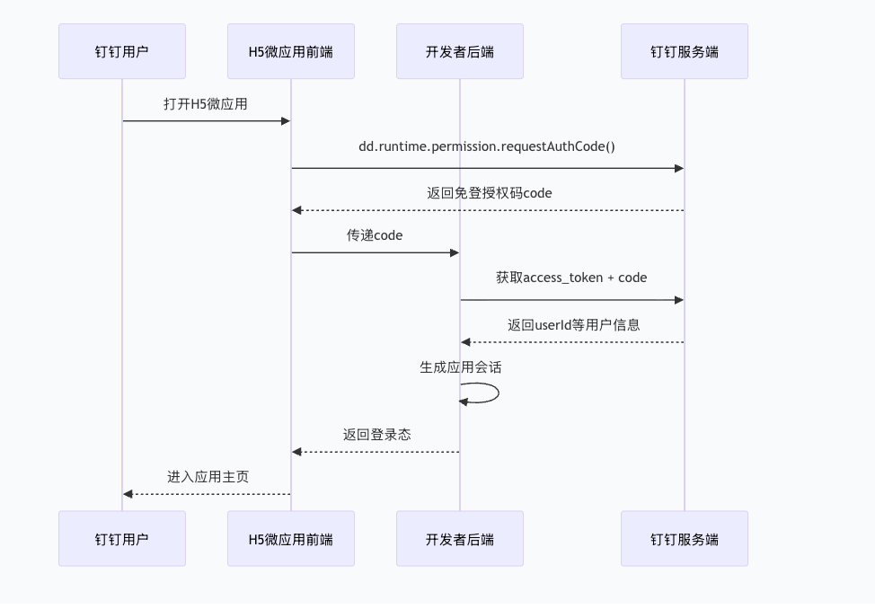

# 环境

```
//判断在微信环境
ua.includes('micromessenger')
```

- 企业微信

- 微信小程序miniprogram，小程序里面跳h5也是小程序环境

  ```
  ua.includes('miniprogram') //判断在小程序环境
  ```

- 微信浏览器micromessenger

**在 H5 页面里判断是否运行在微信小程序的 web-view 环境**

1. 先确认“微信”
2. 再确认“小程序”

```
function inMiniProgram() {
  // 第 1 步：是不是微信
  const ua = navigator.userAgent.toLowerCase();
  if (!ua.includes('micromessenger')) return false;

  // 第 2 步：是不是小程序
  return (
    ua.includes('miniprogram') ||           // Android / 工具 带关键字
    (window.__wxjs_environment === 'miniprogram') // iOS 专用变量
  );
}

// 用法
if (inMiniProgram()) {
  console.log('在小程序 web-view 里');
  // 可以安全调用 wx.miniProgram.navigateTo 等 API
} else {
  console.log('普通微信浏览器 / 外部浏览器');
}
```

# 小程序

https://mp.weixin.qq.com/s/QeqJC-SZzwQAwv3i5Kelbg

## 简介

### 小程序与普通网页开发的区别

小程序的主要开发语言是 JavaScript ，小程序的开发同普通的网页开发相比有很大的相似性。对于前端开发者而言，从网页开发迁移到小程序的开发成本并不高，但是二者还是有些许区别的。

**网页开发渲染线程和脚本线程是互斥的，这也是为什么长时间的脚本运行可能会导致页面失去响应，而在小程序中，二者是分开的，分别运行在不同的线程中。**网页开发者可以使用到各种浏览器暴露出来的 DOM API，进行 DOM 选中和操作。而如上文所述，**小程序的逻辑层和渲染层是分开的，逻辑层运行在 JSCore 中，并没有一个完整浏览器对象，因而缺少相关的DOM API和BOM API。**这一区别导致了前端开发非常熟悉的一些库，例如 jQuery、 Zepto 等，在小程序中是无法运行的。同时 JSCore 的环境同 NodeJS 环境也是不尽相同，所以一些 NPM 的包在小程序中也是无法运行的。

网页开发者需要面对的环境是各式各样的浏览器，PC 端需要面对 IE、Chrome、QQ浏览器等，在移动端需要面对Safari、Chrome以及 iOS、Android 系统中的各式 WebView 。

小程序的运行环境

| **运行环境**     | **逻辑层**     | **渲染层**       |
| :--------------- | :------------- | :--------------- |
| iOS              | JavaScriptCore | WKWebView        |
| 安卓             | V8             | chromium定制内核 |
| 小程序开发者工具 | NWJS           | Chrome WebView   |

## 小程序宿主环境

### 渲染层和逻辑层

首先，我们来简单了解下小程序的运行环境。小程序的运行环境分成**渲染层和逻辑层**，其中 WXML 模板和 WXSS 样式工作在渲染层，JS 脚本工作在逻辑层。

小程序的渲染层和逻辑层分别由2个线程管理：渲染层的界面使用了WebView 进行渲染；逻辑层采用JsCore线程运行JS脚本。一个小程序存在多个界面，所以渲染层存在多个WebView线程，这两个线程的通信会经由微信客户端（下文中也会采用**Native来代指微信客户端**）做中转，逻辑层发送网络请求也经由Native转发，小程序的通信模型下图所示。


#### 逻辑层

小程序开发框架的逻辑层使用 `JavaScript` 引擎为小程序提供开发者 `JavaScript` 代码的运行环境以及微信小程序的特有功能。

逻辑层将数据进行处理后发送给视图层，同时接受视图层的事件反馈。

开发者写的所有代码最终将会打包成一份 `JavaScript` 文件，并在小程序启动的时候运行，直到小程序销毁。这一行为类似 [ServiceWorker](https://developer.mozilla.org/en-US/docs/Web/API/Service_Worker_API)，所以逻辑层也称之为 App Service。

在 `JavaScript` 的基础上，我们增加了一些功能，以方便小程序的开发：

- 增加 `App` 和 `Page` 方法，进行[程序注册](https://developers.weixin.qq.com/miniprogram/dev/framework/app-service/app.html)和[页面注册](https://developers.weixin.qq.com/miniprogram/dev/framework/app-service/page.html)。
- 增加 `getApp` 和 `getCurrentPages` 方法，分别用来获取 `App` 实例和当前页面栈。
- 提供丰富的 [API](https://developers.weixin.qq.com/miniprogram/dev/framework/app-service/api.html)，如微信用户数据，扫一扫，支付等微信特有能力。
- 提供[模块化](https://developers.weixin.qq.com/miniprogram/dev/framework/app-service/module.html#模块化)能力，每个页面有独立的[作用域](https://developers.weixin.qq.com/miniprogram/dev/framework/app-service/module.html#文件作用域)。

**注意：小程序框架的逻辑层并非运行在浏览器中，因此 `JavaScript` 在 web 中一些能力都无法使用，如 `window`，`document` 等。**

### 程序与页面

- **微信客户端在打开小程序之前，会把整个小程序的代码包下载到本地。**

- 紧接着通过 `app.json` 的 `pages` 字段就可以知道你当前小程序的所有页面路径:

  ```
  {
    "pages":[
      "pages/index/index",
      "pages/logs/logs"
    ]
  }
  ```

  写在 `pages` 字段的第一个页面就是这个小程序的首页（打开小程序看到的第一个页面）。于是微信客户端就把首页的代码装载进来，通过小程序底层的一些机制，就可以渲染出这个首页。

- 小程序启动之后，在 `app.js` 定义的 `App` 实例的 `onLaunch` 回调会被执行

   **整个小程序只有一个 App 实例，是全部页面共享的** 

  ```javascript
  App({
    onLaunch: function () {
      // 小程序启动之后 触发
    }
  })
  ```

- 小程序的一个页面是怎么写的

  - 装载index.json

  - 装载这个页面的 `WXML` 结构和 `WXSS` 样式

  - 装载 `index.js`

    ```javascript
    Page({
      data: { // 参与页面渲染的数据
        logs: []
      },
      onLoad: function () {
        // 页面渲染后 执行
      }
    })
    ```

    `Page` 是一个页面构造器，这个构造器就生成了一个页面。在生成页面的时候，小程序框架会把 `data` 数据和 `index.wxml` 一起渲染出最终的结构，于是就得到了你看到的小程序的样子。

    **在渲染完界面之后**，页面实例就会收到一个 `onLoad` 的回调，你可以在这个回调处理你的逻辑。

## 代码构成

### JSON 配置

- 全局配置app.json

  是当前小程序的全局配置，包括了小程序的所有页面路径、界面表现、网络超时时间、底部 tab 等。 

  ```json
  {
    "pages":[
      "pages/index/index",
      "pages/logs/logs"
    ],
    "window":{
      "backgroundTextStyle":"light",
      "navigationBarBackgroundColor": "#fff",
      "navigationBarTitleText": "Weixin",
      "navigationBarTextStyle":"black"
    }
  }
  ```
  
   其他配置项细节可以参考文档 [小程序的配置 app.json](https://developers.weixin.qq.com/miniprogram/dev/framework/config.html) 。 

- 工具配置 project.config.json

  通常大家在使用一个工具的时候，都会针对各自喜好做一些个性化配置，例如界面颜色、编译配置等等，当你换了另外一台电脑重新安装工具的时候，你还要重新配置。

  考虑到这点，小程序开发者工具在每个项目的根目录都会生成一个 `project.config.json`，你在工具上做的任何配置都会写入到这个文件，当你重新安装工具或者换电脑工作时，你只要载入同一个项目的代码包，开发者工具就自动会帮你恢复到当时你开发项目时的个性化配置，其中会包括编辑器的颜色、代码上传时自动压缩等等一系列选项。

   其他配置项细节可以参考文档 [开发者工具的配置](https://developers.weixin.qq.com/miniprogram/dev/devtools/projectconfig.html) 。 

- 页面配置 page.json

  这里的 `page.json` 其实用来表示 pages/logs 目录下的 `logs.json` 这类和小程序页面相关的配置。让开发者可以独立定义每个页面的一些属性

   其他配置项细节可以参考文档 [页面配置](https://developers.weixin.qq.com/miniprogram/dev/framework/config.html#页面配置) 。 

- sitemap 配置

  https://developers.weixin.qq.com/miniprogram/dev/framework/sitemap.html

  小程序根目录下的 `sitemap.json` 文件用来配置小程序及其页面是否允许被微信索引。
  
  ```json
  {
    "rules":[{
      "action": "allow",
      "page": "*"
    }]
  }
  //所有页面都会被微信索引（默认情况）
  ```
  
  
  
  ```json
  {
    "rules":[{
      "action": "disallow",
      "page": "path/to/page"
    }]
  }
  //配置 path/to/page 页面不被索引，其余页面允许被索引
  ```

### WXML 模板

- 标签名字有点不一样

  往往写 HTML 的时候，经常会用到的标签是 `div`, `p`, `span`，开发者在写一个页面的时候可以根据这些基础的标签组合出不一样的组件，例如日历、弹窗等等。

- 多了一些 `wx:if` 这样的属性以及 {{ }} 这样的表达式 


### WXSS 样式

`WXSS` 具有 `CSS` 大部分的特性，小程序在 `WXSS` 也做了一些扩充和修改。

1. 新增了尺寸单位。在写 `CSS` 样式时，开发者需要考虑到手机设备的屏幕会有不同的宽度和设备像素比，采用一些技巧来换算一些像素单位。`WXSS` 在底层支持新的尺寸单位 `rpx` ，开发者可以免去换算的烦恼，只要交给小程序底层来换算即可，由于换算采用的浮点数运算，所以运算结果会和预期结果有一点点偏差。
   - rpx（responsive pixel）: 可以根据屏幕宽度进行自适应。规定屏幕宽为750rpx。如在 iPhone6 上，屏幕宽度为375px，共有750个物理像素，则750rpx = 375px = 750物理像素，1rpx = 0.5px = 1物理像素。
2. 提供了全局的样式和局部样式。和前边 `app.json`, `page.json` 的概念相同，你可以写一个 `app.wxss` 作为全局样式，会作用于当前小程序的所有页面，局部页面样式 `page.wxss` 仅对当前页面生效。
3. 此外 `WXSS` 仅支持部分 `CSS` 选择器

- 样式导入`@import "common.wxss";`

  **示例代码：**

  ```less
  /** common.wxss **/
  .small-p {
    padding:5px;
  }
  /** app.wxss **/
  @import "common.wxss";
  .middle-p {
    padding:15px;
  }
  ```

- 内联样式

  静态的样式统一写到 class 中。style 接收动态的样式，在运行时会进行解析，请尽量避免将静态的样式写进 style 中，以免影响渲染速度。

  - ```html
    <view style="color:{{color}};" />
    ```

  - ```html
    <view class="normal_view" />
    ```


### js 页面逻辑 

#### app.js

```js
// app.js
App({
  onLaunch (options) {
    // Do something initial when launch.
  },
  onShow (options) {
    // Do something when show.
  },
  onHide () {
    // Do something when hide.
  },
  onError (msg) {
    console.log(msg)
  },
  globalData: 'I am global data'
})
```

 详细的参数含义和使用请参考 [App 参考文档](https://developers.weixin.qq.com/miniprogram/dev/reference/api/App.html) 。 

整个小程序只有一个 App 实例，是全部页面共享的。开发者可以通过 `getApp` 方法获取到全局唯一的 App 实例，获取App上的数据或调用开发者注册在 `App` 上的函数。

```js
// xxx.js
const appInstance = getApp()
console.log(appInstance.globalData) // I am global data
```

#### page.js

```js
//index.js
Page({
  data: {
    text: "This is page data."
  },
  onLoad: function(options) {
    // 页面创建时执行
  },
  onShow: function() {
    // 页面出现在前台时执行
  },
  onReady: function() {
    // 页面首次渲染完毕时执行
  },
  onHide: function() {
    // 页面从前台变为后台时执行
  },
  onUnload: function() {
    // 页面销毁时执行
  },
  onPullDownRefresh: function() {
    // 触发下拉刷新时执行
  },
  onReachBottom: function() {
    // 页面触底时执行
  },
  onShareAppMessage: function () {
    // 页面被用户分享时执行
  },
  onPageScroll: function() {
    // 页面滚动时执行
  },
  onResize: function() {
    // 页面尺寸变化时执行
  },
  // 自由数据
  customData: {
    hi: 'MINA'
  }
})
```

详细的参数含义和使用请参考 [Page 参考文档](https://developers.weixin.qq.com/miniprogram/dev/reference/api/Page.html) 。

#### Component.js

```js
Component({
  data: {
    text: "This is page data."
  },
  methods: {
    onLoad: function(options) {
      // 页面创建时执行
    },
    onPullDownRefresh: function() {
      // 下拉刷新时执行
    },
    // 事件响应函数
    viewTap: function() {
      // ...
    }
  }
})
```

## 基础

### behaviors

`behaviors` 是用于组件间代码共享的特性，类似于一些编程语言中的 “**mixins**” 或 “traits”。

每个 `behavior` 可以包含一组属性、数据、生命周期函数和方法。**组件引用它时，它的属性、数据和方法会被合并到组件中，生命周期函数也会在对应时机被调用。** 每个组件可以引用多个 `behavior` ，`behavior` 也可以引用其它 `behavior` 。

同名字段的覆盖和组合规则：[behaviors](https://developers.weixin.qq.com/miniprogram/dev/framework/custom-component/behaviors.html)

详细的参数含义和使用请参考 [Behavior 参考文档](https://developers.weixin.qq.com/miniprogram/dev/reference/api/Behavior.html)。

### 事件

#### 事件的冒泡阶段

**冒泡事件列表：**

| 类型               | 触发条件                                                     | 最低版本                                                     |
| :----------------- | :----------------------------------------------------------- | :----------------------------------------------------------- |
| touchstart         | 手指触摸动作开始                                             |                                                              |
| touchmove          | 手指触摸后移动                                               |                                                              |
| touchcancel        | 手指触摸动作被打断，如来电提醒，弹窗                         |                                                              |
| touchend           | 手指触摸动作结束                                             |                                                              |
| tap                | 手指触摸后马上离开                                           |                                                              |
| longpress          | 手指触摸后，超过350ms再离开，如果指定了事件回调函数并触发了这个事件，tap事件将不被触发 | [1.5.0](https://developers.weixin.qq.com/miniprogram/dev/framework/compatibility.html) |
| longtap            | 手指触摸后，超过350ms再离开（推荐使用longpress事件代替）     |                                                              |
| transitionend      | 会在 WXSS transition 或 wx.createAnimation 动画结束后触发    |                                                              |
| animationstart     | 会在一个 WXSS animation 动画开始时触发                       |                                                              |
| animationiteration | 会在一个 WXSS animation 一次迭代结束时触发                   |                                                              |
| animationend       | 会在一个 WXSS animation 动画完成时触发                       |                                                              |
| touchforcechange   | 在支持 3D Touch 的 iPhone 设备，重按时会触发                 | [1.9.90](https://developers.weixin.qq.com/miniprogram/dev/framework/compatibility.html) |

**注：除上表之外的其他组件自定义事件如无特殊声明都是非冒泡事件，如 [form](https://developers.weixin.qq.com/miniprogram/dev/component/form.html) 的`submit`事件，[input](https://developers.weixin.qq.com/miniprogram/dev/component/input.html) 的`input`事件，[scroll-view](https://developers.weixin.qq.com/miniprogram/dev/component/scroll-view.html) 的`scroll`事件，(详见各个[组件](https://developers.weixin.qq.com/miniprogram/dev/component/))**

**绑定并阻止事件冒泡**

除 `bind` 外，也可以用 `catch` 来绑定事件。与 `bind` 不同， `catch` 会阻止事件向上冒泡。

点击 inner view 会先后调用`handleTap3`和`handleTap2`(因为tap事件会冒泡到 middle view，而 middle view 阻止了 tap 事件冒泡，不再向父节点传递)，点击 middle view 会触发`handleTap2`，点击 outer view 会触发`handleTap1`。

```html
<view id="outer" bindtap="handleTap1">
  outer view
  <view id="middle" catchtap="handleTap2">
    middle view
    <view id="inner" bindtap="handleTap3">
      inner view
    </view>
  </view>
</view>
```

#### 事件的捕获阶段

**触摸类事件支持捕获阶段**。捕获阶段位于冒泡阶段之前，且在捕获阶段中，事件到达节点的顺序与冒泡阶段恰好相反。需要在捕获阶段监听事件时，可以采用`capture-bind`、`capture-catch`关键字，后者将中断捕获阶段和取消冒泡阶段。

在下面的代码中，点击 inner view 会先后调用`handleTap2`、`handleTap4`、`handleTap3`、`handleTap1`。

```html
<view id="outer" bind:touchstart="handleTap1" capture-bind:touchstart="handleTap2">
  outer view
  <view id="inner" bind:touchstart="handleTap3" capture-bind:touchstart="handleTap4">
    inner view
  </view>
</view>
```

#### 事件对象

**基础事件对象属性列表：**

| 属性                                                         | 类型    | 说明                           | 基础库版本                                                   |
| :----------------------------------------------------------- | :------ | :----------------------------- | :----------------------------------------------------------- |
| [type](https://developers.weixin.qq.com/miniprogram/dev/framework/view/wxml/event.html#type) | String  | 事件类型                       |                                                              |
| [timeStamp](https://developers.weixin.qq.com/miniprogram/dev/framework/view/wxml/event.html#timeStamp) | Integer | 事件生成时的时间戳             |                                                              |
| [target](https://developers.weixin.qq.com/miniprogram/dev/framework/view/wxml/event.html#target) | Object  | 触发事件的组件的一些属性值集合 |                                                              |
| [currentTarget](https://developers.weixin.qq.com/miniprogram/dev/framework/view/wxml/event.html#currenttarget) | Object  | 当前组件的一些属性值集合       |                                                              |
| [mark](https://developers.weixin.qq.com/miniprogram/dev/framework/view/wxml/event.html#mark) | Object  | 事件标记数据                   | [2.7.1](https://developers.weixin.qq.com/miniprogram/dev/framework/compatibility.html) |

### 生命周期


### 页面路由

#### 页面栈

框架以栈的形式维护了当前的所有页面。 当发生路由切换的时候，页面栈的表现如下：

| 路由方式   | 页面栈表现                        |
| :--------- | :-------------------------------- |
| 初始化     | 新页面入栈                        |
| 打开新页面 | 新页面入栈                        |
| 页面重定向 | 当前页面出栈，新页面入栈          |
| 页面返回   | 页面不断出栈，直到目标返回页      |
| Tab 切换   | 页面全部出栈，只留下新的 Tab 页面 |
| 重加载     | 页面全部出栈，只留下新的页面      |

开发者可以使用 `getCurrentPages()` 函数获取当前页面栈。

#### 路由方式

对于路由的触发方式以及页面生命周期函数如下：

| 路由方式   | 触发时机                                                     | 路由前页面 | 路由后页面         |
| :--------- | :----------------------------------------------------------- | :--------- | :----------------- |
| 初始化     | 小程序打开的第一个页面                                       |            | onLoad, onShow     |
| 打开新页面 | 调用 API [wx.navigateTo](https://developers.weixin.qq.com/miniprogram/dev/api/route/wx.navigateTo.html) 使用组件 [``](https://developers.weixin.qq.com/miniprogram/dev/component/navigator.html) | onHide     | onLoad, onShow     |
| 页面重定向 | 调用 API [wx.redirectTo](https://developers.weixin.qq.com/miniprogram/dev/api/route/wx.redirectTo.html) 使用组件 [``](https://developers.weixin.qq.com/miniprogram/dev/component/navigator.html) | onUnload   | onLoad, onShow     |
| 页面返回   | 调用 API [wx.navigateBack](https://developers.weixin.qq.com/miniprogram/dev/api/route/wx.navigateBack.html) 使用组件[``](https://developers.weixin.qq.com/miniprogram/dev/component/navigator.html) 用户按左上角返回按钮 | onUnload   | onShow             |
| Tab 切换   | 调用 API [wx.switchTab](https://developers.weixin.qq.com/miniprogram/dev/api/route/wx.switchTab.html) 使用组件 [``](https://developers.weixin.qq.com/miniprogram/dev/component/navigator.html) 用户切换 Tab |            | 各种情况请参考下表 |
| 重启动     | 调用 API [wx.reLaunch](https://developers.weixin.qq.com/miniprogram/dev/api/route/wx.reLaunch.html) 使用组件 [``](https://developers.weixin.qq.com/miniprogram/dev/component/navigator.html) | onUnload   | onLoad, onShow     |

## 业务

### 网页打开小程序

```
    openApp() {
      // window.location.href = 'https://www.baidu.com';
      this.isJump = true;
      let queryParam = `appId=${parseUrlQuery('appId')}&pageName=qywx${
        parseUrlQuery('userId') ? '&userId=' + parseUrlQuery('userId') : ''
      }`;
      const query = encodeURIComponent(queryParam);
      const resultUrl = `weixin://dl/business/?appid=${parseUrlQuery(
        'aid'
      )}&path=pages/loading/index&query=${query}`;
      this.showLoading = false;
      location.href = resultUrl;
    }
```

- path对应小程序代码里面的路由路径

## 注意事项

- `navigateTo`, `redirectTo` 只能打开非 tabBar 页面。
- `switchTab` 只能打开 tabBar 页面。
- `reLaunch` 可以打开任意页面。
- 页面底部的 tabBar 由页面决定，即只要是定义为 tabBar 的页面，底部都有 tabBar。
- 调用页面路由带的参数可以在目标页面的`onLoad`中获取。

## tips

### 获取界面上的节点信息

https://developers.weixin.qq.com/miniprogram/dev/framework/view/selector.html

```js
const query = wx.createSelectorQuery()
query.select('#the-id').boundingClientRect(function(res){
  res.top // #the-id 节点的上边界坐标（相对于显示区域）
})
query.selectViewport().scrollOffset(function(res){
  res.scrollTop // 显示区域的竖直滚动位置
})
```

### 屏幕旋转事件

https://developers.weixin.qq.com/miniprogram/dev/framework/view/resizable.html

### 获取场景值

开发者可以通过下列方式获取场景值：

- 对于小程序，可以在 `App` 的 `onLaunch` 和 `onShow`，或[wx.getLaunchOptionsSync](https://developers.weixin.qq.com/miniprogram/dev/api/base/app/life-cycle/wx.getLaunchOptionsSync.html) 中获取上述场景值。
- 对于小游戏，可以在 [wx.getLaunchOptionsSync](https://developers.weixin.qq.com/miniprogram/dev/api/base/app/life-cycle/wx.getLaunchOptionsSync.html) 和 [wx.onShow](https://developers.weixin.qq.com/miniprogram/dev/framework/app-service/(wx.onShow)) 中获取上述场景值

### 响应显示区域变化

https://developers.weixin.qq.com/miniprogram/dev/framework/view/resizable.html

从小程序基础库版本 [2.4.0](https://developers.weixin.qq.com/miniprogram/dev/framework/compatibility.html) 开始，小程序在手机上支持屏幕旋转。使小程序中的页面支持屏幕旋转的方法是：在 `app.json` 的 `window` 段中设置 `"pageOrientation": "auto"` ，或在页面 json 文件中配置 `"pageOrientation": "auto"` 。

以下是在单个页面 json 文件中启用屏幕旋转的示例。

**代码示例：**

```json
{
  "pageOrientation": "auto"
}
```

#### 在手机上启用屏幕旋转支持

从小程序基础库版本 [2.4.0](https://developers.weixin.qq.com/miniprogram/dev/framework/compatibility.html) 开始，小程序在手机上支持屏幕旋转。使小程序中的页面支持屏幕旋转的方法是：在 `app.json` 的 `window` 段中设置 `"pageOrientation": "auto"` ，或在页面 json 文件中配置 `"pageOrientation": "auto"` 。

以下是在单个页面 json 文件中启用屏幕旋转的示例。

**代码示例：**

```json
{
  "pageOrientation": "auto"
}
```

如果页面添加了上述声明，则在屏幕旋转时，这个页面将随之旋转，显示区域尺寸也会随着屏幕旋转而变化。

从小程序基础库版本 [2.5.0](https://developers.weixin.qq.com/miniprogram/dev/framework/compatibility.html) 开始， `pageOrientation` 还可以被设置为 `landscape` ，表示固定为横屏显示。

#### 在 iPad 上启用屏幕旋转支持

从小程序基础库版本 [2.3.0](https://developers.weixin.qq.com/miniprogram/dev/framework/compatibility.html) 开始，在 iPad 上运行的小程序可以支持屏幕旋转。使小程序支持 iPad 屏幕旋转的方法是：在 `app.json` 中添加 `"resizable": true` 。

**代码示例：**

```json
{
  "resizable": true
}
```

如果小程序添加了上述声明，则在屏幕旋转时，小程序将随之旋转，显示区域尺寸也会随着屏幕旋转而变化。注意：在 iPad 上不能单独配置某个页面是否支持屏幕旋转。

#### Media Query

有时，对于不同尺寸的显示区域，页面的布局会有所差异。此时可以使用 media query 来解决大多数问题。

**代码示例：**

```css
.my-class {
  width: 40px;
}

@media (min-width: 480px) {
  /* 仅在 480px 或更宽的屏幕上生效的样式规则 */
  .my-class {
    width: 200px;
  }
}
```

在 WXML 中，可以使用 [match-media](https://developers.weixin.qq.com/miniprogram/dev/component/match-media.html) 组件来根据 media query 匹配状态展示、隐藏节点。

此外，可以在页面或者自定义组件 JS 中使用 `this.createMediaQueryObserver()` 方法来创建一个 [`MediaQueryObserver`](https://developers.weixin.qq.com/miniprogram/dev/api/wxml/MediaQueryObserver.html) 对象，用于监听指定的 media query 的匹配状态

### 动画

https://developers.weixin.qq.com/miniprogram/dev/framework/view/animation.html

### 初始渲染缓存工作原理

https://developers.weixin.qq.com/miniprogram/dev/framework/view/initial-rendering-cache.html#%E5%88%9D%E5%A7%8B%E6%B8%B2%E6%9F%93%E7%BC%93%E5%AD%98%E5%B7%A5%E4%BD%9C%E5%8E%9F%E7%90%86


# **网页**

## API

### WxLogin

| 参数          | 是否必须 | 说明                                                         |
| ------------- | -------- | ------------------------------------------------------------ |
| self_redirect | 否       | true：手机点击确认登录后可以在 iframe 内跳转到 redirect_uri，false：手机点击确认登录后可以在 top window 跳转到 redirect_uri。默认为 false。 |
| id            | 是       | 第三方页面显示二维码的容器id                                 |
| appid         | 是       | 应用唯一标识，在微信开放平台提交应用审核通过后获得           |
| scope         | 是       | 应用授权作用域，拥有多个作用域用逗号（,）分隔，网页应用目前仅填写snsapi_login即可 |
| redirect_uri  | 是       | 重定向地址，需要进行UrlEncode                                |
| state         | 否       | 用于保持请求和回调的状态，授权请求后原样带回给第三方。该参数可用于防止csrf攻击（跨站请求伪造攻击），建议第三方带上该参数，可设置为简单的随机数加session进行校验 |
| style         | 否       | 提供"black"、"white"可选，默认为黑色文字描述。详见文档底部FAQ |
| href          | 否       | 自定义样式链接，第三方可根据实际需求覆盖默认样式。详见文档底部FAQ |

## 使用wx-sdk前提

- 需要公众号appId

### 基本使用步骤

1. ‌安装jweixin-module‌：

   - 如果你使用的是Vue项目，可以通过npm或yarn安装jweixin-module。如果直接下载官方提供的js文件，可以将该文件放在项目的静态资源文件夹中，并在index.html中通过<script>标签引入。

2. ‌后端配置‌：

   - 在使用jweixin之前，需要在微信公众平台注册并配置公众号或小程序。**此外，还需要设置一个服务器，用于与微信服务器通信以获取access_token和jsapi_ticket，这两个值用于生成调用JS接口所需的签名signature。**

3. ‌获取签名并注入配置‌：

   - 在Vue组件中发起请求到后端服务器获取签名，包括appId、timestamp、nonceStr和signature。使用jweixin.config方法注入这些配置信息。

     ```
     wx.config({
         debug: false, // 开启调试模式
         appId: 'YOUR_APP_ID', // 必填，公众号的唯一标识
         timestamp: timestamp, // 必填，生成签名的时间戳
         nonceStr: nonceStr, // 必填，生成签名的随机串
         signature: signature, // 必填，签名
         jsApiList: ['onMenuShareTimeline', 'onMenuShareAppMessage'] // 必填，需要使用的JS接口列表
     });
     ```

     

4. ‌调用微信JS接口‌：

   - 一旦配置信息注入完成，就可以在前端页面中调用微信提供的各种JS接口了。


### 微信公众平台测试账号

https://blog.csdn.net/qq_35204012/article/details/140253427

### 常见问题及解决方法

1. ‌wx.config is not a function：
   - 如果在使用wx.config时出现此错误，可能是因为uni-app已经注册了一个全局的wx对象。解决方法是安装weixin-js-sdk模块，并通过import引入JWeixin对象进行配置。
2. ‌获取签名失败：
   - 确保后端服务器能够正确返回签名信息，并且前端在获取签名后正确注入配置信息。如果仍然失败，检查网络请求是否成功以及服务器端的配置是否正确。

## JSAPI Ticket 

对于需要在微信公众号内部网页中使用JS-SDK（如分享到朋友圈、发送给朋友等），需要进行JSAPI Ticket的鉴权。

**获取JSAPI Ticket**：

通过微信公众号的access_token获取JSAPI Ticket。

```http
https://api.weixin.qq.com/cgi-bin/ticket/getticket?type=jsapi&access_token=ACCESS_TOKE
```


## 网页授权

https://developers.weixin.qq.com/doc/oplatform/Website_App/WeChat_Login/Wechat_Login.html


### 使用微信网页授权

对于需要获取用户信息的场景（如获取用户昵称、头像等），可以使用微信的网页授权流程。

- 扫码/重定向授权页面

  - **重定向**用户到微信的OAuth2.0授权页面，引导用户同意授权。

    ```html
    <a href="https://open.weixin.qq.com/connect/oauth2/authorize?appid=APPID&redirect_uri=REDIRECT_URI&response_type=code&scope=SCOPE&state=STATE#wechat_redirect">点击登录</a>
    ```

    其中，`APPID`是你的公众号的AppID，`REDIRECT_URI`是授权后重定向的回调链接地址（需要URL编码），`SCOPE`是获取权限的作用域，如`snsapi_userinfo`表示需要获取用户信息

  - 将微信登录二维码**内嵌到自己页面**

    - 在页面中先引入如下JS文件（支持https）：

      ```text
      http://res.wx.qq.com/connect/zh_CN/htmledition/js/wxLogin.js
      ```

    - 在需要使用微信登录的地方实例以下JS对象：

      ```text
       var obj = new WxLogin({
       self_redirect:true,
       id:"login_container", 
       appid: "", 
       scope: "", 
       redirect_uri: "",
        state: "",
       style: "",
       href: "",
       onReady: function(isReady){
              console.log(isReady);
          }
       });
      ```

- 重定向回调链接地址

  - **获取code**：用户同意授权后，微信会跳转回你指定的`redirect_uri`，并在URL的query参数中带上`code`。

  - 将code传给后端，**后端通过code换取网页授权access_token**：

    使用URL的query参数获取的code，向微信服务器请求access_token和用户的**openid（对于同一个微信公众号/小程序，用户的 OpenID 永久不变）。**

    ```http
    https://api.weixin.qq.com/sns/oauth2/access_token?appid=APPID&secret=SECRET&code=CODE&grant_type=authorization_code
    ```
    
    其中，`APPID`、`SECRET`分别是你的公众号的AppID和AppSecret，`CODE`是上一步获取的code。

    1. **刷新access_token（如果需要）**：

       如果需要，可以使用refresh_token来刷新access_token，延长有效期。

    2. **拉取用户信息（如需）**：

       使用access_token和openid拉取用户信息。

       ```http
       https://api.weixin.qq.com/sns/userinfo?access_token=ACCESS_TOKEN&openid=OPENID&lang=zh_CN
       ```
  
- 后端返回对应的数据

  ```
  {
      "mapSource": "177",
      "mapId": "wxdbcad26cca80f16e",
      "code": "031vqZ0w3gOHB53L5N1w3kyrna0vqZ0G",
       "otherParams": {
          "mobile": "13588328862",
          "yzm": "2222"
      }
  }
  ```

  再用响应的数据调对应接口，获取组织列表

### 使用服务器端验证（Node.js）

在服务器端进行验证，可以更安全地处理敏感数据和用户信息。例如，使用Node.js处理微信的OAuth2.0流程。

```javascript
const axios = require('axios');
const querystring = require('querystring');
const express = require('express');
const app = express();
const APPID = 'YOUR_APP_ID';
const APPSECRET = 'YOUR_APP_SECRET';
const REDIRECT_URI = 'YOUR_REDIRECT_URI'; // 需要URL编码过的重定向地址
 
app.get('/login', (req, res) => {
    const url = `https://open.weixin.qq.com/connect/oauth2/authorize?appid=${APPID}&redirect_uri=${REDIRECT_URI}&response_type=code&scope=snsapi_userinfo&state=STATE#wechat
```

### 案例

https://juejin.cn/post/7324876576675020810

### 问题

- 将微信登录二维码**内嵌到自己页面**， self_redirect:true会导致iframe的url是自动重定向的url，需要禁用重定向
- **平台是通过手机号做标识，微信第一次扫码是获取不到手机号，需要用户手动输入添加手机号码，实现微信和手机号码的绑定，这样第二次扫码，后端能通过微信是对对应的手机号**
- 

# 微信支付

https://pay.weixin.qq.com/doc/v2/merchant/4011988025


# 场景

## 跳转

小程序中的H5网页跳转到微信客服无效

```
location.href = 'https://work.weixin.qq.com/kfid/kfc5a879ad30d8071a5';
```

不支持：https://developers.weixin.qq.com/community/develop/doc/000a6842160df89d8e020b09f66800

解决：通过 **“小程序与 H5 页面之间的通信”** 来实现间接跳转。核心思路是：**让 H5 页面发送一个信号给小程序，然后由小程序来执行跳转客服的动作。**


# 钉钉

## 环境

## 免登

**免登**是指用户进入应用后，无需输入钉钉用户名和密码，应用程序可自动获取当前用户身份，进而登录系统的流程。通过免登授权码，可以获取用户身份信息。在钉钉中，免登功能支持多种场景，包括网页应用（H5微应用）、应用管理后台、以及小程序应用等。



- AgentId  App ID
- corpId 企业ID


# 支付宝

## 支付

在现代互联网开发中，**Precreate（扫码支付）** 在大部分情况下比 **Page.pay（跳转页面）** 更受欢迎，因为它对用户体验更友好。

**alipay.trade.page.pay (电脑网站支付)**

- **应用场景**：主要用于 PC 端网页（电脑浏览器）的购物结账。
- **接口返回**：返回一段 HTML 表单代码或一个完整的**支付跳转链接**。
- **支付交互**：用户在电脑打开网页点击支付后，会进入支付宝的网页收银台（或展示一个登录网页版输入密码的二维码），通常无法直接优雅地通过手机支付宝 App 扫码唤起无缝支付。 [[1](https://github.com/chloerei/alipay/blob/master/doc/quick_start_en.md), [2](https://app.unpkg.com/whats-alipay@0.1.5/files/README.md), [3](https://opendocs.alipay.com/open/009yja?referPath=06n8jf_5364a87d), [4](https://github.com/Wei-Shaw/sub2api/issues/1676), [5](https://opendocs.alipay.com/support/01rbcx)]

**alipay.trade.precreate (当面付预创建)**

- **应用场景**：主要用于线下的扫码收银、或开发者想在 PC/自建页面上生成**动态二维码**供用户扫码。
- **接口返回**：直接返回一个**二维码字符串（qr_code）**。
- **支付交互**：商户后台拿到字符串后自己生成二维码图片展示。用户用手机支付宝“扫一扫”该二维码，能直接在手机 App 内唤起收银台完成安全支付，体验更顺畅。 [[1](https://alipay.js.org/), [2](https://github.com/Wei-Shaw/sub2api/issues/1676), [3](https://opendocs.alipay.com/support/01rbcx), [4](https://opendocs.alipay.com/open/009yja?referPath=06n8jf_5364a87d)]

------

为什么 Precreate 通常更受欢迎？

- **体验流畅**：用户直接用手机扫码，不需要在电脑浏览器里输入支付宝账号密码登录。
- **原生感强**：二维码可以直接内嵌在你的网站页面中，用户不需要离开你的网站。
- **跨设备好**：用户习惯在电脑上看屏幕，手里拿着手机随时准备扫码。

------

两种方式的核心对比

\1. Precreate (扫码支付) —— 绝大多数 PC 站点的首选

- **优点**：
  - **用户省事**：用户不用在电脑上记密码、收验证码，扫码直接付。
  - **页面不跳走**：商户可以自己设计收银台弹窗，用户体验更统一。
  - **监控方便**：前端可以用 Ajax 轮询支付状态，支付成功后优雅地刷新页面。
- **缺点**：
  - **开发略多一步**：后端拿到 `qr_code` 字符串后，前端需要自己用 JavaScript 库（如 `qrcode.js`）把它渲染成二维码图片。
  - **不适合纯手机网页**：如果用户直接用手机浏览器打开你的网站，他没办法用自己的手机去扫自己屏幕上的二维码（虽然可以截图导入，但步骤繁琐）。

\2. Page.pay (电脑网站支付) —— 传统或特定场景的选择

- **优点**：
  - **开发极简**：后端直接返回一个 HTML 表单，前端直接执行 `submit()` 即可，剩下的全由支付宝托管。
  - **自带双模式**：支付宝的收银台页面其实**同时包含**了“扫码支付”和“账号密码登录”两个选项。
- **缺点**：
  - **割裂感强**：整个浏览器页面会跳转到支付宝的域名，付完钱再跳回来，用户会觉得离开了你的网站。
  - **依赖浏览器**：容易被部分浏览器的防弹窗插件拦截。

------

总结：如何选择？

- 如果你的网站是 **PC 端商城**，且希望页面设计高端、体验流畅：选择 **Precreate**。
- 如果你不想写前端生成二维码的代码，或者想给用户保留**“账号密码登录付款”**的备选渠道：选择 **Page.pay**。
- 如果你的网站是 **手机端网页（H5）**：这两个都**不适用**，你应该选择 **Wap.pay** (`alipay.trade.wap.pay`)。
