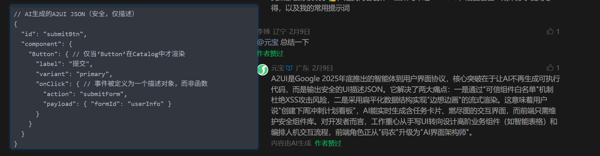

# 入门

https://www.modb.pro/db/1881156671699955712

## 机器学习

- 是人工智能的一个分支，指通过算法和统计模型从数据中自动学习规律，并利用这些规律进行预测或决策。
- 核心思想：从数据中提取特征并建立模型。

### 深度学习

- 是机器学习的一个子领域，基于人工神经网络（ANN）的结构和算法。
- 核心思想：通过多层神经网络（通常称为“深度”网络）自动学习数据的高层次特征。

### 总结

| 特性           | 机器学习                         | 深度学习                           |
| :------------- | :------------------------------- | :--------------------------------- |
| **特征工程**   | 需要手动设计和提取特征           | 自动从数据中学习特征               |
| **模型复杂度** | 模型较简单（如线性回归、SVM 等） | 模型复杂（多层神经网络）           |
| **数据需求**   | 数据量较小也能有效工作           | 需要大量数据才能发挥优势           |
| **计算资源**   | 对计算资源要求较低               | 对计算资源要求较高（GPU 加速）     |
| **应用场景**   | 结构化数据（如表格数据）         | 非结构化数据（如图像、语音、文本） |

## 自然语言处理（NLP）

‌自然语言处理（NLP）是人工智能领域的重要分支‌，旨在使计算机能够理解、解释和生成人类语言，实现人机之间的自然交互。其核心任务包括语言翻译、情感分析、文本生成等，广泛应用于机器翻译、问答系统、聊天机器人等领域

## Token

Token是指在自然语言处理（NLP）模型中，输入文本被分割成的最小单位（通常是单词、子词或字符），这些单位被称为 **Token**。

### 原理


- 在大语言模型（如 GPT 系列、BERT 等）中，输入文本会被分词器（Tokenizer）拆分为 Token 序列。
- 分词器会根据预定义的词汇表（Vocabulary）将文本映射为对应的 Token ID，这些 ID 是模型可以理解的数字表示。

假设我们有以下文本：

```
Hello, how are you doing today?
```

**分词过程**

1. 使用分词器将文本拆分为 Token：

   ```
   ["Hello", ",", "how", "are", "you", "doing", "today", "?"]
   ```

2. 将每个 Token 映射为 Vocabulary 中的唯一 ID：

   ```
   [123, 456, 789, 1011, 1213, 1415, 1617, 1819]
   ```

**输入到模型**

- 模型接收到的是 Token ID 序列 `[123, 456, 789, 1011, 1213, 1415, 1617, 1819]`。
- 模型通过分析这些 Token 的关系和上下文生成输出。

### 作用

- **表示输入信息**：上下文 Token 是模型接收输入的主要形式。模型通过分析这些 Token 的序列来理解输入内容。
- **控制上下文长度**：模型对上下文 Token 的数量有限制（例如 GPT-3 的最大上下文长度为 2048 Token，GPT-4 支持更长的上下文，如 32K Token）。
- **生成输出**：模型基于输入的上下文 Token 生成新的 Token 序列作为输出。

### 上下文context

**大模型每次处理任务时所接收到的信息总和**


> 虽然现代模型支持 128K 甚至 192K 的上下文长度，但在编码场景下，这些上下文往往仍然不足。像Claude Code这类的工具，在上下文做了很多优化（后续会分享一些），但是上下文越长，**AI 生成代码出现幻觉的概率就越高**，后续修正过程会消耗更多资源。

- **影响模型性能**：**上下文 Token 的数量决定了模型能够“记住”多少信息。**更多的 Token 意味着模型可以利用更丰富的上下文进行推理。
- **成本因素**：上下文 Token 越多，计算资源需求越高，使用成本也越高。
- **应用场景**：对于需要处理长文档的任务（如法律文件分析、科学论文总结），支持更多上下文 Token 的模型更具优势。


## RAG

文本检索

## prompt

**prompt的质量直接关乎到AI交付结果的质量。这和我们平时工作时候和同事沟通的情况也是一样的，如果表达不清楚，对方也是不知道要做什么，那交付的产物也是五花八门的。**

##### AI对话

> 我需要实现一个很大的功能，需要每一步我都需要验证ai实现的code怎么样，我需要怎么实现我的要求

- 将任务拆解，并丢给ai，让它分析我们任务拆解是否可行，以及如何去执行
- 挑选任务
  - eg:我们现在开始实现 **任务3：用户列表页面**
- AI生成代码
- 逻辑验证
- 提供反馈并要求修正
- AI 编写单元测试

## LLM

**LLM (Large Language Model)**大语言模型是一类基于深度学习的人工智能模型，旨在处理和生成自然语言文本。通过训练于大规模文本数据，使得大语言模型能够理解并生成与人类语言相似的文本，执行各类自然语言处理任务。 

LLM的训练及使用

  LLM能够理解并生成与人类语言相似的文本，执行各类自然语言处理任务，具体可应用场景包括而不限于文本生成、机器翻译、摘要生成、对话系统、情感分析等。其具有强大的泛化能力、能够处理多种任务。

LLM的训练

LLM的训练过程分为预训练和微调两个阶段。

- 预训练阶段

  模型在大规模未标注文本数据上进行自监督学习，学习通用的语言表示。

- 微调阶段

  模型在特定任务的标注数据上进行有监督学习，调整模型参数以适应具体任务需求。

LLM的使用

  一方面，对于直观的日常使用，用户输入问题（提示词，Prompt），大模型给出该问题的回答。

  另一方面，对于基于LLM的AI应用编程，可通过以指定格式调用LLM的API，获取问题的答案。

基于LLM的Agent框架

- LLM：对标人类大脑，思考如何解决问题、给出怎样的回答。

- 记忆：长期记忆加短期记忆。即智能体使用的历史记录、系统数据，以及智能体执行过程中产生的各种中建信息。

- 规划技能：提示词编排、意图理解、任务分解、自我反思。

- 工具使用：智能体在执行任务中可能会使用到的各种工具接口。


# 概念

## AI产品

### 国外

#### OpenAI

##### 命名规则

o4 4o 4.1 这类命名方式太抽象了，好在找到一个比较清晰易懂的解释：

命名规则可以归纳为【系列名】- 【模型名】- 【参数大小/推理资源高低】

1. GPT开头的模型，是基础的对话模型：GPT-3.5、GPT-4、GPT-4.1、GPT-4.5
2. o开头的模型，是推理模型，回答前会先思考：o1、o3、o4
3. o结尾的模型，是多模态模型，可以处理文本、图像等信息：gpt-4o
4. 最后面加上 mini、nano、pro，代表是不同参数的大小
5. 再再后面加上 low/medium/high，代表的是思考的努力程度

##### GPT-4

- **简介**: GPT-4 是目前 OpenAI 最先进的语言模型，相较于之前的版本，具有更强的推理能力、更高的准确性以及支持多模态输入（如文本和图像）。
- 特点:
  - 支持更长的上下文长度
  - 减少幻觉问题（生成内容更可靠）
  - 能够处理复杂的任务（如法律文档分析、科学论文撰写等）
- 应用场景:
  - 高级内容创作
  - 法律咨询
  - 科学研究

------

##### ChatGPT

- **简介**: ChatGPT 是基于 GPT-3.5 和 GPT-4 的对话模型，专为对话交互设计，能够生成高质量的自然语言回复。
- 版本:
  - **免费版**: 提供基础的对话和文本生成能力。
  - **ChatGPT Pro**: 更强的性能和更高的使用上限，适合专业用户。
- 应用场景:
  - 写作（文章、故事、邮件等）
  - 教育辅助
  - 编程帮助

##### 区别

| 特性           | GPT-4                        | ChatGPT              |
| :------------- | :--------------------------- | :------------------- |
| 模型规模       | 更大，支持更长上下文         | 较小，上下文窗口较短 |
| 理解和推理能力 | 更强，支持复杂任务           | 较弱，专注对话交互   |
| 多模态支持     | 支持文本+图像                | 仅支持文本           |
| 生成质量       | 更准确，减少幻觉问题         | 可能存在错误或偏差   |
| 应用场景       | 高级内容创作、科研、法律咨询 | 日常对话、简单写作   |
| 成本和性能     | 高性能，高成本               | 中等性能，低成本     |

总的来说，**GPT-4** 是更强大、更通用的模型，适用于复杂任务和专业场景；而 **ChatGPT** 则更注重对话交互和用户体验，适合日常使用。

#### Claude/Monica（[Anthropic](https://zhida.zhihu.com/search?content_id=253822235&content_type=Article&match_order=1&q=Anthropic&zhida_source=entity)）

特点：

专注于安全性、透明性和伦理的AI对话模型，旨在减少生成有害内容。

强大的对话生成能力，能够模拟人类对话风格并提供高质量的交流体验。

优势：

道德和伦理保障：Claude 确保生成的内容符合伦理标准，尤其在处理敏感话题时，可以提供更为安全和符合道德的回答。

人性化响应：Claude 的对话更具同理心，能够理解复杂的情感和情境，在提供帮助时能给出更加温和且人性化的建议。

适用于高安全性领域：非常适合应用在法律、医疗、教育等对AI伦理有较高要求的行业。

注册：

[登录Claude](https://link.zhihu.com/?target=https%3A//claude.ai/login%3FreturnTo%3D%2F%3F)

#### Gemini 

多模态能力

Gemini 拥有强大的多模态处理能力，能够同时处理文本、图像、音频和视频等多种媒体形式。特别是 Gemini 1.5 模型，其长上下文窗口高达 100 万个 tokens，这使其能够处理和理解极其长篇的内容。Monica 所基于的 Claude 3 系列同样具备出色的多模态能力，可以理解和分析复杂图像，并且 Claude-3.7-Sonnet 拥有 20 万个 tokens 的上下文窗口，虽然不及 Gemini 1.5，但仍然远超大多数现有模型。

推理能力

在复杂推理任务方面，Gemini 表现出色，尤其在数学和编程领域展现出较强的能力。其逻辑推理和问题解决能力使其成为技术任务的理想助手。而 Claude 3 系列则在推理和理解复杂指令方面表现优异，特别是在伦理推理和安全性方面有独特设计，这使得 Monica 在处理需要价值判断的复杂问题时更为谨慎和平衡。

语言能力

Gemini 支持多种语言，虽然其在英语上的表现最为出色，但在中文等非英语语言上的能力也在不断提升。Google 的全球化战略使 Gemini 在多语言支持方面持续进步。Claude 3 系列在多语言支持上同样取得了显著提升，特别是最新的模型在中文等非英语语言的理解和生成能力上有了长足进步，使 Monica 能够为全球用户提供更加自然流畅的交流体验。

安全性和对齐

Google 为 Gemini 实施了严格的安全措施和内容过滤机制，确保其输出符合道德和法律标准，虽然这些措施曾因过度过滤而引发争议。Anthropic 公司则特别注重 Claude 模型的安全性和价值观对齐，采用独特的"宪法 AI"方法，旨在创建有益、诚实且无害的 AI 系统，这使得 Monica 在处理敏感话题时能够保持平衡的视角。

应用场景对比

Gemini 已深度集成于 Google 搜索、Gmail、Docs 等广泛使用的产品中，用户还可以通过 Google AI Studio 和 [Vertex AI](https://zhida.zhihu.com/search?content_id=256246873&content_type=Article&match_order=1&q=Vertex+AI&zhida_source=entity) 等平台直接访问其能力。这种生态系统优势使 Gemini 在日常工作流程中的应用更为无缝。Monica 所基于的 Claude 则可通过 Claude.ai 网站、API 和各种第三方集成进行访问，与 Slack、Notion 等流行平台的集成使其在协作工作环境中表现出色。

性能评测对比

在各种基准测试中，两个模型系列各有所长。Gemini 在视觉推理任务上表现优异，同时在编码和数学问题上展示出较强的能力，这使其在技术领域的应用特别有价值。Claude 3 系列，尤其是 Claude 3 Opus，在多项基准测试中表现出色，在长文本理解和复杂指令遵循方面具有明显优势，这使得 Monica 在需要深度理解和精确执行的任务中表现突出。

总结

Gemini 和 Monica(Claude) 作为当今最先进的 AI 助手，各自拥有独特优势。Gemini 凭借与 Google 生态系统的深度集成、强大的多模态处理能力以及在技术任务上的出色表现，为用户提供全面的智能助手体验。而 Monica 则以其在安全性、复杂指令理解和伦理对齐方面的特色，为注重 AI 伦理和安全的用户提供可靠的选择。选择哪一个模型，最终取决于用户的具体需求、使用场景以及个人偏好

### 国内

#### 总结

| 模型               | 代码生成 | 代码理解 | 多语言 | 工程实用 | 综合推荐           |
| :----------------- | :------- | :------- | :----- | :------- | :----------------- |
| **DeepSeek-Coder** | ⭐⭐⭐⭐⭐    | ⭐⭐⭐⭐     | ⭐⭐⭐⭐   | ⭐⭐⭐⭐⭐    | **首选（全能型）** |
| **Qwen**           | ⭐⭐⭐⭐     | ⭐⭐⭐      | ⭐⭐⭐    | ⭐⭐⭐⭐     | **中文场景首选**   |
| **CodeGeeX**       | ⭐⭐⭐      | ⭐⭐⭐      | ⭐⭐⭐⭐⭐  | ⭐⭐⭐⭐     | **多语言轻量需求** |
| **Kimi**           | ⭐⭐       | ⭐⭐⭐⭐⭐    | ⭐⭐     | ⭐⭐       | **只用于读代码**   |

> 💡 **如果你只能选一个**：
>
> - 要**写代码** → **DeepSeek-Coder**
> - 要**读代码** → **Kimi**

##### **1.** 代码生成质量

- **DeepSeek-Coder**：
  ✅ 最强项。在算法题（LeetCode 风格）、系统设计、单元测试生成上表现接近 GPT-4。
  ✅ 能生成**可直接运行**的完整函数，错误率低。
  ❌ 对冷门语言（如 Haskell）支持弱于主流语言。
- **Qwen（通义千问）**：
  ✅ 中文场景极强（如根据中文注释生成代码）。
  ✅ 与阿里生态（如 Java/Spring）深度优化。
  ❌ 开源版（Qwen2.5-Coder）弱于闭源 API（Qwen-Max）。
- **CodeGeeX**：
  ✅ 多语言覆盖广，适合国际化项目。
  ❌ 生成代码常有**逻辑瑕疵**（如边界条件遗漏），需人工 review。
- **Kimi**：
  ❌ 代码非其主打方向。生成结果“看似合理”但常有隐藏 bug。
  ✅ 适合**解释已有代码**而非生成新代码。

------

##### **2.** 长上下文 & 大文件处理

| 模型           | 上下文长度 | 代码文件处理能力                   |
| :------------- | :--------- | :--------------------------------- |
| DeepSeek-Coder | 128K       | ✅ 可分析整个模块（如 `src/` 目录） |
| Kimi           | **200K+**  | ✅ 最强！可上传整个代码库并问答     |
| Qwen-Max       | 32K        | ⚠️ 适合单文件                       |
| CodeGeeX4      | 128K       | ✅ 支持跨文件引用                   |

> 💡 **Kimi 在“读代码”上领先，DeepSeek 在“写代码”上领先**。

------

##### **3.** 调试与解释能力

- **Kimi**：
  ✅ 解释复杂代码段、报错信息的能力**最强**（得益于超长上下文 + 中文优化）。
  ❌ 不擅长主动修复 bug。
- **DeepSeek-Coder**：
  ✅ 能定位 bug 并提供修复方案（如“空指针异常 → 加 null check”）。
  ✅ 支持生成单元测试验证修复。
- **Qwen**：
  ✅ 对阿里系技术栈（Dubbo, RocketMQ）的错误码解释精准。
  ❌ 通用调试弱于 DeepSeek。
- **CodeGeeX**：
  ⚠️ 调试建议较模板化，缺乏深度。

#### deepseek

作为国产最强AI，甚至一度比肩chatgpt。

特点：

基于智能搜索引擎技术，结合语义理解提供精准的答案。

可快速从大量文档中提取信息并生成详细回答，适合用于知识管理、研究和学术分析。

优势：

提供思维逻辑过程，不仅懂结果，更懂逻辑。

内容本地化。

精准问答：Deepseek 在理解用户问题的上下文后，能够从海量信息中提供更符合需求的精准答案，比传统搜索引擎更具效率。

多领域支持：无论是学术研究、技术文档，还是市场调研，Deepseek 都能够帮助用户在短时间内获取核心信息。

智能总结与分析：它不仅提供搜索结果，还可以对搜索内容进行智能总结，帮助用户迅速提取关键信息。

注册：

[登录DeepSeek官网](https://link.zhihu.com/?target=https%3A//chat.deepseek.com/sign_in)，然后绑定手机号注册即可开始与deepseek对话，非常简单。


#### 阿里巴巴通义实验室

##### 通义灵码（TONGYI Lingma）

- 智能编码助手，提供代码续写、单元测试生成等功能。
- 应用场景：开发者生产力提升。


##### 通义千问（Qwen）

- 大规模语言模型，支持多语言、多任务处理。
- 应用场景：对话交互、内容创作、编程辅助。

#### 智谱

| 模型名称              | 核心优势与定位                           | 关键能力特点                                                 | 适合的开发场景                                               |
| :-------------------- | :--------------------------------------- | :----------------------------------------------------------- | :----------------------------------------------------------- |
| **智谱 GLM-4.7 系列** | **综合能力与审美领先**，被称为“最强平替” | 在多项基准测试中综合性能超越GPT-5.2、对齐Claude；**Agentic Coding**能力突出，能自我反思、纠错；前端代码审美和UI交互体验极佳。 | 需要高质量、高完成度代码的全栈开发；特别注重UI设计和交互体验的前端项目。 |

#### kimi

#### 其他

##### 百度文心一言

##### 文心一言

- 百度的大语言模型，支持文本生成、对话交互。
- 应用场景：内容创作、智能客服。

##### ERNIE-Bo

- 对话生成模型，基于 ERNIE 技术优化。
- 应用场景：智能助手、多轮对话。

##### 腾讯混元（HunYuan）

##### 混元大模型

- 腾讯推出的大规模语言模型，支持多模态任务。
- 应用场景：内容生成、对话交互。

##### 混元助手

- 基于混元模型的对话系统，应用于微信生态。
- 应用场景：社交互动、客户服务。

##### 华为盘古大模型

##### 盘古大模型

- 华为推出的大规模预训练模型，涵盖文本、视觉、多模态等领域。
- 应用场景：科学研究、工业应用。

##### 盘古 NLP

- 专注于自然语言处理的任务。
- 应用场景：文本分类、信息抽取。

##### 科大讯飞

##### 星火认知大模型

- 科大讯飞推出的超大规模语言模型，支持多语言、多任务处理。
- 应用场景：教育、医疗、客服。

## 场景

1. 智能代码生成
   通过自然语言处理（NLP）和机器学习技术，AI可以将自然语言描述转化为代码，显著提高开发效率。例如，一些工具能够根据设计草图自动生成HTML和CSS代码。
2. 数据分析和运营优化：人工智能可以用于前端开发中的运维运营阶段，通过数据分析和机器学习技术，对用户行为和网站性能进行分析，提供优化建议，帮助优化用户体验和网站性能。
   1. 个性化推荐
      AI能够根据用户的行为数据和偏好，提供个性化的内容推荐。例如，电商平台可以通过AI算法为用户推荐感兴趣的商品，提升用户满意度和转化率。
3. 智能交互设计
   AI驱动的交互设计能够提供更加自然和高效的用户体验。例如，智能语音助手和聊天机器人可以通过自然语言交互帮助用户完成任务。
4. 自动化测试与性能优化
   AI可以用于自动化测试，通过生成测试用例和执行测试任务，提高测试效率和质量。此外，AI还可以用于性能优化，通过分析代码和用户行为数据，自动优化前端性能。
5. 图像识别和处理：人工智能可以用于前端开发中的交互视觉设计，通过图像识别技术，自动分析和处理设计稿中的元素，提取出关键信息，帮助开发人员更快地实现设计效果。
   1. 图像修复：https://www.restorephotos.io/


### 前端

https://cloud.tencent.com/developer/article/2426315

#### vscode

##### 文心快码

https://blog.csdn.net/m0_38139250/article/details/138481438


#### cursor

- 0.45-0.46版本

- 禁止Cursor自动更新：https://blog.csdn.net/qq_42944740/article/details/144810727
- [CursorPro.exe](C:\Users\liming\Downloads\CursorPro.exe) 
- 2925
- 切换账号时要关闭代理

#### 接口

- apifox：https://aicoding.csdn.net/67ced063d649b06b61cbb45f.html

- cursor如何引入外部swagger地址作为接口的知识集

  如何将接口文档作为cursor的知识集

  ```
  直接在项目中创建 API 文档目录：
  Apply to index.js
  Run
  在 .cursor/api-docs/api.md 中按照标准格式编写接口文档
  ```

  

#### TensorFlow.js

由于其全面的线性代数核心和深度学习层， Tensorflow.js在 2019 年已成为所有机器学习 Javascript 项目的面包和黄油。

它在支持的 API 数量上迅速赶上了它的 Python 姐妹，并且在这一点上，几乎机器学习中的任何问题都可以使用它来解决。

Tensorflow.js可以直接在浏览器中使用，同时利用 WebGL 进行加速。

支持浏览器和 Node.js 环境的 Tensorflow.js 模型已被包括Brain.js和machinelearn.js在内的许多开源库采用。

优点

它具有更好的计算图可视化。
它具有无缝性能、快速更新和频繁发布新功能的优势。
它可以部署在各种硬件机器上，从蜂窝设备到具有复杂设置的计算机。
Tensorflow 具有高度并行性，旨在使用各种后端软件（GPU、ASIC）等。
缺点

不支持 Windows
缺少符号循环
除 Nvidia 外不支持 GPU，仅支持语言

#### Brain.js

Brain.js是一个用于神经网络的 Javascript 库，替代了（现已弃用的）“brain”库，它可以与Node.js或浏览器（注意计算）一起使用，并为不同的任务提供不同类型的网络。

优点

它非常适合使用高级语言快速创建简单的神经网络 (NN)，您可以在其中利用大量开源库。
有了一个好的数据集和几行代码，你就可以创建一些非常有趣的功能。
它能够在客户端 javascript 上运行。
缺点

它将您的网络架构限制在只能执行简单应用程序的地步
softmax 层或其他结构的可能性不大。

#### AingDesk知识库

https://github.com/aingdesk/AingDesk

- 


# **AI驱动开发平台**

## 编辑器和扩展

### 编辑器对比

| 对比维度                     | **VS Code**                                                  | **Cursor**                                                   | **Trae**                                                     |
| :--------------------------- | :----------------------------------------------------------- | :----------------------------------------------------------- | :----------------------------------------------------------- |
| **模型灵活性**               | **高（需插件）** 通过Cline/Continue等插件可接入任何兼容OpenAI的模型（国内外通吃），但需自行配置。 | **极高（原生+自定义）** 原生支持Claude/GPT/Gemini，同时**允许接入任何自定义模型**（阿里云、智谱、DeepSeek等），一套工具自由切换国内外模型。 | **低（模型墙）** 国内版只能使用豆包、DeepSeek等本土模型；国际版只能用海外模型。**无法同时使用国内外模型**。 |
| **稳定性与更新**             | **极稳** 微软出品，版本迭代成熟，基础功能极少出问题，更新可控。 | **较稳** 创业公司产品，更新频繁但核心功能（Tab补全、Composer）可靠性高，极少出现基础功能故障。 | **个人版不稳，企业版未知** 你亲历的**代码折叠问题、频繁更新**表明个人版尚在快速迭代期。企业版稳定性无公开信息。 |
| **团队管理功能**             | **无原生功能** 需借助GitHub、Jira等第三方工具，或自研方案，管理成本高。 | **基础团队管理（Business套餐）** 提供用量统计、成员管理、集中计费，额度按席位独立计算（不活跃成员额度无法共享）。 | **完善的企业级管理** 效能看板（追踪AI生成率/代码量）、成本控制（费用上限）、成员活跃度监控、SSO单点登录，真正“团队基础设施”。 |
| **成本**                     | **最低** 免费 + API按量付费（国内模型API成本极低）。         | **中等** Pro $20/人/月，Business $40/人/月。10人团队Business年成本约$4800。 | **企业版需询价** 个人版免费但功能受限；企业版需联系销售报价，通常为“基础席位费+按量付费”。 |
| **网络访问**                 | **无限制** 但AI插件若调用海外模型需自行代理。                | **需代理** 自2025年7月起对中国大陆IP限制访问，必须使用代理或API中转，增加运维负担。 | **国内原生** 字节跳动国内服务器，毫秒级响应，无需任何代理。  |
| **数据合规与安全**           | **取决于插件** 可自行控制数据流向（如自建模型网关），适合对数据主权有严格要求的团队。 | **需自行评估** 数据存储和处理在海外，虽有ISO认证，但代码资产有外传风险，合规性需谨慎。 | **企业级保障** 代码全链路加密、云端零存储、不用于训练，与火山引擎深度集成，有明确法律协议，符合国内监管。 |
| **中文支持与本土化**         | **好（界面）** 中文界面完善，但AI插件的中文理解能力取决于所选模型。 | **一般** 主要面向英文逻辑，对中文支持较弱，需依赖模型本身的中文能力。 | **最佳** 全中文界面，对中文注释、变量名、指令理解准确率高达98%，深度集成Figma导入、国内代码仓库。 |
| **适用场景（针对你的团队）** | **预算敏感、愿意自行集成的团队** 适合作为备选，但统一工具体验一致性较差。 | **模型自由、AI优先的团队** 算法人员已有使用经验，适合需要同时调用国内外模型的场景，团队管理基础功能够用。 | **极致管理、本土化优先且接受模型限制的团队** 若企业版稳定性解决，且只使用国内模型，可考虑。目前与你核心需求（模型自由）冲突。 |

- 多任务
- 跨文件
- token cost

### 编辑器模式

选择哪种模式取决于具体的应用需求和场景。如果需要高效的自动化处理，可以选择 `Composer` 或 `Agent` 模式；如果更注重交互体验，则可以选择 `Chat` 模式；而 `Manual` 模式则适用于那些需要人工确认的关键步骤。

#### Chat Mode（对话模式）

适合即时问题解答、快速修补与小规模修改，需要逐一应用。

#### Composer

Composer Mode（代码生成模式）：能够处理更复杂的任务，执行多文件修改，自动化重复性工作。

 `Agent` 和 `Manual` 是两种不同的执行方式

- Agent Mode（全自动模式）
- manual 

##### Agent 模式

- **特点**：具有自主决策能力，能够根据环境变化动态调整行为。

  - 无需人工干预

  - 实时响应变化

  - 资源消耗相对较高

  - 需要系统权限配置

- **使用场景**：适用于需要智能决策的场景，如游戏AI、自动化测试、个性化推荐等。

  - 自动化处理

  - 作为系统服务运行

  - 自动监控和处理依赖关系

  - 可以在后台持续运行

  - 适合需要持续集成和自动化部署的环境

##### Manual 模式

- **特点**：需要人工干预才能完成操作，不具备自动化能力。

  - 完全依赖用户操作，自动化程度低。

  - 资源消耗较低

  - 可以精确控制更新时机

  - 适合调试和测试

- **使用场景**：适用于对准确性要求高、不能完全依赖自动化的场景，如重要审批流程、复杂问题的复核等


### 扩展

#### roocode/kilo/cline

| 特性维度               | 🚀 **Roo Code**                                               | 🏆 **Cline**                                                  | 🌟 **Kilo Code**                                              |
| :--------------------- | :----------------------------------------------------------- | :----------------------------------------------------------- | :----------------------------------------------------------- |
| **定位与核心特色**     | **成本优化与角色定制**：首创**自定义模式**和**AI角色**，为不同任务（如架构师、问答）创建专用AI，并可限制其权限。 | **生态王者与先驱者**：拥有最庞大的用户社区（**500万+安装**）和**最成熟的MCP**（模型上下文协议）生态，是许多新功能的首创者。 | **集大成者与多面手**：目标是成为一个“超集”工具，融合Roo Code的自定义模式、Cline的生态，并支持**VS Code和JetBrains双平台**及**500+模型**。 |
| **核心差异：文件编辑** | **差异编辑**：只发送修改的部分。**可节省约30%的API费用**，在处理大文件时尤其省钱。 | **全量重写**：每次修改都重写整个文件。更稳定，不会因上下文不匹配而出错，但token消耗较高。 | **兼具两者**：集成了Cline和Roo Code的核心能力，理论上可以灵活选择编辑方式。 |
| **成本与定价**         | **工具免费**，仅支付API费用。**编辑方式更省钱**。提供可选的云功能付费方案（如远程控制）。 | **工具免费**，仅支付API费用。由于全量重写，实际使用成本相对较高。 | **工具免费**。提供**“自带密钥”**和**“Kilo Provider”**两种模型使用方式。后者**零加价**，也支持订阅积分（$19/月起）。 |
| **生态与社区**         | 社区正在成长，有**“模式画廊”**分享预设配置。GitHub **22K+** 星，**120万+** 安装。 | **生态无可匹敌**。拥有**“MCP市场”**、大量教程和第三方集成。GitHub **58K+** 星，**500万+** 安装。 | 作为后起之秀，生态正在快速建设中，已拥有**140万+**用户。强调开源透明和灵活性。 |
| **平台支持**           | VS Code                                                      | VS Code、CLI                                                 | **VS Code、JetBrains、CLI**                                  |
| **最佳适用人群**       | **成本敏感型开发者**、需要**分工明确**（如架构师不写代码）的团队、希望优化API开销的个人。 | **生态依赖型用户**、新手（文档多、问题易解）、需要**浏览器自动化**等前沿功能的探索者。 | **自由探索型开发者**、**多IDE团队**（VS Code和JetBrains混用）、希望**避免供应商锁定**、重视本地模型和灵活性的组织。 |

## MCP

MCP（Model Context Protocol）是 Anthropic 2024 年 11 月推出的开源协议，定位是「AI 时代的 USB-C 接口」，用一套标准把大模型（LLM）与外部数据/工具/系统双向连接起来。

### 概念

MCP（Model Context [Protocol](https://so.csdn.net/so/search?q=Protocol&spm=1001.2101.3001.7020)）是一种轻量级协议，旨在简化大语言模型（LLM）调用和获取第三方服务信息。与我们可能熟悉的 LangChain 等框架不同，MCP 不是一个复杂的库或框架，而是一种通信标准或约定。

**MCP其实就是一个函数，模型传参调用函数，函数返回参数，模型解读参数执行指令。也就是说，MCP server 不能直接问“模型刚才想了什么”或者“模型上一步拿到了什么结果”。**

#### 使用场景

1. 资源（Resources）——只读数据通道
   让 LLM 安全读取本地或远程文件、数据库、API 响应等内容，例如：
   - 文件系统：读取 `/home/user/docs` 下的 Markdown

   - PostgreSQL / SQLite：只读查询业务数据

   - Google Drive：列出/搜索云端文件
     特点：只读、可分页、支持 MIME 类型声明，Server 控制可见范围 

------

1. 工具（Tools）——可执行函数（需用户确认）
   暴露可被 LLM 调用的函数，模型通过一次 function calling 即可完成「查天气 → 返回结果」闭环：
   - Git / GitHub / GitLab：提交、创建 PR、查询 issue
   - Puppeteer / Fetch：网页抓取、浏览器自动化
   - Slack / Linear / Todoist：发消息、建任务、改状态
   - AWS / Cloudflare / Kubernetes：创建资源、查看日志
     调用前需用户点击「Allow」，保障安全 

------

1. 提示（Prompts）——共享模板库
   预编写好的 prompt 模板，可被一键插入对话，减少重复输入：
   - 代码审查模板
   - 数据清洗指令
   - 商业报告大纲
     支持参数化，LLM 可动态填充变量 

------

1. 通信机制——本地 stdio + 远程 SSE
   - 本地：Client-Server 在同一台机器，用标准输入输出（stdio）传 JSON-RPC 2.0 消息，零端口、零认证。
   - 远程：基于 HTTP + Server-Sent Events 实现跨网络实时流，适合分布式部署 

------

1. 进度 & 日志 & 中间件——长任务友好
   - `report_progress`：Server 实时回传百分比，Client 显示进度条，避免「假死」
   - `logging`：Server 日志可流式推给 Client，方便调试。
   - `middleware`：支持鉴权、限流、缓存、请求/响应转换等切面能力 

------

1. 安全与数据控制
   - Server 自己持有 API 密钥，**不向 LLM 提供商泄露**敏感信息 。
   - 支持路径白名单、只读模式、操作确认弹窗，降低数据泄露风险。
   - 通信层可叠加 TLS、签名、OAuth 等额外认证（规范预留扩展点）

#### MCP传输协议

MCP Server 支持三种传输类型：stdio 传输、SSE 传输、Streamable HTTP 传输。

| **类型**        | **传输协议**                                     | **执行环境** |
| --------------- | ------------------------------------------------ | ------------ |
| stdio           | stdio（基于**操作系统管道**的进程间通信（IPC）） | 本地         |
| HTTP            | SSE（基于**HTTP 网络协议**的通信）               | 本地 / 远程  |
| Streamable HTTP | 本地 / 远程                                      |              |

**通常情况下：**

- **`stdio`** 确实主要用于**本地服务**：客户端（如 Claude Desktop）会启动一个子进程运行 MCP 服务器，两者通过标准输入/输出进行通信。这种方式高效、低延迟，适合插件或工具。
- **`SSE`** 则常用于**云端服务**：服务器作为一个独立网络服务运行，客户端通过网络（HTTP）远程连接，可以实现多客户端共享，适合部署在云端或远程服务器上。

- MCP 后续推出的 **Streamable HTTP** 新方案也是为了更好地适应云端场景，同时解决传统 SSE 的一些局限性。

#### MCP 获取信息

1. 当前这次工具调用的 
   这是最标准的方式，也是最可靠的方式。
2. 外部持久化的数据。比如文件、数据库、缓存、memory、page.json 这种。
3. 当前宿主把上一步结果再次作为参数传进来
   这其实是工具编排，不是 MCP 自动共享上下文。

#### 问题

##### MCP 服务器能否获取用户对话中的数据

> 关于MCP（Model Context Protocol）在处理工具调用时，如果用户提供的参数不足以调用工具，模型能否主动向用户询问缺失的参数。
>
> **不能直接获取**，因为 MCP 协议不提供任何机制让服务器读取用户与模型的对话内容。服务器只能被动接收调用请求，并返回结果。

###### 1. 让工具返回“引导性”结果

你可以让工具在参数不足时返回一个特殊的消息，告诉模型需要向用户索取更多信息。例如，你的服务器可以检查参数，如果缺少必要信息，返回如下内容：

typescript

```
return {
  content: [{ type: "text", text: "缺少必要参数：请提供页码 page" }],
  isError: true
};
```

模型收到这个错误后，可能会主动向用户提问：“需要您提供页码，请问要查看第几页？” 这样服务器就间接促使了新一轮交互。

但注意：这依赖于模型对返回结果的理解能力，而且不是所有模型都会将错误提示转化为用户提问。

###### 2. 设计多个工具，分步完成

你可以将一个复杂操作拆分成多个工具，让模型分步调用。例如：

- `ask_for_page`：用于询问用户页码
- `get_users_with_page`：真正获取用户列表

模型可以根据用户意图先调用 `ask_for_page`，获取用户输入后，再调用第二个工具。但这要求模型有足够强的规划能力，且工具描述要清晰。


- 说明模型在决定调用工具时，会检查参数是否完整。
- 如果参数不足，模型会生成一个自然语言问题，询问用户缺失的信息。
- 用户回答后，模型再次尝试调用，现在有了完整的参数。
- MCP在这个过程中只负责工具调用和数据传输，不负责对话管理。

##### 模型是怎么通过对话知道调用对应的mcp呢

mcp服务名字要更清晰地表达了工具的用途和范围

```
export const swaggerGetModelTool = {
  name: "get_swagger_mcp",
  description: "读取 Swagger/OpenAPI 文档，列出模型或返回指定模型的数据结构（支持解析 $ref）",
  inputSchema: swaggerGetModelInputSchema,
} as const;
```


##### **MCP 可以让 IDE 中自带的模型去实现功能**

**给模型下达指令的方式并不是通过 MCP 协议本身，而是通过你与 AI 的自然语言对话**


### 技术调研

##### 背景

做一个能读取swagger生成接口函数，并能获取数据结构给到模型去生成对应的数据展示

##### 语言

| 维度             | 🐍 Python                                      | 🟨 TypeScript (Node.js)                                       | 🐹 Go (Golang)                                                |
| :--------------- | :-------------------------------------------- | :----------------------------------------------------------- | :----------------------------------------------------------- |
| **核心定位**     | AI与数据科学的首选                            | Web集成与前端生态之王                                        | 云原生与高性能利器                                           |
| **上手难度**     | ⭐ (极低)                                      | ⭐⭐ (中等)                                                    | ⭐⭐⭐ (中高)                                                   |
| **开发速度**     | 🚀 极快                                        | 🚀 快                                                         | ⚡ 中                                                         |
| **运行性能**     | 🐢 较慢                                        | ⚡ 中                                                         | 🚀 高                                                         |
| **部署便利性**   | 🟡 需Python环境                                | 🟡 需Node.js环境                                              | 🟢 单二进制文件，无依赖                                       |
| **SDK成熟度**    | 官方SDK，功能完备                             | **官方首选，Tier 1参考实现**                                 | 官方SDK，支持高并发                                          |
| **典型应用场景** | - 数据分析助手 - 本地知识库（RAG） - 科学计算 | - 浏览器自动化（Playwright） - SaaS应用集成（Notion, GitHub） - 前端工程化工具 | - DevOps工具链（K8s, Docker） - 高性能API网关 - 将CLI工具包装为MCP Server |
| **适合团队**     | 数据科学家、AI工程师、研究人员                | 前端团队、全栈工程师                                         | 后端工程师、SRE（网站可靠性工程师）、系统架构师              |

##### IDE支持

- **VSCode + GitHub Copilot**：在Agent模式下，AI会自动发现并使用你的MCP工具 
- **Cursor**：在聊天中直接@提及你的MCP工具
- **Trae/CodeBuddy**：同样支持MCP市场一键安装 

### 配置

#### 环境

##### 开发

```
//.vscode\mcp.json
{
  "servers": {
    "lm-mcp-server": {
      "command": "node",
      "args": [
        "--loader",
        "ts-node/esm",
        "d:/work/demo/front/qiankun/ai/mcp/src/index.ts"
      ],
      "cwd": "d:/work/demo/front/qiankun/ai/mcp"
    }
  }
}
```


#### IDE配置

##### vscode

```
// .vscode\mcp.json
{
  "servers": {
    "lm-mcp-server": {
      "command": "node",
      "args": [
        "d:/work/demo/front/qiankun/ai/mcp/dist/index.js"
      ]
    }
  }
}
```


- 检查是否启动
  - 打开命令面板（`Ctrl+Shift+P`）。
  - 运行 `MCP: Show Compatibility Report`，确认 `serverVersion` 与 `adapterVersion` 匹配且状态正常 ‌8。
  - 运行 `MCP: List Servers`，查看是否包含自定义的 MCP 服务器 ‌

#####  Claud

```
{
  "mcpServers": {
    "lm-mcp": {
      "command": "node",
      "args": [
        "d:/work/demo/front/qiankun/ai/mcp/dist/index.js"
      ]
    }
  }
}
```

#### MCP Inspector 开发测试

MCP Inspector 是官方提供的交互式调试工具。当你用它启动服务器时，服务器进程的输出（包括 `console.error`）会直接显示在运行 Inspector 的**终端**里，或者 Inspector 的 UI 界面上。

启动 Inspector 的命令通常类似：

bash

```
npx @modelcontextprotocol/inspector node your-server.js
```


### server

#### swagger

- 它做什么

  - 实现了一个 MCP 工具 swagger_get_model ：读取 Swagger/OpenAPI 文档（支持 URL、本地 JSON 文件、或直接传对象），然后输出“数据结构（schema）”。

  - 能做两类事：
    - 不传 name ：返回所有可用模型名列表（来自 OpenAPI3 的 components.schemas 或 Swagger2 的 definitions ）
    - 传 name ：返回该模型的 schema，默认会把 $ref 引用解析展开成实际结构


- 怎么用（参数含义）

  - source ：Swagger/OpenAPI 文档地址（http/https）或本地 JSON 路径
  - document ：直接传入文档对象（优先级高于 source ）
  - name ：要获取的模型名（不传就只列出模型名）
  - resolveRefs ：是否解析 $ref （默认 true ）
  - maxDepth ：解析 $ref 的最大深度（默认 6 ，防止无限递归）

- 它怎么实现（核心流程）

  1. loadDocument() ：根据 document/source 拿到文档对象（URL 用 fetch ，本地用 fs.readFile + JSON.parse ）

  2. getSchemasRoot() ：兼容 OpenAPI3/Swagger2，定位 schema 根节点（ components.schemas / definitions ）

  3. resolveSchemaNode() ：递归解析 schema：
     - 遇到 $ref ：按 JSON Pointer（ #/... ）在原文档里找到目标并展开
     - 支持 allOf/oneOf/anyOf 、 properties/items/additionalProperties
     - 用 seenRefs 防止循环引用；用 maxDepth 控制深度

  4. handleSwaggerGetModelTool() ：工具入口，组织返回内容（用 JSON 字符串返回到 MCP 的 text ）

#### create_api

#### create_UI

> 
>
> https://mp.weixin.qq.com/s/gL7AUsuh500d1K4E80-Q2w?scene=1
>
> 这个应该就是前端后面的标准化，像vdom一样把html转成json，业务功能也能转成json去描述


- MCP其实就是一个函数，模型传参调用函数，函数返回参数，模型解读参数执行指令。也就是说，MCP server 不能直接问“模型刚才想了什么”或者“模型上一步拿到了什么结果”。

  模型调用create_ui ，传递jjson，先自动化执行create_api，去创建 apiName，但是arguments还是旧的json

## 智能体

https://code.visualstudio.com/docs/copilot/customization/custom-agents

自定义代理使您能够配置 AI，使其根据特定的开发角色和任务采用不同的角色。例如，您可以创建安全审查员、规划者、解决方案架构师或其他专业角色的代理。每个角色都可以有自己的行为、可用工具和指令。

您还可以使用转接功能在代理之间创建引导式工作流，允许您通过单击即可无缝地从一个专业代理过渡到另一个代理。例如，您可以直接从规划代理过渡到实施代理，或者将相关上下文转交给代码审查员。

一种基于LLM（LargeLanguage Model）的能够感知环境、做出决策并执行行动以实现特定目标的自主系统。与传统人工智能不同，Al Agent 模仿人类行为模式解决问题，通过独立思考和调用工具逐步完成给定目标，实现自主操作。


### MCP和智能体

**MCP 是一种通信协议和规范，而智能体是一种具备自主性的应用模式，MCP 是支撑智能体（尤其是工具调用能力）的重要基础设施。**

智能体：人

MCP：工具

##### 主要区别

1. **层次不同**：
   - **MCP** 是**底层通信层**。它关心的是“如何安全、标准化地暴露一个工具的功能”和“如何传递指令和结果”。
   - **智能体** 是**上层应用层**。它关心的是“要解决什么问题”、“先做什么后做什么”以及“如何理解和利用工具返回的结果”。
2. **主动性**：
   - **MCP** 是被动的。它本身不做任何事情，只是等待客户端（如智能体）的调用。
   - **智能体** 是主动的。它根据目标、规划和环境反馈，主动发起对工具（通过 MCP）的调用。
3. **范围**：
   - **MCP** 的范围非常具体：**工具集成**。专注于解决 AI 应用连接外部工具、数据和服务的“最后一公里”问题。
   - **智能体** 的范围更广：包括**目标理解、任务规划、短期记忆、工具调用、反思迭代**等多个模块。工具调用只是其能力的一部分。

##### 核心联系与协同工作方式

MCP 和智能体是 **“能力提供”与“能力使用”** 的关系，它们共同构成了一个强大的生态系统。

**典型的工作流程（以 Claude Desktop 为例）：**

1. **智能体作为客户端**：用户向 Claude（作为智能体）提出一个复杂请求，例如：“分析我上周的 GitHub 提交，并总结出主要趋势。”
2. **智能体进行规划**：Claude 理解目标，并规划出需要使用的工具：首先需要**访问 GitHub**，然后需要**读取本地文件**来获取时间范围，最后进行**分析总结**。
3. **通过 MCP 调用工具**：
   - Claude（客户端）通过 **MCP 协议**向已连接的 **GitHub 服务器**发送标准化请求：“获取用户X在过去7天的提交记录”。
   - GitHub 服务器通过 **MCP 协议**将结构化数据返回给 Claude。
   - 同样，Claude 通过 MCP 向 **文件系统服务器**请求读取某个日志文件。
4. **智能体整合与执行**：Claude 接收到来自不同工具的结构化数据后，进行分析、推理，生成最终答案反馈给用户。

**在这个流程中：**

- **MCP 的价值**：让智能体（Claude）**无需关心** GitHub API 的具体细节或文件系统的具体操作命令。它只用统一的 MCP “语言”提问，就能得到统一的、结构化的答案。这极大地**降低了对特定工具知识的依赖**。
- **智能体的价值**：它作为大脑，协调多个通过 MCP 连接的工具，完成了一个单靠任何一个工具都无法完成的复合型任务。

- 

### 步骤工作流

- **Planning → Implementation**: Generate a plan in planning agent, then hand off to implementation agent to start coding.
  规划 → 实现：在规划代理中生成计划，然后交给实现代理开始编码。
- **Implementation → Review**: Complete implementation, then switch to a code review agent to check for quality and security issues.
  实现 → 审查：完成实现后，切换到代码审查代理检查质量和安全问题。
- **Write Failing Tests → Write Passing Tests**: Generate failing tests that are easier to review than big implementations, then hand off to make those tests pass by implementing the required code changes.
  编写失败测试 → 编写通过测试：生成比大型实现更容易审查的失败测试，然后交给实现这些测试所需的代码更改。


## 知识库

## 终端

```
# 安装 OpenAPI Generator
npm install @openapitools/openapi-generator-cli -g

# 生成 TypeScript 类型和请求方法
openapi-generator generate -i http://api.example.com/swagger.json -g typescript-axios -o ./src/api
```

```
openapi-generator generate -i https://api-test.17an.com/dsb/yqarw/api/doc.html#/%E4%BB%BB%E5%8A%A1%E7%AE%A1%E7%90%86/%E4%B8%80%E8%B5%B7%E5%AE%89-%E7%9B%B8%E5%85%B3%E6%96%B9(%E4%BC%81%E4%B8%9A)%E6%8E%A5%E5%8F%A3/deleteUsingGET_11 -g typescript-axios -o ./src/service
```


## SSE

https://mp.weixin.qq.com/s/6PYvwHscIHgXfKYZfK-5ZQ