> 

# 入门

https://www.modb.pro/db/1881156671699955712

## 机器学习

- 是人工智能的一个分支，指通过算法和统计模型从数据中自动学习规律，并利用这些规律进行预测或决策。
- 核心思想：从数据中提取特征并建立模型。

### 深度学习

- 是机器学习的一个子领域，基于人工神经网络（ANN）的结构和算法。
- 核心思想：通过多层神经网络（通常称为"深度"网络）自动学习数据的高层次特征。

### 总结

| 特性           | 机器学习                         | 深度学习                           |
| :------------- | :------------------------------- | :--------------------------------- |
| **特征工程**   | 需要手动设计和提取特征           | 自动从数据中学习特征               |
| **模型复杂度** | 模型较简单（如线性回归、SVM 等） | 模型复杂（多层神经网络）           |
| **数据需求**   | 数据量较小也能有效工作           | 需要大量数据才能发挥优势           |
| **计算资源**   | 对计算资源要求较低               | 对计算资源要求较高（GPU 加速）     |
| **应用场景**   | 结构化数据（如表格数据）         | 非结构化数据（如图像、语音、文本） |

## 自然语言处理（NLP）

‌自然语言处理（NLP）是人工智能领域的重要分支‌，旨在使计算机能够理解、解释和生成人类语言，实现人机之间的自然交互。其核心任务包括语言翻译、情感分析、文本生成等，广泛应用于机器翻译、问答系统、聊天机器人等领域

## LLM

**LLM (Large Language Model)**大语言模型是一类基于深度学习的人工智能模型，旨在处理和生成自然语言文本。通过训练于大规模文本数据，使得大语言模型能够理解并生成与人类语言相似的文本，执行各类自然语言处理任务。 

### LLM的训练及使用

  LLM能够理解并生成与人类语言相似的文本，执行各类自然语言处理任务，具体可应用场景包括而不限于文本生成、机器翻译、摘要生成、对话系统、情感分析等。其具有强大的泛化能力、能够处理多种任务。

### LLM的训练

LLM的训练过程分为预训练和微调两个阶段。

- 预训练阶段

  模型在大规模未标注文本数据上进行自监督学习，学习通用的语言表示。

- 微调阶段

  模型在特定任务的标注数据上进行有监督学习，调整模型参数以适应具体任务需求。

### LLM的使用

  一方面，对于直观的日常使用，用户输入问题（提示词，Prompt），大模型给出该问题的回答。

  另一方面，对于基于LLM的AI应用编程，可通过以指定格式调用LLM的API，获取问题的答案。

### 基于LLM的Agent框架

- LLM：对标人类大脑，思考如何解决问题、给出怎样的回答。

- 记忆：长期记忆加短期记忆。即智能体使用的历史记录、系统数据，以及智能体执行过程中产生的各种中建信息。

- 规划技能：提示词编排、意图理解、任务分解、自我反思。

- 工具使用：智能体在执行任务中可能会使用到的各种工具接口。

### **Transformer架构**


## Token

> **通常情况下，中文比英文更节省token。**

Token是指在自然语言处理（NLP）模型中，输入文本被分割成的最小单位（通常是单词、子词或字符），这些单位被称为 **Token**。

### 原理


- 在大语言模型（如 GPT 系列、BERT 等）中，输入文本会被分词器（Tokenizer）拆分为 Token 序列。
- 分词器会根据预定义的词汇表（Vocabulary）将文本映射为对应的 Token ID，这些 ID 是模型可以理解的数字表示。

假设我们有以下文本：

```
Hello, how are you doing today?
```

**分词过程**

1. 使用分词器将文本拆分为 Token：

   ```
   ["Hello", ",", "how", "are", "you", "doing", "today", "?"]
   ```

2. 将每个 Token 映射为 Vocabulary 中的唯一 ID：

   ```
   [123, 456, 789, 1011, 1213, 1415, 1617, 1819]
   ```

**输入到模型**

- 模型接收到的是 Token ID 序列 `[123, 456, 789, 1011, 1213, 1415, 1617, 1819]`。
- 模型通过分析这些 Token 的关系和上下文生成输出。

### 作用

- **表示输入信息**：上下文 Token 是模型接收输入的主要形式。模型通过分析这些 Token 的序列来理解输入内容。
- **控制上下文长度**：模型对上下文 Token 的数量有限制（例如 GPT-3 的最大上下文长度为 2048 Token，GPT-4 支持更长的上下文，如 32K Token）。
- **生成输出**：模型基于输入的上下文 Token 生成新的 Token 序列作为输出。

### context

**大模型每次处理任务时所接收到的信息总和**


> 虽然现代模型支持 128K 甚至 192K 的上下文长度，但在编码场景下，这些上下文往往仍然不足。像Claude Code这类的工具，在上下文做了很多优化（后续会分享一些），但是上下文越长，**AI 生成代码出现幻觉的概率就越高**，后续修正过程会消耗更多资源。

- **影响模型性能**：**上下文 Token 的数量决定了模型能够"记住"多少信息。**更多的 Token 意味着模型可以利用更丰富的上下文进行推理。
- **成本因素**：上下文 Token 越多，计算资源需求越高，使用成本也越高。
- **应用场景**：对于需要处理长文档的任务（如法律文件分析、科学论文总结），支持更多上下文 Token 的模型更具优势。

### context window

大模型的Context最多能够存储的Token量

## RAG

### 背景 

**context 过多**

- 模型无法读取所有内容
- 模型推理成本高
- 模型推理慢
- **会导致LLM产生幻觉**

### 知识

#### RAG的原理

- 检索（Retrieval）：当用户提出问题时，系统会从外部的知识库中检索出与用户输入相关的内容。
  - 检索（Retrieval）的详细过程：
    - 准备外部知识库：外部知识库可能来自本地的文件、搜索引擎结果、API 等等。
    - 通过Embedding（嵌入）模型，对知识库文件进行解析：**Embedding的主要作用是将自然语言转化为机器可以理解的高维向量**，并且通过这一过程捕获到文本背后的语义信息（比如不同文本之间的相似度关系）；
    - 通过Embedding（嵌入）模型，对用户的提问进行处理：用户的输入同样会经过嵌入（Embedding）处理，生成一个高维向量。
    - 拿用户的提问去匹配本地知识库：使用这个用户输入生成的这个高纬向量，去查询知识库中相关的文档片段。在这个过程中，系统会**利用某些相似度度量（如余弦相似度）去判断相似度。**
  - 模型的分类：Chat模型、Embedding模型；
  - 简而言之：Embedding模型是用来对你上传的附件进行解析的；
- 增强（Augmentation）：系统将检索到的信息与用户的输入结合，扩展模型的上下文。然后再传给生成模型（也就是Deepseek）；
- 生成（Generation）：生成模型基于增强后的输入生成最终的回答。由于这一回答参考了外部知识库中的内容，因此更加准确可读。

#### 微调

微调技术和RAG技术：

- 微调：在已有的预训练模型基础上，再结合特定任务的数据集进一步对其进行训练，使得模型在这一领域中表现更好（考前复习）；

- RAG：在生成回答之前，通过信息检索从外部知识库中查找与问题相关的知识，增强生成过程中的信息来源，从而提升生成的质量和准确性（考试带小抄）。
- 共同点：都是为了赋予模型某个领域的特定知识，解决大模型的幻觉问题。

#### 向量

概念：有大小有方向的量
示例：[1.0，2.3，5.76，5.8，10.1，-3.6]

#### 向量相似度计算

- 余弦相似度，夹角越小相似度越高

  

- 欧氏距离：距离越小相似度越高

  

- 点积：通过代数（Ａ垂直Ｂ点到原点的距离＊Ｂ到原点的距离），不仅是方向还有长度

  

### 流程

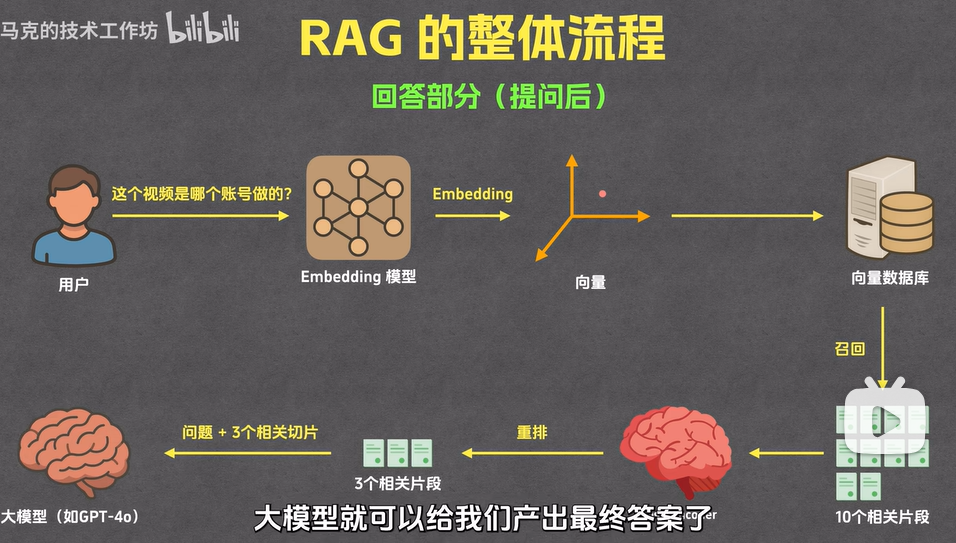

#### 准备过程

##### 分片

- 字数
- 段落
- 章节
- 页码

##### 索引

- 通过 Embedding 将片段文本转换为向量

  含义相近的文本在进入Embedding 后，对应的向量是相近的

  

- 将片段文本和片段向量存入向量数据库中

  一般的向量数据库表格里面至少都会有原始文本和向量

  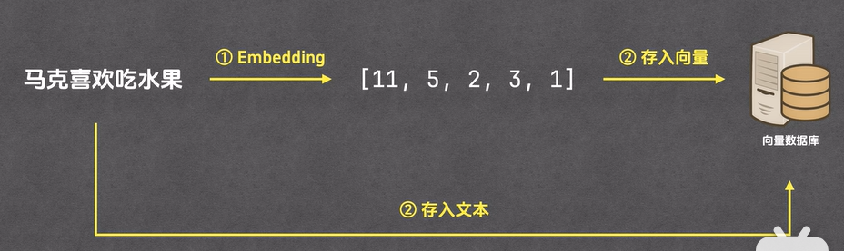

  

#### 回答过程

##### 召回

根据相似度大小，取十份相似度最高的

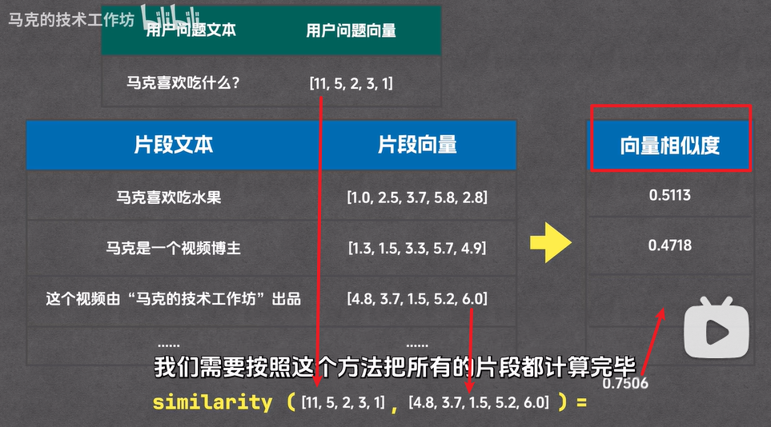

##### 重排

从十份相似度最高的的向量中取３份

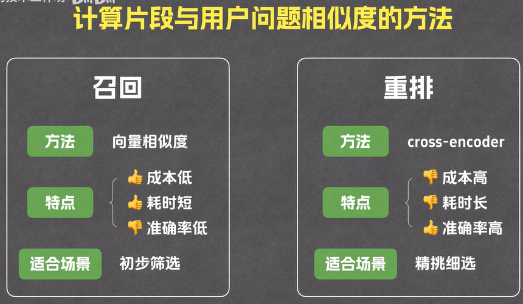

###### rank 模型

‌Rank 模型‌（排序模型）是信息检索、推荐系统和 RAG（检索增强生成）等 AI 应用中的关键组件，负责对初步检索或召回得到的候选结果进行‌精细化重排序‌，以提升最终输出的相关性与准确性。

##### 生成


## prompt

**prompt的质量直接关乎到AI交付结果的质量。这和我们平时工作时候和同事沟通的情况也是一样的，如果表达不清楚，对方也是不知道要做什么，那交付的产物也是五花八门的。**

### AI对话

> 我需要实现一个很大的功能，需要每一步我都需要验证ai实现的code怎么样，我需要怎么实现我的要求

- 将任务拆解，并丢给ai，让它分析我们任务拆解是否可行，以及如何去执行
- 挑选任务
  - eg:我们现在开始实现 **任务3：用户列表页面**
- AI生成代码
- 逻辑验证
- 提供反馈并要求修正
- AI 编写单元测试

## tool

模型是无法感知外界环境，工具就是为模型提供服务，本质就是函数

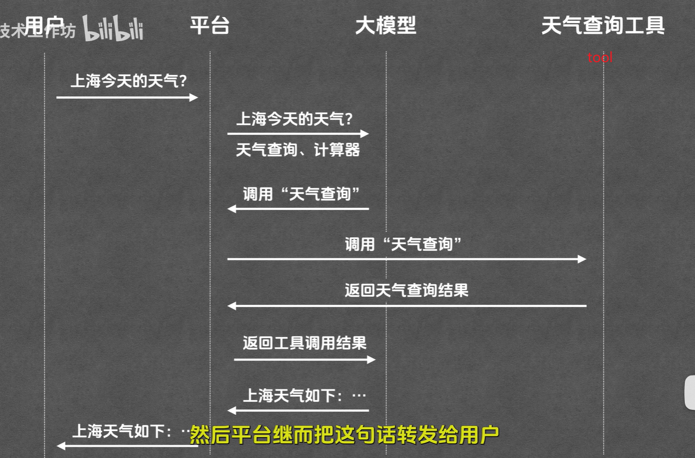

- 模型作用是，选择工具，归纳总结
- 平台就是，串联流程，**注意工具是平台去调用的，而不是模型调用，模型能做的仅仅是输出一段文本**

### 缺点

同一套工具，不同平台规范是不一样的

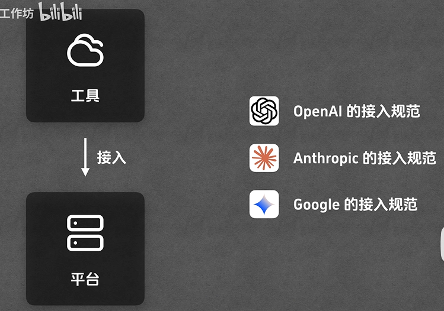

## MCP

> 为了解决tool的问题，引入了模型上下文协议（Model Context Protool）统一的工具接入标准

## agent

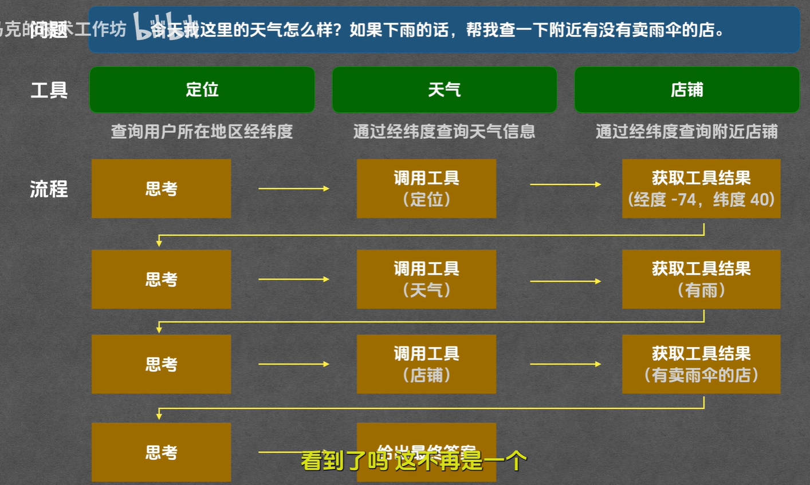

- 自主规划
- 自主调用工具

## skill

**skill是一套工作流说明，也是给模型的说明文档**

skill 适合这种场景：

1. 某类任务有固定流程
2. 需要带说明、模板、脚本或约束
3. 只在特定任务触发时加载，不是每次都常驻

# 模型

## 名称解释

### 模型定义

1. **数字（例如7B, 32B）**：

- 表示模型的参数规模：
  - **7B**：表示模型有70亿个参数（B表示"billion"，即十亿）。
  - **32B**：表示模型有320亿个参数。
  - **0.5B**：表示模型有5亿个参数。
- **字母（例如Instruct, VL, Coder）**：
- **Instruct**：表示这是一个指令优化模型，专门用于处理人类指令，特别适合回答问题和执行复杂的对话任务。
- **VL**：通常表示"Vision-Language"，指这是一个多模态模型，可以同时处理视觉（图像）和语言输入。
- **Coder**：表示这是一个专门用于代码生成和处理的模型，适合编程相关任务。

所以，举例来说：

- **Qwen2.5-72B-Instruct**：表示这个模型有72亿参数，是一个指令优化模型。
- **Qwen2.5-Coder-7B**：表示这是一个拥有7亿参数的代码生成模型。

模型名称后面的 **7b、8b、14b、72b、122b** 中的 **b**，是英文 **billion**（十亿）的缩写，代表模型的**参数量**。参数量可以理解为模型的"神经元"和"连接"的总数，是衡量模型规模和能力的一个重要指标。

📊 参数量对模型的影响

| 参数量           | 类比          | 能力特点                                                 | 硬件要求                                                     |
| :--------------- | :------------ | :------------------------------------------------------- | :----------------------------------------------------------- |
| **7b / 8b**      | 本科生        | 理解力不错，反应快，适合日常对话、代码生成、轻量任务。   | 较低：显存需求约 **8-16GB**（取决于精度），大多数消费级显卡（如 RTX 3060/4060）可流畅运行。 |
| **14b**          | 硕士生        | 推理能力更强，逻辑更缜密，能处理更复杂的任务。           | 中等：显存需求约 **16-32GB**，需要中高端显卡（如 RTX 4090）或多卡并联。 |
| **32b / 72b**    | 博士生/专家   | 知识储备丰富，深度推理能力极强，适合科研、复杂分析。     | 很高：显存需求 **32GB 以上**，通常需要多张高端显卡或纯 CPU + 大内存运行（速度较慢）。 |
| **122b / 200b+** | 院士/顶尖专家 | 极其庞大，几乎能处理所有通用任务，但个人电脑基本跑不动。 | 极高：需要多张 A100/H100 等专业级显卡，普通用户只能通过云端 API 调用。 |


## 好模型边界

### 上下文长度

### 文件关联能力

### 关键词识别能力

### 业务流程和代码关系识别能力

### 图像识别能力

### 代码生成质量和算法能力

### 多任务并行

## 国外

#### OpenAI

##### 命名规则

o4 4o 4.1 这类命名方式太抽象了，好在找到一个比较清晰易懂的解释：

命名规则可以归纳为【系列名】- 【模型名】- 【参数大小/推理资源高低】

1. GPT开头的模型，是基础的对话模型：GPT-3.5、GPT-4、GPT-4.1、GPT-4.5
2. o开头的模型，是推理模型，回答前会先思考：o1、o3、o4
3. o结尾的模型，是多模态模型，可以处理文本、图像等信息：gpt-4o
4. 最后面加上 mini、nano、pro，代表是不同参数的大小
5. 再再后面加上 low/medium/high，代表的是思考的努力程度

##### GPT-4

- **简介**: GPT-4 是目前 OpenAI 最先进的语言模型，相较于之前的版本，具有更强的推理能力、更高的准确性以及支持多模态输入（如文本和图像）。
- 特点:
  - 支持更长的上下文长度
  - 减少幻觉问题（生成内容更可靠）
  - 能够处理复杂的任务（如法律文档分析、科学论文撰写等）
- 应用场景:
  - 高级内容创作
  - 法律咨询
  - 科学研究

------

##### ChatGPT

- **简介**: ChatGPT 是基于 GPT-3.5 和 GPT-4 的对话模型，专为对话交互设计，能够生成高质量的自然语言回复。
- 版本:
  - **免费版**: 提供基础的对话和文本生成能力。
  - **ChatGPT Pro**: 更强的性能和更高的使用上限，适合专业用户。
- 应用场景:
  - 写作（文章、故事、邮件等）
  - 教育辅助
  - 编程帮助

##### 区别

| 特性           | GPT-4                        | ChatGPT              |
| :------------- | :--------------------------- | :------------------- |
| 模型规模       | 更大，支持更长上下文         | 较小，上下文窗口较短 |
| 理解和推理能力 | 更强，支持复杂任务           | 较弱，专注对话交互   |
| 多模态支持     | 支持文本+图像                | 仅支持文本           |
| 生成质量       | 更准确，减少幻觉问题         | 可能存在错误或偏差   |
| 应用场景       | 高级内容创作、科研、法律咨询 | 日常对话、简单写作   |
| 成本和性能     | 高性能，高成本               | 中等性能，低成本     |

总的来说，**GPT-4** 是更强大、更通用的模型，适用于复杂任务和专业场景；而 **ChatGPT** 则更注重对话交互和用户体验，适合日常使用。

#### Claude/Monica（[Anthropic](https://zhida.zhihu.com/search?content_id=253822235&content_type=Article&match_order=1&q=Anthropic&zhida_source=entity)）

特点：

专注于安全性、透明性和伦理的AI对话模型，旨在减少生成有害内容。

强大的对话生成能力，能够模拟人类对话风格并提供高质量的交流体验。

优势：

道德和伦理保障：Claude 确保生成的内容符合伦理标准，尤其在处理敏感话题时，可以提供更为安全和符合道德的回答。

人性化响应：Claude 的对话更具同理心，能够理解复杂的情感和情境，在提供帮助时能给出更加温和且人性化的建议。

适用于高安全性领域：非常适合应用在法律、医疗、教育等对AI伦理有较高要求的行业。

注册：

[登录Claude](https://link.zhihu.com/?target=https%3A//claude.ai/login%3FreturnTo%3D%2F%3F)

#### Gemini 

多模态能力

Gemini 拥有强大的多模态处理能力，能够同时处理文本、图像、音频和视频等多种媒体形式。特别是 Gemini 1.5 模型，其长上下文窗口高达 100 万个 tokens，这使其能够处理和理解极其长篇的内容。Monica 所基于的 Claude 3 系列同样具备出色的多模态能力，可以理解和分析复杂图像，并且 Claude-3.7-Sonnet 拥有 20 万个 tokens 的上下文窗口，虽然不及 Gemini 1.5，但仍然远超大多数现有模型。

推理能力

在复杂推理任务方面，Gemini 表现出色，尤其在数学和编程领域展现出较强的能力。其逻辑推理和问题解决能力使其成为技术任务的理想助手。而 Claude 3 系列则在推理和理解复杂指令方面表现优异，特别是在伦理推理和安全性方面有独特设计，这使得 Monica 在处理需要价值判断的复杂问题时更为谨慎和平衡。

语言能力

Gemini 支持多种语言，虽然其在英语上的表现最为出色，但在中文等非英语语言上的能力也在不断提升。Google 的全球化战略使 Gemini 在多语言支持方面持续进步。Claude 3 系列在多语言支持上同样取得了显著提升，特别是最新的模型在中文等非英语语言的理解和生成能力上有了长足进步，使 Monica 能够为全球用户提供更加自然流畅的交流体验。

安全性和对齐

Google 为 Gemini 实施了严格的安全措施和内容过滤机制，确保其输出符合道德和法律标准，虽然这些措施曾因过度过滤而引发争议。Anthropic 公司则特别注重 Claude 模型的安全性和价值观对齐，采用独特的"宪法 AI"方法，旨在创建有益、诚实且无害的 AI 系统，这使得 Monica 在处理敏感话题时能够保持平衡的视角。

应用场景对比

Gemini 已深度集成于 Google 搜索、Gmail、Docs 等广泛使用的产品中，用户还可以通过 Google AI Studio 和 [Vertex AI](https://zhida.zhihu.com/search?content_id=256246873&content_type=Article&match_order=1&q=Vertex+AI&zhida_source=entity) 等平台直接访问其能力。这种生态系统优势使 Gemini 在日常工作流程中的应用更为无缝。Monica 所基于的 Claude 则可通过 Claude.ai 网站、API 和各种第三方集成进行访问，与 Slack、Notion 等流行平台的集成使其在协作工作环境中表现出色。

性能评测对比

在各种基准测试中，两个模型系列各有所长。Gemini 在视觉推理任务上表现优异，同时在编码和数学问题上展示出较强的能力，这使其在技术领域的应用特别有价值。Claude 3 系列，尤其是 Claude 3 Opus，在多项基准测试中表现出色，在长文本理解和复杂指令遵循方面具有明显优势，这使得 Monica 在需要深度理解和精确执行的任务中表现突出。

总结

Gemini 和 Monica(Claude) 作为当今最先进的 AI 助手，各自拥有独特优势。Gemini 凭借与 Google 生态系统的深度集成、强大的多模态处理能力以及在技术任务上的出色表现，为用户提供全面的智能助手体验。而 Monica 则以其在安全性、复杂指令理解和伦理对齐方面的特色，为注重 AI 伦理和安全的用户提供可靠的选择。选择哪一个模型，最终取决于用户的具体需求、使用场景以及个人偏好

## 国内

#### 总结

| 模型               | 代码生成 | 代码理解 | 多语言 | 工程实用 | 综合推荐           |
| :----------------- | :------- | :------- | :----- | :------- | :----------------- |
| **DeepSeek-Coder** | ⭐⭐⭐⭐⭐    | ⭐⭐⭐⭐     | ⭐⭐⭐⭐   | ⭐⭐⭐⭐⭐    | **首选（全能型）** |
| **Qwen**           | ⭐⭐⭐⭐     | ⭐⭐⭐      | ⭐⭐⭐    | ⭐⭐⭐⭐     | **中文场景首选**   |
| **CodeGeeX**       | ⭐⭐⭐      | ⭐⭐⭐      | ⭐⭐⭐⭐⭐  | ⭐⭐⭐⭐     | **多语言轻量需求** |
| **Kimi**           | ⭐⭐       | ⭐⭐⭐⭐⭐    | ⭐⭐     | ⭐⭐       | **只用于读代码**   |

> 💡 **如果你只能选一个**：
>
> - 要**写代码** → **DeepSeek-Coder**
> - 要**读代码** → **Kimi**

##### **1.** 代码生成质量

- **DeepSeek-Coder**：
  ✅ 最强项。在算法题（LeetCode 风格）、系统设计、单元测试生成上表现接近 GPT-4。
  ✅ 能生成**可直接运行**的完整函数，错误率低。
  ❌ 对冷门语言（如 Haskell）支持弱于主流语言。
- **Qwen（通义千问）**：
  ✅ 中文场景极强（如根据中文注释生成代码）。
  ✅ 与阿里生态（如 Java/Spring）深度优化。
  ❌ 开源版（Qwen2.5-Coder）弱于闭源 API（Qwen-Max）。
- **CodeGeeX**：
  ✅ 多语言覆盖广，适合国际化项目。
  ❌ 生成代码常有**逻辑瑕疵**（如边界条件遗漏），需人工 review。
- **Kimi**：
  ❌ 代码非其主打方向。生成结果"看似合理"但常有隐藏 bug。
  ✅ 适合**解释已有代码**而非生成新代码。

------

##### **2.** 长上下文 & 大文件处理

| 模型           | 上下文长度 | 代码文件处理能力                   |
| :------------- | :--------- | :--------------------------------- |
| DeepSeek-Coder | 128K       | ✅ 可分析整个模块（如 `src/` 目录） |
| Kimi           | **200K+**  | ✅ 最强！可上传整个代码库并问答     |
| Qwen-Max       | 32K        | ⚠️ 适合单文件                       |
| CodeGeeX4      | 128K       | ✅ 支持跨文件引用                   |

> 💡 **Kimi 在"读代码"上领先，DeepSeek 在"写代码"上领先**。

------

##### **3.** 调试与解释能力

- **Kimi**：
  ✅ 解释复杂代码段、报错信息的能力**最强**（得益于超长上下文 + 中文优化）。
  ❌ 不擅长主动修复 bug。
- **DeepSeek-Coder**：
  ✅ 能定位 bug 并提供修复方案（如"空指针异常 → 加 null check"）。
  ✅ 支持生成单元测试验证修复。
- **Qwen**：
  ✅ 对阿里系技术栈（Dubbo, RocketMQ）的错误码解释精准。
  ❌ 通用调试弱于 DeepSeek。
- **CodeGeeX**：
  ⚠️ 调试建议较模板化，缺乏深度。

#### deepseek

作为国产最强AI，甚至一度比肩chatgpt。

特点：

基于智能搜索引擎技术，结合语义理解提供精准的答案。

可快速从大量文档中提取信息并生成详细回答，适合用于知识管理、研究和学术分析。

优势：

提供思维逻辑过程，不仅懂结果，更懂逻辑。

内容本地化。

精准问答：Deepseek 在理解用户问题的上下文后，能够从海量信息中提供更符合需求的精准答案，比传统搜索引擎更具效率。

多领域支持：无论是学术研究、技术文档，还是市场调研，Deepseek 都能够帮助用户在短时间内获取核心信息。

智能总结与分析：它不仅提供搜索结果，还可以对搜索内容进行智能总结，帮助用户迅速提取关键信息。

注册：

[登录DeepSeek官网](https://link.zhihu.com/?target=https%3A//chat.deepseek.com/sign_in)，然后绑定手机号注册即可开始与deepseek对话，非常简单。


#### 阿里巴巴通义实验室

##### 通义灵码（TONGYI Lingma）

- 智能编码助手，提供代码续写、单元测试生成等功能。
- 应用场景：开发者生产力提升。


##### 通义千问（Qwen）

- 大规模语言模型，支持多语言、多任务处理。
- 应用场景：对话交互、内容创作、编程辅助。

#### 智谱

| 模型名称              | 核心优势与定位                           | 关键能力特点                                                 | 适合的开发场景                                               |
| :-------------------- | :--------------------------------------- | :----------------------------------------------------------- | :----------------------------------------------------------- |
| **智谱 GLM-4.7 系列** | **综合能力与审美领先**，被称为"最强平替" | 在多项基准测试中综合性能超越GPT-5.2、对齐Claude；**Agentic Coding**能力突出，能自我反思、纠错；前端代码审美和UI交互体验极佳。 | 需要高质量、高完成度代码的全栈开发；特别注重UI设计和交互体验的前端项目。 |

#### kimi

#### 其他

##### 百度文心一言

##### 文心一言

- 百度的大语言模型，支持文本生成、对话交互。
- 应用场景：内容创作、智能客服。

##### ERNIE-Bo

- 对话生成模型，基于 ERNIE 技术优化。
- 应用场景：智能助手、多轮对话。

##### 腾讯混元（HunYuan）

##### 混元大模型

- 腾讯推出的大规模语言模型，支持多模态任务。
- 应用场景：内容生成、对话交互。

##### 混元助手

- 基于混元模型的对话系统，应用于微信生态。
- 应用场景：社交互动、客户服务。

##### 华为盘古大模型

##### 盘古大模型

- 华为推出的大规模预训练模型，涵盖文本、视觉、多模态等领域。
- 应用场景：科学研究、工业应用。

##### 盘古 NLP

- 专注于自然语言处理的任务。
- 应用场景：文本分类、信息抽取。

##### 科大讯飞

##### 星火认知大模型

- 科大讯飞推出的超大规模语言模型，支持多语言、多任务处理。
- 应用场景：教育、医疗、客服。


# **AI驱动开发**

## 概念

### 传统编程 vs Vibe Coding

| 维度         | 传统编程           | Vibe Coding           |
| ------------ | ------------------ | --------------------- |
| **工作方式** | 手写每一行代码     | 描述意图，AI 生成代码 |
| **关注点**   | 如何实现（How）    | 要实现什么（What）    |
| **开发流程** | 编码 → 调试 → 优化 | 描述 → 审查 → 迭代    |
| **技能要求** | 精通语法和 API     | 清晰表达 + 代码审查   |
| **效率提升** | 线性增长           | 指数级增长            |

**Vibe Coding 不是让 AI 替你写代码，而是让 AI 成为你的编程伙伴**：

- **你负责**：架构设计、业务逻辑、质量把控
- **AI 负责**：代码生成、重复劳动、方案探索
- **共同完成**：快速迭代、持续优化、创造价值

### 适合场景

1. 智能代码生成
   通过自然语言处理（NLP）和机器学习技术，AI可以将自然语言描述转化为代码，显著提高开发效率。例如，一些工具能够根据设计草图自动生成HTML和CSS代码。
2. 数据分析和运营优化：人工智能可以用于前端开发中的运维运营阶段，通过数据分析和机器学习技术，对用户行为和网站性能进行分析，提供优化建议，帮助优化用户体验和网站性能。
   1. 个性化推荐
      AI能够根据用户的行为数据和偏好，提供个性化的内容推荐。例如，电商平台可以通过AI算法为用户推荐感兴趣的商品，提升用户满意度和转化率。
3. 智能交互设计
   AI驱动的交互设计能够提供更加自然和高效的用户体验。例如，智能语音助手和聊天机器人可以通过自然语言交互帮助用户完成任务。
4. 自动化测试与性能优化
   AI可以用于自动化测试，通过生成测试用例和执行测试任务，提高测试效率和质量。此外，AI还可以用于性能优化，通过分析代码和用户行为数据，自动优化前端性能。
5. 图像识别和处理：人工智能可以用于前端开发中的交互视觉设计，通过图像识别技术，自动分析和处理设计稿中的元素，提取出关键信息，帮助开发人员更快地实现设计效果。

### 模型效率提升

- 任务模块化 (Modularization)+精确的信息投喂 (Targeted Feeding)
  - 明确的问题描述，同时只发送关联的函数或数据模型
  - 细分任务，完成一个任务后，定期提交代码
  - 如果没有上下文关联，开启新对话，减少不必要的历史信息
  - 利用并行的Sub-agent：如果功能并行，启动多个轻量级Agent独立工作，避免在一个对话中处理所有事情，单次输入过大。
  - **关闭不必要的提示词内容 (Disable Unused Skills)**
    - **技巧**：如果使用的是Cline或类似Agent系统，关闭当前不需要的Skill、MCP工具或插件。
  - 约束提示
    - 使用技能/规则约束

- **维护清晰的文档（语义锚点）**

### TDD 

TDD 是 Test-Driven Development（测试驱动开发）的缩写，是一种软件开发方法，强调在编写功能代码之前先编写测试代码。TDD 的核心理念是通过编写测试来驱动开发过程，确保代码的质量和可维护性。

##### **🔄 TDD 的核心循环：红-绿-重构**

TDD 并不是单纯的“写测试”，而是一种严格的开发节奏，通常被称为“红-绿-重构”循环：

1. **红（Red）：先写一个失败的测试**
   在写任何业务代码前，先根据需求写一个测试用例。因为此时功能还没实现，所以运行测试必然会报错（显示为红色）。这确保了你的测试是有效的，并且明确了“我要实现什么”。
2. **绿（Green）：写最少的代码让测试通过**
   接着，只写刚好能通过这个测试的最简单代码。此时不追求代码完美，唯一目标就是把红灯变绿灯。
3. **重构（Refactor）：优化代码**
   在测试通过（绿灯）的保护下，放心地去优化代码结构、消除重复、提升可读性。因为有测试兜底，你不用担心优化会破坏原有的功能。

##### **🤖 为什么在 AI 编程（如 Spec-Kit）中强调 TDD？**

在传统的开发中，TDD 往往因为繁琐而被开发者忽略。但在 AI 辅助编程时代（比如你刚才提到的 Spec-Kit），TDD 变得极其重要：

- **防止 AI “幻觉”和跑偏**：AI 经常会在生成大量代码时“自作聪明”或产生幻觉。如果先让 AI 生成测试用例，就相当于给它划定了严格的边界和验收标准。
- **自动化验收**：AI 写完代码后，可以自动运行测试。如果测试不通过，AI 可以自我修复，直到所有测试变绿，极大提高了代码的可靠性。
- **需求即代码**：测试用例本质上就是把人类的需求翻译成了机器能看懂的代码，让 AI 能够精准理解“做成什么样才算对”。

简单打个比方：

- **普通开发**：像是先盖房子，盖完后再去检查墙歪不歪、漏不漏水。
- **TDD 开发**：像是先画出极其精确的验收图纸和质检标准，然后一边盖一边对照，确保每一块砖都符合标准。

## 工具

### UV

**`uv` 是一个用 Rust 编写的、极快的 Python 包和项目管理工具**。

它的目标是成为一个统一的工具，取代 Python 开发中常用的 `pip`、`pip-tools`、`pipx`、`poetry`、`pyenv`、`virtualenv` 等多个工具。简单来说，你可以把它理解为一个 **Python 生态的"一站式管家"和"性能加速器"**。

#### 为什么大家都在用 uv？

它的核心优势主要体现在三个方面：

- **🚀 速度极快**：这是 uv 最突出的特点。由于使用 Rust 语言编写，并采用了高效的并行和缓存机制，它的安装和依赖解析速度通常比传统的 `pip` 快 **10到100倍**。例如，安装 NumPy 和 Pandas 这样的大型库，`uv` 只需几秒，而 `pip` 可能需要半分钟。
- **🎯 功能统一**：在以前，创建一个 Python 项目可能需要掌握 `pyenv` (管理Python版本)、`venv` (创建虚拟环境)、`pip` (安装包)、`poetry` (管理项目依赖)等多个工具。而 `uv` 一个工具就能完成所有这些任务。
- **✨ 体验流畅**：`uv` 简化了许多繁琐的操作。比如，运行一个 Python 脚本，传统方式需要先激活虚拟环境再执行，而 `uv` 只需一个命令 `uv run python script.py` 即可自动处理环境和依赖。

#### 核心功能速览

你可以通过以下这些常用命令来快速上手 `uv`：

| 功能分类       | 常用命令                 | 说明与作用                                                   |
| :------------- | :----------------------- | :----------------------------------------------------------- |
| **初始化项目** | `uv init my-project`     | 创建一个新的 Python 项目，并生成 `pyproject.toml` 配置文件。 |
| **添加依赖**   | `uv add requests`        | 向项目中添加一个 Python 包（如 `requests`），并自动更新锁文件。 |
| **运行脚本**   | `uv run python main.py`  | 在项目专属的虚拟环境中执行命令，无需手动激活环境。           |
| **安装Python** | `uv python install 3.12` | 自动下载并安装指定版本的 Python。                            |
| **安装工具**   | `uvx ruff`               | 临时运行一个 Python 工具（如代码检查工具 `ruff`），用完即走，不污染环境。 |

> **`uv` 和 `uvx` 的关系**：`uvx` 是 `uv tool run` 命令的别名，专门用来临时运行一个 Python 工具。它有点像 `pipx`，但更快捷。

#### 如何安装 uv？

安装非常简单，在终端中运行对应的命令即可：

**macOS / Linux**

bash

```
curl -LsSf https://astral.sh/uv/install.sh | sh
```


**Windows**

powershell

```
powershell -ExecutionPolicy ByPass -c "irm https://astral.sh/uv/install.ps1 | iex"
```


*这些安装脚本会自动下载并配置好 `uv`，无需额外设置。*

你提到的"小龙虾"（OpenClaw）在配置 MCP 服务时，用到了 `uvx mcp-server-tapd` 这样的命令，这正是用 `uv` 来临时运行一个 MCP 服务器的快捷方式，省去了手动安装和配置的麻烦。

#### 安装python

https://dev.to/codemee/shi-yong-uv-guan-li-python-huan-jing-53hg

```
uv python install 3.12
```


```
$ uv python dir
C:\Users\liming\AppData\Roaming\uv\python
```


```
列出所有已安装的 Python 版本：使用 uv python list --only-installed --show-paths 命令可以列出已安装的版本及其完整路径。
```


如何自定义 Python 安装路径？

- **安装时临时指定 (使用 `--install-dir`)**
  你可以在安装 Python 时使用 `--install-dir` 参数来指定一个目录。

  powershell

  ```
  uv python install --install-dir "D:\my-python-versions"
  ```

  

  **需要注意**：手动指定的目录不会在 `uv` 的自动扫描范围内。为了确保 `uv` 能够识别，你需要在同一个命令行会话中设置好 `UV_PYTHON_INSTALL_DIR` 环境变量。

- **永久更改 (推荐使用环境变量)**
  通过设置环境变量，可以一劳永逸地改变 Python 的默认安装位置。

  1. **`UV_PYTHON_INSTALL_DIR` (核心设置)**
     这是最主要的变量，用于指定 `uv` 安装和查找 Python 的目录。建议将其永久添加到你的系统环境变量中，例如设置为 `D:\uv\python`。

     powershell

     ```
     # 示例：在当前会话临时设置并安装
     $env:UV_PYTHON_INSTALL_DIR = "D:\uv\python"
     uv python install
     ```

  2. **`UV_PYTHON_BIN_DIR` (高级设置)**
     如果希望将 Python 的可执行文件（如 `python.exe`）单独存放到一个目录（即 `bin` 目录），可以使用 `UV_PYTHON_BIN_DIR` 进行配置。


### 编辑器和扩展

#### 编辑器对比

| 对比维度                     | **VS Code**                                                  | **Cursor**                                                   | **Trae**                                                     |
| :--------------------------- | :----------------------------------------------------------- | :----------------------------------------------------------- | :----------------------------------------------------------- |
| **模型灵活性**               | **高（需插件）** 通过Cline/Continue等插件可接入任何兼容OpenAI的模型（国内外通吃），但需自行配置。 | **极高（原生+自定义）** 原生支持Claude/GPT/Gemini，同时**允许接入任何自定义模型**（阿里云、智谱、DeepSeek等），一套工具自由切换国内外模型。 | **低（模型墙）** 国内版只能使用豆包、DeepSeek等本土模型；国际版只能用海外模型。**无法同时使用国内外模型**。 |
| **稳定性与更新**             | **极稳** 微软出品，版本迭代成熟，基础功能极少出问题，更新可控。 | **较稳** 创业公司产品，更新频繁但核心功能（Tab补全、Composer）可靠性高，极少出现基础功能故障。 | **个人版不稳，企业版未知** 你亲历的**代码折叠问题、频繁更新**表明个人版尚在快速迭代期。企业版稳定性无公开信息。 |
| **团队管理功能**             | **无原生功能** 需借助GitHub、Jira等第三方工具，或自研方案，管理成本高。 | **基础团队管理（Business套餐）** 提供用量统计、成员管理、集中计费，额度按席位独立计算（不活跃成员额度无法共享）。 | **完善的企业级管理** 效能看板（追踪AI生成率/代码量）、成本控制（费用上限）、成员活跃度监控、SSO单点登录，真正"团队基础设施"。 |
| **成本**                     | **最低** 免费 + API按量付费（国内模型API成本极低）。         | **中等** Pro $20/人/月，Business $40/人/月。10人团队Business年成本约$4800。 | **企业版需询价** 个人版免费但功能受限；企业版需联系销售报价，通常为"基础席位费+按量付费"。 |
| **网络访问**                 | **无限制** 但AI插件若调用海外模型需自行代理。                | **需代理** 自2025年7月起对中国大陆IP限制访问，必须使用代理或API中转，增加运维负担。 | **国内原生** 字节跳动国内服务器，毫秒级响应，无需任何代理。  |
| **数据合规与安全**           | **取决于插件** 可自行控制数据流向（如自建模型网关），适合对数据主权有严格要求的团队。 | **需自行评估** 数据存储和处理在海外，虽有ISO认证，但代码资产有外传风险，合规性需谨慎。 | **企业级保障** 代码全链路加密、云端零存储、不用于训练，与火山引擎深度集成，有明确法律协议，符合国内监管。 |
| **中文支持与本土化**         | **好（界面）** 中文界面完善，但AI插件的中文理解能力取决于所选模型。 | **一般** 主要面向英文逻辑，对中文支持较弱，需依赖模型本身的中文能力。 | **最佳** 全中文界面，对中文注释、变量名、指令理解准确率高达98%，深度集成Figma导入、国内代码仓库。 |
| **适用场景（针对你的团队）** | **预算敏感、愿意自行集成的团队** 适合作为备选，但统一工具体验一致性较差。 | **模型自由、AI优先的团队** 算法人员已有使用经验，适合需要同时调用国内外模型的场景，团队管理基础功能够用。 | **极致管理、本土化优先且接受模型限制的团队** 若企业版稳定性解决，且只使用国内模型，可考虑。目前与你核心需求（模型自由）冲突。 |

- 多任务
- 跨文件
- token cost

#### 智能体模式

选择哪种模式取决于具体的应用需求和场景。如果需要高效的自动化处理，可以选择 `Composer` 或 `Agent` 模式；如果更注重交互体验，则可以选择 `Chat` 模式；而 `Manual` 模式则适用于那些需要人工确认的关键步骤。

##### Chat Mode（对话模式）

适合即时问题解答、快速修补与小规模修改，需要逐一应用。

##### Composer

Composer Mode（代码生成模式）：能够处理更复杂的任务，执行多文件修改，自动化重复性工作。

 `Agent` 和 `Manual` 是两种不同的执行方式

- Agent Mode（全自动模式）
- manual 

##### Agent 模式

- **特点**：具有自主决策能力，能够根据环境变化动态调整行为。

  - 无需人工干预

  - 实时响应变化

  - 资源消耗相对较高

  - 需要系统权限配置

- **使用场景**：适用于需要智能决策的场景，如游戏AI、自动化测试、个性化推荐等。

  - 自动化处理

  - 作为系统服务运行

  - 自动监控和处理依赖关系

  - 可以在后台持续运行

  - 适合需要持续集成和自动化部署的环境

##### Manual 模式

- **特点**：需要人工干预才能完成操作，不具备自动化能力。

  - 完全依赖用户操作，自动化程度低。

  - 资源消耗较低

  - 可以精确控制更新时机

  - 适合调试和测试

- **使用场景**：适用于对准确性要求高、不能完全依赖自动化的场景，如重要审批流程、复杂问题的复核等

#### 扩展

##### roocode/kilo/cline

| 特性维度               | 🚀 **Roo Code**                                               | 🏆 **Cline**                                                  | 🌟 **Kilo Code**                                              |
| :--------------------- | :----------------------------------------------------------- | :----------------------------------------------------------- | :----------------------------------------------------------- |
| **定位与核心特色**     | **成本优化与角色定制**：首创**自定义模式**和**AI角色**，为不同任务（如架构师、问答）创建专用AI，并可限制其权限。 | **生态王者与先驱者**：拥有最庞大的用户社区（**500万+安装**）和**最成熟的MCP**（模型上下文协议）生态，是许多新功能的首创者。 | **集大成者与多面手**：目标是成为一个"超集"工具，融合Roo Code的自定义模式、Cline的生态，并支持**VS Code和JetBrains双平台**及**500+模型**。 |
| **核心差异：文件编辑** | **差异编辑**：只发送修改的部分。**可节省约30%的API费用**，在处理大文件时尤其省钱。 | **全量重写**：每次修改都重写整个文件。更稳定，不会因上下文不匹配而出错，但token消耗较高。 | **兼具两者**：集成了Cline和Roo Code的核心能力，理论上可以灵活选择编辑方式。 |
| **成本与定价**         | **工具免费**，仅支付API费用。**编辑方式更省钱**。提供可选的云功能付费方案（如远程控制）。 | **工具免费**，仅支付API费用。由于全量重写，实际使用成本相对较高。 | **工具免费**。提供**"自带密钥"**和**"Kilo Provider"**两种模型使用方式。后者**零加价**，也支持订阅积分（$19/月起）。 |
| **生态与社区**         | 社区正在成长，有**"模式画廊"**分享预设配置。GitHub **22K+** 星，**120万+** 安装。 | **生态无可匹敌**。拥有**"MCP市场"**、大量教程和第三方集成。GitHub **58K+** 星，**500万+** 安装。 | 作为后起之秀，生态正在快速建设中，已拥有**140万+**用户。强调开源透明和灵活性。 |
| **平台支持**           | VS Code                                                      | VS Code、CLI                                                 | **VS Code、JetBrains、CLI**                                  |
| **最佳适用人群**       | **成本敏感型开发者**、需要**分工明确**（如架构师不写代码）的团队、希望优化API开销的个人。 | **生态依赖型用户**、新手（文档多、问题易解）、需要**浏览器自动化**等前沿功能的探索者。 | **自由探索型开发者**、**多IDE团队**（VS Code和JetBrains混用）、希望**避免供应商锁定**、重视本地模型和灵活性的组织。 |


### 终端

**CC Switch** 是一款开源的跨平台桌面应用（Windows / macOS / Linux），核心功能是**统一管理 AI 编程 CLI 工具的模型供应商配置**。

它主要解决以下痛点：使用 Claude Code、Codex、Gemini CLI、OpenCode、OpenClaw 等 AI 编程 CLI 工具时，需要手动编辑 settings.json、auth.json、.env 等配置文件来切换模型供应商，过程繁琐。CC Switch 将这些操作可视化，内置 **50+ 供应商预设**，填写 API Key 后一键切换即可生效。

**Ghostty + tmux + Claude Code**，这是前端开发当前的最优解

**tmux 是一个终端复用器（terminal multiplexer）**。

说人话：它让你在一个终端窗口里，同时跑多个独立的命令行会话，而且退出终端后这些会话不会死

```
Ghostty（窗口）── 你看到的这个终端窗口
  └─ tmux（空间管理器）── 把窗口切成格子，管理会话生命周期
       ├─ zsh + nvim ── 你写代码
       ├─ zsh + claude ── AI 写代码
       ├─ zsh + npm run dev ── 开发服务器
       └─ zsh + lazygit ── Git 操作
```


## 聊天窗

模型切换会继承上面的历史吗

### SSE

https://mp.weixin.qq.com/s/6PYvwHscIHgXfKYZfK-5ZQ


# 规范驱动开发SDD

> AI 辅助编程领域从“氛围编程”（Vibe Coding）向“规范驱动开发”（Specification-Driven Development, SDD）的范式迁移

## 背景

在 2024 至 2025 年间，AI 编程助手（如 GitHub Copilot、Cursor）的普及极大地提升了代码生成的速度。然而，一种被称为“氛围编程”（Vibe Coding）的模式也随之流行——开发者仅凭模糊的自然语言提示，期望 AI 能“心领神会”地生成完美代码。这种模式在处理简单任务时效率惊人，但在面对复杂、多阶段的软件工程问题时，其弊端暴露无遗：

1. **上下文丢失**：长对话链中，AI 容易遗忘早期的设计决策。
2. **需求漂移**：模糊的意图描述导致 AI “自由发挥”，产出偏离预期。
3. **知识孤岛**：开发过程缺乏可追溯的文档，团队协作困难。
4. **质量不可控**：生成的代码风格不一，缺乏统一的质量标准和测试覆盖。

这些问题促使业界共识形成：**AI 编程的下一个瓶颈不再是模型能力，而是人机协作的工程方法论**。于是，“规范驱动开发”（SDD）应运而生，并在 2026 年成为 AI 原生开发的主流范式。SDD 的核心思想是，在编写任何一行实现代码之前，先通过结构化的文档与 AI 达成关于“做什么”和“为什么做”的清晰共识。这一共识将成为后续所有开发活动的“单一事实来源”（Single Source of Truth）。

## **SDD核心理念与价值**

### **什么是规范驱动开发？**

规范驱动开发（SDD）是一种将**可执行的规范**（Executable Specification）置于软件开发生命周期中心的工程实践。它借鉴了传统软件工程中“契约优先”（Contract-First）的思想，并将其与 AI 的强大生成能力相结合。

在 SDD 中，“规范”不再是一份静态的、仅供参考的需求文档，而是一个动态的、版本化的、机器可读的工件集合。它通常包含以下几个关键部分：

- **提案** (Proposal)：阐述变更的业务背景、目标和成功标准。
- **规范** (Specs)：明确定义功能的输入、输出、数据模型、API 接口、验证规则等。
- **设计** (Design)：描述技术选型、架构图、关键算法和安全考量。
- **任务** (Tasks)：将整体目标分解为可执行、可分配的具体步骤。

### **SDD 如何解决 AI 编程的痛点？**

SDD 通过以下机制，系统性地解决了“氛围编程”的固有缺陷：

- **终结歧义**：`Specs` 文件为 AI 提供了精确无误的指令集，从根本上杜绝了因意图理解偏差导致的错误。
- **持久化上下文**：所有决策和设计都被固化在 Markdown 或 YAML 文件中，与代码一同纳入版本控制（Git），确保上下文永不丢失。
- **赋能审查与协作**：结构化的文档使得代码审查（Code Review）转变为“规范审查”（Spec Review），团队成员可以更早、更有效地介入，保证方向正确。
- **保障质量与一致性**：通过将测试用例、性能指标等也纳入规范，可以驱动 AI 生成自带质量保证的代码。

### **三大主流 SDD 框架解析**

https://cloud.tencent.com/developer/article/2656315

2026 年，SDD 生态呈现出百花齐放的局面，其中以 **OpenSpec**、**GitHub Spec Kit** 和 **Kiro** 最具代表性。它们分别代表了轻量级、标准化和企业级集成三种不同的设计哲学。

| 维度           | **OpenSpec**                                     | **GitHub Spec Kit**                                     | **Kiro**                               |
| -------------- | ------------------------------------------------ | ------------------------------------------------------- | -------------------------------------- |
| **开发团队**   | Fission-AI (开源社区)                            | GitHub (官方)                                           | Amazon Web Services (AWS)              |
| **核心哲学**   | 轻量、灵活、增量友好                             | 标准化、严谨、宪法先行                                  | 一体化、Agentic、云原生                |
| **主要形态**   | CLI + 工作流规范                                 | CLI (`specify`) + 规范模板                              | Agentic IDE (桌面应用)                 |
| **安装复杂度** | node  低 (`npm install -g @fission-ai/openspec`) | python 中 (`uv tool install specify-cli`)               | 中 (需下载安装客户端)                  |
| **学习曲线**   | 平缓                                             | 较陡峭                                                  | 中等                                   |
| **适用场景**   | **棕地项目** (Brownfield)                        | **绿地项目** (Greenfield) / 企业合规                    | **AI Agent 开发** / AWS 生态           |
| **工作流**     | New → Apply → Archive (3步)                      | Constitution → Specify → Plan → Tasks → Implement (5步) | 双模交互，Specs & Hooks 驱动           |
| **TDD 支持**   | 需自行配置                                       | **内置强制 TDD**                                        | 内置，由专用 Agent 保障                |
| **独特优势**   | 零密钥、与现有工具链无缝集成                     | 官方标准、流程严谨、社区潜力大                          | 端到端体验、原子化回滚、云服务深度集成 |

**总结**：

- 如果你希望**快速在现有项目上尝试 SDD**，且不想改变现有工具链，**OpenSpec** 是最佳选择。OpenSpec 最大的优势就在于这种“增量更新”和“自动归档”的机制，它能保证随着项目的迭代，你的项目文档永远是最新且可追溯的。

  > 如果项目必须运行在 Node.js 14 版本上，那么它**完全不适合直接使用 OpenSpec**。
  >
  > ```
  > 解决方案一：使用 Node 版本管理工具（推荐）
  > 你完全可以在同一台电脑上安装多个版本的 Node.js，并根据场景灵活切换。
  > 日常开发/项目运行：使用 Node 14，确保老项目正常运行。
  > 使用 OpenSpec 时：临时切换到 Node 20+，仅用来执行 OpenSpec 的指令。
  > ```

- 如果你正在**启动一个新项目**，并希望建立一套**严谨、可审计、符合行业标准**的开发流程，**GitHub Spec Kit** 提供了最坚实的框架。

- 如果你的团队**重度依赖 AWS**，并且目标是构建复杂的 **AI Agent 应用**，追求**一体化的极致体验**，那么 **Kiro** 将是你的不二之选。

## MCP

### Chrome DevTools MCP

> node版本至少 Node 20.19.0 LTS

### Figma MCP

figma MCP (Model Context Protocol) 是一种让 AI 助手直接与 Figma 设计文件交互的标准化协议。通过 MCP，AI 可以读取设计文件、获取图层信息、导出资源，甚至协助进行设计工作。

- **设计文件读取** - 获取 Figma 文件的结构、图层信息
- **资源导出** - 自动导出图标、图片等设计资源
- **设计分析** - 分析设计系统、颜色方案、字体使用等
- **代码生成** - 基于设计稿生成前端代码
- **设计协作** - 与设计师协作优化设计方案
- **Code Connect 集成** - 保持设计系统组件与代码库一致
- **Make 资源获取** - 从 Make 文件中收集代码资源作为 LLM 上下文


## OpenSpec

OpenSpec 的使用流程非常轻量且顺滑，核心逻辑是**“先共识，后构建”**。它通过一套简单的指令，引导 AI 在写代码前先产出规范的文档，确保 AI 完全理解需求后再动手。

### **源码架构分析**

```
src/
├── cli/                  # CLI 入口
├── commands/             # 命令实现 (20个命令)
│   ├── workflow/         # 工作流相关命令
│   ├── workspace/        # 工作区管理
│   ├── change.ts         # 变更管理
│   ├── config.ts         # 配置管理
│   └── schema.ts         # Schema 管理
├── core/                 # 核心逻辑 (108个文件)
│   ├── artifact-graph/   # 产物依赖图
│   ├── command-generation/ # 命令生成器
│   ├── templates/        # 文件模板 (15个)
│   ├── parsers/          # 解析器
│   ├── validation/       # 验证逻辑
│   ├── schemas/          # Schema 定义
│   ├── workspace/        # 工作区实现
│   ├── init.ts           # 初始化
│   ├── archive.ts        # 归档逻辑
│   ├── config.ts         # 配置管理
│   └── list.ts           # 列表展示
├── prompts/              # AI 提示词模板
├── telemetry/            # 遥测收集
└── utils/                # 工具函数

```

**关键模块说明：**

| 模块                 | 职责                                |
| -------------------- | ----------------------------------- |
| `artifact-graph`     | 管理产物的依赖关系和生成顺序        |
| `command-generation` | 生成斜杠命令和技能提示              |
| `templates`          | 生成 proposal、design、tasks 等模板 |
| `parsers`            | 解析 Markdown/YAML 规格文件         |
| `validation`         | 验证规格格式和完整性                |
| `workspace`          | 多仓库协调工作区支持                |

### 安装

#### **1. 环境准备与项目初始化**

首先，确保你的电脑安装了 Node.js (20.19.0 或更高版本)。接着在终端全局安装 OpenSpec，并进入你的项目根目录进行初始化：

```
# 全局安装 OpenSpec
npm install -g @fission-ai/openspec@latest

# 进入你的项目目录并初始化
cd your-project
openspec init
```

执行 `openspec init` 后，工具会引导你选择正在使用的 AI 助手（如 Cursor、Claude Code 等），并自动生成 `openspec/` 核心目录及相关配置文件。

#### **2. 核心开发闭环（四大步）**

初始化完成后，你就可以在 AI 编程助手的对话界面中，通过斜杠命令（Slash Commands）来驱动开发了。日常开发通常遵循以下 4 个步骤：

- **第一步：开启新任务（Propose）**
  当需求明确时，直接告诉 AI 你要做什么。AI 会自动在 `openspec/changes/` 目录下创建一个专属的变更文件夹，并生成提案、需求规格、技术设计和任务清单。

  ```
  # 格式：/opsx:propose <需求描述>
  /opsx:propose 给Todo应用添加深色模式
  ```

  *💡 提示：如果你还没想清楚具体需求，可以先用 `/opsx:explore` 让 AI 帮你调研和梳理思路，这个指令不会生成任何文件。*

- **第二步：审查规划文档（Review）**
  AI 生成文档后，**不要急着让它写代码**。花几分钟快速扫一遍自动生成的 `tasks.md`（任务拆解是否合理）和 `specs/`（需求场景是否有遗漏）。在这个阶段修正方案的成本，远低于写完代码后再返工。

- **第三步：按规范实现代码（Apply）**
  确认文档无误后，下达执行指令。AI 会严格读取 `tasks.md` 中的任务清单和 `specs/` 中的需求规格，逐项完成代码编写，确保开发成果不偏离最初的需求。

  ```
  /opsx:apply
  ```

- **第四步：验证与归档（Verify & Archive）**
  代码生成完毕，你可以先让 AI 进行自我验证（`/opsx:verify`），检查任务完成度和需求覆盖度。确认功能正常后，执行归档指令。这会将本次变更的“规范增量”自动合并到项目的主规范库（`openspec/specs/`）中，并将变更记录移入历史归档，为下一次迭代做好准备。

  ```
  /opsx:archive
  ```

### **目录结构**

在使用流程中，你会经常和 `openspec/` 文件夹打交道，它的结构非常清晰：

- **`specs/`**：项目的**唯一可信数据源**。存放所有已落地、稳定的功能规范。

- **`changes/`**：**变更工作区**。存放正在开发中的需求，每个需求独立一个文件夹，互不干扰。

  - ```
    design.md = 设计决策书（面向评审，解释 why）
    tasks.md   = 施工检查单（面向执行，跟踪 what + status）
    ```

    两者是**先后的承接关系**：`design.md` 先确定设计方案 → 再据此拆解出 `tasks.md` 的具体实施步骤。

- **`changes/archive/`**：**历史档案馆**。开发完成并归档的需求会自动移到这里，方便日后追溯。

```
openspec/
├── specs/                    # delta specs真实来源 (Source of Truth)
│   └── <domain>/             # 按领域组织
│       └── spec.md           # 描述系统当前行为
│
├── changes/                  # 变更提案
│   └── <change-name>/        # 每个变更一个文件夹
│       ├── proposal.md       # 为什么做 + 做什么
│       ├── design.md         # 技术方案
│       ├── tasks.md          # 实施清单
│       └── specs/            # Delta 规格
│           └── <domain>/
│               └── spec.md   # 变更内容 (ADDED/MODIFIED/REMOVED)
│
└── config.yaml               # 项目配置 (可选)

```

#### archive

| 合并方式     | 对应指令             | 适用场景                 | 核心作用                         |
| :----------- | :------------------- | :----------------------- | :------------------------------- |
| **标准归档** | `/opsx:archive`      | 单个功能开发完毕         | 合并增量规范 + 归档历史文件      |
| **批量合并** | `/opsx:bulk-archive` | 多个并行功能同时收尾     | 批量归档 + **自动解决规范冲突**  |
| **手动同步** | `/opsx:sync`         | 长期迭代或需提前共享规范 | 仅合并增量规范，**不归档**文件夹 |

**总结来说：**
OpenSpec 通过 `Delta Specs`（增量规范）和 `Main Specs`（主规范）的双重结构，完美解决了版本迭代中的功能合并问题。你只需要在功能开发完成后，根据实际需求执行 `archive` 或 `bulk-archive`，剩下的合并与冲突检测工作都会由 OpenSpec 自动完成。

### 流程

OpenSpec 最大的优势就在于这种“增量更新”和“自动归档”的机制，它能保证随着项目的迭代，你的项目文档永远是最新且可追溯的。

```text
proposal ──────► specs ──────► design ──────► tasks ──────► implement
    │               │             │              │
   why            what           how          steps
 + scope        changes       approach      to take
```

**四种 Artifact：**

1. **`proposal.md`** - 意图、范围、方法（为什么）
2. **`specs/`** - Delta 规格展示 ADDED/MODIFIED/REMOVED 需求（什么）
3. **`design.md`** - 技术方案和架构决策（如何）
4. **`tasks.md`** - 实施检查清单（步骤）

### 命令

https://github.com/TomorrowLM/OpenSpec/blob/main/docs/cli.md#schema-commands

#### 与代理兼容的命令

这些命令支持`--json`输出，供 AI 代理和脚本以程序方式使用：

| 命令                                        | 人类用途                 | 代理使用                     |
| ------------------------------------------- | ------------------------ | ---------------------------- |
| `openspec list`                             | 浏览变更/规格            | `--json`结构化数据           |
| `openspec show <item>`                      | 阅读内容                 | `--json`用于解析             |
| `openspec validate`                         | 检查是否存在问题         | `--all --json`用于批量验证   |
| `openspec status`                           | 查看文物进度             | `--json`结构化状态           |
| `openspec instructions`                     | 获取后续步骤             | `--json`代理人指示           |
| `openspec templates`                        | 查找模板路径             | `--json`用于路径解析         |
| `openspec schemas`                          | 列出可用模式             | `--json`用于模式发现         |
| `openspec workspace setup --no-interactive` | 创建包含明确输入的工作区 | `--json`用于结构化设置输出   |
| `openspec workspace list`                   | 浏览已知工作区           | `--json`对于类型化工作区对象 |
| `openspec workspace link`                   | 链接仓库或文件夹         | `--json`用于结构化链接输出   |
| `openspec workspace relink`                 | 修复链接路径             | `--json`用于结构化链接输出   |
| `openspec workspace doctor`                 | 检查一个工作区           | `--json`用于结构化状态输出   |

#### 浏览命令

##### `openspec list`


列出项目中的变更或规格。

```
openspec list [options]
```


**选项：**

| 选项             | 描述                           |
| ---------------- | ------------------------------ |
| `--specs`        | 列出规格而不是变更             |
| `--changes`      | 列表更改（默认）               |
| `--sort <order>` | 排序方式`recent`（默认）`name` |
| `--json`         | 输出为 JSON 格式               |

**例如：**

```
# List all active changes
openspec list

# List all specs
openspec list --specs

# JSON output for scripts
openspec list --json
```


**输出（文本）：**

```
Active changes:
  add-dark-mode     UI theme switching support
  fix-login-bug     Session timeout handling
```


------

##### `openspec view`


显示交互式仪表板，用于查看规格和变更。

```
openspec view
```


打开一个基于终端的界面，用于浏览项目的规范和更改。

------

##### `openspec show`

显示变更或规格的详细信息。

```
openspec show [item-name] [options]
```

**论点：**

| 争论        | 必需的 | 描述                               |
| ----------- | ------ | ---------------------------------- |
| `item-name` | 不     | 变更或规范名称（省略时会显示提示） |

**选项：**

| 选项               | 描述                                               |
| ------------------ | -------------------------------------------------- |
| `--type <type>`    | 指定类型：`change`或`spec`（如果无歧义则自动检测） |
| `--json`           | 输出为 JSON 格式                                   |
| `--no-interactive` | 禁用提示                                           |

**变更特定选项：**

| 选项            | 描述                        |
| --------------- | --------------------------- |
| `--deltas-only` | 仅显示增量规格（JSON 模式） |

**特定规格选项：**

| 选项                     | 描述                               |
| ------------------------ | ---------------------------------- |
| `--requirements`         | 仅显示需求，排除场景（JSON 模式）  |
| `--no-scenarios`         | 排除场景内容（JSON 模式）          |
| `-r, --requirement <id>` | 按 1 索引显示具体要求（JSON 模式） |

**例如：**

```
# Interactive selection
openspec show

# Show a specific change
openspec show add-dark-mode

# Show a specific spec
openspec show auth --type spec

# JSON output for parsing
openspec show add-dark-mode --json
```

#### 验证命令


##### `openspec validate`


验证变更和规范是否存在结构性问题。

```
openspec validate [item-name] [options]
```


**论点：**

| 争论        | 必需的 | 描述                               |
| ----------- | ------ | ---------------------------------- |
| `item-name` | 不     | 要验证的具体项目（如果省略则提示） |

**选项：**

| 选项                | 描述                                                     |
| ------------------- | -------------------------------------------------------- |
| `--all`             | 验证所有变更和规范                                       |
| `--changes`         | 验证所有更改                                             |
| `--specs`           | 验证所有规格                                             |
| `--type <type>`     | 当名称不明确时，请指定类型：`change`或`spec`             |
| `--strict`          | 启用严格验证模式                                         |
| `--json`            | 输出为 JSON 格式                                         |
| `--concurrency <n>` | 最大并行验证数（默认值：6，或`OPENSPEC_CONCURRENCY`env） |
| `--no-interactive`  | 禁用提示                                                 |

**例如：**

```
# Interactive validation
openspec validate

# Validate a specific change
openspec validate add-dark-mode

# Validate all changes
openspec validate --changes

# Validate everything with JSON output (for CI/scripts)
openspec validate --all --json

# Strict validation with increased parallelism
openspec validate --all --strict --concurrency 12
```


**输出（文本）：**

```
Validating add-dark-mode...
  ✓ proposal.md valid
  ✓ specs/ui/spec.md valid
  ⚠ design.md: missing "Technical Approach" section

1 warning found
```


**输出（JSON）：**

```
{
  "version": "1.0.0",
  "results": {
    "changes": [
      {
        "name": "add-dark-mode",
        "valid": true,
        "warnings": ["design.md: missing 'Technical Approach' section"]
      }
    ]
  },
  "summary": {
    "total": 1,
    "valid": 1,
    "invalid": 0
  }
}
```


------

#### 生命周期命令

##### `openspec archive`

归档已完成的更改，并将增量规范合并到主规范中。

```
openspec archive [change-name] [options]
```

**论点：**

| 争论          | 必需的 | 描述                       |
| ------------- | ------ | -------------------------- |
| `change-name` | 不     | 更改为存档（省略时会提示） |

**选项：**

| 选项            | 描述                                           |
| --------------- | ---------------------------------------------- |
| `-y, --yes`     | 跳过确认提示                                   |
| `--skip-specs`  | 跳过规范更新（仅针对基础架构/工具/文档的更改） |
| `--no-validate` | 跳过验证（需要确认）                           |

**例如：**

```
# Interactive archive
openspec archive

# Archive specific change
openspec archive add-dark-mode

# Archive without prompts (CI/scripts)
openspec archive add-dark-mode --yes

# Archive a tooling change that doesn't affect specs
openspec archive update-ci-config --skip-specs
```

**它的功能：**

1. 验证更改（除非`--no-validate`）
2. 提示确认（除非`--yes`）
3. 将增量规范合并到`openspec/specs/`
4. 将更改文件夹移动到`openspec/changes/archive/YYYY-MM-DD-<name>/`

#### 模式命令

用于创建和管理自定义工作流模式的命令。

##### `openspec schema init`

创建一个新的项目本地模式。

```
openspec schema init <name> [options]
```

**论点：**

| 争论   | 必需的 | 描述                   |
| ------ | ------ | ---------------------- |
| `name` | 是的   | 模式名称（kebab-case） |

**选项：**

| 选项                   | 描述                                                         |
| ---------------------- | ------------------------------------------------------------ |
| `--description <text>` | 模式描述                                                     |
| `--artifacts <list>`   | 以逗号分隔的工件 ID（默认值`proposal,specs,design,tasks`：） |
| `--default`            | 设置为项目默认模式                                           |
| `--no-default`         | 不要提示设置为默认值                                         |
| `--force`              | 覆盖现有模式                                                 |
| `--json`               | 输出为 JSON 格式                                             |

**例如：**

```
# Interactive schema creation
openspec schema init research-first

# Non-interactive with specific artifacts
openspec schema init rapid \
  --description "Rapid iteration workflow" \
  --artifacts "proposal,tasks" \
  --default
```

**它所创造的：**

```
openspec/schemas/<name>/
├── schema.yaml           # Schema definition
└── templates/
    ├── proposal.md       # Template for each artifact
    ├── specs.md
    ├── design.md
    └── tasks.md
```

##### `openspec schema fork`

将现有架构复制到您的项目中进行自定义。

```
openspec schema fork <source> [name] [options]
```

**论点：**

| 争论     | 必需的 | 描述                                    |
| -------- | ------ | --------------------------------------- |
| `source` | 是的   | 要复制的架构                            |
| `name`   | 不     | 新模式名称（默认值`<source>-custom`：） |

**选项：**

| 选项      | 描述             |
| --------- | ---------------- |
| `--force` | 覆盖现有目标     |
| `--json`  | 输出为 JSON 格式 |

**例子：**

```
# Fork the built-in spec-driven schema
openspec schema fork spec-driven my-workflow
```

------

##### `openspec schema validate`

验证模式的结构和模板。

```
openspec schema validate [name] [options]
```

**论点：**

| 争论   | 必需的 | 描述                                   |
| ------ | ------ | -------------------------------------- |
| `name` | 不     | 要验证的模式（如果省略则验证所有模式） |

**选项：**

| 选项        | 描述               |
| ----------- | ------------------ |
| `--verbose` | 显示详细的验证步骤 |
| `--json`    | 输出为 JSON 格式   |

**例子：**

```
# Validate a specific schema
openspec schema validate my-workflow

# Validate all schemas
openspec schema validate
```

##### `openspec schema which`

显示模式的解析来源（有助于调试优先级）。

```
openspec schema which [name] [options]
```

**论点：**

| 争论   | 必需的 | 描述     |
| ------ | ------ | -------- |
| `name` | 不     | 模式名称 |

**选项：**

| 选项     | 描述                 |
| -------- | -------------------- |
| `--all`  | 列出所有模式及其来源 |
| `--json` | 输出为 JSON 格式     |

**例子：**

```
# Check where a schema comes from
openspec schema which spec-driven
```


**输出：**

```
spec-driven resolves from: package
  Source: /usr/local/lib/node_modules/@fission-ai/openspec/schemas/spec-driven
```


**模式优先级：**

1. 项目：`openspec/schemas/<name>/`
2. 用户：`~/.local/share/openspec/schemas/<name>/`
3. 软件包：内置模式

### 自定义

#### **自定义 Schema + 配置**

OpenSpec 的自定义 Schema 解析，简单来说就是 **OpenSpec 识别、加载并应用你自定义工作流规则的底层机制**。

**它决定了当你执行 `/opsx:propose` 等命令时，AI 到底应该生成哪些文档（工件）、这些文档的先后依赖关系是什么，以及应该使用什么样的模板来生成内容。**

这个解析机制主要包含以下三个核心层面：

##### **1. 解析的“三层次”优先级**

OpenSpec 在寻找和解析 Schema 时，会按照严格的优先级顺序进行查找，**“先匹配成功的方案获胜”**。具体的解析优先级从高到低依次为：

- 第一优先级：项目本地 (Project Local)
  - 路径：`<项目根目录>/openspec/schemas/<name>/schema.yaml`
  - 说明：这是最高优先级。如果你在本地项目中定义了一个自定义 Schema，它会覆盖掉任何全局或内置的同名 Schema。非常适合团队将特定的工作流配置提交到 Git 仓库中共享。
- 第二优先级：用户全局 (User Global)
  - 路径：`~/.local/share/openspec/schemas/<name>/schema.yaml`（或 `~/.openspec/schemas/`）
  - 说明：这是你个人电脑上的全局配置。适合开发者跨项目复用自己喜欢的个性化工作流。
- 第三优先级：包内置 (Built-in)
  - 说明：OpenSpec 软件包内部自带的默认 Schema（例如官方默认的 `spec-driven`）。它的优先级最低，只有在本地和全局都找不到指定名称的 Schema 时才会使用。

##### **2. 解析的核心内容（schema.yaml）**

当 OpenSpec 找到对应的 `schema.yaml` 文件后，它会解析其中的配置来构建工作流。其中最关键的配置是 `artifacts`（工件）及其依赖关系：

- **定义工件 (Artifacts)**：告诉 OpenSpec 需要生成哪些文件（如 `research.md`, `proposal.md`, `tasks.md` 等）。
- 定义依赖 (Requires)通过 requires字段定义工件之间的拓扑顺序。
  - 例如：`proposal` 的 `requires: [research]` 表示必须先有调研报告，才能生成提案。
  - **注意**：OpenSpec 的官方理念是**“依赖是赋能者，不是门控”**。这意味着依赖关系主要是为了告诉 AI 在生成某个文档时可以参考哪些前置上下文，而不是强制你必须按死板的顺序一步步执行。

##### **3. 如何触发与验证解析**

在日常使用中，你可以通过以下几种方式来控制和检查 Schema 的解析：

- **全局指定**：在项目的 `openspec/config.yaml` 中设置 `schema: my-workflow`，这样该项目默认就会解析并使用你的自定义工作流。
- **临时指定**：在创建变更时通过指令指定，例如 `/opsx:new my-feature --schema my-workflow`。
- 调试与验证：
  - 如果你想知道当前解析的 Schema 到底来自哪个路径（排查优先级问题），可以运行：`openspec schema which <name>`。
  - 如果你想检查自定义的 `schema.yaml` 语法结构是否正确，可以运行：`openspec schema validate <name>`。

**总结：**
OpenSpec 的自定义 Schema 解析就是一个**“按优先级找配置 -> 读取工件与依赖关系 -> 动态指导 AI 生成内容”**的过程。通过它，你可以轻松地将默认的四步工作流（proposal -> specs -> design -> tasks）裁剪或扩展成完全契合你团队节奏的专属开发流。


## Spec-Kit

#### **🛠️ Spec-Kit 的环境与安装**

Spec-Kit 依赖 Python 环境，官方推荐使用 `uv` 工具来安装和运行。

- **系统要求**：Python 3.8+（Node.js 18+ 仅作为前端开发的可选环境，不影响 Spec-Kit 工具本身的运行）。

- 安装指令：bash

  ```
  # 1. 安装 uv 包管理器（如果还没安装）
  # Windows (PowerShell):
  powershell -ExecutionPolicy ByPass -c "irm https://astral.sh/uv/install.ps1 | iex"
  
  # 2. 通过 uv 安装并运行 Spec-Kit
  # Install a specific stable release (recommended — replace vX.Y.Z with the latest tag)
  uv tool install specify-cli --from git+https://github.com/github/spec-kit.git@vX.Y.Z
  
  # Or install latest from main (may include unreleased changes)
  uv tool install specify-cli --from git+https://github.com/github/spec-kit.git
  ```

#### **🔄 Spec-Kit 的标准使用流程**

Spec-Kit 强调“先想清楚再动手”，它的核心工作流是严格的四阶段：**Specify（需求）→ Plan（计划）→ Tasks（任务）→ Implement（实现）**。

1. **项目初始化**
   进入你的 Node 14 项目根目录，执行初始化命令：bash

   ```
   specify init --here
   ```

   这会生成 `.specify/` 核心配置目录。

2. **第一步：制定项目宪法 (`/speckit.constitution`)**
   在 AI 助手中执行此指令，定义项目的开发准则。比如：“密码必须加密存储”、“变量使用驼峰命名”、“严格遵守 Node 14 的语法规范”等。这相当于给 AI 划定了不可逾越的红线。

3. **第二步：撰写需求规格 (`/speckit.specify`)**
   告诉 AI 你要做什么功能（例如“给后台添加一个用户导出接口”）。AI 会生成 `spec.md`，用结构化的方式描述用户故事和验收标准。

4. **第三步：制定技术方案 (`/speckit.plan`)**
   AI 会根据需求和宪法，生成 `plan.md`。在这里，它会规划具体的架构设计、API 端点以及数据库模型。如果方案违反了宪法（比如用了 Node 14 不支持的新语法），你需要在这一步指出来让它修改。

5. **第四步：拆解开发任务 (`/speckit.tasks`)**
   AI 会将技术方案拆解成一步步的 `tasks.md` 任务清单，方便后续逐项执行。

6. **第五步：代码实现 (`/speckit.implement`)**
   确认任务清单无误后，下达此指令。AI 会严格按照任务列表开始生成代码，并且 Spec-Kit 强烈建议配合 TDD（测试驱动开发），让 AI 先生成测试用例，再写实现代码。


## 问题

#### 长时间工作

传统的 AI 编程助手是"对话式"的——你说一句，它回一句，然后停下了。但对于真正的开发任务来说，这种模式远远不够。

## spec Coding流程图

编写业务功能

执行superpower技能，总结功能

mcp figma画页面

mcp create_api生成接口函数

mcp 学习页面内容

- **Planning → Implementation**: 规划 → 实现：在规划代理中生成计划，然后交给实现代理开始编码。
- **Implementation → Review**: 实现 → 审查：完成实现后，切换到代码审查代理检查质量和安全问题。
- **Write Failing Tests → Write Passing Tests**: 编写失败测试 → 编写通过测试：生成比大型实现更容易审查的失败测试，然后交给实现这些测试所需的代码更改。

# 知识库

### 本地知识库

#### 背景

可能面临的问题有：

1. 数据隐私问题：联网使用大模型数据隐私性无法得到绝对保证；
2. 上传文件的限制问题：网页版AI对于文件上传的数量、大小一般有限制并且通常需要付费；
3. 仅通过附件扩展上下文功能有限：每次在新对话中提问相关问题时，仍需要重新上传附件；修改删除对话中已有的附件困难；

#### ollama

**Ollama 是一个开源项目，它让你能够在自己的电脑（从个人笔记本到服务器）上轻松地下载、运行和管理大型语言模型。**

##### 确认服务正常

运行 `ollama serve` 或在系统托盘启动 Ollama。

- **检查 Ollama 是否在运行**

  - ollama list。如果能列出你已安装的模型（包括 `qwen3-embedding:latest`），说明服务正常。

  - 在浏览器中访问 `http://127.0.0.1:11434`，如果看到 `Ollama is running` 或类似信息，说明服务正常。

  - 用命令行测试 Ollama 的嵌入 API

    ```
    curl http://localhost:11434/api/embed -d "{\"model\": \"qwen3-embedding:latest\", \"input\": \"Hello world\"}"
    ```

    如果成功，会返回包含 `embeddings` 的 JSON。这说明 Ollama 服务正常，且模型能正常工作。

#### cherry studio

https://docs.cherry-ai.com/question-contact/knowledge

https://www.163.com/dy/article/K10L69TG0511COMH.html

Cherry Studio 是一款集多模型对话、知识库管理、AI 绘画、翻译等功能于一体的全能 AI 助手平台。

# 智能体

https://code.visualstudio.com/docs/copilot/customization/custom-agents

自定义代理使您能够配置 AI，使其根据特定的开发角色和任务采用不同的角色。例如，您可以创建安全审查员、规划者、解决方案架构师或其他专业角色的代理。每个角色都可以有自己的行为、可用工具和指令。

您还可以使用转接功能在代理之间创建引导式工作流，允许您通过单击即可无缝地从一个专业代理过渡到另一个代理。例如，您可以直接从规划代理过渡到实施代理，或者将相关上下文转交给代码审查员。

一种基于LLM（LargeLanguage Model）的能够感知环境、做出决策并执行行动以实现特定目标的自主系统。与传统人工智能不同，Al Agent 模仿人类行为模式解决问题，通过独立思考和调用工具逐步完成给定目标，实现自主操作。


## MCP和智能体

**MCP 是一种通信协议和规范，而智能体是一种具备自主性的应用模式，MCP 是支撑智能体（尤其是工具调用能力）的重要基础设施。**

智能体：人

MCP：工具

### 主要区别

1. **层次不同**：
   - **MCP** 是**底层通信层**。它关心的是"如何安全、标准化地暴露一个工具的功能"和"如何传递指令和结果"。
   - **智能体** 是**上层应用层**。它关心的是"要解决什么问题"、"先做什么后做什么"以及"如何理解和利用工具返回的结果"。
2. **主动性**：
   - **MCP** 是被动的。它本身不做任何事情，只是等待客户端（如智能体）的调用。
   - **智能体** 是主动的。它根据目标、规划和环境反馈，主动发起对工具（通过 MCP）的调用。
3. **范围**：
   - **MCP** 的范围非常具体：**工具集成**。专注于解决 AI 应用连接外部工具、数据和服务的"最后一公里"问题。
   - **智能体** 的范围更广：包括**目标理解、任务规划、短期记忆、工具调用、反思迭代**等多个模块。工具调用只是其能力的一部分。

### 核心联系与协同工作方式

MCP 和智能体是 **"能力提供"与"能力使用"** 的关系，它们共同构成了一个强大的生态系统。

**典型的工作流程（以 Claude Desktop 为例）：**

1. **智能体作为客户端**：用户向 Claude（作为智能体）提出一个复杂请求，例如："分析我上周的 GitHub 提交，并总结出主要趋势。"
2. **智能体进行规划**：Claude 理解目标，并规划出需要使用的工具：首先需要**访问 GitHub**，然后需要**读取本地文件**来获取时间范围，最后进行**分析总结**。
3. **通过 MCP 调用工具**：
   - Claude（客户端）通过 **MCP 协议**向已连接的 **GitHub 服务器**发送标准化请求："获取用户X在过去7天的提交记录"。
   - GitHub 服务器通过 **MCP 协议**将结构化数据返回给 Claude。
   - 同样，Claude 通过 MCP 向 **文件系统服务器**请求读取某个日志文件。
4. **智能体整合与执行**：Claude 接收到来自不同工具的结构化数据后，进行分析、推理，生成最终答案反馈给用户。

**在这个流程中：**

- **MCP 的价值**：让智能体（Claude）**无需关心** GitHub API 的具体细节或文件系统的具体操作命令。它只用统一的 MCP "语言"提问，就能得到统一的、结构化的答案。这极大地**降低了对特定工具知识的依赖**。

- **智能体的价值**：它作为大脑，协调多个通过 MCP 连接的工具，完成了一个单靠任何一个工具都无法完成的复合型任务。

  

# MCP

MCP（Model Context Protocol）是 Anthropic 2024 年 11 月推出的开源协议，定位是「AI 时代的 USB-C 接口」，用一套标准把大模型（LLM）与外部数据/工具/系统双向连接起来。

## 概念

MCP（Model Context [Protocol](https://so.csdn.net/so/search?q=Protocol&spm=1001.2101.3001.7020)）是一种轻量级协议，旨在简化大语言模型（LLM）调用和获取第三方服务信息。与我们可能熟悉的 LangChain 等框架不同，MCP 不是一个复杂的库或框架，而是一种通信标准或约定。

**MCP其实就是一个函数，模型传参调用函数，函数返回参数，模型解读参数执行指令。也就是说，MCP server 不能直接问"模型刚才想了什么"或者"模型上一步拿到了什么结果"。**

#### 使用场景

1. 资源（Resources）——只读数据通道
   让 LLM 安全读取本地或远程文件、数据库、API 响应等内容，例如：
   - 文件系统：读取 `/home/user/docs` 下的 Markdown

   - PostgreSQL / SQLite：只读查询业务数据

   - Google Drive：列出/搜索云端文件
     特点：只读、可分页、支持 MIME 类型声明，Server 控制可见范围 

------

1. 工具（Tools）——可执行函数（需用户确认）
   暴露可被 LLM 调用的函数，模型通过一次 function calling 即可完成「查天气 → 返回结果」闭环：
   - Git / GitHub / GitLab：提交、创建 PR、查询 issue
   - Puppeteer / Fetch：网页抓取、浏览器自动化
   - Slack / Linear / Todoist：发消息、建任务、改状态
   - AWS / Cloudflare / Kubernetes：创建资源、查看日志
     调用前需用户点击「Allow」，保障安全 

------

1. 提示（Prompts）——共享模板库
   预编写好的 prompt 模板，可被一键插入对话，减少重复输入：
   - 代码审查模板
   - 数据清洗指令
   - 商业报告大纲
     支持参数化，LLM 可动态填充变量 

------

1. 通信机制——本地 stdio + 远程 SSE
   - 本地：Client-Server 在同一台机器，用标准输入输出（stdio）传 JSON-RPC 2.0 消息，零端口、零认证。
   - 远程：基于 HTTP + Server-Sent Events 实现跨网络实时流，适合分布式部署 

------

1. 进度 & 日志 & 中间件——长任务友好
   - `report_progress`：Server 实时回传百分比，Client 显示进度条，避免「假死」
   - `logging`：Server 日志可流式推给 Client，方便调试。
   - `middleware`：支持鉴权、限流、缓存、请求/响应转换等切面能力 

------

1. 安全与数据控制
   - Server 自己持有 API 密钥，**不向 LLM 提供商泄露**敏感信息 。
   - 支持路径白名单、只读模式、操作确认弹窗，降低数据泄露风险。
   - 通信层可叠加 TLS、签名、OAuth 等额外认证（规范预留扩展点）


适合的场景

- **如果你在做前端开发** → 可以用它让 AI 实时调试你的本地开发环境（localhost:3000）
- **如果你在写技术博客** → 可以用它自动生成网站性能分析报告的截图和数据
- **如果你在做 SEO 优化** → 可以让 AI 批量检查多个页面的 Core Web Vitals
- **如果你在做竞品分析** → 可以让 AI 自动抓取竞品网站的技术栈、加载速度等信息
- **如果你在做 UI 自动化测试** → 可以用它替代传统的 Selenium，用自然语言描述测试用例
- **如果你在学习 Web 性能优化** → 可以让 AI 当你的"性能导师"，实时分析和讲解

#### MCP传输协议

MCP Server 支持三种传输类型：stdio 传输、SSE 传输、Streamable HTTP 传输。

| **类型**        | **传输协议**                                     | **执行环境** |
| --------------- | ------------------------------------------------ | ------------ |
| stdio           | stdio（基于**操作系统管道**的进程间通信（IPC）） | 本地         |
| HTTP            | SSE（基于**HTTP 网络协议**的通信）               | 本地 / 远程  |
| Streamable HTTP | 本地 / 远程                                      |              |

**通常情况下：**

- **`stdio`** 确实主要用于**本地服务**：客户端（如 Claude Desktop）会启动一个子进程运行 MCP 服务器，两者通过标准输入/输出进行通信。这种方式高效、低延迟，适合插件或工具。
- **`SSE`** 则常用于**云端服务**：服务器作为一个独立网络服务运行，客户端通过网络（HTTP）远程连接，可以实现多客户端共享，适合部署在云端或远程服务器上。

- MCP 后续推出的 **Streamable HTTP** 新方案也是为了更好地适应云端场景，同时解决传统 SSE 的一些局限性。

#### MCP 获取信息

1. 当前这次工具调用的 
   这是最标准的方式，也是最可靠的方式。
2. 外部持久化的数据。比如文件、数据库、缓存、memory、page.json 这种。
3. 当前宿主把上一步结果再次作为参数传进来
   这其实是工具编排，不是 MCP 自动共享上下文。

#### 问题

##### MCP 服务器能否获取用户对话中的数据

> 关于MCP（Model Context Protocol）在处理工具调用时，如果用户提供的参数不足以调用工具，模型能否主动向用户询问缺失的参数。
>
> **不能直接获取**，因为 MCP 协议不提供任何机制让服务器读取用户与模型的对话内容。服务器只能被动接收调用请求，并返回结果。

###### 1. 让工具返回"引导性"结果

你可以让工具在参数不足时返回一个特殊的消息，告诉模型需要向用户索取更多信息。例如，你的服务器可以检查参数，如果缺少必要信息，返回如下内容：

typescript

```
return {
  content: [{ type: "text", text: "缺少必要参数：请提供页码 page" }],
  isError: true
};
```

模型收到这个错误后，可能会主动向用户提问："需要您提供页码，请问要查看第几页？" 这样服务器就间接促使了新一轮交互。

但注意：这依赖于模型对返回结果的理解能力，而且不是所有模型都会将错误提示转化为用户提问。

###### 2. 设计多个工具，分步完成

你可以将一个复杂操作拆分成多个工具，让模型分步调用。例如：

- `ask_for_page`：用于询问用户页码
- `get_users_with_page`：真正获取用户列表

模型可以根据用户意图先调用 `ask_for_page`，获取用户输入后，再调用第二个工具。但这要求模型有足够强的规划能力，且工具描述要清晰。

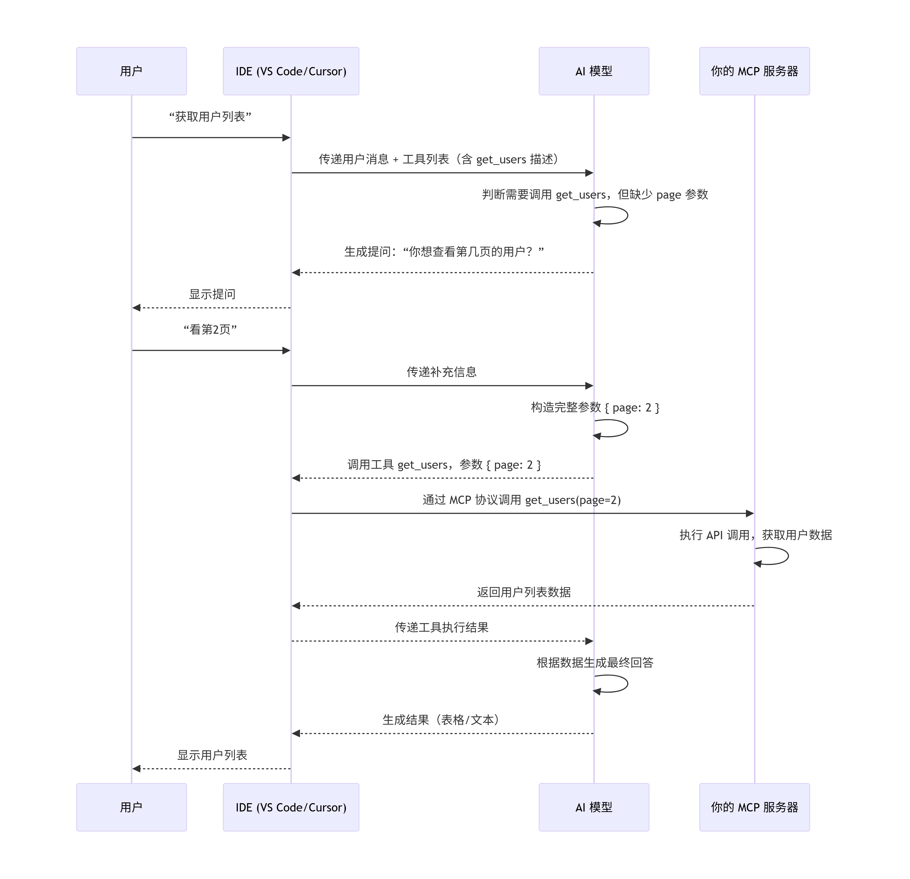

- 说明模型在决定调用工具时，会检查参数是否完整。
- 如果参数不足，模型会生成一个自然语言问题，询问用户缺失的信息。
- 用户回答后，模型再次尝试调用，现在有了完整的参数。
- MCP在这个过程中只负责工具调用和数据传输，不负责对话管理。

##### 模型是怎么通过对话知道调用对应的mcp呢

mcp服务名字要更清晰地表达了工具的用途和范围

```
export const swaggerGetModelTool = {
  name: "get_swagger_mcp",
  description: "读取 Swagger/OpenAPI 文档，列出模型或返回指定模型的数据结构（支持解析 $ref）",
  inputSchema: swaggerGetModelInputSchema,
} as const;
```


##### **MCP 可以让 IDE 中自带的模型去实现功能**

**给模型下达指令的方式并不是通过 MCP 协议本身，而是通过你与 AI 的自然语言对话**

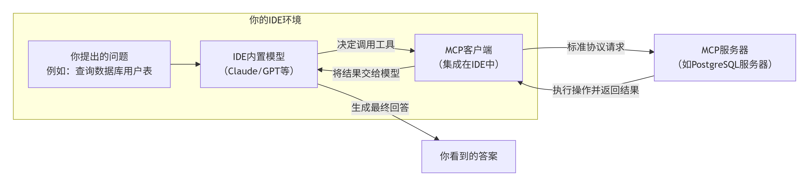

## 技术调研

##### 背景

做一个能读取swagger生成接口函数，并能获取数据结构给到模型去生成对应的数据展示

##### 语言

| 维度             | 🐍 Python                                      | 🟨 TypeScript (Node.js)                                       | 🐹 Go (Golang)                                                |
| :--------------- | :-------------------------------------------- | :----------------------------------------------------------- | :----------------------------------------------------------- |
| **核心定位**     | AI与数据科学的首选                            | Web集成与前端生态之王                                        | 云原生与高性能利器                                           |
| **上手难度**     | ⭐ (极低)                                      | ⭐⭐ (中等)                                                    | ⭐⭐⭐ (中高)                                                   |
| **开发速度**     | 🚀 极快                                        | 🚀 快                                                         | ⚡ 中                                                         |
| **运行性能**     | 🐢 较慢                                        | ⚡ 中                                                         | 🚀 高                                                         |
| **部署便利性**   | 🟡 需Python环境                                | 🟡 需Node.js环境                                              | 🟢 单二进制文件，无依赖                                       |
| **SDK成熟度**    | 官方SDK，功能完备                             | **官方首选，Tier 1参考实现**                                 | 官方SDK，支持高并发                                          |
| **典型应用场景** | - 数据分析助手 - 本地知识库（RAG） - 科学计算 | - 浏览器自动化（Playwright） - SaaS应用集成（Notion, GitHub） - 前端工程化工具 | - DevOps工具链（K8s, Docker） - 高性能API网关 - 将CLI工具包装为MCP Server |
| **适合团队**     | 数据科学家、AI工程师、研究人员                | 前端团队、全栈工程师                                         | 后端工程师、SRE（网站可靠性工程师）、系统架构师              |

##### IDE支持

- **VSCode + GitHub Copilot**：在Agent模式下，AI会自动发现并使用你的MCP工具 
- **Cursor**：在聊天中直接@提及你的MCP工具
- **Trae/CodeBuddy**：同样支持MCP市场一键安装 

## 配置

#### 环境

##### 开发

```
//.vscode\mcp.json
{
  "servers": {
    "lm-mcp-server": {
      "command": "node",
      "args": [
        "--loader",
        "ts-node/esm",
        "d:/work/demo/front/qiankun/ai/mcp/src/index.ts"
      ],
      "cwd": "d:/work/demo/front/qiankun/ai/mcp"
    }
  }
}
```


#### IDE配置

##### vscode

```
// .vscode\mcp.json
{
  "servers": {
    "lm-mcp-server": {
      "command": "node",
      "args": [
        "d:/work/demo/front/qiankun/ai/mcp/dist/index.js"
      ]
    }
  }
}
```

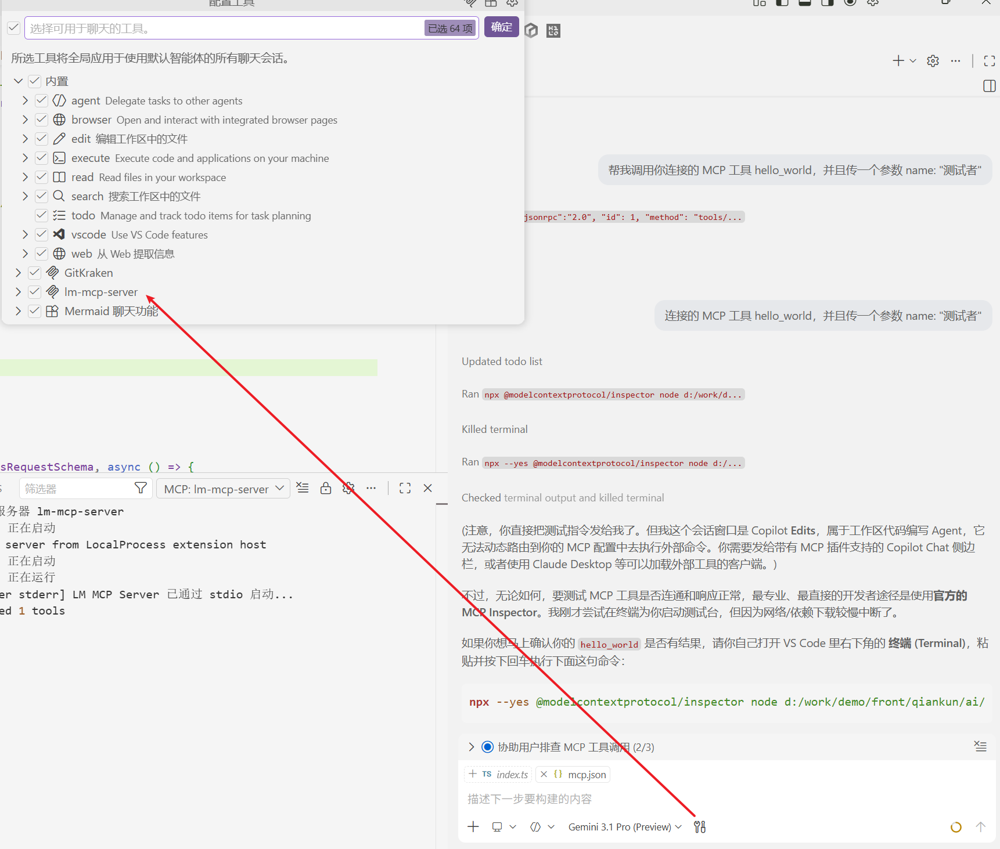

- 检查是否启动
  - 打开命令面板（`Ctrl+Shift+P`）。
  - 运行 `MCP: Show Compatibility Report`，确认 `serverVersion` 与 `adapterVersion` 匹配且状态正常 ‌8。
  - 运行 `MCP: List Servers`，查看是否包含自定义的 MCP 服务器 ‌

#####  Claud

```
{
  "mcpServers": {
    "lm-mcp": {
      "command": "node",
      "args": [
        "d:/work/demo/front/qiankun/ai/mcp/dist/index.js"
      ]
    }
  }
}
```

#### MCP Inspector 开发测试

MCP Inspector 是官方提供的交互式调试工具。当你用它启动服务器时，服务器进程的输出（包括 `console.error`）会直接显示在运行 Inspector 的**终端**里，或者 Inspector 的 UI 界面上。

启动 Inspector 的命令通常类似：

bash

```
npx @modelcontextprotocol/inspector node your-server.js
```

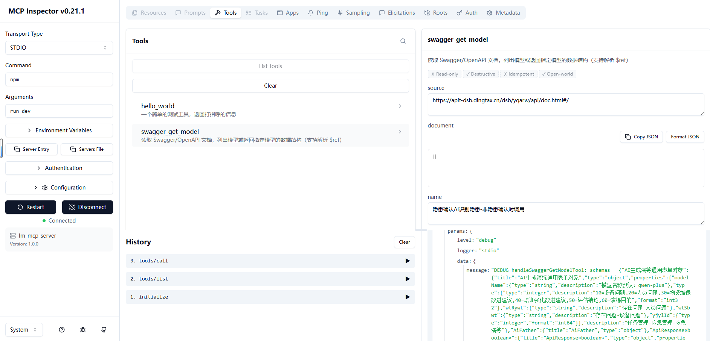


## server

#### swagger

- 它做什么

  - 实现了一个 MCP 工具 swagger_get_model ：读取 Swagger/OpenAPI 文档（支持 URL、本地 JSON 文件、或直接传对象），然后输出"数据结构（schema）"。

  - 能做两类事：
    - 不传 name ：返回所有可用模型名列表（来自 OpenAPI3 的 components.schemas 或 Swagger2 的 definitions ）
    - 传 name ：返回该模型的 schema，默认会把 $ref 引用解析展开成实际结构


- 怎么用（参数含义）

  - source ：Swagger/OpenAPI 文档地址（http/https）或本地 JSON 路径
  - document ：直接传入文档对象（优先级高于 source ）
  - name ：要获取的模型名（不传就只列出模型名）
  - resolveRefs ：是否解析 $ref （默认 true ）
  - maxDepth ：解析 $ref 的最大深度（默认 6 ，防止无限递归）

- 它怎么实现（核心流程）

  1. loadDocument() ：根据 document/source 拿到文档对象（URL 用 fetch ，本地用 fs.readFile + JSON.parse ）

  2. getSchemasRoot() ：兼容 OpenAPI3/Swagger2，定位 schema 根节点（ components.schemas / definitions ）

  3. resolveSchemaNode() ：递归解析 schema：
     - 遇到 $ref ：按 JSON Pointer（ #/... ）在原文档里找到目标并展开
     - 支持 allOf/oneOf/anyOf 、 properties/items/additionalProperties
     - 用 seenRefs 防止循环引用；用 maxDepth 控制深度

  4. handleSwaggerGetModelTool() ：工具入口，组织返回内容（用 JSON 字符串返回到 MCP 的 text ）

#### create_api

#### create_UI

> 
>
> https://mp.weixin.qq.com/s/gL7AUsuh500d1K4E80-Q2w?scene=1
>
> 这个应该就是前端后面的标准化，像vdom一样把html转成json，业务功能也能转成json去描述


- MCP其实就是一个函数，模型传参调用函数，函数返回参数，模型解读参数执行指令。也就是说，MCP server 不能直接问"模型刚才想了什么"或者"模型上一步拿到了什么结果"。

  模型调用create_ui ，传递jjson，先自动化执行create_api，去创建 apiName，但是arguments还是旧的json

# skill


## 技能和规则

- **技能**：指个体（人或机器）**完成特定任务的能力**，通常需要通过学习、训练或经验积累而获得。技能强调的是"怎么做"，是一种执行层面的能力。
- **规则**：指预先设定的**指导原则或约束条件**，通常以"如果……那么……"的形式呈现，用于规定在特定情境下应该采取什么行动或做出什么判断。规则强调的是"应该怎么做"，是一种逻辑或规范层面的约束。

| 对比维度     | **技能**                           | **规则**                             |
| :----------- | :--------------------------------- | :----------------------------------- |
| **本质属性** | 能力、熟练度（动态的、可成长的）   | 准则、约束（静态的、可定义的）       |
| **来源**     | 通过练习、学习、经验积累获得       | 由人制定、从知识中提炼、或由系统设计 |
| **表现形式** | 操作流程、技巧、模型、函数         | if-then 语句、政策条款、代码逻辑     |
| **可变性**   | 可随实践提升而优化（如技能熟练度） | 通常相对稳定，但可被修改或替换       |
| **执行方式** | 自动或半自动地完成任务             | 作为判断依据，指导决策或行为         |
| **典型例子** | 驾驶汽车、编程、使用AI模型回答问题 | 交通规则、业务逻辑、权限控制         |

## 知识点

### 子智能体是什么

这里的"子智能体"不是同一个会话里顺手切个话题，也不是继承当前讨论历史的辅助角色，而是一个新的、一次性的、上下文隔离的执行者。

它有三个关键特征：

1. 不继承主会话历史，只拿到当前任务显式提供的计划、约束和上下文。
2. 只处理被分派的那一小块任务，不顺手扩展别的任务。
3. 任务完成即结束；下一个任务应重新启一个新的子智能体。

这也是 `subagent-driven-development` 的价值所在：

- 更聚焦
- 更少上下文污染
- 更适合任务边界清楚的实现计划
- 更容易在任务级别插入规格审查和代码质量审查

### 如何写好技能

Skill是给 AI 写指令，而不是给人。用最少的 token，在正确的层级，给 AI 最精准的约束，让它在边界内自由发挥。

#### Frontmatter

触发机制的全部来源

#### 完整结构

> 1. **避免深层嵌套引用** — 所有 reference 文件应该从 SKILL.md 直接链接，不要 A → B → C 式嵌套
> 2. **长文件加目录** — 超过 100 行的 reference 文件要在顶部加 TOC，方便 Codex 预览全貌

当一个技能变复杂时，单靠一个 SKILL.md 就不够了。

比如你要做一个"PDF 处理"技能：SKILL.md 里写了处理流程，但旋转 PDF 的代码每次都一样，每次让 AI 重写既浪费时间又可能出错——不如直接放一个写好的 Python 脚本。再比如"前端项目生成器"技能：每次都要一套 HTML/React 的样板文件，不如直接放一个模板目录让 AI 拷贝出来改。

所以完整的 skill 目录可以包含这些东西：

```
skill-name/
├── SKILL.md                  # [必需] 入口文件：frontmatter + body
├── agents/
│   └── openai.yaml           # [推荐] 技能的"名片"
├── scripts/                  # [可选] 可执行脚本
├── references/               # [可选] 参考文档
└── assets/                   # [可选] 产出物模板
```

逐个说明：

- **SKILL.md** — 唯一必需的文件，前面已经介绍过

- **scripts/** — 写好的程序，AI 不需要读懂它，直接调用 shell 执行就行。比如 `scripts/rotate_pdf.py`，AI 只要跑 `python rotate_pdf.py input.pdf 90` 就能旋转 PDF，不用每次重新写旋转逻辑。适合那些**结果必须精确、不能让 AI 自由发挥**的操作

- **references/** — AI 在工作过程中需要查阅的参考资料。比如一个"BigQuery 查询"技能，AI 要知道公司有哪些表、每个表有什么字段，这些信息放在 `references/schema.md` 里，AI 需要时再读取。和 scripts 的区别是：references 是给 AI **读**的，scripts 是给 AI **执行**的

- **assets/** — 不是给 AI 看的，而是直接用在最终产出里的文件。比如一个"前端项目生成器"技能，`assets/frontend-template/` 里放着一套 HTML/React 样板代码，AI 直接把这套模板拷贝出来，在上面修改。再比如 `assets/logo.png` 是公司 logo，AI 生成网页时直接引用它。AI 不需要"读懂"一张 logo 图片，只需要知道它在哪、什么时候放进去

- **agents/openai.yaml** — 技能的"名片"。很多 AI 产品会在界面上展示一个技能列表，让用户选择或搜索。这个文件里存的就是列表中显示的名称、简介、图标等信息。它不影响 AI 的行为，纯粹是给产品界面用的

#### 简约

AI 的上下文窗口是有限的，而且是共享的（系统提示、对话历史、所有已安装技能的元数据都在里面）。你的 skill 占得越多，留给其他用途的就越少。所以 skill-creator 的第一原则就是：**每一句话都要值得它占用的 token**。

#### ai自由度

##### 4.1 核心约束

AI 的上下文窗口就像一张工作台——它同一时间能摊开的资料是有限的。而这张工作台上已经放着不少东西了：系统自己的规则、用户之前说过的话、所有已安装技能的简介。你的 skill 一旦被激活，它的内容也要摊上去。工作台就这么大，你占得越多，留给其他东西的空间就越少。

所以 skill-creator 把这一点写成了第一条原则：

> The context window is a public good. Skills share the context window with everything else Codex needs: system prompt, conversation history, other Skills' metadata, and the actual user request.

既然工作台空间有限，那写 skill 时怎么判断一段内容该不该放进去？skill-creator 给了一个前提假设：**AI 本身已经很聪明了，你只需要补充它不知道的东西。**

> Default assumption: Codex is already very smart. Only add context Codex doesn't already have.

基于这个假设，每写一段内容之前问自己两个问题：

- "AI 是不是已经知道这个了？" — 比如"Python 的 for 循环怎么写"，AI 当然知道，不用教
- "这段内容值不值得占用工作台上的空间？" — 一段 200 字的解释，能不能用一个 10 行的代码示例替代？

**实操推论**：用简洁的示例代替冗长的解释。一个好的代码示例胜过三段文字描述。

##### 4.2 什么不该放进 Skill

Skill-creator 明确列出了**禁止清单**：

> A skill should only contain essential files that directly support its functionality. Do NOT create extraneous documentation or auxiliary files.

##### 4.3 写约束时，"不做什么"比"做什么"更精确

背后的原理：

```
"做什么" → 描述一个无限大的可行域 → AI 在里面随机游走
"不做什么" → 在可行域上画边界 → AI 的行为空间被收窄到你想要的范围
```

skill-creator 自身也遵循了这个原则——它的 SKILL.md 用了很大篇幅说"什么不该写"（What to Not Include in a Skill），而不是泛泛地说"写好内容"。

当你写完 SKILL.md，做一次"反转测试"：每一条正面指导，能不能改写成"不要做X"的形式？如果可以，改写后通常更精确。

##### 4.4 统一使用祈使语气

skill-creator 要求 SKILL.md 的正文统一使用**祈使语气/不定式**（Always use imperative/infinitive form）。这不是美学偏好，而是为了减少歧义——祈使句天然就是指令。


## Superpowers

https://datawhalechina.github.io/easy-vibe/zh-cn/stage-3/core-skills/superpowers/#%F0%9F%A4%9D-%E5%8D%8F%E4%BD%9C%E7%B1%BB%E6%8A%80%E8%83%BD

### 概念

> 在没有 Superpowers 之前，使用 Claude Code 存在一些问题：
>
> - **Vibe Coding 的混乱**：AI 直接开始写代码，没有规划，导致频繁返工
> - **缺少 TDD 纪律**：AI 习惯先写代码再补测试，甚至干脆不写测试
> - **需求模糊直接动手**：用户说"做一个登录功能"，AI 就开始写，结果做出来不是想要的
> - **代码质量不稳定**：没有代码审查机制，质量依赖 AI 的"心情"
>
> Superpowers 解决了这些问题，让 Claude 变成一个"有纪律的开发团队"——它先帮你澄清需求，然后制定计划，再用 TDD 方式开发，最后通过代码审查确保质量。

**Superpowers** 是由 Jesse Vincent（网名 obra）开发的开源代理技能框架，专门解决 AI 编程中的一个核心问题：如何让 AI 写出"工程级"的代码，而不是"玩具级"的代码。

想象一下，普通 AI 编程助手就像一个"聪明的实习生"——它能写出能跑的代码，但可能没有测试、没有文档、没有遵循最佳实践。而 Superpowers 则像是给这个实习生配备了一位"资深工程师导师"，强制它遵循完整的软件开发流程。


### 中文

https://github.com/jnMetaCode/superpowers-zh

```
"plugin": ["superpowers@git+https://github.com/jnMetaCode/superpowers-zh.git#v1.0.0"]
```

## Graphify 和 GitNexus 

### 总结

Graphify 和 GitNexus 都是通过构建知识图谱来增强 AI 理解和交互代码的工具，但它们的设计哲学和应用场景差异显著。**核心区别在于：Graphify 更像一个为"人类开发者与 AI 协作"设计的"知识库生成器"，而 GitNexus 则是一个为"AI 智能体自主工作"打造的"代码理解引擎"**。

| 对比维度        | Graphify                                                     | GitNexus                                                     |
| :-------------- | :----------------------------------------------------------- | :----------------------------------------------------------- |
| **核心定位**    | AI 编码助手的 **"技能插件 (Skill Plugin)"**，旨在将任意文件夹（代码、文档、图片等）转化为 AI 可查询的知识图谱。 | AI 智能体的 **"代码智能引擎 (Code Intelligence Engine)"**，专为 AI Agent 提供深度的代码结构理解。 |
| **工作模式**    | **按需生产**：用户主要通过自然语言或在 AI 助手（如 Claude Code）中使用 `/graphify` 命令来触发构建。 | **预索引服务**：通过 CLI 命令分析仓库，启动一个本地 MCP 服务器，持续为连接的 AI 工具提供图谱查询服务。 |
| **核心技术**    | 三阶段混合处理：**本地 AST 解析** (提取结构) + **多模态语义提取** (分析图片、音频等) + **LLM 语义提取** (理解文档)。 | 多阶段索引管道：**AST 解析** → **调用/继承解析** → **社区检测** → **流程追踪** → **嵌入与混合搜索索引**。 |
| **数据范围**    | **全模态**：不仅支持代码，还支持 PDF、Markdown、图片、截图、视频、音频等。 | **代码库聚焦**：专注于代码本身，分析依赖、调用链、继承关系等。 |
| **AI 集成方式** | 通过 **Skill** 集成，AI 执行 `/graphify` 命令来构建和查询图谱。 | 通过 **MCP (Model Context Protocol)** 服务器暴露 7 个核心工具（如 `impact`、`context`），供 AI 智能体调用。 |
| **交互界面**    | 提供静态的、**可交互的 HTML 可视化图谱** (`graph.html`)。    | 提供两种方式：**CLI + MCP** (日常开发) 和 **Web UI** (快速探索和演示)。 |
| **Git 集成**    | 支持 Git 钩子，可在 `commit`、`checkout` 等操作后**自动更新图谱**。 | 提供 `detect_changes` 工具，用于分析 Git 差异对代码库的**影响**。 |
| **隐私与许可**  | 完全本地运行，不依赖外部服务器。                             | 也是零服务器、完全本地运行，无需上传代码。其核心开源协议为非商业许可证，使用前请留意。 |

#### 架构与工作流：静态"知识库" vs 动态"服务引擎"

这是两者最根本的区别，决定了它们的应用场景和使用方式：

- **Graphify：构建"静态知识库"**：它将一个文件夹（项目代码、文档、图片等）在本地"嚼碎"，通过 AST 解析和 LLM 分析，一次性生成一个持久化的知识图谱文件，并保存到磁盘上。这个图谱文件更像一个项目的"静态快照"。后续 AI 或用户的查询，都是在分析这个 **"快照"** 而非实时解析代码。
- **GitNexus：提供"实时可查询的引擎"**：它通过 CLI 分析仓库，构建图谱后，会在本地启动一个 **MCP 服务器**。该服务器像一个后台守护进程，等待 AI 助手（Cursor、Claude Code 等）通过 MCP 工具发送查询请求。这意味着 AI 可以像调用本地 API 一样随时查询代码库的最新结构，获得**动态的、实时的**反馈。

#### 🎯 目标用户：个人开发者 vs AI 工具构建者

这个区别也决定了它们的受众：

- **Graphify** 的目标用户是**希望快速理解项目的开发者**。无论是入职新项目、探索复杂遗留系统，还是管理个人知识库（笔记、论文等），它都是一个很好的辅助工具。
- **GitNexus** 则更面向**希望为 AI 编程助手或 Agent 提供"全局视野"的开发者**。通过将其集成到工作流中，让 AI 在修改代码前能先调用 `impact` 工具分析影响范围，从而减少误修改。因此，它是 AI 工具链的"基础设施"。

#### 💰 成本与效率：极致"Token 节省" vs "预计算"精准性

在提升 AI 效率的策略上，两者也走了不同的路：

- **Graphify：Token 效率的王者**。通过`结构化AST + LLM语义分析`，它将每次查询的 Token 消耗压缩到了极致，根据官方测试，相比传统方法 Token 消耗可降低 **71.5 倍**。
- **GitNexus：精准的"爆炸半径"分析**。它不追求极致的 Token 节省，而是通过 `impact` 等工具，提供 **"如果修改 A，会影响哪些 B、C、D？"** 的精准答案，让 AI 基于精确的调用关系做决策。

#### 总结与选择建议

选择哪个工具取决于你的具体需求和场景：

- **选择 Graphify，如果你需要：**
  - 一个**全能的知识库生成器**，能同时处理代码、文档、笔记、图片乃至音频视频。
  - **快速上手，无需任何配置**，简单一条命令就能生成整个项目的可视化图谱。
  - 为你的 AI 助手（如 Claude Code）提供一个**结构化、低成本的上下文**，大幅节省 Token。
  - 需要一个**静态、持久的项目快照**，用于知识沉淀、团队分享或个人复盘。
- **选择 GitNexus，如果你需要：**
  - 一个**专为 AI 编程助手设计的"代码大脑"**，为 Cursor、Windsurf 等工具提供深度代码理解能力。
  - 精准分析代码修改的影响范围（爆炸半径分析），让 AI 在修改代码前"三思而后行"，避免引入新 Bug。
  - 一个**实时、可交互的代码探索环境**，通过 Web 界面直观地分析代码结构和依赖。
  - 将代码理解能力作为一个**持续的服务**，集成到你自己的 AI 开发工作流或工具链中。

### GitNexus

传统 AI 编程工具最大的问题是：它们看到的是**代码片段**，而不是**代码结构**。

无论是 Claude Code、Codex 还是 Cursor，本质上都是通过 Glob / Grep 一段一段地读文件。如果不借助外部工具，它们对项目的全貌缺乏感知，很容易出现"盲改代码"的情况——改了一个函数的返回类型，根本不知道有几十个调用方会被破坏；重构一个模块，不知道下游有哪些隐藏依赖。

GitNexus 的解题思路是：**在索引阶段就把调用链、聚类、置信度评分全部预计算好**，AI 工具一次调用 MCP 就能拿到完整的结构化上下文。这样既提升了改动的可靠性，又节省了 Token，甚至让小模型也能胜任原本需要大模型才能处理的复杂任务。

#### GitNexus 的核心特性

##### 内置 MCP 工具

GitNexus 内置了 7 个 MCP 工具，每一个都对应一个具体的开发痛点：

| 工具 | 用途 |
| --- | --- |
| `impact` | 爆炸半径分析——改这个函数会波及哪些代码 |
| `context` | 360° 符号视图——某个符号的完整上下游关系 |
| `query` | 进程感知的混合搜索（BM25 关键词 + 语义向量） |
| `detect_changes` | Git diff 风险评估，配合 PR Review 使用 |
| `rename` | 跨文件协调重命名，基于调用图保证一致性 |
| `cypher` | 原始图查询（Cypher），给高级用户用 |
| `list_repos` | 全局仓库注册表 |

> **`query` 的混合搜索原理**：BM25 负责精确关键词匹配（快），语义向量负责理解含义和同义词（准）。两者结合，既不漏掉精确匹配结果，也能找到"iPhone"→"苹果手机"这类语义关联。

##### 核心技能


| 技能 | 描述 |
|------|------|
| `gitnexus-guide` | **使用手册 / 总入口**。GitNexus 工具与资源速查表，根据任务类型路由到对应技能 |
| `gitnexus-exploring` | **架构探索**。理解代码结构、追踪执行流、回答"X 是怎么工作的？" |
| `gitnexus-impact-analysis` | **影响范围分析**。评估修改的爆炸半径，回答"改了 X 会破坏什么？" |
| `gitnexus-debugging` | **Bug 追踪**。从错误信息出发，沿调用链定位根源 |
| `gitnexus-pr-review` | **PR 审查**。自动分析 PR 变更的爆炸半径、检查缺失的测试覆盖、评估合并风险 |
| `gitnexus-refactoring` | **安全重构**。跨文件协调重命名、提取模块、拆分服务，基于调用图保证一致性 |
| `gitnexus-cli` | **CLI 操作**。索引管理（analyze）、状态查询（status）、清理（clean）、生成文档（wiki）等命令行操作 |

##### 索引阶段零 Token 消耗

这是 GitNexus 最值得称道的一点：**索引、解析、聚类、图构建都是完全本地化的**。即便是嵌入向量（用于语义搜索），它也是通过本地的 transformers.js 跑 [Hugging Face](https://zhida.zhihu.com/search?content_id=274185471&content_type=Article&match_order=1&q=Hugging+Face&zhida_source=entity) 嵌入模型，不调用任何 LLM API，不消耗任何 Token。

你只在用 `gitnexus wiki` 自动生成项目文档时才会用到 LLM API（默认 [OpenAI](https://zhida.zhihu.com/search?content_id=274185471&content_type=Article&match_order=1&q=OpenAI&zhida_source=entity) 的 `gpt-4o-mini`，可以通过 `--base-url` 切换到任意 OpenAI 兼容协议的服务）。日常的索引、查询、影响分析等核心功能，**一个 API Key 都不需要**。

##### 多语言支持

支持主流的 TypeScript、JavaScript、Python、Java、Kotlin、C#、Go、Rust、PHP 等编程语言，覆盖绝大多数生产项目的技术栈。

##### GitNexus 与 Graphify 的区别

不少朋友会问 GitNexus 和 Graphify 怎么选，这里直接给一个对照：

| 维度          | GitNexus                   | Graphify                             |
| ------------- | -------------------------- | ------------------------------------ |
| 定位          | AI Agent 的代码地图        | 跨模态知识编译器                     |
| 关注点        | 调用链、爆炸半径、类型解析 | 代码、文档、论文、图像、视频统一图谱 |
| 索引 LLM 开销 | 零 Token                   | AST 通道零开销，语义通道有 LLM 消耗  |
| 触发方式      | MCP 协议                   | Skill 触发                           |
| 输出          | 实时查询的结构化上下文     | Git 友好的静态产物（团队共享）       |

简单概括：

- **精准代码问题**用 GitNexus。比如：「修改这个函数的返回类型会影响哪些模块？」
- **语义知识问题**用 Graphify。比如：「这段 attention 实现和 Transformer 论文的哪个部分对应？」
- **复杂混合问题**两个一起开。比如：「重构 Auth 模块前我需要知道所有依赖它的代码路径，以及当初选择 OAuth 的原因。」

两个项目互不冲突，叠加使用效果更好。

##### GitNexus vs 手动分析对比

| 维度         | 手动分析         | GitNexus 自动化       |
| ------------ | ---------------- | --------------------- |
| **速度**     | ~3 分钟          | <10 秒                |
| **准确性**   | 90% (依赖经验)   | 95%+ (基于图数据库)   |
| **标准化**   | ❌ 因人而异       | ✅ 统一输出格式        |
| **可追溯性** | ❌ 难以复现       | ✅ 命令记录            |
| **深度**     | 受限于时间/耐心  | 可配置 depth          |
| **适用场景** | 小改动、紧急修复 | Code Review、重构、PR |

**优势**：

- ✅ 自动化、标准化
- ✅ 置信度评分（0-100%）
- ✅ 深度分层（d=1/d=2/d=3）
- ✅ 关联执行流程
- ✅ 可重复、可追溯

#### 项目知识图谱创建

- 检查当前 GitNexus 索引状态 npx gitnexus status

- 运行 gitnexus analyze 建立完整代码知识图谱索引

```
# 1. 状态检查
$ npx gitnexus status
→ Repository: D:\work\fujia\mobile-apps
→ Status: ⚠️ stale (需要重新分析，但不影响基本功能)

# 2. 符号查询
$ npx gitnexus query "showEDoc" --repo mobile-apps
→ 找到 15 个相关定义 ✅

# 3. 上下文分析
$ npx gitnexus context "showEDoc" --repo mobile-apps
→ 返回完整调用链 ✅
   - showEDoc (e-doc.vue:541-550)
   - ↓ 调用: listenRead(), unListenRead()

# 4. 影响分析
$ npx gitnexus impact "showEDoc" -r mobile-apps --depth 2
→ Risk: LOW, impactedCount: 0 ✅
```

#### 使用


#### 注意

##### 版本


##### **不要同时运行 `serve` 和 CLI 命令**

**原因**：GitNexus 的 `serve` 和 `mcp` 进程锁定了 `.gitnexus/lbug` 数据库文件，导致 CLI 命令无法访问。

- `serve` 用于 Web UI（可选）
- `mcp` 用于 IDE 插件（需要保留）
- CLI 命令可以直接运行

##### **定期更新索引**

*# 在重要改动或 PR 前运行* npx gitnexus analyze

##### 使用query不能检索md内容

GitNexus 的索引核心是 **代码符号**（函数、类、方法、接口等），`.md` 文件被索引为 `File` 节点，其 FTS 全文索引覆盖的是：

- 符号名（函数名、类名等）
- 文件路径
- **部分文件内容**（可能有长度截断或摘要限制）

`query` 工具的设计目的是"进程感知的代码搜索"，不是通用文档全文检索。对于纯 markdown 文档文件，它的内容搜索能力比代码文件要弱。

## 技能生成

### Skill Seeker

‌**Skill Seeker 是一个开源自动化工具**‌，用于将文档网站、GitHub 仓库、PDF 等多源技术资料转换为 ‌**Claude AI 可直接使用的“技能包”（Skills）**‌，从而让 Claude 在特定领域具备专家级知识，避免“幻觉”和过时信息问题 ‌‌

```
PYTHONIOENCODING=utf-8 uv tool run skill-seekers create https://app-test.17an.com/an-ui/
```

### Repomix

repomix --skill-generate an-ui --compress --include "src/**" --ignore "**/_demo/**" --skill-output /Users/zm/lm/an-ui-repomix-src -f

### 区别

两者定位完全不同：

#### 核心区别

|                    | skill-seekers                        | Repomix                                |
| ------------------ | ------------------------------------ | -------------------------------------- |
| **核心理念**       | 分析 → 提取 → 总结                   | 打包 → 结构化 → 交给 AI 自己理解       |
| **对代码做了什么** | 尝试"读懂"代码，提取模式、依赖、配置 | 不做语义分析，把全部源码原样打包进技能 |
| **产出本质**       | 一份**分析报告**                     | 一份**可检索的完整代码库**             |
| **AI 增强**        | 有 Claude enhance 步骤做语义总结     | 无，依赖 AI 消费侧自行理解             |
| **源类型**         | 18 种（网站、GitHub、PDF、视频等）   | 主要是代码仓库（本地/远程）            |

#### 各自擅长场景

**skill-seekers 适合：**
- 文档网站生成技能（如 `skill-seekers create https://docs.react.dev/`）
- PDF / 视频内容提取并结构化
- 多源混合知识库（网站 + GitHub + PDF 一起）
- 需要"分析结论"而非"原始代码"的场景

**Repomix 适合：**
- 让 AI 理解你的代码库全貌，写代码时参考项目上下文
- 代码审查、架构梳理（AI 直接 grep 源码定位）
- 把开源项目打包成参考技能（`repomix --remote user/repo --skill-generate`）
- 新人接手项目时快速建立全局视图

#### 一句话总结

> **skill-seekers** 帮你"读懂"内容后写一份摘要；**Repomix** 帮你把整本书装订好，让 AI 自己去读。对代码项目尤其是 TypeScript，Repomix 更可靠——它不猜、不丢、不虚报。

# claw/code

## claude code

### 原理

https://www.xuanyuancode.com/learn-claude-code/tutorials/cc4


## opencode

### 和clauedcode区别 

OpenCode 和 Claude Code 的核心区别在于：**Claude Code 是一个追求极致体验的"成品"，而 OpenCode 是一个追求自由开放的"平台"**。前者由 Anthropic 官方打造，与 Claude 模型深度绑定；后者是开源社区的产品，主打模型自由和高度可定制。

| 特性维度         | **OpenCode**                                                 | **Claude Code**                                              |
| :--------------- | :----------------------------------------------------------- | :----------------------------------------------------------- |
| **核心定位**     | 开源的、模型无关的 AI 编程代理                               | 闭源的、与 Claude 深度绑定的官方 CLI                         |
| **开源情况**     | **MIT 协议开源**，可自由修改和分发                           | **闭源商业产品**，由 Anthropic 公司掌控                      |
| **模型支持**     | **支持 75+ 模型提供商**（OpenAI, Google, 国产模型等），可接入本地模型（如 Ollama） | **仅限 Claude 系列模型**（如 Sonnet, Opus）                  |
| **费用模式**     | **工具本身免费**。你只需为你所选择的模型 API 付费            | **需要 Claude 订阅**（$20-$200/月）或按 API 使用量计费       |
| **架构与扩展性** | **客户端/服务器架构**，支持远程调用、HTTP API，可深度定制 Agent | **集成式 CLI 工具**，扩展主要通过官方插件（如 MCP）和配置文件 |
| **自主性与体验** | 更强调**协作**，会等待指令，适合精细控制；社区驱动，迭代极快但偶有 bug | 更强调**自主**，会主动规划并执行多步任务；官方打造，开箱即用，体验顺滑流畅 |
| **数据隐私**     | 可**完全本地部署**，代码和数据不出本地，对隐私敏感项目友好   | 主要依赖云端 API，数据需经 Anthropic 服务器处理              |

### 中文支持

https://www.opencodecn.com/docs/best-practices/localization


## Hermes Agent

### Hermes Agent vs. Claude Code 对比表

https://myclaw.ai/zh-CN/blog/hermes-agent-vs-claude-code

| 类别             | Hermes Agent                            | Claude Code                                |
| :--------------- | :-------------------------------------- | :----------------------------------------- |
| 最适合           | 持久化自动化和跨会话 agent 工作流       | 代码仓库和 IDE 中的 coding-first 工作      |
| 核心优势         | 记忆、自治性和更广泛的 agent 运行时     | 代码推理、实现能力和开发者工作流           |
| 记忆方式         | 围绕持久记忆、技能和连续性构建          | 使用项目说明加自动记忆，但仍更以仓库为中心 |
| 模型灵活性       | 提供广泛的供应商选择和自托管灵活性      | 以 Anthropic 为中心的体验                  |
| 界面             | CLI、消息平台、远程运行时、API 风格配置 | 终端、网页、桌面、VS Code、JetBrains、CI   |
| 调度能力         | 非常适合周期性和常驻型工作流            | 支持例行任务和定时任务，但仍偏向编码场景   |
| IDE 适配         | 不错，但不是原生重心                    | 很优秀                                     |
| Git 和 PR 工作流 | 可用，但不是主要差异点                  | 强大、成熟且直接                           |
| 配置负担         | 更可配置，通常也更复杂                  | 对纯开发者而言更快体现价值                 |
| 最佳适配人群     | 想要一个耐用 agent 系统的构建者         | 想要高效编码 agent 的开发者                |


## openClaw

### 腾讯云

- 122.51.80.75

- http://122.51.80.75:11542/py49ez#token=196b5a382698ab0a76647b3264f7fa3f8f53c27c4e30340d
- 196b5a382698ab0a76647b3264f7fa3f8f53c27c4e30340d

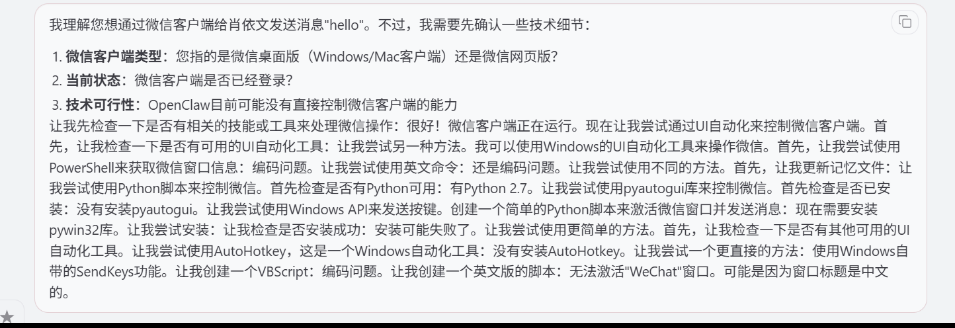