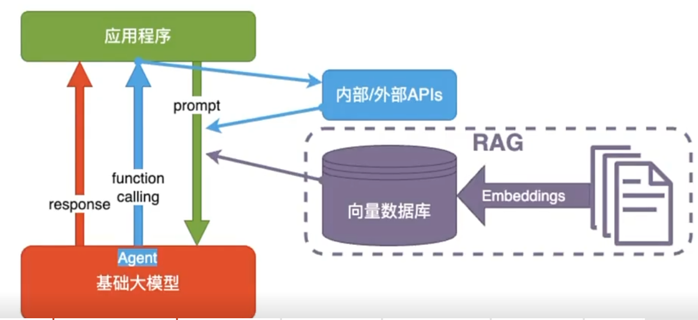

前端转 Agent 开发学习计划（综合版）

> 适用人群：有 1 年以上前端开发经验，希望转型 AI Agent 开发工程师的同学。
> 核心差异化：**从第一天就用可视化 UI 承载 Agent 完整链路**，让 Agent 行为透明、可调试、可演示。

# 目标

| 周次      | 目标                                          | 核心内容                                                     | 推荐资源                                                     |
| :-------- | :-------------------------------------------- | :----------------------------------------------------------- | :----------------------------------------------------------- |
| 第 1 周   | 建立正确认知                                  | Agent 三要素（思考 + 工具 + 记忆）；CoT/ReAct 基础推理范式；Token、流式输出、结构化 Prompt 规范 | Andrew Ng《AI Agent》公开课 / 李宏毅《Agent 发展脉络》       |
| 第 2 周   | 跑通带可视化 UI 的最简 Agent（前端特色 Demo） | LangChain JS / Vercel AI SDK Hello World；Next.js 流式对话；前端渲染 Agent 思考、工具调用状态 | Vercel AI SDK 官方文档、LangChain JS 中文教程 + B 站 "肖立新"AI Agent 系列 |
| 第 3-4 周 | 掌握双栈主流 Agent 框架（Python+JS）          | Python：LangGraph、CrewAI；JS：LangChain JS、Vercel AI SDK；记忆、工具、基础 RAG 集成 | LangGraph 官方文档、CrewAI 中文文档                          |
| 第 5-6 周 | 做出能用的 Agent                              | 自动周报/竞品搜集/简历助手                                   | 选 1-2 个真实需求改造                                        |
| 第 7 周+  | 进阶自由探索：复杂推理 + 多智能体 + 工程部署  | Plan-and-Execute 任务规划、多智能体协作；AutoGen、MetaGPT；Docker 打包、云端部署、密钥安全、日志监控 | AutoGen、MetaGPT 等                                          |


# 概念

## 训练

1.大模型阅读了人类说过的所有的话。这就是「机器学习」
2.训练过程会把不同token同时出现的概率存入「神经网络」文件。保存的数据就是「参数」，也叫「权重」

## 推理

1.我们给推理程序若干token，程序会加载大模型权重，算出概率最高的下一个token是什么2.用生成的token，再加上上文，就能继续生成下一个token。以此类推，生成更多文字


# 入门

https://www.modb.pro/db/1881156671699955712

## 标量，向量，矩阵，张量

## 机器学习

- 是人工智能的一个分支，指通过算法和统计模型从数据中自动**学习规律**，并利用这些规律进行预测或决策。
- 核心思想：从数据中提取特征并建立模型。

### 深度学习

- 是机器学习的一个子领域，基于人工神经网络（ANN）的结构和算法。
- 核心思想：通过多层神经网络（通常称为"深度"网络）自动学习数据的高层次特征。

### 总结

| 特性           | 机器学习                         | 深度学习                           |
| :------------- | :------------------------------- | :--------------------------------- |
| **特征工程**   | 需要手动设计和提取特征           | 自动从数据中学习特征               |
| **模型复杂度** | 模型较简单（如线性回归、SVM 等） | 模型复杂（多层神经网络）           |
| **数据需求**   | 数据量较小也能有效工作           | 需要大量数据才能发挥优势           |
| **计算资源**   | 对计算资源要求较低               | 对计算资源要求较高（GPU 加速）     |
| **应用场景**   | 结构化数据（如表格数据）         | 非结构化数据（如图像、语音、文本） |

## 自然语言处理（NLP）

‌自然语言处理（NLP）是人工智能领域的重要分支‌，旨在使计算机能够理解、解释和生成人类语言，实现人机之间的自然交互。其核心任务包括语言翻译、情感分析、文本生成等，广泛应用于机器翻译、问答系统、聊天机器人等领域

##  LLM

**LLM (Large Language Model)**大语言模型是一类基于深度学习的人工智能模型，旨在处理和生成自然语言文本。通过训练于大规模文本数据，使得大语言模型能够理解并生成与人类语言相似的文本，执行各类自然语言处理任务。 

### LLM的训练及使用

  LLM能够理解并生成与人类语言相似的文本，执行各类自然语言处理任务，具体可应用场景包括而不限于文本生成、机器翻译、摘要生成、对话系统、情感分析等。其具有强大的泛化能力、能够处理多种任务。

### LLM的训练

LLM的训练过程分为预训练和微调两个阶段。

- 预训练阶段

  模型在大规模未标注文本数据上进行自监督学习，学习通用的语言表示。

- 微调阶段

  模型在特定任务的标注数据上进行有监督学习，调整模型参数以适应具体任务需求。

### LLM的使用

  一方面，对于直观的日常使用，用户输入问题（提示词，Prompt），大模型给出该问题的回答。

  另一方面，对于基于LLM的AI应用编程，可通过以指定格式调用LLM的API，获取问题的答案。

### 基于LLM的Agent框架

- LLM：对标人类大脑，思考如何解决问题、给出怎样的回答。

- 记忆：长期记忆加短期记忆。即智能体使用的历史记录、系统数据，以及智能体执行过程中产生的各种中建信息。

- 规划技能：提示词编排、意图理解、任务分解、自我反思。

- 工具使用：智能体在执行任务中可能会使用到的各种工具接口。

### **Transformer架构**


## Token

> **通常情况下，中文比英文更节省token。**

Token是指在自然语言处理（NLP）模型中，输入文本被分割成的最小单位（通常是单词、子词或字符），这些单位被称为 **Token**。

1个英文字符≈0.3个token。1个中文字符≈0.6个token。

### 原理


- 在大语言模型（如 GPT 系列、BERT 等）中，输入文本会被分词器（Tokenizer）拆分为 Token 序列。
- 分词器会根据预定义的词汇表（Vocabulary）将文本映射为对应的 Token ID，这些 ID 是模型可以理解的数字表示。

假设我们有以下文本：

```
Hello, how are you doing today?
```

**分词过程**

1. 使用分词器将文本拆分为 Token：

   ```
   ["Hello", ",", "how", "are", "you", "doing", "today", "?"]
   ```

2. 将每个 Token 映射为 Vocabulary 中的唯一 ID：

   ```
   [123, 456, 789, 1011, 1213, 1415, 1617, 1819]
   ```

**输入到模型**

- 模型接收到的是 Token ID 序列 `[123, 456, 789, 1011, 1213, 1415, 1617, 1819]`。
- 模型通过分析这些 Token 的关系和上下文生成输出。

### 作用

- **表示输入信息**：上下文 Token 是模型接收输入的主要形式。模型通过分析这些 Token 的序列来理解输入内容。
- **控制上下文长度**：模型对上下文 Token 的数量有限制（例如 GPT-3 的最大上下文长度为 2048 Token，GPT-4 支持更长的上下文，如 32K Token）。
- **生成输出**：模型基于输入的上下文 Token 生成新的 Token 序列作为输出。

### context

**大模型每次处理任务时所接收到的信息总和**


> 虽然现代模型支持 128K 甚至 192K 的上下文长度，但在编码场景下，这些上下文往往仍然不足。像Claude Code这类的工具，在上下文做了很多优化（后续会分享一些），但是上下文越长，**AI 生成代码出现幻觉的概率就越高**，后续修正过程会消耗更多资源。

- **影响模型性能**：**上下文 Token 的数量决定了模型能够"记住"多少信息。**更多的 Token 意味着模型可以利用更丰富的上下文进行推理。
- **成本因素**：上下文 Token 越多，计算资源需求越高，使用成本也越高。
- **应用场景**：对于需要处理长文档的任务（如法律文件分析、科学论文总结），支持更多上下文 Token 的模型更具优势。

### context window

大模型的Context最多能够存储的Token量

## RAG

### 背景 

**context 过多**

- 模型无法读取所有内容
- 模型推理成本高
- 模型推理慢
- **会导致LLM产生幻觉**

### 知识

#### RAG的原理

- 检索（Retrieval）：当用户提出问题时，系统会从外部的知识库中检索出与用户输入相关的内容。
  - 检索（Retrieval）的详细过程：
    - 准备外部知识库：外部知识库可能来自本地的文件、搜索引擎结果、API 等等。
    - 通过Embedding（嵌入）模型，对知识库文件进行解析：**Embedding的主要作用是将自然语言转化为机器可以理解的高维向量**，并且通过这一过程捕获到文本背后的语义信息（比如不同文本之间的相似度关系）；
    - 通过Embedding（嵌入）模型，对用户的提问进行处理：用户的输入同样会经过嵌入（Embedding）处理，生成一个高维向量。
    - 拿用户的提问去匹配本地知识库：使用这个用户输入生成的这个高纬向量，去查询知识库中相关的文档片段。在这个过程中，系统会**利用某些相似度度量（如余弦相似度）去判断相似度。**
  - 模型的分类：Chat模型、Embedding模型；
  - 简而言之：Embedding模型是用来对你上传的附件进行解析的；
- 增强（Augmentation）：系统将检索到的信息与用户的输入结合，扩展模型的上下文。然后再传给生成模型（也就是Deepseek）；
- 生成（Generation）：生成模型基于增强后的输入生成最终的回答。由于这一回答参考了外部知识库中的内容，因此更加准确可读。

#### 微调

微调技术和RAG技术：

- 微调：在已有的预训练模型基础上，再结合特定任务的数据集进一步对其进行训练，使得模型在这一领域中表现更好（考前复习）；

- RAG：在生成回答之前，通过信息检索从外部知识库中查找与问题相关的知识，增强生成过程中的信息来源，从而提升生成的质量和准确性（考试带小抄）。
- 共同点：都是为了赋予模型某个领域的特定知识，解决大模型的幻觉问题。

#### 向量

概念：有大小有方向的量
示例：[1.0，2.3，5.76，5.8，10.1，-3.6]

#### 向量相似度计算

- 余弦相似度，夹角越小相似度越高

  

- 欧氏距离：距离越小相似度越高

  

- 点积：通过代数（Ａ垂直Ｂ点到原点的距离＊Ｂ到原点的距离），不仅是方向还有长度

  

### 流程


#### 准备过程

##### 分片

- 字数
- 段落
- 章节
- 页码

##### 索引

- 通过 Embedding 将片段文本转换为向量

  含义相近的文本在进入Embedding 后，对应的向量是相近的

  

- 将片段文本和片段向量存入向量数据库中

  一般的向量数据库表格里面至少都会有原始文本和向量

  

  

#### 回答过程

##### 召回

根据相似度大小，取十份相似度最高的


##### 重排

从十份相似度最高的的向量中取３份


###### rank 模型

‌Rank 模型‌（排序模型）是信息检索、推荐系统和 RAG（检索增强生成）等 AI 应用中的关键组件，负责对初步检索或召回得到的候选结果进行‌精细化重排序‌，以提升最终输出的相关性与准确性。

##### 生成


## prompt

**prompt的质量直接关乎到AI交付结果的质量。这和我们平时工作时候和同事沟通的情况也是一样的，如果表达不清楚，对方也是不知道要做什么，那交付的产物也是五花八门的。**

### AI对话

> 我需要实现一个很大的功能，需要每一步我都需要验证ai实现的code怎么样，我需要怎么实现我的要求

- 将任务拆解，并丢给ai，让它分析我们任务拆解是否可行，以及如何去执行
- 挑选任务
  - eg:我们现在开始实现 **任务3：用户列表页面**
- AI生成代码
- 逻辑验证
- 提供反馈并要求修正
- AI 编写单元测试

## tool

模型是无法感知外界环境，工具就是为模型提供服务，本质就是函数


- 模型作用是，选择工具，归纳总结
- 平台就是，串联流程，**注意工具是平台去调用的，而不是模型调用，模型能做的仅仅是输出一段文本**

### 缺点

同一套工具，不同平台规范是不一样的


## MCP

> 为了解决tool的问题，引入了模型上下文协议（Model Context Protool）统一的工具接入标准

## agent


- 自主规划
- 自主调用工具

## skill

**skill是一套工作流说明，也是给模型的说明文档**

skill 适合这种场景：

1. 某类任务有固定流程
2. 需要带说明、模板、脚本或约束
3. 只在特定任务触发时加载，不是每次都常驻

# 技术栈和流程架构

## 全景图

```
┌─────────────────────────────────────────────────────┐
│                     前端层                           │
│  Next.js 14+  │  Vercel AI SDK  │  TypeScript       │
│  流式渲染 UI  │  Agent 可视化   │  管理后台          │
├─────────────────────────────────────────────────────┤
│                     API 层                           │
│  FastAPI（Python）  │  Next.js API Routes（JS）     │
├─────────────────────────────────────────────────────┤
│                    Agent 框架层                       │
│  LangChain  │  LangGraph  │  CrewAI  │  AutoGen     │
├─────────────────────────────────────────────────────┤
│                   基础设施层                          │
│  LLM API（OpenAI/DeepSeek/Claude）                  │
│  向量数据库（Pinecone/Milvus/Chroma）                │
│  工具 API（搜索/天气/Git/网页爬取）                   │
└─────────────────────────────────────────────────────┘
```

## 大模型应用技术架构



| 决策问题         | 是 → 结果                | 否 → 下一步      |
| :--------------- | :----------------------- | :--------------- |
| 是否要补充知识？ | RAG                      | 要对接其它系统？ |
| 要对接其它系统？ | Function Calling         | 值得尝试微调？   |
| 值得尝试微调？   | 用历史数据做 Fine-tuning | —                |

### 纯prompt

### function calling

**Function Calling** 是让 LLM 能够"调用外部函数"的机制：模型不直接执行代码，而是输出一个结构化的函数调用请求（函数名 + 参数 JSON），由你的程序实际执行，再把结果返回给模型。

---

#### 流程示意

```
用户: 北京今天几度？
  ↓
LLM: → { function: "getWeather", args: { city: "北京" } }   ← 模型决定调哪个函数
  ↓
你的代码: 调天气 API，拿到 26°C
  ↓
LLM: → "北京今天 26°C，晴转多云"                           ← 模型把结果转成人话
```

---

#### 跟普通 API 调用的区别

|                  | 普通代码调用              | Function Calling                     |
| ---------------- | ------------------------- | ------------------------------------ |
| **谁决定调什么** | 程序员写死 `if / switch`  | LLM 理解语义后自主选择               |
| **参数怎么填**   | 代码从用户输入里正则/解析 | LLM 从自然语言中提取并填 JSON        |
| **适用场景**     | 规则明确的固定流程        | 用户说话方式不固定、工具数量多的场景 |

---

#### 为什么是 Agent 的基础

Agent = LLM + 工具 + 决策循环。Function Calling 解决了核心一环：让模型在合适的时机、用合适的参数去调工具。Vercel AI SDK 里对应的就是 `tool()` + `maxSteps`，LangChain.js 里对应 `tool()` + Agent Executor。

一句话：**LLM 的手，你的工具箱**。

### rag

RAG (Retrieval-Augmented Generation)

- Embeddings:把文字转换为更易于相似度计算的编码。这种编码叫向量

- 向量数据库:把向量存起来，方便查找

- 向量搜索:根据输入向量，找到最相似的向量

### fine-tuning（微调）

# 跑通最简单的 Agent

## 背景

### 一、前端背景切入 Agent 的可行性

前端背景直接切入应用层 Agent（调 API、搭工具链、做交互）完全够用，Node.js 生态足以支撑。Python 可以边做边学，哪天需要做模型微调或深入框架源码时再补，上手很快。

### 二、方向与语言选型

| 方向                                      | 需要 Python？ | 说明                                                         |
| :---------------------------------------- | :------------ | :----------------------------------------------------------- |
| **Agent 应用开发**（调 API、搭 Workflow） | 不必          | 用 TypeScript/Node.js 即可，LangChain.js、Vercel AI SDK、Mastra 等生态已成熟 |
| **Agent 框架/底层开发**                   | 建议学        | LangChain、AutoGPT、CrewAI 等主流框架以 Python 为主，社区和教程也最丰富 |
| **模型微调 / 训练**                       | 必须          | PyTorch、Transformers、数据管线几乎全是 Python 生态          |
| **提示工程 / Agent 产品设计**             | 不必          | 核心是逻辑设计和评测思维，语言不限                           |

## 核心目标

复用前端技术栈，完成带可视化交互的对话 Agent，**区别于纯命令行 Python 脚本 Demo**。

| 方向                     | 说明                                                 |
| ------------------------ | ---------------------------------------------------- |
| **思考状态可视化**       | 展示模型思考 loading 动画 + 思考文本流式输出         |
| **工具调用可视化**       | 弹窗 / 卡片展示工具调用的参数和返回结果              |
| **消息样式区分**         | 用户消息、模型思考文本、工具返回数据三种独立 UI 样式 |
| **Token 流监控**（进阶） | 实时显示 Token 消耗和响应时间                        |

## 技术栈组合

`Next.js 14+` + `Vercel AI SDK` + `OpenAI/DeepSeek API` + TypeScript

## 分步落地流程

| 步骤 | 内容                                                         | 预估时间 |
| ---- | ------------------------------------------------------------ | -------- |
| 1    | 搭建 Next.js 项目，接入 Vercel AI SDK，实现流式打字对话 UI   | 1 天     |
| 2    | 接入工具调用：天气 API / 搜索 API，完成基础 Tool Use 逻辑    | 1.5 天   |
| 3    | 前端渲染 Agent 完整链路：思考 loading → 工具调用卡片 → 最终回复 | 1.5 天   |
| 4    | 区分三种 UI 样式：用户消息 / 模型思考文本 / 工具返回数据     | 1 天     |


# 做出能用的 Agent

### 实战项目一：AI 周报小助理（推荐首选）

| 维度     | 说明                                                         |
| -------- | ------------------------------------------------------------ |
| 难度     | ★★☆☆☆                                                        |
| 技术栈   | 后端：Python + CrewAI + FastAPI；前端：Next.js + Vercel AI SDK |
| 核心技能 | 工具调用、对话记忆、多步骤规划、输出纠错、向量存储、前后端联调 |

**项目目标**：自动拉取 Git 提交记录 + 手动录入本周工作 → Agent 整理标准化周报 → 支持复制 / 发送企业微信 / 邮件

**分步落地流程**：

1. Python 端使用 CrewAI 官方模板搭建「信息收集研究员 + 周报撰写写手」双角色智能体
2. 自定义工具函数：对接 GitLab/GitHub API 拉取个人提交记录
3. 定制提示词：适配公司周报固定模板，约束输出格式
4. 封装 FastAPI 接口，把 Agent 能力暴露给前端
5. Next.js 搭建管理页面：支持选择时间范围、查看 Git 记录预览、一键生成周报、历史周报存储查看

### 实战项目二：竞品信息搜集 Agent

| 维度     | 说明                                       |
| -------- | ------------------------------------------ |
| 难度     | ★★★☆☆                                      |
| 核心能力 | 网页爬取、信息结构化、对比分析、RAG 知识库 |

自动爬取竞品官网 / 资讯，整理竞品动态、价格、功能对比文档，支持定期自动更新。

### 实战项目三：简历优化助手

| 维度     | 说明                                        |
| -------- | ------------------------------------------- |
| 难度     | ★★☆☆☆                                       |
| 核心能力 | PDF 解析、Prompt 工程、多轮对话、结构化输出 |

上传简历 PDF，Agent 结合岗位 JD 优化简历、生成面试高频问答，支持多轮迭代修改。

### 备选方向：RAG 问答助手

- **目标**：跑通"文档解析 → 向量化 → 检索 → 生成"全链路
- **技术栈**：Next.js + LangChain + ChromaDB + Vercel AI SDK
- **产出**：支持多文档上传、带引用来源的垂直领域知识库问答系统

---

# 进阶自由探索

### 1. 推理范式深挖

- **ReAct**：Reasoning + Acting 交替循环，适合需要工具调用的任务
- **Plan-and-Execute**：先规划后执行，适合复杂多步骤任务
- **Self-Reflection**：自校验纠错机制，Agent 对输出进行自我审查和改进
- 理解不同范式的适用场景与局限，能根据任务特点选择最佳推理策略

### 2. 多智能体系统

- **AutoGen**：事件驱动的多角色协作框架，适合企业级应用
- **MetaGPT**：模拟软件公司的多角色分工（产品、架构师、开发、测试 Agent）
- **CrewAI**：角色抽象简洁，适合快速原型和业务对齐
- 实现多角色分工协作，理解 Agent 间通信协议与任务编排

### 3. 工程化落地能力

| 模块               | 内容                                                         |
| ------------------ | ------------------------------------------------------------ |
| **向量数据库进阶** | Pinecone / Milvus 云端向量库选型与接入；混合检索（Hybrid Search）、重排序（Rerank） |
| **RAG 优化**       | 文本分块策略（Chunking）、查询改写、上下文压缩、引用溯源     |
| **容器化部署**     | Docker 打包 Next.js + FastAPI；云服务器部署；环境变量密钥隔离 |
| **监控与优化**     | LangSmith / Arize Phoenix 链路追踪；Token 消耗统计；上下文截断优化；输出安全过滤 |
| **前端工程化**     | 用 Zustand/Redux 管理 Agent 上下文；用 CI/CD 经验部署 Agent 服务（前端工程师优势） |

### 4. 前沿探索方向

- **本地私有大模型 + Agent**：Ollama + LangChain，数据不出本地的安全方案
- **浏览器端离线 Agent**：WebLLM / Transformers.js，完全在浏览器运行的 Agent
- **AI 工具插件开发**：Chrome Extension + Agent，Figma 插件 + Agent
- **Copilot 模式**：在 IDE 中集成 Agent，实现代码补全、测试生成、文档自动化

---

## 阶段性自检清单

### 第 1 周完成标准

- [ ] 能用自己的话解释 Agent 三要素
- [ ] 能画出 ReAct 循环的流程图
- [ ] 理解 Token、Temperature、System Prompt 的作用
- [ ] 产出：Agent 概念笔记或脑图

### 第 2 周完成标准

- [ ] 对话页面能流式输出模型回复
- [ ] 至少接入 1 个外部工具并能正确调用
- [ ] 页面能区分展示思考过程、工具调用和最终回复
- [ ] 产出：可浏览器打开的对话网页 Demo

### 第 3-4 周完成标准

- [ ] 能用 LangGraph 实现一个包含条件分支的 Agent 工作流
- [ ] 能用 CrewAI 搭建至少 2 个角色的协作 Agent
- [ ] 理解 Memory 机制并能实现带记忆的多轮对话
- [ ] 产出：2 个框架 Demo 仓库（JS + Python 各一）

### 第 5-6 周完成标准

- [ ] 项目前后端完整打通，可本地运行演示
- [ ] Agent 输出质量稳定，错误情况有兜底处理
- [ ] 有基本的日志和错误追踪
- [ ] 产出：完整可演示的 Agent 项目

### 第 7 周+ 完成标准

- [ ] 理解并能实现至少 2 种推理范式
- [ ] 能独立选型框架并解释理由
- [ ] 项目具备基本的工程化能力（部署、监控、安全）
- [ ] 产出：进阶项目或技术文章

---

## 风险与应对

| 风险                     | 影响                  | 应对措施                                                   |
| ------------------------ | --------------------- | ---------------------------------------------------------- |
| LLM API 费用过高         | 无法大量调试          | 优先使用 DeepSeek 等性价比模型；本地调试用 Ollama 跑小模型 |
| 框架版本迭代快           | Demo 代码快速过时     | 锁定版本号；优先看官方文档而非第三方教程                   |
| 前端转 Python 的学习曲线 | 阶段三进度延迟        | 第 3 周先 JS 线建立信心，第 4 周再切入 Python              |
| 实战项目需求不明确       | 项目做一半失去方向    | 选择自己日常真正需要的场景（如周报自动化）                 |
| Token 上下文限制         | 长对话/大文档处理失败 | 学习上下文窗口管理、摘要压缩、分块处理策略                 |
| RAG 召回准确率低         | Agent 回答质量差      | 学习混合检索、Rerank、查询改写等优化技术                   |

---

## 给前端转 Agent 的 3 条核心建议

### 1. 把"可视化"作为核心竞争力

后端开发者往往忽略 UI，而你可以将 Agent 的"思考黑盒"变成可视化的白盒。将 Token 流、工具调用 JSON、报错重试过程通过精致的 React 组件展示出来，**这在面试和作品展示中极具杀伤力**。

### 2. 不要害怕 Python，但也不要抛弃 JS

前期全部用 JS（Vercel AI SDK）能让你快速获得成就感。但到了复杂的 RAG 和多 Agent 阶段，Python 生态（LangGraph / CrewAI）更成熟。**将 Python 视为"提供 AI 能力的后端 BFF 层"，用 FastAPI 暴露接口给 Next.js 调用即可**。

### 3. 用前端工程化思维做 AI

利用你擅长的组件化、状态管理（Zustand / Redux）来管理复杂的 Agent 上下文与消息历史；利用 Docker 和 CI/CD 经验来部署 Agent 服务，**这是传统算法工程师相对薄弱的环节**。

---

## 推荐资源汇总

| 类型   | 资源                           | 说明                               |
| ------ | ------------------------------ | ---------------------------------- |
| 公开课 | Andrew Ng《AI Agent》          | 概念入门首选                       |
| 公开课 | 李宏毅《Agent 发展脉络》       | 中文讲解，脉络清晰                 |
| 文档   | Vercel AI SDK 官方文档         | **前端 Agent 开发必读**            |
| 文档   | LangChain / LangGraph 官方文档 | Python 框架权威参考                |
| 文档   | CrewAI 中文文档                | 多 Agent 快速上手                  |
| 文档   | OpenAI 官方 Agent 文档         | 理解 Function Calling 最佳实践     |
| 视频   | B 站"肖立新" AI Agent 系列     | 中文实战教程                       |
| 框架   | AutoGen / MetaGPT              | 进阶多智能体                       |
| 工具   | Ollama + Open WebUI            | 本地模型调试环境                   |
| 工具   | LangSmith                      | Agent 链路追踪与调试               |
| 社区   | GitHub Agent 相关开源项目      | 研读 MetaGPT、ChatDev、Dify 等源码 |

---

*文档版本：v1.0（综合版）| 基于四份前端转 Agent 学习计划文档整合而成*
*（内容由AI生成，仅供参考）*