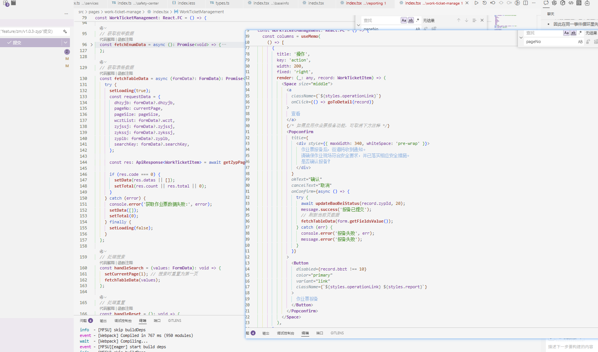
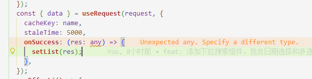
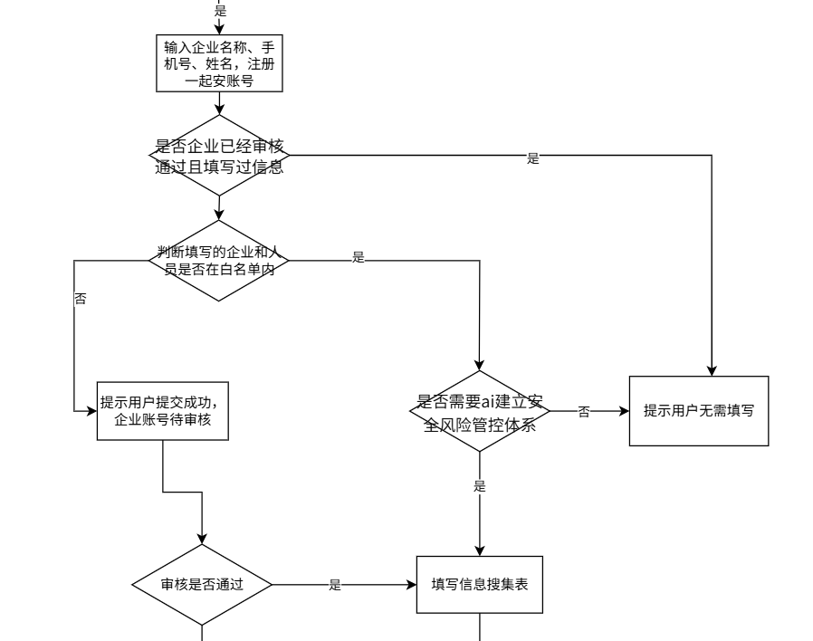

# 我的

arm

LiMing@ifugle.onaliyun.com

120329Tomorrow@liMing

120329698@TomorrowLi2

## 功能

- 版本上线更新提醒

## 难点

- ~~vant上传图片有拍摄功能和app有关，钉钉上的就不能拍照~~

- 精度问题tofixed

- 异步

  

- 采集

  - 引导页图片加载
    - 1倍图和2倍图的区别
    - 2倍图过大，导致加载慢。使用压缩
    - 图片加载顺序不一致，在img上加onload事件，只有加载成功再加载下一个
  - 环境
    - h5和微信小程序环境联动，上一步，下一步，成功提交跳转
  - 从子组件带过来的对象，导致响应式无法同步。因为直接将带过来的对象unshift给父组件的list，此时只是引用子组件的地址，所以导致响应失效的
  - :key报错，排除是有相同的项
  - 查看更多选中之后，切换选中项，从查看更多里的那一项没有响应。先用set，unshift，都无效。因为是直接从子组件中传过来的对象，使用的是子组件中定义的对象地址，所以这一项在当前父组件是没有响应的

- 安全区域

- 为什么弹框要放最外层

  - 使用portal，因为单纯position会受它的上级所有的overflow：hidden影响，而被隐藏

  - 使用portal，默认是注入在根app上的，滚动时候因为它是在外层，所以显示在外层。

    feat: eqa-select防止注入在根app上的，导致父容器滚动，下拉框在外部能看到

    

    

- 组件解耦

  - 企业，场所。提取两种展示的公共组件
  - 30多个类别，最多8个要素，使用动态组件

- 微信公众号，定位

  - 一直报签名问题

    - 查看接口定位到是给wx.config数据不对，数据层级问题

      ```
      {
       "appId": "wx8ff075269fccc068",
       "timeStamp": 1751686307,
       "nonceStr": "abcdefg",
       "signature": "e013209404f27477c3668a0212b60e03dfb3864b",
       "url": "https://app-test.dingtax.cn/dsb/eqa/?corpId=XNZZ-11489-70&env=dd/",
       "ticket": "52Tw1_qSfGvjmabRE6VHqRUUT3FXUVVzr4mDgfFMEpcbQjgObqYIxxVN-tKs7KqZksTujLnjOG_lvIQO8E8HxA"
      }
      ```

    - 检测签名是否正确

  - 定位问题可能是url的问题（验签只和当前页面有关），去微信开发社区看提问，可能是hash导致的

  - 最后定位使用whistle代理导致的

  

- 在constans.js中对常量进行修改，会导致切换状态或者切换账号时，常量任然会是修改后的值

- ES6 Module 导入的是值的 **引用**，在vue的script外层创建变量，会导致这个变量一直被缓存，切换账号也会存在

  

- 子组件监听props.value,问题原因和解决方案：

  1. 问题原因：

  - company-select 组件期望接收的 value 格式是 { qyList: [], czytList: [], xzfs: 10 }

  - 但在 daily-check-create.vue 中，params.jcqyList 被初始化为空对象 {}

  - 这导致 company-select 组件的 watch:value 无法正确处理数据

  1. 解决方案：

  - 修改了 params.jcqyList 的初始化格式，确保包含所有必要字段

  - 在清空和重置时也使用正确的数据结构

  - 在编辑模式下也确保使用正确的数据结构

- 复制ai生成数据

  

  

- 11

  

  

优化


- 闭包

  

  - 使用usememo，如果不设置currentPage，fetchTableData里面的currentPage是旧的值。
  
    
  
  - table配置，操作项使用动态接口函数配置，动态切换接口函数，接口函数还是之前的接口
  
  apiConfig 使用的是闭包中的旧值，而不是最新的状态值。这是因为 React 的闭包特性导致的
  
  ```
   const [apiConfig, setApiConfig] = React.useState(apis[activeTab.key]);
    const apiConfigRef = React.useRef(apis[activeTab.key]);
    
    // 同步更新 ref
    React.useEffect(() => {
      apiConfigRef.current = apiConfig;
    }, [apiConfig]);
  ```

  useRef 的特性：
  
  - useRef 返回一个可变的 ref 对象，其 .current 属性被初始化为传入的参数
  - ref 对象在组件的整个生命周期内保持不变
  - 修改 .current 属性不会触发组件重新渲染
  - 由于 ref 对象本身不变，所有引用它的地方都会访问到最新的 .current 值
  解决方案机制：
  
  1. 1.
     我们创建 apiConfigRef 来跟踪最新的 apiConfig
  2. 2.
     使用 useEffect 在 apiConfig 变化时同步更新 apiConfigRef.current
  3. 3.
     在 onConfirm 回调中使用 apiConfigRef.current 而不是 apiConfig
     这样无论何时调用 onConfirm ，它都能通过 apiConfigRef.current 访问到最新的 API 配置值，而不是创建回调时捕获的旧值。

- 自定义一个SelectBtnCom表单组件，form.resetFields导致表单组件被重新渲染

  https://github.com/react-component/field-form/issues/106

  reset 会重置整个 Field 以消除之前存在的任何副作用，受控组件数据管理应该是纯粹的。如果就是要 mount 就加载，可以用第三方库管理请求做 cachable。比如 [swr](https://github.com/zeit/swr)

  ahooks useRequest能实现swr的功能https://ahooks.js.org/zh-CN/hooks/use-request/cache/

  

# 功能

## 信息采集

> 基于AI的底层能力，通过采集单位的基础信息，ai推荐行业，场所，设备，用来初始化制度，职责，风险点。实现一起安的开通，并为单位提供定制化的初始化基础数据

- 版本1：先是第一步先是信息采集，第二步再是填写手机号码验证码提交（不需要校验手机号，任何人都能填写，om后端审核）

- 版本2：将手机号码验证码提交提到最前面，且只允许白名单的手机号（是否为**三元**，企业安全负责人/消防负责/法人）

  - 手机号登录校验

    

- 版本3：单位类别，开始只有场所和企业，后面基于这两种扩展为

  - 生产加工企业（包含加工、组装、制造）有厂房、车间，从事原料加工、组装、制造
  - 仓储物流
    有仓库或货物周转配送场所
  - 办公类企业
    在写字楼办公，从事研发、设计、咨询、技术服务
  - 园区
    为小微企业提供经营场地、公共设施与配套服务的各类园区
  - 园区+生产加工企业
    既包含入驻的企业也涵盖园区主体开展投资与生产
  - 不属于以上选项（场所）

- 版本3：手机号登录之后立即注册一起安企业，并进行免登操作，后续的信息采集页面需要提供登录信息token

  - 只要注册一起安企业后，可以进入一起安小程序进行信息收集

- 版本4：接入信息确认（ai推荐行业，场所，设备，用来初始化制度，职责，风险点），形成4步

- 多端

  - 微信，h5，钉钉

- 用户体验

  - 缓存
    - 考虑用户中途会退出去，提供保存按钮。

    - 问专家去企微，回去后自动跳到以前填写的页面

  - 键盘
    - 悬浮，防止内容高度压缩

    - 滚动收起键盘

    - 默认弹出键盘

    - 默认打开数字键盘，手机号，验证码，默认键盘是数字

  - 底部按钮没有置于底部
    - 方法一：通过设置100vh,flex布局自动撑开
      - 但是100vh 不总是等于一屏幕的高度（浏览器地址栏和工具栏）。导致底部按钮不会吸顶到工具栏上
    - 使用吸顶position: sticky;，
    - 弹性滚动

- 小点

  - 要素调整
  - 文案调整
  
- pc嵌入iframe移动端

  移动端不用登陆就能调用接口原因：**Cookie的作用域由Domain和Path属性定义，端口号和协议不参与作用域判断**

# 痛点

前端工程 如何提高团队的组件使用率

https://blog.csdn.net/yuleiming21/article/details/134165195

- 图标，项目图标割裂，有图片，有iconfont

  导致能共用的不能共用，而且不能预览所有的图标

- 公共组件不能分清移动端还是pc

- 公共枚举很少

- vant必须单独引用，form校验不执行

- 格式化，lint检测

- axios提示，默认报错会弹窗，导致重复弹窗

- 下拉框前端维护

  - 把所有选项存储在store里面，用一个对象存储

- 组件，

  - 组件重复度https://juejin.cn/post/7387237066012704787

    - 配置

      - threshold：表示重复度的阈值，超过这个值，就会输出错误报警。如阈值设为 10，当重复度为18.1%时，会提示以下错误❌，但代码的检测会正常完成。

      - reporters：表示生成结果检测报告的方式，一般有以下几种：

        console：控制台打印输出
        consoleFull：控制台完整打印重复代码块
        json：输出 json 格式的报告
        xml：输出 xml 格式的报告
        csv：输出 csv 格式的报告
        markdown：输出带有 markdown 格式的报告
        html：生成html报告到html文件夹
        verbose：输出大量调试信息到控制台

      - **ignore**：指定要忽略的文件或目录。可以使用通配符匹配多个文件或目录。

      - **languages**：指定要检测的语言。

      - format：需要进行重复度检测的源代码格式，目前支持150多种，我们常用的如 javascript、typescript、css 等

      - absolute：在检测报告中使用绝对路径

    - 响应

      - Clone found (javascript)：
        显示找到的重复代码块，这里是javascript文件。并且会显示重复代码在文件中具体的行数，便于查找。

        Format：文件格式，这里是 javascript，还可以是 scss、markup 等。

        Files analyzed：已分析的文件数量，统计被检测中的文件数量。

        Total lines：所有文件的总行数。

        Total tokens：所有的token数量，一行代码一般包含几个到几十个不等的token数量。

        Clones found：找到的重复块数量。

        Duplicated lines：重复的代码行数和占比。

        Duplicated tokens：重复的token数量和占比。

        Detection time：检测耗时。

    - 代码块

      jscpd 区分代码块的方式主要有以下几种：

      基于文件结构：

      - 在 Vue 文件中，会按照以下结构划分代码块：

        ```
             <template>  <!-- 模板代码块 -->
               <div>...</div>
             </template>
        
             <script>    <!-- 脚本代码块 -->
               export default {
                 ...
               }
             </script>
        
             <style>     <!-- 样式代码块 -->
               .class { ... }
             </style>
        ```

        

      基于语法结构：

      - 在 <script>中：

        ```
             // 函数定义
             function example() { ... }  // 一个代码块
             
             // 类定义
             class Example { ... }       // 一个代码块
             
             // 对象方法
             export default {
               methods: {
                 method1() { ... },      // 一个代码块
                 method2() { ... }       // 一个代码块
               }
             }
        ```

        

      基于配置的 min-lines 和 max-lines：

      ```
           {
             "min-lines": 150,    // 最小150行
             "max-lines": 3000    // 最大3000行
           }
      ```

      - 这意味着：

      - 小于150行的代码块不会被检测

      - 大于3000行的代码块不会被检测

      - 只有150-3000行之间的代码块才会被检测

      1. 实际检测示例：

         ```
            <!-- 文件A -->
            <template>
              <div class="container">
                <!-- 150行以上的模板代码 -->
              </div>
            </template>
         
            <script>
            export default {
              methods: {
                // 方法1：200行代码
                method1() { ... },
                
                // 方法2：100行代码（不会被检测，因为小于min-lines）
                method2() { ... }
              }
            }
            </script>
         
            <!-- 文件B -->
            <template>
              <div class="container">
                <!-- 150行以上的模板代码 -->
              </div>
            </template>
         ```

         

      在这个例子中：

      - method1 会被检测（因为超过150行）

      - method2 不会被检测（因为小于150行）

      - 模板部分会被检测（如果超过150行）

      1. 检测规则：

      - 代码块必须完整（不能跨文件）

      - 代码块必须连续（不能跳过中间部分）

      - 代码块必须满足行数要求（150-3000行）

      - 代码块之间的相似度必须超过阈值（60%）

    - 简单来说：

      - threshold 控制"多相似才算重复"（质量）

      - min-lines 和 max-lines 控制"多长才需要检测"（数量）

      在您的配置中：

      - 只有当代码块超过150行且小于3000行时，才会进行检测

      - 检测时，只有当相似度超过60%才会被标记为重复

      - 这样的配置可以：

      1. 避免检测太小的代码片段（减少误报）

      1. 避免检测过大的文件（提高性能）

      1. 只关注真正严重的代码重复问题（相似度>60%）

  - 组件知识库

    - 痛点
      - 同一个用途的组件被不同人多次实现，导致后续维护的人可能都不知道该怎么维护/很难维护
      - 我不知道原来项目里已经有这么个通用组件了
      - 我找到组件代码，但我不确定这个组件呈现效果是什么，是不是我想要的，对业务不熟，与其慢慢去捞页面找试用，干脆自己再撸一个
      - 我找到组件代码，也找到页面呈现效果，但我不知道该怎么使用，需要花时间去看源码
      - 应用之间的组件被相互应用
      - package组件不维护，都在子应用去做定制化
      - 
      
    - 需求
      - 新增一个文档项目，还是基于原有项目构建文档
      - 案例展示
      - 案例可编辑
      - 适配ai
      - 扩展除组件以外的工具
      - 语言：vue,react
      - 端：移动，pc
    
    - github
      - https://github.com/benjycui/bisheng
  


# AI

概念

- 智能体：智能体（Agent）就是能够感知环境并采取行动以实现某种目标的系统。它可以是一个软件程序、机器人，甚至是人类。
- token：


方式

- 大模型
  - 包公司的模型和知识库，输出对应行业的内容
- 工具
- 深度问答


过程

- 思考
  - 上下文，token数量

- 推理
  - 引用知识库
- 回答
- 扩展
  - 中止
  - sql
  - 命令行
  - 浏览器工具
  - 历史记录
  - 布局


# 周报

本周是刚来公司的第一周，完成了入职培训，也是在小蓟和同事的指导和帮助下逐渐融入了团队，同时春歌也做了公司和应急项目的培训，对于公司和项目有了更深的了解。

这周我也做了

- dsb-admin和mobile-apps项目环境搭建
- whistle的安装和配置
- 完成了一起安的新同事加入的前端页面
  - 审核列表页面
  - 邀请同事加入页面
  - 完成同意，重复加入页面的组件
  - 开发审核表单页面

# 日报

- 1周

  - 8.25，26：监管明细图表展示

  - 8.27，8.28：an登录页面样式，协议

  - 8.30：公共页面新建模板功能

  - 基础信息tab顺序调整，风险分级管控颜色，文案调整，“检查单位”文案更新为“被检查单位”

- 2
  - 9.1：新增检查表模板弹框重构
  - 9.2：入驻单位消防类型优化
  - 9.3-9.4：
  
    - 1、PC登录的协议校验提示
  
      2、管理后台的三方登录账号管理校验
  
      3、危化品优化，监督类型支持多选；包装方式优化
  - 


# v2.2.5方案

| **文档编号**：     |                             |
| ------------------ | --------------------------- |
| **需求名称**：     | 单位注册+信息收集v2.2.5方案 |
| **需求ID**：       |                             |
| **前端 Owner**：   | 木昸，志明                  |
| **文档状态**：     | ✅ 评审中                    |
| **最后更新时间**： |                             |

## 1. 需求概述

### 业务目标

单位注册+信息收集重构，提高用户体验，提高信息采集的准确度，减少商务的工作量

### 任务描述

- 引导页重构
- 单位注册
  - 根据白名单数据，判断出来是否为企业/园区/场所
  - 添加加油站类别
  - 类别折叠
  - 问专家
- 信息采集
  - 生产性企业中的完善其他信息放在收集的最后
- 信息确认
  - 原先的多个条件选择拆分为多个页面选择，提高选项的数量
  - 行业类别添加危险化学品，是否有仓库，类别可多选
- 查看搜索支持语义搜索
- 微信小程序，修改为所有人可见，可以填写的身份新增安全管理员/消防安全管理人
- 电脑端支持信息采集

## 2. 技术实现

### 2.1 模块目录结构与组件拆分

#### 示意图

#### 目录

##### 原目录


##### 新目录


#### 组件职责划分

- 

### 2.2 通信

- eventbus
- localstorage

### 2.3 接口与数据定义

#### API 设计

| 方法 | URL  | 描述 |
| ---- | ---- | ---- |

### 2.4 非功能性需求（NFR）

#### **性能**

#### **兼容性**

#### **可用性**

#### **安全性**

## 3. 风险评估与应对

| 风险 | 可能性 | 影响 | 应对措施 |
| ---- | ------ | ---- | -------- |

------

## 4. 工作量评估（PERT）

| 估算类型  | 人日 |
| --------- | ---- |
| 乐观 O    | 1    |
| 悲观 P    | 2    |
| 最可能 M  | 1.5  |
| 最终 PERT | 1.5  |

**拆分明细**

- 开发：
- 自测 & 联调：
- Code Review & 修改：
- 缓冲时间：

## 测试要点
