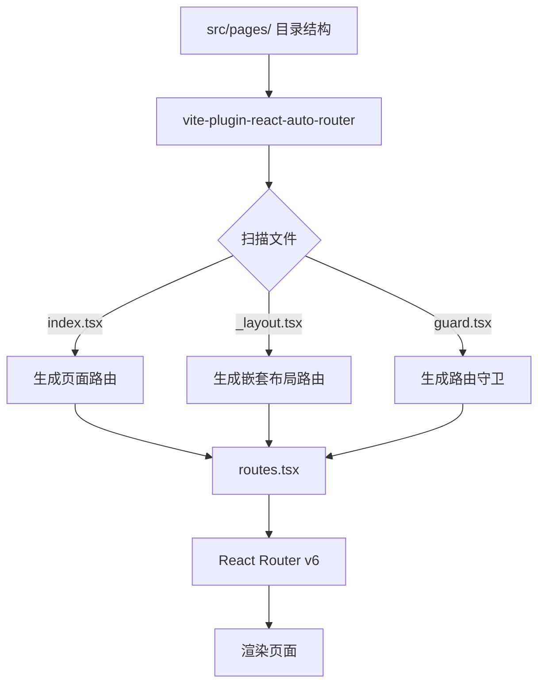
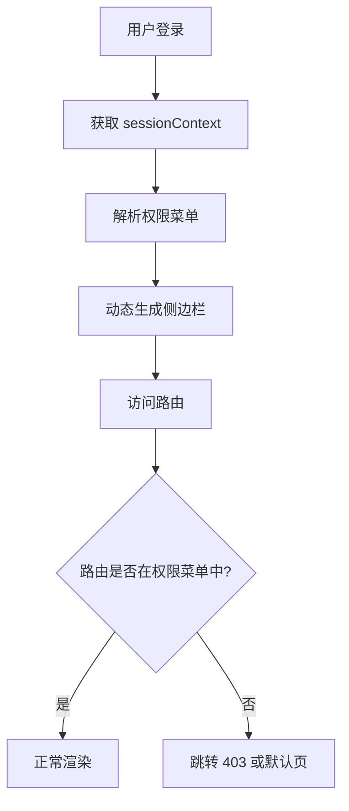
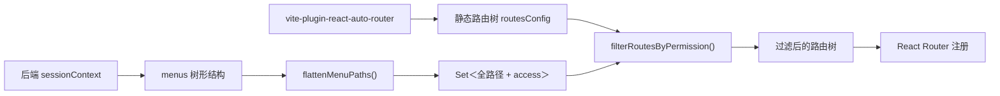
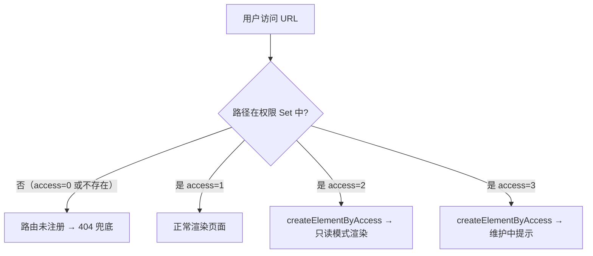
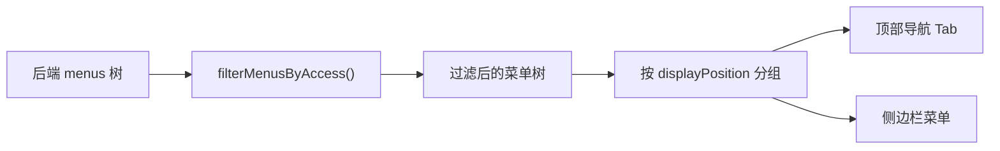
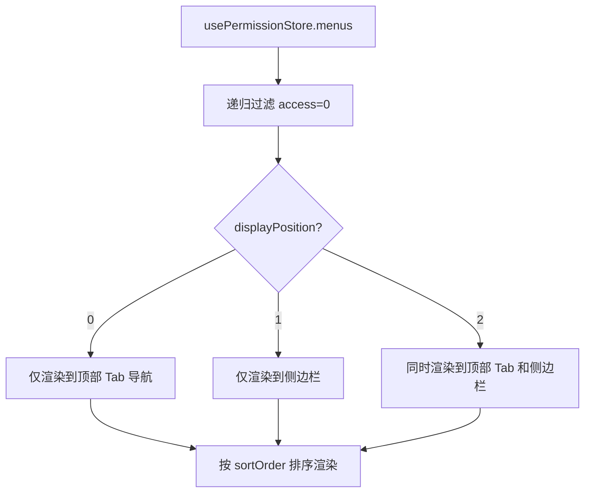
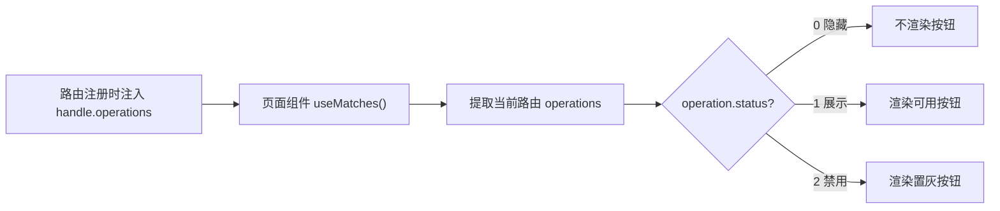

# 路由生成插件与权限控制技术方案

## 一、需求概述

### 背景

项目采用约定式路由（Convention-based Routing）方案，通过 Vite 插件 `vite-plugin-react-auto-router` 自动扫描 `src/pages/` 目录结构并生成 React Router v6 路由配置。同时，项目需要支持基于角色的访问控制（RBAC），包括菜单级、路由级和按钮级权限管理。

---

## 二、技术选型

| 维度          | 方案                           | 版本 | 说明                                 |
| ------------- | ------------------------------ | ---- | ------------------------------------ |
| **构建工具**  | Vite                           | 5.x  | 快速的前端构建工具                   |
| **框架**      | React                          | 18.x | UI 构建库                            |
| **UI 组件库** | Ant Design                     | 5.x  | 企业级 UI 组件库                     |
| **样式方案**  | Tailwind CSS + CSS Modules     | -    | 原子化 CSS + 模块化样式              |
| **路由**      | React Router v6 + 自动路由插件 | 6.x  | 约定式路由，自动扫描目录生成路由配置 |
| **状态管理**  | Zustand                        | 4.x  | 轻量级状态管理，用于权限上下文       |
| **类型检查**  | TypeScript                     | 5.x  | 严格模式，类型安全                   |

---

## 三、架构设计

### 路由生成架构



### 权限控制架构



---

## 四、路由生成设计

### 当前路由生成规则

| 文件          | 作用                                            | 生成路由类型 |
| ------------- | ----------------------------------------------- | ------------ |
| `index.tsx`   | 当前目录对应的页面组件                          | 独立路由     |
| `_layout.tsx` | 当前目录的嵌套布局组件，内部需渲染 `<Outlet />` | 父级路由     |
| `guard.tsx`   | 路由守卫组件，会包裹当前目录的 `element`        | 守卫路由     |
| 目录名 `404`  | 特殊处理，生成通配路径 `*`，用作 404 兜底页     | 通配路由     |

### 嵌套 vs 平铺判断规则

项目支持**双模式**嵌套路由生成策略，通过 `vite.config.ts` 中的 `nestedByDirectory` 配置切换。

#### 模式一：`_layout.tsx` 作为嵌套开关（默认，向后兼容）

**配置**: `nestedByDirectory: false` (默认值)

- 目录有 `_layout.tsx` → 当前目录变成父路由，子目录挂到 `children`，子页面通过 `<Outlet />` 渲染
- 目录无 `_layout.tsx` → 当前目录是独立路由，子目录被提升为平铺路由
- 一旦进入某个 `_layout.tsx` 的嵌套上下文，其所有后代目录都会继续嵌套，即使后代目录自己没有 `_layout.tsx`

**简记**：看有没有 `_layout.tsx`，不看目录层级。

#### 模式二：UmiJS 风格的目录驱动嵌套（新增）

**配置**: `nestedByDirectory: true`

- 基于目录结构自动生成嵌套路由，无需 `_layout.tsx`
- 有子目录的目录会自动成为父路由容器
- 父路由容器没有 `index.tsx` 时，`element` 为 `null`（React Router v6 原生支持）
- 父路由容器有 `index.tsx` 时，正常生成 `element`

**简记**：看目录层级，有子目录就嵌套。

#### 对比示例

```
目录结构：
a/
├── index.tsx
├── b/
│   └── index.tsx
└── c/
    └── index.tsx

模式一 (nestedByDirectory: false)：
生成：/a         ← 独立路由
     /a/b        ← 平铺路由
     /a/c        ← 平铺路由

模式二 (nestedByDirectory: true)：
生成：/a         ← 父路由容器 (有 element)
  └─ /b          ← 嵌套子路由
  └─ /c          ← 嵌套子路由
```

> **详细文档**：参见 [vite-plugin-react-auto-router-routing-cases.md](./vite-plugin-react-auto-router-routing-cases.md) 和 [vite-plugin-react-auto-router-nested-enhancement.md](./vite-plugin-react-auto-router-nested-enhancement.md)

## 五、权限菜单设计

菜单数据结构遵循 **type 与 displayPosition 职责分离** 的设计原则：

- `type` —— 决定**内容类型**（是否有路由、是否加载组件）
- `displayPosition` —— 决定**显示位置**（顶部 / 侧边栏 / 双重显示）
- 两者正交组合，互不影响，各司其职

### type 字段（内容类型）

| type | 含义           | 有路由 | 加载组件   | 适用场景                      |
| ---- | -------------- | ------ | ---------- | ----------------------------- |
| 0    | 目录（仅分组） | ❌     | ❌         | 顶部 Tab 分组、侧边栏分组标题 |
| 1    | 页面（有路由） | ✅     | ✅         | 普通业务页面                  |
| 2    | 微应用         | ✅     | ✅（远程） | qiankun 子应用入口            |

#### qiankun 微应用集成

项目采用 qiankun 微前端架构，`type=2` 的菜单项作为子应用入口，其路由注册和权限控制遵循以下规则：

| 维度       | 主应用                                                 | 子应用                                 |
| ---------- | ------------------------------------------------------ | -------------------------------------- |
| 菜单配置   | 仅配置子应用顶层入口（`type=2`）                       | 内部菜单由子应用自行管理               |
| 路由注册   | 为子应用入口注册一条父路由，挂载 qiankun 容器组件      | 内部路由由子应用独立注册，主应用不感知 |
| 权限控制   | `access` 控制子应用整体可见性（隐藏/启用/只读/维护中） | 内部页面权限由子应用自行实现           |
| 菜单树透传 | 不解析、不合并子应用内部菜单                           | 可独立调用接口获取自己的菜单树         |

> **设计决策**：主应用对子应用采用**「整体注册、内部自治」**模式。主应用只负责子应用入口的路由注册和页面级权限（`access`），子应用内部的导航结构、路由、按钮权限均由子应用自行管理，主应用不透出或合并子应用内部菜单。

### displayPosition 字段（显示位置）

| displayPosition | 含义        | 顶部显示 | 侧边栏显示 | 适用场景             |
| --------------- | ----------- | -------- | ---------- | -------------------- |
| 0               | 顶部导航    | ✅       | ❌         | 一级 Tab 分组        |
| 1               | 侧边栏      | ❌       | ✅         | 二级/三级菜单        |
| 2               | 顶部+侧边栏 | ✅       | ✅         | 快捷入口（双重显示） |

### access 字段（访问权限）

| access | 含义   | 影响范围                                     | 路由注册  | 访问行为                     | 适用场景                     |
| ------ | ------ | -------------------------------------------- | --------- | ---------------------------- | ---------------------------- |
| 0      | 隐藏   | 不生成路由 + 侧边栏不显示                    | ❌ 不注册 | 404（不存在）                | 对当前用户不可见的功能       |
| 1      | 启用   | 生成路由 + 侧边栏正常显示 + 可查看和编辑     | ✅ 注册   | 正常访问                     | 正常可用的功能               |
| 2      | 只读   | 生成路由 + 侧边栏正常显示 + 仅可查看不可编辑 | ✅ 注册   | 可查看，但所有编辑操作被禁用 | 审计期数据锁定、试用期用户等 |
| 3      | 维护中 | 生成路由 + 侧边栏置灰显示                    | ✅ 注册   | 显示"功能维护中"提示页面     | 临时下线、升级中的功能       |

#### 权限层级说明

- `access` 控制**页面级访问权限**：页面能否访问以及以什么模式访问（隐藏 / 启用 / 只读 / 维护中）
- `operations` 数组控制**页面级操作权限**：页面内的具体操作能否使用（按钮、Tab、模块、表单字段等），每个操作对象包含 `name`、`operationCode` 和 `status`
- 两者**粒度和层级不同**，配合使用实现完整的 RBAC 模型

#### 语义说明

| 字段                    | 语义                                           |
| ----------------------- | ---------------------------------------------- |
| `access=0`（隐藏）      | 功能对当前用户**不存在**，不注册路由，返回 404 |
| `access=1`（启用）      | 功能**正常可用**，查看 + 编辑均可              |
| `access=2`（只读）      | 功能**仅可查看**，路由存在但编辑操作被禁用     |
| `access=3`（维护中）    | 功能**暂时不可用**，路由存在但显示友好提示页   |
| `operations[].status=0` | 操作**隐藏**（不渲染）                         |
| `operations[].status=1` | 操作**展示**（正常显示且可用）                 |
| `operations[].status=2` | 操作**禁用**（显示但置灰不可点击）             |

#### 权限控制示例

```typescript
// 第一道关卡：access 控制页面级访问权限
if (menu.access === 0) return <Navigate to="/404" />;  // 页面不存在
if (menu.access === 3) return <FeatureDisabled />;     // 功能维护中
if (menu.access === 2) return <ReadOnlyWrapper>...</ReadOnlyWrapper>;  // 只读模式

// 第二道关卡：使用 usePermission Hook 控制页面级操作权限
const { hasPermission } = usePermission();
{hasPermission('person_edit') && <Button>编辑</Button>}
{hasPermission('person_delete') && <Button>删除</Button>}
```

#### 操作权限数据结构

```typescript
interface MenuOperation {
  /** 操作名称 */
  name: string;
  /** 操作权限码 */
  operationCode: string;
  /** 操作状态：0=隐藏, 1=展示（可用）, 2=禁用（置灰不可点击） */
  status: number;
}

> **注意**：菜单类型统一使用 `UrbanSessionMenuResponse`（见 [第九章 接口与数据定义](#5-menus--当前用户可用菜单树)），此处不再单独定义。
```

> **延伸阅读**：`usePermission` Hook 的具体实现、使用场景和辅助组件见 [8.2 usePermission Hook](#82-usepermission-hook操作权限)。

#### access=3（维护中）推荐实现

> 完整实现见 [8.1 routePermission](#81-routepermission路由权限工具集) 中的 `FeatureDisabled` 组件。

```typescript
// 侧边栏：菜单置灰显示
<Menu.Item disabled={menu.access === 3}>
```

#### access=2（只读）推荐实现

> 完整实现见 [8.1 routePermission](#81-routepermission路由权限工具集) 中的 `ReadOnlyWrapper` 和 `ReadOnlyContext`。

```typescript
// 方式 1：路由层自动包裹 ReadOnlyWrapper（推荐，已在 filterRoutesByPermission 中处理）

// 方式 2：通过 operations.status 控制单个按钮（见 8.2 usePermission Hook）
const { hasPermission, isOperationDisabled } = usePermission();
{hasPermission('person_edit') && <Button>编辑</Button>}
{isOperationDisabled('person_edit') && <Button disabled>编辑</Button>}

// 注意：access=2 已由路由层处理，页面内无需额外判断
```

#### access=0 不注册路由的设计决策

**选择原因：**

1. **安全性更高**：路由不存在，无法通过 URL 直接访问（攻击者无法枚举隐藏页面）
2. **性能更好**：减少路由表大小，提升路由匹配速度
3. **语义更清晰**：隐藏 = 不存在（返回 404），而非无权限（返回 403）
4. **维护成本更低**：不需要在 Guard 层做额外的 access 判断
5. **符合最小权限原则**：不存在的资源无法被访问

**对比方案（运行时拦截）的劣势：**

- ❌ 安全性低：路由存在，知道 URL 就能尝试访问
- ❌ 性能差：路由表包含无效路由
- ❌ 体验差：访问隐藏路由会闪烁（先渲染再跳转 403）
- ❌ 语义混乱：隐藏的路由为什么还能被访问（即使是 403）？

**实现方式：**

```typescript
// 在后端返回菜单后，过滤掉 access=0 的菜单
const validMenus = sessionContext?.menus?.filter((m) => m.access !== 0) || [];

// 使用 filterRoutesByPermission 递归过滤路由树
const protectedRoutes = filterRoutesByPermission(staticRoutes, validMenus);
```

### 组合使用示例

**场景：顶部一级 Tab + hover 二级菜单 + 点击展开侧边栏**

导航交互流程：

```
┌─────────────────────────────────────────────────────────────┐
│  [城市管理]   [序化管理]   [人员管理]   ...          顶部 Tab │  ← displayPosition=0, type=0（目录）
├──────────┬──────────────────────────────────────────────────┤
│  检查计划 │                                                  │
│  检查记录 │              页面内容区域                        │  ← 点击一级 Tab 后展开侧边栏
│  统计分析 │                                                  │     displayPosition=1, type=1
│           │                                                  │
└──────────┴──────────────────────────────────────────────────┘

交互行为：
1. 顶部 Tab 渲染所有 displayPosition=0 的一级菜单（type=0 目录）
2. hover 一级 Tab 时，下拉展示其 children 中 displayPosition=1 和 displayPosition=2 的菜单，以 type=0 的子目录作为分组标题
3. 点击一级 Tab 后，左侧展开该分类下的侧边栏菜单，children 中的 type=0 子目录作为可折叠分组标题
4. 点击二级菜单项，路由跳转至对应页面（type=1）或加载子应用（type=2）
5. displayPosition=2 的菜单同时出现在顶部 Tab 和侧边栏中（快捷入口）
```

**场景：直接展示侧边栏（无顶部 Tab）**

当后端菜单中没有 `displayPosition=0` 的顶级目录时，Layout 自动切换为纯侧边栏模式：

```
┌──────────┬──────────────────────────────────────────────────┐
│  管控大屏 │                                                  │
│  事件整改 │              页面内容区域                        │  ← 无顶部 Tab，直接展示侧边栏
│  基础数据 │                                                  │     displayPosition=1, type=1
│  人员管理 │                                                  │
│  岗位管理 │                                                  │
└──────────┴──────────────────────────────────────────────────┘

交互行为：
1. 后端菜单中无 displayPosition=0 的菜单项时，顶部导航栏自动隐藏
2. 侧边栏直接渲染所有 displayPosition=1 或 2 的菜单（access!=0）
3. type=0 的子目录作为可折叠分组标题，type=1/2 为可点击菜单项
4. 侧边栏支持折叠/展开（通过 Layout.Sider collapsible 实现）
```

**Layout 自适应逻辑：**

```typescript
// Layout 组件根据 topTabs 是否为空自动切换布局模式
const { topTabs, sidebarMenus } = useMenuRoutes();
const hasTopTabs = topTabs.length > 0;
const [collapsed, setCollapsed] = useState(false);

return (
  <Layout className="min-h-screen">
    {/* 有顶部 Tab 时渲染顶部导航 */}
    {hasTopTabs && <TopTabNav tabs={topTabs} />}
    <Layout>
      {/* 侧边栏始终渲染，支持折叠 */}
      <Layout.Sider
        collapsible
        collapsed={collapsed}
        onCollapse={setCollapsed}
      >
        <SidebarMenu menus={sidebarMenus} />
      </Layout.Sider>
      <Layout.Content>
        <Outlet />
      </Layout.Content>
    </Layout>
  </Layout>
);
```

**字段与导航层级映射：**

| 导航层级       | 对应字段组合                                                                      | 交互方式                        |
| -------------- | --------------------------------------------------------------------------------- | ------------------------------- |
| 顶部一级 Tab   | `displayPosition=0`，`type=0`                                                     | 始终显示在顶部                  |
| hover 二级菜单 | 一级 Tab 的 `children`，`displayPosition=1` 或 `2`；`type=0` 的子目录作为分组标题 | hover 下拉展示，按 type=0 分组  |
| 侧边栏菜单     | `displayPosition=1`，`type=1` 或 `2`；`type=0` 的子目录作为可折叠分组标题         | 点击 Tab 后展开，按 type=0 分组 |
| 快捷入口       | `displayPosition=2`，`type=1`                                                     | 顶部+侧边栏双显                 |

**菜单数据示例：**

```typescript
// 顶部一级 Tab（目录分组）
{
  "menuName": "城市管理",
  "path": "/urban-management",
  "type": 0,              // 目录（仅分组，无页面）
  "displayPosition": 0,   // 顶部导航
  "access": 1,
  "children": [
    // 二级 hover 菜单（同时也是侧边栏菜单）
    {
      "menuName": "检查计划",
      "path": "/urban-management/check-plan",
      "type": 1,          // 页面（有路由）
      "displayPosition": 1, // 侧边栏
      "access": 1,
      "operations": [...]
    }
  ]
}

// 特殊场景：某个页面既在顶部 Tab 显示，又在侧边栏显示
{
  "menuName": "管控大屏",
  "path": "/dashboard",
  "type": 1,              // 页面（有路由）
  "displayPosition": 2,   // 顶部+侧边栏都显示
  "access": 1,
}
```

### 路由注册规则

- 所有 `access !== 0` 的菜单都注册路由
- `type=0` 注册为父路由容器（`element=null`）
- `type=1/2` 注册为页面路由（加载组件）
- `displayPosition` **不影响**路由注册，只影响 UI 渲染位置

### UI 渲染规则

```typescript
// 1. 渲染顶部 Tab
const topTabs = menus.filter((m) => m.displayPosition === 0 && m.access !== 0);

// 2. 渲染侧边栏
const sidebarMenus = menus.filter(
  (m) => m.displayPosition === 1 && m.access !== 0
);

// 3. 渲染双重显示菜单
const bothMenus = menus.filter(
  (m) => m.displayPosition === 2 && m.access !== 0
);
```

## 七、公共依赖

### 公共 Store

| Store                | 关键字段               | 使用模块 | 依赖 Store | 说明           |
| -------------------- | ---------------------- | -------- | ---------- | -------------- |
| `usePermissionStore` | sessionContext, loaded | 全局     | 无         | 权限上下文管理 |

#### 使用矩阵

| 消费者 Store         | 依赖的 Store | 依赖字段       | 说明                   |
| -------------------- | ------------ | -------------- | ---------------------- |
| `usePermissionStore` | 无           | sessionContext | 存储用户权限上下文信息 |

#### PermissionStore 接口定义

```typescript
// src/stores/usePermissionStore.ts
interface PermissionState {
  /** 当前登录用户上下文信息 */
  sessionContext: UrbanSessionContextResponse | null;
  /** 是否已加载完成 */
  loaded: boolean;
  /** 是否正在加载 */
  loading: boolean;
  /** 当前页面对应的菜单项（路由切换时自动更新） */
  currentMenu: UrbanSessionMenuResponse | null;

  setSessionContext: (context: UrbanSessionContextResponse) => void;
  clearSessionContext: () => void;
  fetchSessionContext: () => Promise<void>;
  setCurrentMenu: (menu: UrbanSessionMenuResponse | null) => void;
}
```

#### PermissionStore 创建

```typescript
// src/stores/usePermissionStore.ts
import { create } from 'zustand';
import { urbanSessionApi } from '@/services/person';
import type { UrbanSessionContextResponse } from '@/services/person/types';

const usePermissionStore = create<PermissionState>((set) => ({
  sessionContext: null,
  loaded: false,
  loading: false,
  currentMenu: null,

  setSessionContext: (context) => {
    set({ sessionContext: context, loaded: true });
  },

  clearSessionContext: () => {
    set({ sessionContext: null, loaded: false, currentMenu: null });
  },

  setCurrentMenu: (menu) => {
    set({ currentMenu: menu });
  },

  fetchSessionContext: async () => {
    set({ loading: true });
    try {
      const res = await urbanSessionApi();
      if (res.code === '0' && res.data) {
        set({ sessionContext: res.data, loaded: true });
      }
    } finally {
      set({ loading: false });
    }
  },
}));
```

### 公共 Hooks

| Hook            | 用途                                               | 使用模块        | 依赖                 |
| --------------- | -------------------------------------------------- | --------------- | -------------------- |
| `usePermission` | 页面级操作权限控制（按钮/Tabs/模块显隐禁用）       | 业务页面        | `usePermissionStore` |
| `useMenuRoutes` | 基于后端菜单生成顶部 Tab、侧边栏菜单和路由注册配置 | Layout, App.tsx | `usePermissionStore` |

#### usePermission 实现

```typescript
// src/hooks/usePermission.ts
import { useCallback } from 'react';
import { usePermissionStore } from '@/stores/usePermissionStore';

interface UsePermissionReturn {
  /** 检查操作是否可用（status=1） */
  hasPermission: (operationCode: string) => boolean;
  /** 检查操作是否禁用（status=2） */
  isOperationDisabled: (operationCode: string) => boolean;
  /** 获取操作完整信息 */
  getOperation: (operationCode: string) => MenuOperation | undefined;
}

export const usePermission = (): UsePermissionReturn => {
  const currentMenu = usePermissionStore((state) => state.currentMenu);

  const hasPermission = useCallback(
    (operationCode: string) => {
      const op = currentMenu?.operations?.find(
        (item) => item.operationCode === operationCode
      );
      // status=1 表示操作可用
      return op?.status === 1;
    },
    [currentMenu?.operations]
  );

  /** 检查操作是否禁用 */
  const isOperationDisabled = useCallback(
    (operationCode: string) => {
      const op = currentMenu?.operations?.find(
        (item) => item.operationCode === operationCode
      );
      return op?.status === 2;
    },
    [currentMenu?.operations]
  );

  const getOperation = useCallback(
    (operationCode: string) => {
      return currentMenu?.operations?.find(
        (op) => op.operationCode === operationCode
      );
    },
    [currentMenu?.operations]
  );

  return {
    hasPermission,
    isOperationDisabled,
    getOperation,
  };
};
```

**使用场景示例：**

```tsx
import { usePermission } from '@/hooks/usePermission';

const CheckPlanPage: React.FC = () => {
  const { hasPermission, isOperationDisabled } = usePermission();

  return (
    <div>
      {/* 场景 1：按钮显示/隐藏 */}
      {hasPermission('plan_create') && <Button>新建计划</Button>}
      {hasPermission('plan_export') && <Button>导出</Button>}

      {/* 场景 2：Tab 显示/隐藏 */}
      <Tabs>
        <TabPane tab="基础信息" key="basic">
          ...
        </TabPane>
        {hasPermission('tab_advanced') && (
          <TabPane tab="高级设置" key="advanced">
            ...
          </TabPane>
        )}
      </Tabs>

      {/* 场景 3：模块显示/隐藏 */}
      {hasPermission('module_statistics') && <StatisticsCard />}

      {/* 场景 4：表单字段禁用 */}
      <Form.Item label="计划名称">
        <Input disabled={isOperationDisabled('field_edit')} />
      </Form.Item>
    </div>
  );
};
```

#### useMenuRoutes 实现

```typescript
// src/constants/menu.tsx
import { useMemo } from 'react';
import { usePermissionStore } from '@/stores/usePermissionStore';
import type { UrbanSessionMenuResponse } from '@/services/person/types';

/** 菜单项转 UI 渲染结构 */
interface MenuNode {
  key: string;
  label: string;
  path: string;
  type: number;
  icon?: React.ReactNode;
  children?: MenuNode[];
}

/** 将后端菜单树递归转为 UI MenuNode 树 */
const toMenuNodes = (items: UrbanSessionMenuResponse[]): MenuNode[] =>
  items.map((item) => ({
    key: item.menuId,
    label: item.menuName,
    path: item.path,
    type: item.type,
    icon: getIconByKey(item.menuId),
    children: item.children?.length ? toMenuNodes(item.children) : undefined,
  }));

/**
 * 动态菜单 Hook
 * 统一数据源（sessionContext.menus），按职责分区返回：
 * - topTabs：顶部一级 Tab
 * - sidebarMenus：侧边栏菜单（含 hover 下拉）
 * - permissionRoutes：动态路由注册配置（全量有效菜单）
 */
export const useMenuRoutes = () => {
  const sessionContext = usePermissionStore((state) => state.sessionContext);
  const menus = sessionContext?.menus ?? [];

  /** 顶部一级 Tab：displayPosition=0 且 access!=0 */
  const topTabs = useMemo(
    () =>
      toMenuNodes(
        menus.filter((m) => m.displayPosition === 0 && m.access !== 0)
      ),
    [menus]
  );

  /**
   * 侧边栏菜单：displayPosition=1 或 2 且 access!=0
   * type=0 的子目录作为可折叠分组标题
   */
  const sidebarMenus = useMemo(
    () =>
      toMenuNodes(
        menus.filter(
          (m) =>
            (m.displayPosition === 1 || m.displayPosition === 2) &&
            m.access !== 0
        )
      ),
    [menus]
  );

  /**
   * 动态路由注册配置：access!=0 的全量菜单树
   * type=0 注册为父路由容器（element=null）
   * type=1/2 注册为页面路由（加载组件）
   */
  const permissionRoutes = useMemo(
    () => toMenuNodes(menus.filter((m) => m.access !== 0)),
    [menus]
  );

  return { topTabs, sidebarMenus, permissionRoutes };
};
```

**消费方按需解构：**

```typescript
// Layout 顶部导航
const { topTabs } = useMenuRoutes();

// Layout 侧边栏
const { sidebarMenus } = useMenuRoutes();

// App.tsx 路由注册
const { permissionRoutes } = useMenuRoutes();
```

### 公共 utils

| 函数                         | 用途                                                  | 使用模块          | 文件路径                                                |
| ---------------------------- | ----------------------------------------------------- | ----------------- | ------------------------------------------------------- |
| `filterRoutesByPermission()` | 基于后端菜单过滤路由树，注入权限信息到 `route.handle` | App.tsx           | `src/utils/routePermission/filterRoutesByPermission.ts` |
| `createElementByAccess()`    | 根据 access 状态创建对应路由元素（维护中/只读/正常）  | App.tsx, 路由组装 | `src/utils/routePermission/createElementByAccess.ts`    |
| `checkRoutePermission()`     | 检查路由是否有访问权限                                | Layout, Guard     | `src/utils/routePermission/checkRoutePermission.ts`     |
| `findMenuByPath()`           | 从菜单树中按路径递归查找菜单项（含 operations）       | AdminLayout       | `src/utils/routePermission/findMenuByPath.ts`           |

#### createElementByAccess 实现

```typescript
// src/utils/routePermission/createElementByAccess.ts
import React from 'react';
import { FeatureDisabled, ReadOnlyWrapper } from '@/components';

/**
 * 根据 access 状态创建对应的路由元素
 */
export function createElementByAccess(
  element: React.ReactNode,
  access: number
): React.ReactNode {
  if (access === 0) {
    return null;
  }
  if (access === 3) {
    return <FeatureDisabled />;
  }
  if (access === 2) {
    return <ReadOnlyWrapper>{element}</ReadOnlyWrapper>;
  }
  return element;
}
```

#### checkRoutePermission 实现

```typescript
// src/utils/routePermission/checkRoutePermission.ts
import type { RouteObject } from 'react-router-dom';

/**
 * 检查路由是否有访问权限
 */
export function checkRoutePermission(route: RouteObject): boolean {
  const access = route?.handle?.access;
  return access !== undefined && access !== 0;
}
```

#### findMenuByPath 实现

```typescript
// src/utils/routePermission/findMenuByPath.ts
import type { UrbanSessionMenuResponse } from '@/services/person/types';

/**
 * 从菜单树中按路径递归查找菜单项
 * @param items 菜单树
 * @param path 目标路径
 * @returns 匹配的菜单项（含 operations），未找到返回 undefined
 */
export function findMenuByPath(
  items: UrbanSessionMenuResponse[],
  path: string
): UrbanSessionMenuResponse | undefined {
  for (const item of items) {
    if (item.path === path) return item;
    const found = item.children?.length
      ? findMenuByPath(item.children, path)
      : undefined;
    if (found) return found;
  }
}
```

#### filterRoutesByPermission 实现

```typescript
// src/utils/routePermission/filterRoutesByPermission.ts
import type { RouteObject } from 'react-router-dom';
import type { UrbanSessionMenuResponse } from '@/services/person/types';
import { createElementByAccess } from './createElementByAccess';

/**
 * 基于后端菜单配置过滤路由树
 * @param staticRoutes 插件生成的静态路由（routes.tsx）
 * @param menus 后端返回的菜单树（全路径）
 * @returns 过滤后的动态路由配置
 */
export function filterRoutesByPermission(
  staticRoutes: RouteObject[],
  menus: UrbanSessionMenuResponse[]
): RouteObject[] {
  const validMenuPaths = new Set<string>();
  const menuAccessMap = new Map<string, UrbanSessionMenuResponse>();

  const collectMenuPaths = (items: UrbanSessionMenuResponse[]) => {
    items.forEach((menu) => {
      if (menu.access !== 0) {
        validMenuPaths.add(menu.path);
        menuAccessMap.set(menu.path, menu);
      }
      if (menu.children) {
        collectMenuPaths(menu.children);
      }
    });
  };
  collectMenuPaths(menus);

  const filterRouteTree = (
    routes: RouteObject[],
    parentPath = ''
  ): RouteObject[] => {
    return routes
      .map((route) => {
        const routePath = route.path || '';
        const fullPath = routePath.startsWith('/')
          ? routePath
          : parentPath
            ? `${parentPath}/${routePath}`.replace(/\/+/g, '/')
            : `/${routePath}`;

        const hasAccess = validMenuPaths.has(fullPath);
        const menuConfig = menuAccessMap.get(fullPath);

        const filteredChildren = route.children
          ? filterRouteTree(route.children, fullPath)
          : [];

        if (route.children?.length && filteredChildren.length === 0) {
          return null;
        }

        if (!route.children && !hasAccess) {
          return null;
        }

        return {
          ...route,
          element: createElementByAccess(
            route.element,
            menuConfig?.access ?? 1
          ),
          children: filteredChildren.length > 0 ? filteredChildren : undefined,
          handle: {
            access: menuConfig?.access,
            type: menuConfig?.type,
            operations: menuConfig?.operations,
            menuName: menuConfig?.menuName,
          },
        };
      })
      .filter((r): r is RouteObject => r !== null);
  };

  return filterRouteTree(staticRoutes);
}
```

### 公共 Context

| Context           | 类型      | 用途                                                             | 提供方            | 消费方       |
| ----------------- | --------- | ---------------------------------------------------------------- | ----------------- | ------------ |
| `ReadOnlyContext` | `boolean` | 全局只读状态传递，业务组件通过 `useContext` 读取当前页面是否只读 | `ReadOnlyWrapper` | 业务页面组件 |

> `ReadOnlyContext` 由 `ReadOnlyWrapper` 组件内部创建并导出，实现见 [8.1 routePermission](#81-routepermission路由权限工具集)。

## 八、公共组件

### 权限相关组件

| 组件                | 文件路径                                        | 用途                                                             | 触发条件     | 说明                                                            |
| ------------------- | ----------------------------------------------- | ---------------------------------------------------------------- | ------------ | --------------------------------------------------------------- |
| `FeatureDisabled`   | `src/utils/routePermission/featureDisabled.tsx` | 功能维护中提示页面                                               | access=3     | 显示友好提示 + 返回首页按钮                                     |
| `ReadOnlyWrapper`   | `src/utils/routePermission/readOnlyWrapper.tsx` | 只读模式包装器，通过 `ReadOnlyContext.Provider` 向下传递只读状态 | access=2     | 包裹页面组件，业务层通过 `useContext(ReadOnlyContext)` 感知只读 |
| `Permission`        | `src/components/Permission/index.tsx`           | 声明式权限控制组件，根据 `operationCode` 控制子节点显隐          | 业务页面调用 | 适用于简单显隐场景，复杂场景用 `usePermission` Hook             |
| `NotAuthorizedPage` | `src/pages/403/index.tsx`                       | 403 无权限页面，用户访问未授权路由时展示                         | 路由兆底     | 显示 403 提示 + 返回首页按钮                                    |

### 8.1 routePermission（路由权限工具集）

> 文件路径：`src/utils/routePermission/`
>
> **工具函数实现**见 [第七章 公共 utils](#公共-utils)。

**组件实现代码：**

```typescript
// src/utils/routePermission/readOnlyWrapper.tsx（组件部分）
import React from 'react';
import { Result, Button } from 'antd';

/**
 * 功能维护中提示页面
 */
export const FeatureDisabled: React.FC = () => {
  return (
    <Result
      status="warning"
      title="功能维护中"
      subTitle="该功能正在进行系统升级，预计稍后恢复使用"
      extra={
        <Button type="primary" onClick={() => (window.location.href = '/')}>
          返回首页
        </Button>
      }
    />
  );
};

/**
 * 只读状态 Context
 * 用于全局传递只读状态，业务组件通过 useContext 读取
 */
export const ReadOnlyContext = React.createContext<boolean>(false);

/**
 * 只读模式包装器
 * 全局禁用所有编辑操作（按钮、表单输入等）
 */
export const ReadOnlyWrapper: React.FC<{ children: React.ReactNode }> = ({
  children,
}) => {
  return (
    <ReadOnlyContext.Provider value={true}>
      {children}
    </ReadOnlyContext.Provider>
  );
};
```

**ReadOnlyContext 使用示例：**

```typescript
// 业务组件中读取只读状态
import { useContext } from 'react';
import { ReadOnlyContext } from '@/utils/routePermission';

const CheckPlanPage: React.FC = () => {
  const isReadOnly = useContext(ReadOnlyContext);

  return (
    <div>
      <h1>检查计划</h1>

      {/* 按钮根据只读状态禁用 */}
      <Button disabled={isReadOnly}>新建计划</Button>

      {/* 表单根据只读状态禁用 */}
      <Form>
        <Form.Item label="计划名称">
          <Input disabled={isReadOnly} />
        </Form.Item>
      </Form>
    </div>
  );
};
```

> **说明**：`guard.tsx`（页面级路由守卫）为可选功能，当前项目暂不需要。`filterRoutesByPermission` 已满足全局 access 状态处理需求。
> 后续引入 `guard.tsx` 的时机：
>
> - 某些页面需要特殊权限（不同于全局菜单）
> - 页面级数据预加载（如加载完数据才渲染）
> - 某些页面需要多次权限校验
> - A/B 测试（不同用户看到不同页面版本）

### 8.2 Permission 组件（声明式权限控制）

> 文件路径：`src/components/Permission/index.tsx`
> 职责：声明式权限控制，适用于简单的显隐场景

```tsx
// src/components/Permission/index.tsx
import React from 'react';
import { usePermission } from '@/hooks/usePermission';

interface PermissionProps {
  code: string;
  fallback?: React.ReactNode;
  children: React.ReactNode;
}

/**
 * 权限控制组件（声明式）
 * 适用于简单的显示/隐藏场景
 */
export const Permission: React.FC<PermissionProps> = ({
  code,
  fallback = null,
  children,
}) => {
  const { hasPermission } = usePermission();
  return hasPermission(code) ? <>{children}</> : <>{fallback}</>;
};

// 使用示例
<Permission code="plan_create">
  <Button>新建计划</Button>
</Permission>;
```

### 8.3 NotAuthorizedPage（403 无权限页面）

> 文件路径：`src/pages/403/index.tsx`
> 职责：用户访问未授权路由时展示的兗底页面

```typescript
// src/pages/403/index.tsx
import React from 'react';
import { Button, Result } from 'antd';
import { useNavigate } from 'react-router-dom';

/**
 * 403 无权限页面
 * 当用户尝试访问未授权路由时展示
 */
const NotAuthorizedPage: React.FC = () => {
  const navigate = useNavigate();

  return (
    <Result
      status="403"
      title="403"
      subTitle="抱歉，您没有权限访问该页面。"
      extra={
        <Button type="primary" onClick={() => navigate('/')}>
          返回首页
        </Button>
      }
    />
  );
};

export default NotAuthorizedPage;
```

### 8.4 App.tsx 路由组装（使用上述公共组件）

```typescript
// src/App.tsx
import { useRoutes } from 'react-router-dom';
import { filterRoutesByPermission } from '@/utils/routePermission';
import staticRoutes from '@/pages/routes';
import { usePermissionStore } from '@/stores/usePermissionStore';

function App() {
  const sessionContext = usePermissionStore((state) => state.sessionContext);
  const loaded = usePermissionStore((state) => state.loaded);

  // 权限未加载完成，显示加载中
  if (!loaded) {
    return <Loading />;
  }

  // 1. 不需要 Layout 的路由（登录页、404、403、全屏页等）
  const publicRoutes: RouteObject[] = [
    { path: '/login', element: <LoginPage /> },
    { path: '/404', element: <NotFoundPage /> },
    { path: '/403', element: <NotAuthorizedPage /> },
    { path: '/dashboard', element: <DashboardPage /> },
  ];

  // 2. 基于权限过滤受保护路由（包含 access 状态处理）
  const menus = sessionContext?.menus || [];
  const protectedRoutes = filterRoutesByPermission(staticRoutes, menus);

  // 3. 组装路由
  const element = useRoutes([
    // 公开路由（不需要 Layout）
    ...publicRoutes,

    // 受保护路由（需要 Layout，权限已在 filterRoutesByPermission 中处理）
    {
      path: '/',
      element: <AdminLayout />,
      children: protectedRoutes,
    },

    // 404 兗底
    { path: '*', element: <Navigate to="/404" replace /> },
  ]);

  return <ConfigProvider locale={zhCN}>{element}</ConfigProvider>;
}
```

**优势：**

1. ✅ 登录页、404 页、403 页不会显示侧边栏和顶部栏
2. ✅ 权限拦截在路由配置层，Layout 不会先渲染
3. ✅ 清晰区分公开路由和受保护路由
4. ✅ 支持全屏页面（如管控大屏）
5. ✅ 全路径菜单配置，权限判断简单直接（`Set.has()`）
6. ✅ 递归过滤路由树，自动处理父子路由依赖关系
7. ✅ 注入权限信息到 `route.handle`，组件中可通过 `useMatches()` 读取
8. ✅ access=0 的菜单不注册路由，安全性更高（无法通过 URL 枚举）
9. ✅ **权限处理集中在 `filterRoutesByPermission`**，统一处理路由过滤和 access 状态（0/1/2/3），无需额外守卫组件

### 8.5 AdminLayout currentMenu 同步

> 文件路径：`src/layouts/AdminLayout.tsx`
> 职责：路由切换时自动将当前页面对应的菜单项（含 operations）同步到 Store，供 `usePermission` Hook 消费

`usePermission` 依赖 Store 中的 `currentMenu`，该字段通过 Layout 组件中的 `useMatches()` + `useEffect` 在路由变化时自动更新：

```typescript
// src/layouts/AdminLayout.tsx
import { useMatches } from 'react-router-dom';
import { usePermissionStore } from '@/stores/usePermissionStore';
import { findMenuByPath } from '@/utils/routePermission';

const AdminLayout: React.FC = () => {
  const matches = useMatches();
  const setCurrentMenu = usePermissionStore(
    (state) => state.setCurrentMenu
  );
  const sessionContext = usePermissionStore(
    (state) => state.sessionContext
  );

  useEffect(() => {
    const currentMatch = matches[matches.length - 1];
    const handle = currentMatch?.handle;
    if (!handle?.menuName) {
      setCurrentMenu(null);
      return;
    }
    const menu = findMenuByPath(
      sessionContext?.menus ?? [],
      currentMatch.pathname
    );
    setCurrentMenu(menu ?? null);
  }, [matches, sessionContext, setCurrentMenu]);

  // ... Layout 渲染（含顶部 Tab、侧边栏、折叠逻辑）
  return <Layout>...</Layout>;
};
```

**数据流向：**

```
路由切换 → useMatches() 获取当前路由 handle
         → findMenuByPath() 从 menus 树中查找对应菜单项
         → setCurrentMenu() 写入 Store
         → usePermission() 从 currentMenu.operations 读取权限
```

---

## 九、接口与数据定义

### 权限数据结构

#### 完整响应结构

```typescript
/** 统一 API 响应结构 */
interface ApiResponse<T = unknown> {
  /** 业务状态码："0" 表示成功，非 "0" 表示具体错误类型 */
  code: string;
  /** 响应数据 */
  data: T;
  /** 错误信息 */
  error?: string;
  /** 错误堆栈 */
  errorTrace?: string;
}

/** 城管线当前登录用户上下文响应 */
interface UrbanSessionContextResponse {
  /** 当前登录用户信息 */
  user: UrbanSessionUserResponse;
  /** 当前应用端 */
  application: UrbanSessionApplicationResponse;
  /** 当前租户上下文 */
  tenant: UrbanSessionTenantResponse;
  /** 当前用户角色列表 */
  roles: UrbanSessionRoleResponse[];
  /** 当前用户可用菜单树 */
  menus: UrbanSessionMenuResponse[];
  /** 当前用户有效权限编码 */
  permissionCodes: string[];
  /** 会话ID（可选） */
  sessionId?: string | null;
}
```

#### 详细字段说明

**1. user - 当前登录用户信息**

```typescript
interface UrbanSessionUserResponse {
  /** 登录账户用户ID */
  appUserId: string;
  /** 成员ID */
  memberId: number;
  /** 成员名称 */
  memberName: string;
  /** 手机号 */
  mobile: string;
  /** 当前部门ID */
  departmentId: number;
  /** 当前部门名称 */
  departmentName: string;
  /** 当前岗位ID */
  positionId: number;
  /** 当前岗位名称 */
  positionName: string;
  /** 是否管理员 */
  adminFlag: boolean;
}
```

**示例数据：**

```json
{
  "appUserId": "usr_123456",
  "memberId": 1001,
  "memberName": "张三",
  "mobile": "13800138000",
  "departmentId": 50,
  "departmentName": "城市管理部",
  "positionId": 10,
  "positionName": "部门主任",
  "adminFlag": true
}
```

**2. application - 当前应用端**

```typescript
interface UrbanSessionApplicationResponse {
  /** 产品编码，固定为 URBAN_MANAGEMENT */
  productCode: string;
  /** 应用端编码，一期固定为 admin */
  applicationCode: string;
}
```

**3. tenant - 当前租户上下文**

```typescript
interface UrbanSessionTenantResponse {
  /** 当前租户ID */
  tenantId: number;
  /** 当前租户名称 */
  tenantName: string;
}
```

**4. roles - 当前用户角色列表**

```typescript
interface UrbanSessionRoleResponse {
  /** 角色ID */
  roleId: string;
  /** 角色编码 */
  roleCode: string;
  /** 角色名称 */
  roleName: string;
}
```

**5. menus - 当前用户可用菜单树**
旧的

```typescript
interface UrbanSessionMenuResponse {
  /** 菜单ID */
  menuId: string;
  /** 菜单编码 */
  menuCode: string;
  /** 菜单名称 */
  menuName: string;
  /** 前端路由路径 */
  path: string;
  /** 展示顺序，数值越小越靠前 */
  sortOrder: number;
  /** 子菜单 */
  children?: UrbanSessionMenuResponse[];
}
```

新的

```typescript
interface UrbanSessionMenuResponse {
  /** 菜单ID */
  menuId: string;
  /** 菜单编码 */
  menuCode: string;
  /** 菜单名称 */
  menuName: string;
  /** 前端路由路径（全路径） */
  path: string;
  /**
   * 菜单类型：0=目录（仅分组），1=页面（有路由），2=微应用
   * 决定是否有路由、是否需要加载组件
   */
  type: number;
  /**
   * 显示位置：0=顶部导航，1=侧边栏，2=顶部+侧边栏
   * 决定菜单在 UI 中的渲染位置
   */
  displayPosition: number;
  /** 访问权限：0=隐藏（不注册路由），1=启用（正常可用），2=只读（仅查看），3=维护中（友好提示） */
  access: number;
  /** 展示顺序，数值越小越靠前 */
  sortOrder: number;
  /** 菜单图标（可选） */
  icon?: string;
  /** 操作权限列表（控制页面内具体操作的可用性） */
  operations?: MenuOperation[];
  /** 子菜单 */
  children?: UrbanSessionMenuResponse[];
}

/** 菜单操作权限 */
interface MenuOperation {
  /** 操作名称 */
  name: string;
  /** 操作权限码 */
  operationCode: string;
  /** 操作状态：0=隐藏（不渲染），1=展示（正常可用），2=禁用（置灰不可点击） */
  status: number;
}
```

**示例数据：**

```json
[
  {
    "menuId": "menu_pc_dashboard",
    "menuCode": "dashboard",
    "menuName": "管控大屏",
    "path": "/dashboard",
    "type": 1,
    "displayPosition": 2,
    "access": 1,
    "sortOrder": 1,
    "icon": "DashboardOutlined",
    "operations": [
      {
        "name": "查看",
        "operationCode": "dashboard_view",
        "status": 1
      }
    ],
    "children": []
  },
  {
    "menuId": "menu_pc_urban",
    "menuCode": "urban_management",
    "menuName": "城市管理",
    "path": "/urban-management",
    "type": 0,
    "displayPosition": 0,
    "access": 1,
    "sortOrder": 2,
    "icon": "AppstoreOutlined",
    "children": [
      {
        "menuId": "menu_pc_urban_plan",
        "menuCode": "check_plan",
        "menuName": "检查计划",
        "path": "/urban-management/check-plan",
        "type": 1,
        "displayPosition": 1,
        "access": 1,
        "sortOrder": 1,
        "icon": "CalendarOutlined",
        "operations": [
          {
            "name": "查看",
            "operationCode": "check_plan_view",
            "status": 1
          },
          {
            "name": "新增",
            "operationCode": "check_plan_create",
            "status": 1
          },
          {
            "name": "编辑",
            "operationCode": "check_plan_edit",
            "status": 1
          },
          {
            "name": "删除",
            "operationCode": "check_plan_delete",
            "status": 2
          }
        ],
        "children": []
      }
    ]
  }
]
```

**6. permissionCodes - 当前用户有效权限编码**

```typescript
permissionCodes: string[];
```

**示例数据：**

```json
["urban_plan_create", "urban_record_view", "person_add", "person_edit"]
```

#### 前端使用示例

> **Store 接口定义与创建代码**已统一收归至 [第七章 公共 Store](#permissionstore-创建)。

```typescript
// 获取菜单列表
const menus = usePermissionStore((state) => state.sessionContext?.menus || []);

// 检查权限（推荐使用第七章 usePermission Hook 代替手写）
const hasPermission = (permissionCode: string) => {
  const permissionCodes =
    usePermissionStore.getState().sessionContext?.permissionCodes || [];
  return permissionCodes.includes(permissionCode);
};
```

### API 接口规划

| 接口路径                     | 方法 | 使用模块   | 说明               |
| ---------------------------- | ---- | ---------- | ------------------ |
| `/dsb/api/szt/urban/session` | GET  | 全局初始化 | 获取用户会话上下文 |

### 注意事项

1. **成功判断**：接口成功标识为 `code === '0'`，而非 `success` 字段
2. **菜单结构**：`menus` 是树形结构，支持多级嵌套（通过 `children` 字段）
3. **权限编码**：`permissionCodes` 是扁平数组，用于按钮级权限控制
4. **租户隔离**：所有数据基于 `tenant.tenantId` 进行租户隔离

### 相关类型定义位置

- **类型定义文件**：`src/services/person/types.ts`
- **接口调用文件**：`src/services/person/index.ts`
- **Store 使用文件**：`src/stores/usePermissionStore.ts`

---

## 十、核心技术

### 10.1 权限模型

| 模型 | 说明                                            |
| ---- | ----------------------------------------------- |
| RBAC | 基于角色的访问控制（Role-Based Access Control） |

### 10.2 权限控制总览

前端权限控制分为三个层级，各层级独立运作、协同防护：

| 层级     | 核心职责                   | 数据来源                       | 实现位置                  |
| -------- | -------------------------- | ------------------------------ | ------------------------- |
| 路由权限 | 控制页面是否可访问         | `menus[].access`               | App.tsx 路由配置层        |
| 菜单权限 | 控制导航菜单是否可见       | `menus[]`（已过滤 `access=0`） | Layout 侧边栏 / 顶部导航  |
| 按钮权限 | 控制页面内操作按钮的可用性 | `menus[].operations[].status`  | 页面组件内 `useMatches()` |

> **接口级权限**（HTTP 拦截器 403 处理）已实现，不在本章讨论范围。

### 10.3 路由权限

**目标**：在路由注册阶段过滤无权限页面，用户访问未授权路由时跳转 403。

#### 数据流



#### 权限判断流程



> **路由注册阶段统一处理**：`filterRoutesByPermission()` 在路由注册阶段完成所有 access 状态处理——`access=0` 过滤路由，`access=2/3` 通过 `createElementByAccess()` 包裹对应元素，无需额外的渲染阶段守卫组件。

#### 核心实现

> `filterRoutesByPermission()` 完整代码见 [8.1 routePermission](#81-routepermission路由权限工具集)。
> App.tsx 路由组装完整代码见 [8.4 App.tsx 路由组装](#84-apptsx-路由组装使用上述公共组件)。

**关键规则**：

- 后端菜单 `path` 必须使用全路径（如 `/urban-management/check-plan`），权限匹配通过 `Set.has()` 实现
- `access=0` 的菜单**不注册路由**，递归过滤路由树
- `access=1/2/3` 的菜单**均注册路由**，`access=2/3` 由 `createElementByAccess()` 在路由注册阶段包裹对应元素

**示例**：

```
后端返回菜单:
[
  { path: "/urban-management", access: 1 },
  { path: "/urban-management/check-plan", access: 1 },
  { path: "/urban-management/check-record", access: 0 }
]

↓ filterRoutesByPermission()

/urban-management → ✅ access=1，注册
├── /urban-management/check-plan → ✅ access=1，注册
└── /urban-management/check-record → ❌ access=0，过滤

↓ 最终注册路由

/urban-management
└── /check-plan
```

### 10.4 菜单权限

**目标**：根据后端返回的 `menus` 树形数据动态渲染导航菜单，`access=0` 的菜单不显示。

#### 数据流



#### 菜单渲染流程



**关键规则**：

- `type=0`（目录）作为分组标题，不直接导航，其 `children` 展开显示
- `displayPosition` 仅控制 UI 渲染位置，**不影响**路由注册
- 菜单过滤在 Store 层完成，组件直接消费已过滤的菜单数据

### 10.5 按钮权限

**目标**：控制页面内操作按钮的显隐和可用性，基于 `operations[].status` 三值状态。

#### 数据流



#### 使用示例

> `usePermission` Hook 完整实现见第七章。

```typescript
import { useMatches } from 'react-router-dom';

function CheckPlanPage() {
  const matches = useMatches();
  const currentRoute = matches[matches.length - 1];
  const operations = currentRoute?.handle?.operations || [];

  const createOp = operations.find(
    (op) => op.operationCode === 'check_plan_create'
  );

  return (
    <div>
      <h1>检查计划</h1>
      {/* status=0 不渲染，status=2 置灰 */}
      {createOp?.status !== 0 && (
        <Button disabled={createOp?.status === 2} onClick={handleCreate}>
          新增计划
        </Button>
      )}
    </div>
  );
}
```

**`operations.status` 三值语义**：

| status | 含义 | 行为               |
| ------ | ---- | ------------------ |
| 0      | 隐藏 | 按钮不渲染到 DOM   |
| 1      | 展示 | 正常渲染，可点击   |
| 2      | 禁用 | 渲染但置灰不可点击 |

### 10.6 关键设计约束

1. **后端菜单 `path` 字段必须使用全路径**（以 `/` 开头），如 `/urban-management/check-plan`，避免相对路径拼接带来的匹配错误。
2. **`access=0` 的菜单不注册路由**，通过 `filterRoutesByPermission()` 递归过滤路由树。
3. **`access=2`（只读）和 `access=3`（维护中）**的菜单注册路由，由 `createElementByAccess()` 在路由注册阶段包裹对应元素。
4. **`type` 与 `displayPosition` 职责分离**：
   - `type` 决定内容类型（0=目录，1=页面，2=微应用），控制路由注册和组件加载。
   - `displayPosition` 决定显示位置（0=顶部导航，1=侧边栏，2=两者兼有），控制 UI 渲染位置。
   - `displayPosition` **不影响**路由注册，所有 `access !== 0` 的菜单都注册路由。
5. **权限信息注入**：`filterRoutesByPermission()` 会将 `access`、`type`、`displayPosition`、`operations` 注入到 `route.handle`，组件中可通过 `useMatches()` 读取。

---

## 十一、项目配置

### 11.1 核心功能模块与路由映射

#### PC 端

| 模块              | 页面                 | 路由                              | 负责人 | 说明                   |
| ----------------- | -------------------- | --------------------------------- | ------ | ---------------------- |
| 管控大屏          | Dashboard            | `/dashboard`                      | -      | 数据可视化驾驶舱       |
| 城市管理          | UrbanManagement      | `/urban-management`               | -      | 包含检查计划与检查记录 |
| 城市管理-检查计划 | CheckPlan            | `/urban-management/check-plan`    | -      | 任务计划管理           |
| 城市管理-检查记录 | CheckRecord          | `/urban-management/check-record`  | -      | 检查记录台账           |
| 序化管理          | SequenceManagement   | `/sequence-management`            | -      | 包含检查计划、检查记录 |
| 事件整改管理      | EventRectification   | `/event-rectification-management` | -      | 事件整改与验收管理     |
| 人员管理          | PersonManagement     | `/person-management`              | -      | 人员增删改查           |
| 基础数据维护      | BasicDataMaintenance | `/basic-data-maintenance`         | -      | 道路/公厕/绿化等数据   |
| 职能分类管理      | PositionManagement   | `/position-management`            | -      | 岗位信息维护           |

#### 移动端

| 模块         | 页面                     | 路由                          | 负责人 | 说明                                 |
| ------------ | ------------------------ | ----------------------------- | ------ | ------------------------------------ |
| 首页         | Home                     | `/welcome`                    | -      | 展示各功能入口（日常检查、随手拍等） |
| 日常检查     | GarbageInspection        | `/garbage-inspection`         | -      | 待处理任务列表及历史记录             |
| 日常检查详情 | GarbageInspectionDetail  | `/garbage-inspection/detail`  | -      | 执行检查、签到、提交结果             |
| 随手拍上报   | HazardReporting          | `/hazard-reporting`           | -      | 上报事件事件，上传带水印图片         |
| 随手拍清单   | PhotoReportList          | `/photo-report-list`          | -      | 所有事件列表及详情                   |
| 事件整改     | EventRectification       | `/event-rectification`        | -      | 待整改事件列表                       |
| 事件整改详情 | EventRectificationDetail | `/event-rectification/detail` | -      | 整改操作（开始整改、转交、拒不整改） |
| 事件验收     | EventAcceptance          | `/event-acceptance`           | -      | 待验收事件列表                       |

---

### 11.2 路由与权限对应关系

#### PC 端 - 页面访问权限表（基于路由）

| 菜单/模块名称    | 路由地址                            | 任务跟踪人员 | 管理人员（主任） | 管理人员（非主任） | 备注                              |
| :--------------- | :---------------------------------- | :----------- | :--------------- | :----------------- | :-------------------------------- |
| **管控大屏**     | `/dashboard`                        | ✗            | ✓                | ✓                  | 数据可视化驾驶舱                  |
| **城市管理**     | `/urban-management`                 | ✗            | ✓                | ✓                  | 包含检查计划与检查记录            |
| ↳ 检查计划       | `/urban-management/check-plan`      | ✗            | ✓                | ✓                  | 城市管理团队任务计划管理          |
| ↳ 检查记录       | `/urban-management/check-record`    | ✗            | ✓                | ✓                  | 城市管理团队检查记录台账          |
| **序化管理**     | `/sequence-management`              | ✗            | ✓                | ✓                  | 包含检查计划、检查记录、统计分析  |
| ↳ 检查计划       | `/sequence-management/check-plan`   | ✗            | ✓                | ✓                  | 序化管理团队任务计划管理          |
| ↳ 检查记录       | `/sequence-management/check-record` | ✗            | ✓                | ✓                  | 序化管理团队检查记录台账          |
| **人员管理**     | `/person-management`                | ✗            | ✓                | ✓                  | 人员增删改查、部门管理            |
| **基础数据维护** | `/basic-data-maintenance`           | ✗            | ✓                | ✓                  | 道路/公厕/绿化/车辆/点位/重点区域 |
| **事件整改管理** | `/event-rectification-management`   | ✗            | ✓                | ✓                  | PC 端事件整改与验收管理           |
| **岗位管理**     | `/position-management`              | ✗            | ✓                | ✓                  | 岗位增删改查                      |

> **说明**：任务跟踪人员对上述所有 PC 端后台管理页面均**无访问权限**。

#### 移动端 - 页面访问权限表（基于路由）

| 模块/页面名称    | 路由地址                      | 任务跟踪人员 | 管理人员（主任） | 管理人员（非主任） | 备注                                                                                                   |
| :--------------- | :---------------------------- | :----------- | :--------------- | :----------------- | :----------------------------------------------------------------------------------------------------- |
| **首页**         | `/welcome`                    | ✓            | ✓                | ✓                  | 展示各功能入口（日常检查、随手拍等）                                                                   |
| **日常检查**     | `/garbage-inspection`         | ✓            | ✓                | ✓                  | 待处理任务列表及历史记录（页面内数据按当前用户过滤）                                                   |
| **日常检查详情** | `/garbage-inspection/detail`  | ✓            | ✓                | ✓                  | 执行检查、签到、提交结果                                                                               |
| **随手拍上报**   | `/hazard-reporting`           | ✓            | ✓                | ✓                  | 上报事件事件，上传带水印图片                                                                           |
| **随手拍清单**   | `/photo-report-list`          | ✓            | ✓                | ✓                  | 所有事件列表及详情。**仅主任**在此页面内拥有「确认有效/无效」操作按钮                                  |
| **事件整改**     | `/event-rectification`        | ✓            | ✓                | ✓                  | \*任务跟踪人员仅显示被指派给自己的待整改事件                                                           |
| **事件整改详情** | `/event-rectification/detail` | ✓            | ✓                | ✓                  | 整改操作（开始整改、转交、拒不整改）                                                                   |
| **事件验收**     | `/event-acceptance`           | ✓            | ✓                | ✓                  | 待验收事件列表（所有人可见，但任务跟踪人员仅能看到自己提交的事件？PRD 未明确，通常验收人应是管理人员） |

---

### 11.3 关键按钮与操作权限

#### PC 端 - 关键按钮与操作权限表

| 操作/功能点              | 所在页面（路由）                                 | 任务跟踪人员 | 管理人员（主任） | 管理人员（非主任） | 逻辑说明                                 |
| :----------------------- | :----------------------------------------------- | :----------- | :--------------- | :----------------- | :--------------------------------------- |
| **查看大屏数据**         | 管控大屏 (`/dashboard`)                          | ✗            | ✓                | ✓                  | 所有管理人员均可查看全局监控数据         |
| **下钻查看详情**         | 管控大屏 (`/dashboard`)                          | ✗            | ✓                | ✓                  | 点击图表跳转至具体任务/事件详情          |
| **全屏切换/地图刷新**    | 管控大屏 (`/dashboard`)                          | ✗            | ✓                | ✓                  | 界面交互操作                             |
| **新建检查计划**         | 检查计划 (`.../check-plan`)                      | ✗            | ✓                | ✓                  | 创建任务计划，状态默认为启用             |
| **编辑检查计划**         | 检查计划 (`.../check-plan`)                      | ✗            | ✓                | ✓                  | 修改计划内容，可停用/启用                |
| **删除/停用检查计划**    | 检查计划 (`.../check-plan`)                      | ✗            | ✓                | ✓                  | 停用后不再生成新任务，已生成任务不受影响 |
| **导出检查记录**         | 检查记录 (`.../check-record`)                    | ✗            | ✓                | ✓                  | 导出台账 CSV                             |
| **查看检查记录详情**     | 检查记录 (`.../check-record`)                    | ✗            | ✓                | ✓                  | 查看已完成/取消任务的详细检查结果        |
| **新增/修改道路/公厕等** | 基础数据维护 (`/basic-data-maintenance`)         | ✗            | ✓                | ✓                  | 核心业务数据的增删改查                   |
| **导入/导出基础数据**    | 基础数据维护 (`/basic-data-maintenance`)         | ✗            | ✓                | ✓                  | CSV 批量导入导出                         |
| **新增/编辑人员**        | 人员管理 (`/person-management`)                  | ✗            | ✓                | ✓                  | 人员信息维护                             |
| **删除人员**             | 人员管理 (`/person-management`)                  | ✗            | ✓                | ✓                  | 需二次确认                               |
| **统计分析 - 切换维度**  | 统计分析 (`/sequence-management/statistics`)     | ✗            | ✓                | ✓                  | 个人/团队/区域维度切换                   |
| **统计分析 - 导出报表**  | 统计分析 (`/sequence-management/statistics`)     | ✗            | ✓                | ✓                  | 生成数据报表                             |
| **查看整改事件列表**     | 事件整改管理 (`/event-rectification-management`) | ✗            | ✓                | ✓                  | 查看所有整改事件及状态                   |
| **审核/验收整改事件**    | 事件整改管理 (`/event-rectification-management`) | ✗            | ✓                | ✓                  | 通过/驳回整改结果                        |
| **新增/编辑岗位**        | 岗位管理 (`/position-management`)                | ✗            | ✓                | ✓                  | 岗位信息维护                             |
| **删除岗位**             | 岗位管理 (`/position-management`)                | ✗            | ✓                | ✓                  | 需二次确认                               |

#### 移动端 - 关键按钮与操作权限表

| 操作/功能点           | 所在页面（路由）                             | 任务跟踪人员 | 管理人员（主任） | 管理人员（非主任） | 逻辑说明                                               |
| :-------------------- | :------------------------------------------- | :----------- | :--------------- | :----------------- | :----------------------------------------------------- |
| **开始检查**          | 日常检查 (`/garbage-inspection`)             | ✓            | ✓                | ✓                  | 从任务列表进入检查详情                                 |
| **签到/提交检查结果** | 日常检查详情 (`/garbage-inspection/detail`)  | ✓            | ✓                | ✓                  | 执行检查并上传结果                                     |
| **随手拍上报**        | 随手拍上报 (`/hazard-reporting`)             | ✓            | ✓                | ✓                  | 拍照上报事件，上传带水印图片                           |
| **确认事件有效/无效** | 随手拍清单 (`/photo-report-list`)            | ✗            | ✓                | ✗                  | 仅主任拥有确认操作权限                                 |
| **开始整改**          | 事件整改详情 (`/event-rectification/detail`) | ✓            | ✓                | ✓                  | \*任务跟踪人员仅操作被指派给自己的事件                 |
| **转交整改**          | 事件整改详情 (`/event-rectification/detail`) | ✓            | ✓                | ✓                  | 将整改任务转交给其他人员                               |
| **拒不整改**          | 事件整改详情 (`/event-rectification/detail`) | ✓            | ✓                | ✓                  | 拒绝整改并填写原因                                     |
| **验收通过/驳回**     | 事件验收 (`/event-acceptance`)               | ✗            | ✓                | ✓                  | PRD 未明确任务跟踪人员是否可验收，通常验收人为管理人员 |

### 11.4 菜单配置示例

#### PC 端菜单配置

```json
[
  {
    "menuId": "menu_pc_dashboard",
    "menuCode": "dashboard",
    "menuName": "管控大屏",
    "path": "/dashboard",
    "type": 1,
    "displayPosition": 2,
    "access": 1,
    "sortOrder": 1,
    "icon": "DashboardOutlined"
  },
  {
    "menuId": "menu_pc_urban",
    "menuCode": "urban_management",
    "menuName": "城市管理",
    "path": "/urban-management",
    "type": 0,
    "displayPosition": 0,
    "access": 1,
    "sortOrder": 2,
    "icon": "AppstoreOutlined",
    "children": [
      {
        "menuId": "menu_pc_urban_plan",
        "menuCode": "urban_check_plan",
        "menuName": "检查计划",
        "path": "/urban-management/check-plan",
        "type": 1,
        "displayPosition": 1,
        "access": 1,
        "sortOrder": 1,
        "icon": "CalendarOutlined",
        "operations": [
          {
            "name": "查看",
            "operationCode": "urban_plan_view",
            "status": 1
          },
          {
            "name": "新增",
            "operationCode": "urban_plan_create",
            "status": 1
          },
          {
            "name": "编辑",
            "operationCode": "urban_plan_edit",
            "status": 1
          },
          {
            "name": "删除",
            "operationCode": "urban_plan_delete",
            "status": 2
          }
        ]
      },
      {
        "menuId": "menu_pc_urban_record",
        "menuCode": "urban_check_record",
        "menuName": "检查记录",
        "path": "/urban-management/check-record",
        "type": 1,
        "displayPosition": 1,
        "access": 1,
        "sortOrder": 2,
        "icon": "FileTextOutlined"
      }
    ]
  },
  {
    "menuId": "menu_pc_sequence",
    "menuCode": "sequence_management",
    "menuName": "序化管理",
    "path": "/sequence-management",
    "type": 0,
    "displayPosition": 0,
    "access": 1,
    "sortOrder": 3,
    "icon": "OrderedListOutlined",
    "children": [
      {
        "menuId": "menu_pc_sequence_plan",
        "menuCode": "sequence_check_plan",
        "menuName": "检查计划",
        "path": "/sequence-management/check-plan",
        "type": 1,
        "displayPosition": 1,
        "access": 1,
        "sortOrder": 1
      },
      {
        "menuId": "menu_pc_sequence_record",
        "menuCode": "sequence_check_record",
        "menuName": "检查记录",
        "path": "/sequence-management/check-record",
        "type": 1,
        "displayPosition": 1,
        "access": 1,
        "sortOrder": 2
      }
    ]
  },
  {
    "menuId": "menu_pc_event",
    "menuCode": "event_rectification",
    "menuName": "事件整改管理",
    "path": "/event-rectification-management",
    "type": 1,
    "displayPosition": 1,
    "access": 1,
    "sortOrder": 4,
    "icon": "ToolOutlined"
  },
  {
    "menuId": "menu_pc_basicdata",
    "menuCode": "basic_data",
    "menuName": "基础数据维护",
    "path": "/basic-data-maintenance",
    "type": 1,
    "displayPosition": 1,
    "access": 1,
    "sortOrder": 5,
    "icon": "DatabaseOutlined"
  },
  {
    "menuId": "menu_pc_position",
    "menuCode": "position_management",
    "menuName": "职能分类管理",
    "path": "/position-management",
    "type": 1,
    "displayPosition": 1,
    "access": 1,
    "sortOrder": 6,
    "icon": "TagsOutlined"
  },
  {
    "menuId": "menu_pc_people",
    "menuCode": "person_management",
    "menuName": "人员管理",
    "path": "/person-management",
    "type": 1,
    "displayPosition": 1,
    "access": 1,
    "sortOrder": 7,
    "icon": "TeamOutlined"
  }
]
```

#### 移动端菜单配置

```json
[
  {
    "menuId": "menu_h5_home",
    "menuCode": "home",
    "menuName": "首页",
    "path": "/welcome",
    "type": 1,
    "displayPosition": 1,
    "access": 1,
    "sortOrder": 1,
    "icon": "HomeOutlined"
  },
  {
    "menuId": "menu_h5_inspection",
    "menuCode": "garbage_inspection",
    "menuName": "日常检查",
    "path": "/garbage-inspection",
    "type": 1,
    "displayPosition": 1,
    "access": 1,
    "sortOrder": 2,
    "icon": "CheckCircleOutlined"
  },
  {
    "menuId": "menu_h5_hazard",
    "menuCode": "hazard_reporting",
    "menuName": "随手拍上报",
    "path": "/hazard-reporting",
    "type": 1,
    "displayPosition": 1,
    "access": 1,
    "sortOrder": 3,
    "icon": "CameraOutlined"
  },
  {
    "menuId": "menu_h5_photo_list",
    "menuCode": "photo_report_list",
    "menuName": "随手拍清单",
    "path": "/photo-report-list",
    "type": 1,
    "displayPosition": 1,
    "access": 1,
    "sortOrder": 4,
    "icon": "UnorderedListOutlined",
    "operations": [
      {
        "name": "确认有效",
        "operationCode": "photo_confirm_valid",
        "status": 1
      },
      {
        "name": "确认无效",
        "operationCode": "photo_confirm_invalid",
        "status": 1
      }
    ]
  },
  {
    "menuId": "menu_h5_rectification",
    "menuCode": "event_rectification",
    "menuName": "事件整改",
    "path": "/event-rectification",
    "type": 1,
    "displayPosition": 1,
    "access": 1,
    "sortOrder": 5,
    "icon": "ToolOutlined"
  },
  {
    "menuId": "menu_h5_acceptance",
    "menuCode": "event_acceptance",
    "menuName": "事件验收",
    "path": "/event-acceptance",
    "type": 1,
    "displayPosition": 1,
    "access": 1,
    "sortOrder": 6,
    "icon": "AuditOutlined",
    "operations": [
      {
        "name": "验收通过",
        "operationCode": "event_accept_pass",
        "status": 1
      },
      {
        "name": "验收驳回",
        "operationCode": "event_accept_reject",
        "status": 1
      }
    ]
  }
]
```

---

## 十二、开发规范

### 目录规范

| 目录          | 用途                           | 规范                                                                |
| ------------- | ------------------------------ | ------------------------------------------------------------------- |
| `pages/`      | 页面级组件，自动生成路由       | 每个页面独立文件夹，私有组件放 `components/`，私有 hook 放 `hooks/` |
| `components/` | 多页面复用的公共组件           | 大驼峰命名，主文件 `index.tsx`，样式 `index.module.less`            |
| `stores/`     | 全局 Zustand Store             | 仅放公共状态，页面私有的放页面目录                                  |
| `services/`   | API 请求封装（按模块分文件夹） | 每个模块独立文件夹，统一错误处理                                    |

### 路由生成约定

1. **`_layout.tsx` 必须渲染 `<Outlet />`**，否则子页面不会显示
2. **无 `_layout.tsx` 时子目录平铺**（nestedByDirectory: false），不需要 `Outlet`
3. **layout-only 目录访问父路径会显示空内容**，如需默认页请补充 `index.tsx`
4. `components/`、`hooks/`、`Layout/` 目录会被插件排除，不生成路由
5. **`guard.tsx` 为可选功能**，当前项目暂不需要，后续有特殊权限校验需求时再引入
6. **`access=0` 的菜单不注册路由**，使用 `filterRoutesByPermission()` 递归过滤路由树
7. **`access=2`（只读）和 `access=3`（维护中）**的菜单注册路由，由 `createElementByAccess()` 在路由注册阶段包裹对应元素
8. **后端菜单 `path` 字段必须使用全路径**（以 `/` 开头），如 `/urban-management/check-plan`
9. **`type` 与 `displayPosition` 职责分离**：
   - `type` 决定内容类型（0=目录，1=页面，2=微应用），控制路由注册和组件加载
   - `displayPosition` 决定显示位置（0=顶部导航，1=侧边栏，2=两者兼有），控制 UI 渲染位置
   - `displayPosition` **不影响**路由注册，所有 `access !== 0` 的菜单都注册路由
10. **nestedByDirectory: true 时**，父路由容器没有 `index.tsx` 则 `element` 为 `null`，访问父路径显示空白
11. **向后兼容**: 默认 `nestedByDirectory: false`，保持现有 `_layout.tsx` 作为嵌套开关的行为
12. **路由结构变化**: 启用 `nestedByDirectory: true` 后，所有有子目录的页面都会变成嵌套路由，需确认菜单配置和权限控制是否适配
13. **权限信息注入**: `filterRoutesByPermission()` 会将 `access`、`type`、`displayPosition`、`operations` 注入到 `route.handle`，组件中可通过 `useMatches()` 读取

## 十四、非功能性需求（NFR）

### 性能

| 指标     | 目标值  | 说明                   |
| -------- | ------- | ---------------------- |
| 首屏加载 | < 2s    | 弱网环境首屏可交互时间 |
| 路由切换 | < 100ms | 页面切换响应时间       |

### 安全性

| 场景     | 措施                                                                           |
| -------- | ------------------------------------------------------------------------------ |
| 路由越权 | filterRoutesByPermission 路由注册阶段统一过滤 + createElementByAccess 状态包裹 |
| XSS 防护 | 输入转义、CSP 策略                                                             |
| 敏感数据 | 脱敏展示、加密传输                                                             |

---

## 十五、测试策略

| 测试类型 | 覆盖范围                   | 目标覆盖率 | 工具                  |
| -------- | -------------------------- | ---------- | --------------------- |
| 单元测试 | 路由生成逻辑、权限判断逻辑 | 80%        | Vitest                |
| 集成测试 | 路由渲染、权限拦截         | 70%        | React Testing Library |
| E2E 测试 | 核心业务流程、权限流转     | 60%        | Playwright            |

---

## 十六、工作量评估

### PERT 估算

| 估算类型                           | 人日    |
| ---------------------------------- | ------- |
| 乐观（O）                          | 2.0     |
| 悲观（P）                          | 5.0     |
| 最可能（M）                        | 3.0     |
| **PERT 期望值** `(O + 4M + P) / 6` | **3.2** |

### 拆分明细

| 阶段        | 工作内容                         | 人日    |
| ----------- | -------------------------------- | ------- |
| 现状分析    | 梳理路由生成规则与权限对应关系   | 0.5     |
| 方案设计    | 设计动态权限菜单集成方案         | 0.5     |
| 核心开发    | 修改 Layout 拦截逻辑、完善 Guard | 1.0     |
| 自测 & 联调 | 单元测试编写、权限流程测试       | 0.8     |
| Code Review | PR 评审、修改反馈                | 0.4     |
| **合计**    |                                  | **3.2** |

---

## 十七、风险评估与应对

### 技术风险

| 风险项                                      | 影响                 | 概率   | 应对策略                                         | 状态                                                               |
| ------------------------------------------- | -------------------- | ------ | ------------------------------------------------ | ------------------------------------------------------------------ |
| ~~约定式路由与动态权限菜单不匹配~~          | ~~路由越权访问~~     | ~~中~~ | ~~增加 Layout 层权限拦截 + Guard 组件双重保护~~  | ✅ 已解决（通过 filterRoutesByPermission + createElementByAccess） |
| ~~type=2 的路由页被 Layout 误判为非法路径~~ | ~~详情页被强制跳转~~ | ~~高~~ | ~~修改 Layout 匹配逻辑，支持 type=2 路由白名单~~ | ✅ 已解决（通过 App.tsx 区分公开/受保护路由）                      |
| 嵌套路由中 `<Outlet />` 位置不正确          | 子页面不显示         | 低     | 文档规范 + 代码审查                              | ⚠️ 仍需关注                                                        |
| 插件 AST 解析失败导致组件名为空             | 路由生成错误         | 低     | 增加文件存在性校验 + 组件名回退机制              | ⚠️ 仍需关注                                                        |
| nestedByDirectory: true 导致路由结构变化    | 菜单配置不匹配       | 中     | 启用前全面回归测试，确认菜单路径匹配逻辑         | ⚠️ 仍需关注                                                        |

### 业务风险

| 风险项                   | 影响         | 概率 | 应对策略                   |
| ------------------------ | ------------ | ---- | -------------------------- |
| 后端权限接口返回格式变更 | 权限解析失败 | 低   | 增加类型校验 + 错误提示    |
| 权限规则频繁调整         | 维护成本高   | 中   | 抽象权限判断逻辑为独立函数 |

### 依赖风险

| 风险项                     | 影响          | 概率 | 应对策略                   |
| -------------------------- | ------------- | ---- | -------------------------- |
| React Router v6 大版本升级 | 路由 API 变更 | 低   | 关注官方更新日志，提前适配 |
| Vite 插件兼容性问题        | 构建失败      | 低   | 锁定依赖版本，定期更新     |

---

## 附录：改进建议

### 0. 重构路由架构（P0 - 最高优先级）

**问题：** 当前所有路由都被 AdminLayout 包裹，导致登录页、404 页、全屏页等不需要 Layout 的页面也会显示侧边栏和顶部栏。

**方案：** 在 App.tsx 中区分公开路由和受保护路由。

> **完整实现**：该方案已在 [8.5 App.tsx 路由组装](#85-apptsx-路由组装使用上述公共组件) 中完整落地，包含公开路由分离、权限过滤和 403 兗底。

**预计工作量：** 0.5 人日

---

### 1. 修复 type=2 路由页被误杀问题

**问题：** Layout 的兗底跳转逻辑会把不在 `menus` 中的路由（type=2）强制跳转到默认页。

> **完整实现**：该问题已通过 [8.1 filterRoutesByPermission](#81-routepermission路由权限工具集) 的递归路由过滤彻底解决，无需手动收集路径。

### 2. 支持动态权限菜单

**当前问题：** 菜单是静态写死的（`src/constants/menu.tsx`），未根据后端返回的权限动态过滤。

> **实现代码**：`useMenuRoutes` Hook 已统一收归至 [第七章 公共 Hooks](#usemenuroutes-实现)。

### 3. ~~增强 Guard 组件支持~~（暂不需要）

> **说明**：当前项目通过 Layout 层的权限拦截已满足需求，暂不需要 `guard.tsx`。
>
> **后续引入时机**：
>
> - 某些页面需要特殊权限（不同于全局菜单）
> - 页面级数据预加载（如加载完数据才渲染）
> - 某些页面需要多次权限校验
> - A/B 测试（不同用户看到不同页面版本）

**当前状态：** ❌ 暂不实现

### 4. 完善 403 无权限页面

**当前问题：** 项目仅有 404 页面，缺少 403 无权限页面。

> **完整实现：** `NotAuthorizedPage` 组件代码见 [8.4 NotAuthorizedPage](#84-notauthorizedpage403-无权限页面)。
> 路由注册方式见 [8.5 App.tsx 路由组装](#85-apptsx-路由组装使用上述公共组件) 中的 `publicRoutes`。

### 5. 路由生成插件增强

**建议新增功能：**

| 功能                    | 说明                                                  | 优先级 |
| ----------------------- | ----------------------------------------------------- | ------ |
| 支持 `@permission` 注释 | 页面顶部注释支持权限标识，如 `@permission urban:view` | P2     |
| 生成路由元数据          | 路由配置自动包含 `meta: { permission: 'xxx' }`        | P2     |
| 权限校验工具函数        | 提供 `checkRoutePermission()` 公共函数                | P1     |

---

## 附录：变更记录

| 版本 | 日期       | 修改人 | 修改内容                                                                                                                                                                                                                                                                                                |
| ---- | ---------- | ------ | ------------------------------------------------------------------------------------------------------------------------------------------------------------------------------------------------------------------------------------------------------------------------------------------------------- |
| v1.0 | 2026-06-25 | AI     | 初稿                                                                                                                                                                                                                                                                                                    |
| v1.1 | 2026-06-26 | AI     | 新增嵌套路由双模式支持（nestedByDirectory 配置选项）                                                                                                                                                                                                                                                    |
| v1.2 | 2026-06-26 | AI     | 补充 PermissionGuard 全局路由守卫（支持 access=2/3 拦截）、403 页面注册、ReadOnlyWrapper 只读模式实现                                                                                                                                                                                                   |
| v1.3 | 2026-06-26 | AI     | 更新风险评估章节，标注已解决的风险项（路由权限不匹配、type=2 误判）                                                                                                                                                                                                                                     |
| v1.4 | 2026-06-26 | AI     | 移除 PermissionGuard 组件，将 access 状态处理集成到 filterRoutesByPermission，简化架构                                                                                                                                                                                                                  |
| v1.5 | 2026-06-29 | AI     | 新增「十三、统一项目架构视图」章节，并将第 4 章、第 10 章、第 11 章中对应内容迁移至该章节统一管理                                                                                                                                                                                                       |
| v1.6 | 2026-06-29 | AI     | 将 `usePermission` Hook 实现从第 4 章迁移至第十章 10.4 操作权限实现                                                                                                                                                                                                                                     |
| v1.7 | 2026-06-29 | AI     | 公共依赖/组件实现统一收归至第七、八章，10.4、10.5、附录 4 中重复实现改为引用                                                                                                                                                                                                                            |
| v1.8 | 2026-06-29 | AI     | 公共依赖各子表补充实现引用链接，第九章/附录 0/1/2 中散落的实现同步引用第七、八章，新增 `useDynamicMenus` 到公共 Hooks，后重命名为 `useMenuRoutes`                                                                                                                                                       |
| v1.9 | 2026-06-29 | AI     | 第七章公共依赖内联所有实现代码（Store/Hooks/Services），第五章/8.2/第九章/附录 2 中重复实现改为引用第七章                                                                                                                                                                                               |
| v2.0 | 2026-06-29 | AI     | 第十/十一章结构与内容优化：子章节编号对齐父章节（13.4.x→10.x、13.x→11.x），标题层级统一为 ###，十一章按 PC/移动端分类拆分，菜单配置字段对齐 UrbanSessionMenuResponse，交叉引用修正（8.5→8.4），移动端首页路由修正为 /welcome                                                                            |
| v2.1 | 2026-06-29 | AI     | 第十章权限实现重构：移除旧版权限层级表、Layout 拦截逻辑和路由架构方案，按路由权限/菜单权限/按钮权限三维度重新组织，补充数据流 Mermaid 图和权限判断流程图，原 10.5 关键设计约束顺延为 10.6                                                                                                               |
| v2.2 | 2026-06-29 | AI     | 字段统一治理：移除冗余 MenuItem 接口，统一使用 UrbanSessionMenuResponse；menuList→menus、item.id→menuId、item.name→menuName；PermissionStore 新增 currentMenu 字段及更新机制；Layout 补充纯侧边栏模式自适应逻辑；filterRoutesByPermission 集成 createElementByAccess；全文 PermissionGuard 残留统一替换 |
| v2.3 | 2026-06-29 | AI     | 抽取 findMenuByPath 到公共 utils（src/utils/routePermission/），AdminLayout 改为引用公共函数，移除内联实现                                                                                                                                                                                              |
