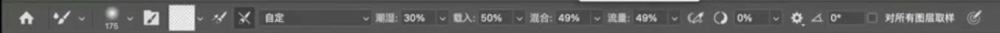

# 约拍

- 地点：景区开放时间，闭园时间，有哪些可以出片的景点
- 聊天话术：
  - 哪个角度好看
  - 拍摄类型
    - 自然/生命力
    - 简约
    - 网感
    - 复古
    - 电影
      - 武侠
  - 为什么拍胖
    - 镜头是光学镜头有一定的压缩感，二维展示所以比真实的看起来胖
- 道具

# 拍照

## 人像

## 机位

- 仰拍：显高

  容易拍出双下巴

  - 拍侧面抬下巴
  - 拍正面倾斜身体

- 俯拍：轮廓更立体

  容易头大，人矮

  - 广角拍全身
  - 长焦拍半身

- 平拍：更能表现模特情绪

  容易呆板

  - 找前景
  - 拍纵深
  - 摆动作

## 构图

- 点
  - 中心点
  - 三分点
- 线
  - 对称
  - 对角
  - 曲线
  - 引导
- 面
  - 前景
  - 框架
  - 填充：主体占满画面
  - 留白：除去主体，其他都是空白
  - 重复和对比
  - 

## 光圈

大光圈：数字越小，光圈越大，孔洞越大，进入相机的光线越多，画面越亮，虚化越强

## 闪光灯

### 模式

- M手动模式
- ttl自动模式：过亮或者过暗，调整闪光灯曝光补偿

### 打光方式

- 直闪：闪光灯灯头直接打向主体
- 跳闪：灯头打向墙壁，天花板或者反光板，通过反射的光照亮主体

### 使用场景

- 补光：逆光，夜景，主体很暗，室内窗边
  - 用相机控制**背景曝光正常**
  - 使用闪光灯给主体补光
- 压光：背景变暗，突出主体
  - 压低背景（欠曝）  
  - 使用闪光灯给主体补光

## 摄影风格

### 日系

### 复古

### 电影

### 自然/生命力

- 破面：头部和身体不在一致
- 破线
- 找支点，就是找支撑的道具（不是自己带的道具  ）
- 道具

### 简约

# PS

## 知识

位图模式，只有黑白色，每一个像素只包含一位数据。

灰度模式，黑白图像。

rgb，三元色，一个像素有24位数据，每一个元色占8位，每一个元色可以表现出256种浓度的色调

### 图片格式

- TIFF用于应用程序和计算机平台进行图像数据的交换。

- JPG用于图像预览和超文本

### 图层

#### 锁定图层

锁定图层的作用是**防止误操作**，四种锁定模式：

| 锁定类型 | 图标 | 效果 |
| :------- | :--- | :--- |
|          |      |      |

| **锁定透明像素** | 棋盘格图标   | 只能在已有像素上绘制，透明区域不受影响——给车上描边/涂装不会溢出到车身之外 |
| ---------------- | ------------ | ------------------------------------------------------------ |
| **锁定图像像素** | 画笔图标     | 禁止任何绘制/涂抹/减淡加深，但仍可移动图层                   |
| **锁定位置**     | 十字箭头图标 | 禁止移动图层，但仍可绘制                                     |
| **锁定全部**     | 锁图标       | 上述三项全部锁定，图层完全不可编辑                           |

**实际场景**：抠好车身后锁定透明像素，用画笔给车身加高光时随便涂都不会溢出到车窗和背景，比选区+画笔高效得多。

### 蒙版

**“蒙版用来控制图层的显示与隐藏，且不破坏原图。”**

你可以把它理解为一种**“无损橡皮擦”**——擦掉的地方其实只是被隐藏了，随时可以擦回来。

Photoshop（PS）蒙版的核心作用是**非破坏性地隐藏或显示图层部分区域**，以黑白灰灰度图控制透明度（**白色显示、黑色隐藏、灰色半透明**）。它主要用于图像合成、精细抠图、局部调整和渐变融合，能有效保护原始像素，修改极其灵活，是PS高级编辑的核心技能。

**PS蒙版的主要作用及应用场景：**

- **非破坏性编辑 (No-destructive Editing)**：区别于橡皮擦，蒙版隐藏的图像随时可恢复，不会永久删除图像内容。
- **图像合成与融合**：利用黑色画笔或渐变在蒙版上涂抹，可使两个图层过渡自然，常用于风光摄影曝光合并。
- **精细抠图**：对复杂边缘（如发丝、透明物体）配合画笔进行细致涂抹，实现高质量抠图。
- **局部调整**：配合调整图层（如曲线、色阶），通过蒙版限制调整范围，仅修改图片特定区域
- **创建形状遮罩 (矢量蒙版/剪切蒙版)**：利用路径或形状显示图层内容，实现画框效果

**常用蒙版类型：**

1. **图层蒙版 (Layer Mask)**：直接在图层上创建灰度板。
2. **剪切蒙版 (Clipping Mask)**：以底层形状限制上层内容。
3. **快速蒙版 (Quick Mask)**：临时选区编辑

| 蒙版类型     | 核心原理                                                  | 典型用途                                                     |
| :----------- | :-------------------------------------------------------- | :----------------------------------------------------------- |
| **图层蒙版** | 用灰度控制图层透明度：白=完全显示，黑=完全隐藏，灰=半透明 | 无破坏性抠图、合成、渐变过渡、局部调整                       |
| **剪贴蒙版** | 用下方图层的像素范围限制上方图层的显示区域                | 图案填充文字/形状、局部调色不溢出、相框效果                  |
| **矢量蒙版** | 用路径/形状的矢量边界控制显示区域                         | 需要清晰锐利边缘的抠图、UI 设计、Logo 合成（可无限缩放不失真） |

#### 剪切蒙版

剪切蒙版（Clipping Mask）是Photoshop中一个非常强大且常用的工具，它允许你用一个图层的内容来“剪切”或限制另一个图层的显示范围。简单来说，剪切蒙版可以让上层图层的内容只在下层图层的形状范围内显示，而超出下层图层的部分则会被隐藏。

### 前景色和背景色

Photoshop中的前景色和背景色是两组常用颜色配置。**前景色**主要用于绘图、填充、描边和字体颜色（快捷键 Alt+Delete），是主要绘制颜色；**背景色**主要用于辅助填充、背景擦除、渐变工具默认颜色（快捷键 Ctrl+Delete）。二者配合用于实现快速上色和蒙版操作。

以下是详细作用：

1. 前景色 (Foreground Color) - 上方颜色 

   前景色通常用于主动绘制和填充操作，是用户最常使用的颜色。

   - **绘图工具：** 画笔、铅笔、形状工具、文字工具默认使用前景色。
   - **填充选区：** 使用 `Alt + Delete` (Windows) / `Option + Delete` (Mac) 快速填充前景色。
   - **描边操作：** 对选区进行描边时，默认为前景色。
   - **渐变工具：** 默认的线性或径向渐变通常以“前景色到背景色”开始。 [[1](https://www.zhihu.com/question/526314187), [2](https://m.yutu.cn/question/tiwen_183346.html), [3](https://www.shenyecg.com/Article/618246), [4](https://www.hxsd.tv/wenda/9565/)]

1. 背景色 (Background Color) - 下方颜色

   背景色主要起辅助、底色填充作用。

   - **填充底色：** 使用 `Ctrl + Delete` (Windows) / `Command + Delete` (Mac) 快速填充背景色。
   - **橡皮擦工具：** 在背景图层上使用橡皮擦工具时，擦除的内容会显示为背景色。
   - **渐变工具：** 作为渐变填充的终点颜色。 [[1](https://www.zhihu.com/question/526314187), [2](https://www.hxsd.tv/wenda/9565/), [3](https://m.yutu.cn/question/tiwen_183346.html)]

常用操作快捷键

- **切换前背景色：** 按 `X` 键。

- **恢复默认黑白：** 按 `D` 键（前景黑，背景白）。

- **填充前景色：** `Alt + Delete` (Win) / `Option + Delete` (Mac)。

- **填充背景色：** `Ctrl + Delete` (Win) / `Command + Delete` (Mac)

### 通道

### HSL

- 明度：颜色的亮度
- 饱和度：色彩的鲜艳
- 色相

## 快捷方式

- ctrl alt shift 求交集

### 画笔

| 操作系统    | 快捷键                                                       |
| :---------- | :----------------------------------------------------------- |
| **macOS**   | [ 缩小 / ] 放大，或按住 Control + Option 同时水平拖拽鼠标（Mac 2020 及之后版本） |
| **Windows** | [ 缩小 / ] 放大，或按住 Alt + 右键 同时水平拖拽鼠标          |

按住 Shift 再按 [ / ] 可以调节画笔硬度（边缘软硬程度）。

### **吸管工具取样**

按住 Alt（macOS 是 Option）切换到吸管临时取样颜色。在其他工具（画笔/修复画笔）状态下，Alt 可直接从图像中取样设为前景色。

### 前/后景色

ctrl加delete填充背景色

alt加delete填充前景色 

### 色彩

- 去色 ctrl shift u
- 

### 图层

- ctrl t 自由变换，调整图层位置和大小
- ctrl加j，拷贝，选区转换成图层 
- ctrl e 合并图层。ctrl+shift+alt + e 盖印图层，不会把以前的图层删除
- **如何对空白图层添加的颜色更改** 使用“填充”工具 按快捷键 `Shift + F5`
- 复制图层蒙版到曲线图层中 按住 Alt/Option 键，将蒙版缩略图从一个图层拖到曲线图层上，松开即可复制。
- 反转涂抹的图层蒙版 cmd+i
- 选中多个图层生成组 ctrl+g

### 选区

- 图层选区
  - 按住 **Ctrl键 (Mac: Command键)**，同时用鼠标左键单击图层面板中的 **图层缩略图**
- 反选的快捷键是 **Ctrl + Shift + I** (Mac为 **Cmd + Shift + I**)
- 取消选区 ctrl d
- 隐藏/显示选区 ctrl+h
- 高光阴影中间调选区
  - 高光通道
    - ctrl + 通道rgb
    - ctrl + alt + 2
  
  - 阴影通道
    - 反选高光
  
  - 中间调通道
    - 选中高光
    - ctrl+shift+alt按住，出现x号的时候
    - 点击阴影通道
  
  - 扩大和缩小选取
    - mac option+command+shift，出现加号和减号
  

### 曲线

在Photoshop中，通过“图层”面板下方的**[“创建新的填充或调整图层”](https://www.3d66.com/answers/question_113496.html)**按钮（圆形图标）选择**[“曲线”](https://jingyan.baidu.com/article/e6c8503cb2e67ae54e1a1866.html)**可新建非破坏性曲线调整图层。通过点击[“曲线”](https://zhuanlan.zhihu.com/p/61873746)图层属性中的对角线、[添加节点并拖动](https://thomaskksj.tuchong.com/t/13162843/)，可灵活调节图像亮度和色彩。

## 工具

### 参数

密度（羽化）：画笔周边的效果实现程度，是否生硬

压力：调整的强度

速率：扭曲的快慢

### 移动

移动图层，选区

### 选区

- 矩形选区：做图像边框

### 套索

| 工具               | 快捷键       | 操作方式                                          | 使用场景                                                     | 典型用途                                           |
| :----------------- | :----------- | :------------------------------------------------ | :----------------------------------------------------------- | :------------------------------------------------- |
| **套索工具**       | L            | 按住鼠标自由绘制选区边界，松手自动闭合            | 不需要精确边缘的场合；随手圈出大致范围做局部调色             | 快速圈选粗略范围、草图级选区                       |
| **多边形套索工具** | Shift+L 切换 | 逐次点击确立**直线段**锚点，双击或回到起点闭合    | 物体边缘为直线或折线的场景；汽车摄影中轮毂、车窗、建筑外立面 | 选取边缘为直线的物体（建筑、包装盒、屏幕截图区域） |
| **磁性套索工具**   | Shift+L 切换 | 沿物体边缘拖动，自动吸附到颜色/亮度对比强烈的轮廓 | 主体与背景有明显反差的场景；白色车身在深色背景前、产品白底图 | 主体与背景反差明显时的快速抠图                     |

### 快速选择

| 工具             | 快捷键   | 操作方式                                           | 使用场景                         | 典型用途                       |
| :--------------- | :------- | :------------------------------------------------- | :------------------------------- | :----------------------------- |
| **快速选择工具** | W        | 画笔涂抹，自动识别边缘，[ ] 调整笔刷大小，Alt 减选 | 主体与背景反差大、边缘清晰的照片 | 人物抠图、产品换背景           |
| **魔棒工具**     | Shift+W  | 单击选取相似颜色区域，容差值控制选取范围           | 大面积纯色背景、颜色统一的区域   | 证件照换底色、天空替换         |
| **对象选择工具** | Shift+W  | 框选或悬停自动识别物体，AI 驱动                    | 画面中有多个独立物体需单独选取   | 群像中提取单人、多物品分别处理 |
| **选择主体**     | 需自定义 | 顶部选项栏一键点击，自动识别画面主体               | 主体突出、背景相对简洁的照片     | 电商白底图、汽车摄影快速抠图   |
|                  |          |                                                    |                                  |                                |

### 图框

| 工具         | 快捷键 | 操作方式                                      | 使用场景                   | 典型用途                       |
| :----------- | :----- | :-------------------------------------------- | :------------------------- | :----------------------------- |
| **图框工具** | K      | 拖拽绘制矩形/椭圆占位框，拖入图片自动裁剪适配 | 版式排版、批量统一图片尺寸 | 相册排版、多图拼贴、作品集展示 |

### 修复

| 工具             | 快捷键            | 操作方式                                    | 使用场景               | 典型用途                                        |
| :--------------- | :---------------- | :------------------------------------------ | :--------------------- | :---------------------------------------------- |
| **污点修复画笔** | J                 | 直接点击/涂抹瑕疵区域，自动采样周围像素融合 | 小面积孤立瑕疵         | 祛痘、去灰尘斑点、去电线杆上的鸟                |
| **修复画笔**     | J（Shift+J 切换） | Alt+点击取样源，再涂抹目标区域              | 需手动指定采样源的修复 | 保留纹理（如皮肤毛孔）的同时去除皱纹、疤痕      |
| **修补工具**     | J                 | 圈选问题区域，拖拽到干净区域自动融合        | 大面积不规则区域替换   | 移除画面中多余人物/杂物，汽车摄影中去掉地面油渍 |
| **内容感知移动** | J                 | 圈选对象，拖拽到新位置，自动填充原位置      | 调整元素位置           | 挪动车标位置、调整构图中的主体                  |
| **红眼工具**     | J                 | 框选红眼区域或直接点击瞳孔                  | 闪光灯造成的红眼       | 人像红眼修正                                    |

### 仿制图章

仿制图章是"复印机"，修复画笔是"智能嫁接"——前者原样搬，后者只搬纹理并自动适配环境色。

| 工具         | 快捷键 | 操作方式                                                 | 使用场景                 | 典型用途                                                     |
| :----------- | :----- | :------------------------------------------------------- | :----------------------- | :----------------------------------------------------------- |
| **仿制图章** | S      | Alt+点击定义取样源，松开后在目标位置涂抹，像素被严格复制 | 需要像素级精确复制的场景 | 复制纹理细节、去除复杂背景水印、修复规则图案区域、车身漆面瑕疵的精准复制修复 |

### 画笔工具  

**主要结合蒙版使用**

#### 混合器画笔

混合器画笔（Mixer Brush）是 Photoshop 中模拟真实绘画技法的工具，核心作用是在画布上**混合、涂抹、融合颜色**，让数字绘画产生类似油画、水彩、丙烯等传统媒介的笔触质感。

**主要是对衣服的褶皱和磨皮处理**

##### 关键参数与作用

| 参数                   | 作用                                                         |
| :--------------------- | :----------------------------------------------------------- |
| **潮湿**               | 控制画笔从画布"拾取"颜色的力度。值越高，拖拽时拾取的颜色越多，笔触颜色越淡；低值下笔触更浓更不透明 |
| **载入**               | 设定笔尖"蘸取"的颜料量。载入低时笔触很快变干（拖尾短），载入高时颜料充足，可画出长而连续的混合笔触 |
| **混合**               | 决定拾取的画布颜色与前景色的混合比例。100% 时完全用画布拾取的颜色绘画；0% 时只用前景色 |
| **流量**               | 控制颜料流出的速率。低流量像是干笔刷，高流量则是湿润饱满的笔触 |
| **对所有图层取样**     | 开启后可从所有可见图层拾取颜色进行混合，不限于当前图层。修图合成时非常关键 |
| **每次描边后清理画笔** | 每画一笔后自动清除笔尖残留颜色，下一笔用全新色彩开始。适合频繁切换色调的场景 |
|                        |                                                              |

##### 实际应用场景

- **模拟油画/水彩效果**：调高潮湿和混合值，在已有色块上涂抹产生渐变融合，像真实颜料在画布上推开
- **人像精修中的皮肤柔化**：用低流量、适中混合值在肤色过渡区域轻刷，平滑颜色断层而不丢失纹理
- **创意合成中的色彩统一**：开启"对所有图层取样"，将不同素材的颜色在边缘处混合，消除拼贴感
- **手绘插画着色**：利用潮湿和载入模拟干湿笔触变化，一笔中实现颜色从浓到淡的自然过渡

------

简单来说，常规画笔只是"覆盖"颜色，混合器画笔则是"搅动和融合"已有颜色，是通往写实绘画质感的核心工具。

### 历史记录画笔

### 橡皮擦

### 吸管

shift加吸管工具等于颜色取样点工具  

#### 在图像中取样以设置白场

在 Photoshop 色阶（Ctrl+L / Cmd+L）或曲线（Ctrl+M / Cmd+M）调整中，使用白场吸管在图像中取样的核心作用是**重新定义"白色"基准，实现一键白平衡校正和色偏修复**。

工作原理

| 操作                                         | 效果                                                         |
| :------------------------------------------- | :----------------------------------------------------------- |
| 用**白场吸管**点击图像中**本应是纯白**的区域 | Photoshop 将该像素的 RGB 值强制映射为纯白（R=255, G=255, B=255），同时按比例重新映射整个图像的色调范围 |
| 用**灰场吸管**点击中性灰区域                 | 消除色偏，让中性灰真正呈现中性（R=G=B）                      |
| 用**黑场吸管**点击本应纯黑的区域             | 将其映射为纯黑（R=G=B=0），拉伸暗部层次                      |
|                                              |                                                              |

典型使用场景

- **校正白平衡**：拍摄时光源偏黄/偏蓝，用白场吸管点击画面中原本为白色的衬衫、纸张、云朵等，整张照片色调自动恢复
- **增强对比度**：同时设置黑场和白场，可最大化图像的动态范围
- **消除色偏**：灰场吸管点击水泥地面、沥青、白墙等中性物体，快速去除整体色偏

## 液化

ctrl+shfit+X

左边工具栏

- 向前变形：瘦脸，瘦身
- 重建（橡皮擦）
- 平滑：中和调整前后，防止过度

- 顺时针：眼角角度
- 褶皱：防止走光 ，缩小眼睛/鼻孔
- 膨胀：放大
- 左推：不推荐
- 冻结蒙版：不受其他工具影响
- 解冻蒙版
- 脸部：快捷脸部调整
- 抓手工具：移动图层

右边工具栏

- 固定边缘：对图层边缘向左推，会漏出透明图层
- 人脸识别液化（和脸部工具一样一个是手动，一个是调参数，这个更精确）
  - 复位：其中一张脸进行还原 
  - 全部：全部脸
- 蒙版选项：解决左边工具栏手动涂抹的劣势
  - 选区：对选区的内容和冻结的区域进行取交集和取反
- 视图选项
  - 显示参考线
  - 显示脸部工具的线
- 显示背景：多用于合成图像 
- 画笔重建：类似于重建按钮，只是能控制重建的还原程度

## 案例

### 抠图

| 工具                    | 快捷键                | 操作方式                                                     | 使用场景                                         | 典型用途                                                     |
| :---------------------- | :-------------------- | :----------------------------------------------------------- | :----------------------------------------------- | :----------------------------------------------------------- |
| 套索工具                | L                     | 按住鼠标自由绘制选区边界，松手自动闭合                       | 不需要精确边缘的场合；随手圈出大致范围做局部调色 | 快速圈选粗略范围、草图级选区                                 |
| 多边形套索工具          | Shift+L 切换          | 逐次点击确立直线段锚点，双击或回到起点闭合                   | 物体边缘为直线或折线的场景                       | 选取边缘为直线的物体（建筑、包装盒、屏幕截图区域）           |
| 磁性套索工具            | Shift+L 切换          | 沿物体边缘拖动，自动吸附到颜色/亮度对比强烈的轮廓            | 主体与背景有明显反差的场景                       | 白色车身在深色背景前、产品白底图等主体与背景反差明显时的快速抠图 |
| 快速选择工具 / 魔棒工具 | W                     | 点击或涂抹基于颜色/纹理相似度自动扩展选区                    | 色彩/纹理相对均匀的区域                          | 纯色背景、大面积相近颜色区域的快速选取                       |
| 钢笔工具                | P                     | 通过锚点和贝塞尔曲线精确绘制路径，两个点都有弧度时需 Alt+点击锚点取消第一个锚点的弧度，路径闭合后转为选区 | 需要极高精度的抠图场景；边缘带复杂曲线的物体     | 产品精修抠图、人像发丝级抠图、Logo 提取                      |
| 色彩范围                | 菜单：选择 → 色彩范围 | 基于颜色采样建立选区，可调节容差值控制选取范围               | 主体颜色单一且与背景颜色差异明显                 | 蓝天背景替换、纯色幕布抠图                                   |
| 背景橡皮擦工具          | E                     | 画笔擦除时保留前景色（设定的前景色），移除背景色（设定的背景色），需有明显的色差才能生效 | 前景与背景存在明显色差                           | 边缘带毛发的对象、树木与天空的分割抠图                       |

#### 发丝

**选择并遮住**操作步骤：

1. **选中图层** → 菜单栏 **选择 → 主体**（或属性栏点"选择主体"按钮），AI 自动生成人物大致选区
2. 保持选区激活状态 → 菜单栏 **选择 → 选择并遮住**（或在选项栏点"选择并遮住"按钮）
3. 进入遮罩工作区后，右侧属性面板关键设置：
   - **视图模式**：选"叠加"或"黑底"，方便观察发丝
   - **边缘检测**：勾选"智能半径"，适当调大半径（发丝场景建议 3~8px）
   - **全局优化**：平滑 2~5、羽化 0.5~1px、对比度 5~15%、**勾选"净化颜色"**（量 50~70%）
4. 左侧工具栏选择第二个按钮 **"调整边缘画笔工具"**（笔刷图标带箭头），沿头发边缘涂抹，PS 会自动识别并还原飘散发丝
5. 下方的"输出到"选择 **"新建带有图层蒙版的图层"** → 确定

**关键技巧**：

- 调整边缘画笔只涂头发边缘，不要涂到主体内部
- 如果某些发丝被误删，按住 Alt 键涂抹可恢复
- 完成后如有瑕疵，直接在新图层的蒙版上用黑/白画笔手动修补

### 去掉图层的某块区域

| 方法                | 操作                                                      | 性质           |
| :------------------ | :-------------------------------------------------------- | :------------- |
| **蒙版 + 黑色画笔** | 给图层添加蒙版，选黑色画笔（B），在蒙版上涂抹要去掉的区域 | 非破坏性，最好 |
| **选区 + 蒙版**     | 用套索/钢笔圈出要去掉的区域 → 填充黑色到蒙版              | 非破坏性       |
| **选区 + Delete**   | 框选区域直接按 Delete 键                                  | 破坏性，不推荐 |

蒙版上黑色=隐藏、白色=显示，涂错了按 X 切白色画笔就能恢复。建议始终走蒙版路线。

### 变形

- 自由变换ctrl+t
-  操作变形
- 透视变形

| 功能         | 入口            | 控制方式                                         | 适用场景                                         |
| :----------- | :-------------- | :----------------------------------------------- | :----------------------------------------------- |
| **自由变换** | Ctrl/Cmd + T    | 8 个锚点，缩放/旋转/斜切/扭曲，右键切换子模式    | 日常缩放旋转、基本透视调整                       |
| **透视变形** | 编辑 → 透视变形 | 先绘制四边形网格定义平面，再拖拽角点改变透视关系 | 修正建筑畸变、改变物体观看角度、不同透视平面合成 |
| **操控变形** | 编辑 → 操控变形 | 在物体上打图钉固定关键点，拖拽图钉局部弯曲变形   | 调整人物姿态、弯曲四肢、让直线变曲线             |

**核心区别**：

- **自由变换**：整体变换，所有像素受统一矩阵映射，变形规则、可预测
- **透视变形**：专攻透视关系，改变的是"近大远小"的灭点方向，不是随意拉扯
- **操控变形**：局部自由弯曲，想弯哪里打图钉拖哪里，适合有机形态调整

### 光源

#### 光 

- 夕阳光的色相 以及饱和度怎么给

  假设你有一张夕阳光的照片，但整体色调偏冷，缺乏温暖感。你可以按照以下步骤进行调整：

  1. 打开“色相/饱和度”调整，将色相值增加到 +20 左右，让颜色偏向橙色和黄色。
  2. 将饱和度值增加到 +30，增强颜色的鲜艳度。
  3. 打开“亮度/对比度”调整，将亮度增加到 +10，对比度增加到 +20。
  4. 使用“曲线”调整，增加红色通道的亮度，进一步强化暖色调。
  5. 添加一个渐变滤镜，从画面上方添加一个从深色到浅色的渐变，模拟夕阳的光线效果。
  6. 最后，添加轻微的颗粒感，让画面更具质感。

#### 添加光源

##### 方式一

首先打开图片，点击“添加曲线”工具，调整高光部分至合适亮度。然后新建图层绘制光束，选择渐变工具，设置颜色为白色到透明，并应用镜像渐变效果。使用自由变换工具调整渐变形状，接着删除下半部分，用矩形选框工具delete填充背景色至黑色。最后，通过点击图层蒙版并恢复默认黑白，再按control+D取消选区，将光束图层混合模式改为叠加效果，完成提升氛围感的处理。接着，利用曲线工具压暗图片的高光部分以达到理想的效果。

##### 方式二

#### 丁达尔

##### 有光

- 高光选区，并新建图层
- 滤镜->径向模糊->数量100->模糊方式改为缩放->中心点移动到左上角后确认

##### 添加丁达尔光效

- 通过新建图层

  - 使用椭圆工具，画个圆，并用白色填充，执行滤镜渲染云彩

  - 创建一个色阶图层，调整两边的滑块往中间挤压
  - control加E合并图层

- 执行滤镜模糊，径向模糊。把数量拉满，模糊方法改为缩放，品质选择最佳。把中心点选择图片的光源位置。

- 更改混合模式为滤色。Control加T自由变换，调整位置与大小。

- 添加色相饱和度图层
  - 着色
  - 剪切蒙版

#### 问题

##### ps添加的丁达尔在人像上太过生硬

- **改变混合模式：** 将制作好的丁达尔光线图层混合模式设置为**“滤色” (Screen)** 或 **“柔光” (Soft Light)**，通常比“线性减淡”或“正常”模式更自然。
- **降低透明度：** 适当降低光线图层的透明度 (Opacity)，让光线隐约透出人像纹理，而非完全覆盖。
- **使用蒙版擦除：** 给光线图层添加白色蒙版，使用低不透明度（如 \(20\%-30\%\)）的黑色画笔，轻轻擦除人物脸上、身上过亮的部分，确保光线主要在背景和人物边缘，而不是死死地贴在人物脸上。 [[1](https://jingyan.baidu.com/article/b907e627860a8607e6891c63.html), [2](https://www.bilibili.com/read/cv1295063/), [3](https://www.16xx8.com/photoshop/jiaocheng/2017/145491_all.html)]
- 添加灰层

### 滤镜

#### 柔焦

添加柔焦效果，以增强照片的唯美氛围。

首先，在图层面板中选择背景图层上的高光区域，通过通道操作（按住Control键并点击RGB通道）来选中这些最亮的部分。然后，复制选区包裹的像素到一个新的图层，并对该图层执行高斯模糊滤镜以达到柔焦效果。通过调节半径滑块控制模糊程度，从而影响发丝轮廓光的亮度和通透感。

要增强通透感，可将复制出来的图层混合模式改为“强光”，这将提升发丝轮廓光的亮度；如果效果不够强烈，可以复制图层并叠加效果。若需减弱整体通透感或对比度，可将混合模式改为“绿色”。对于局部柔焦效果，可以按住Control键选择相关图层后组，并创建蒙版，用黑色画笔涂抹不需要柔焦或需减弱柔焦效果的部分，以达到自然过渡的效果。

### 人像

五官脸型修液标准

我们在液化的时候，以鹅蛋脸(瓜子脸)型来修，这种脸型是大众审美。(以客人要求为主有的客人不要求修瓜子脸，会以原本的脸型进行修瘦，不改变原有的脸型)
在液化的时候，还要注意人物五官比例是否端正，如:人物的嘴型一边较高或一边较长，需要适当的去调整他的嘴型。(不需要去纠结两边一模一样，只需要我们直接观察差不多比例正常就可以，不可能调整的一模一样)·还有三庭比例是否一样，如:人物的下巴较短或

身材修液标准

在修饰身材的时候，我们以人物身材去修饰，这种身材就是我们说的前凸后翘，她的胸部和臀部都要比她的腰要宽，侧面看是一个s型。
在给人物拉身高的时候，我们一般人物以他的头部为计算单位，是7个半头的身高，再给人物拉身高的时候，8个头的身高就可以了，时装秀模特的身高是9个头身高比例。(正常人的比例不能拉到9个头身高比例，不然人物比例会失调)

#### 变白

| 方法                    | 核心步骤                                                     | 快捷键 / 操作                                                | 适用场景           |
| :---------------------- | :----------------------------------------------------------- | :----------------------------------------------------------- | :----------------- |
| **曲线 + 蒙版**（首选） | 新建曲线提亮层(红底蓝高) → 蒙版反向变黑 → 白色画笔只涂皮肤   | Ctrl+M 曲线 / Ctrl+I 反向蒙版 / B 画笔，柔边圆、不透明度 25%、流量 30% | 精准控区，最常用   |
| **可选颜色去黄**        | 新建可选颜色层 → 选"黄色"，黑滑块左拉 -15%；选"红色"，黑滑块左拉 -10%，青滑块左拉 -8% | 图层面板底部半黑半白圆 → 可选颜色                            | 肤色发黄偏暗时叠用 |
| **通道选区 + 滤色**     | 通道面板选红色通道 → 底部"载入选区" → 回图层添加"滤色"效果 → 可选叠亮度/对比度层，红色通道提明度 | 通道面板快捷键：无默认，窗口菜单调出                         | 快捷一键提亮暗部   |
| **色相/饱和度**         | 新建色相/饱和度层 → 颜色选"红色"→ 提高"明度"                 | Ctrl+U                                                       | 配合上述方法微调   |

#### 暇疵

- 痘痘：使用污点修复画笔

- 妆照瑕疵

#### 磨皮

磨皮是解决皮肤不平滑，导致打光，上脸的瑕疵会放大，磨皮就是解决光影过渡，弱化纹理细节

| 方法           | 原理                                                         | 操作方式                                                     | 特点                                                 | 适合人群                |
| :------------- | :----------------------------------------------------------- | :----------------------------------------------------------- | :--------------------------------------------------- | :---------------------- |
| **中性灰磨皮** | 在 50% 灰色柔光图层上，用黑白画笔提亮暗部、压暗亮部，均匀光影 | 新建灰色填充层 → 混合模式"柔光"→ 低不透明度黑白画笔逐像素涂抹 | 效果最精细，可保留毛孔质感；极其耗时（一张脸几小时） | 商业级精修、高端人像    |
| **双曲线磨皮** | 建立两条曲线：一条提亮暗斑，一条压暗高光，配合蒙版画笔涂抹   | 新建两条曲线调整层（一提亮、一压暗）→ 蒙版反黑 → 白色画笔分别涂抹 | 光影控制最灵活，比中性灰稍快；同样能保留纹理         | 商业修图师首选          |
| **高低频磨皮** | 将图层拆分为"低频层"（颜色/光影，可模糊）和"高频层"（纹理细节，保留） | 复制两层 → 低频层高斯模糊 → 高频层"应用图像"减去低频 → 混合模式"线性光" | 速度最快，适合批量处理；但过度使用易塑胶感           | 婚纱/写真、日常效率修图 |
|                |                                                              |                                                              |                                                      |                         |

**三者的核心区别**：中性灰和双曲线都是通过手动控制光影来均匀肤色，属于"光影重塑"路线，效果最自然但极慢；高低频是将颜色和纹理分离处理，走"效率路线"，速度快但质感不如前两者。

**实操建议**：日常修图用高低频足够；追求质感的重要作品用双曲线；商业大片才上中性灰。

##### **双曲线磨皮**

- 新建两个双曲线，并各自调整曲线高度，对曲线的图层蒙版ctrl+i反相

  

- 新建黑白图层

- 再次新建曲线，拉低曲线，放大瑕疵

- 画笔：正常，不透明3，流量100

##### 高低频

- 复制两个图层，一个是 低频，一个是高频

- 低频，使用高斯模糊，半径6

- 高频，图像，应用图像后选择线性光

  

- 新建黑白图层

- 新建曲线，拉低曲线，放大瑕疵

- 选择画笔-混合器画笔工具，在低频图层涂抹，如果想提亮，从附近亮部区域移动到暗部区域，暗部就会提亮

  

  