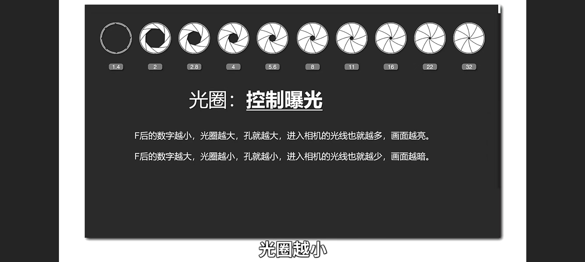
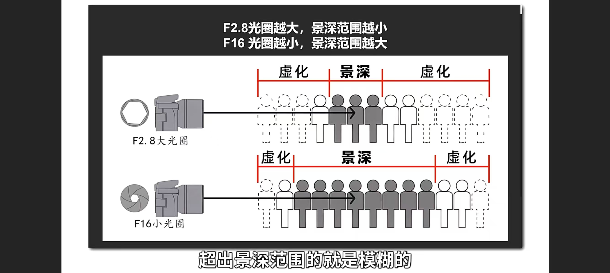
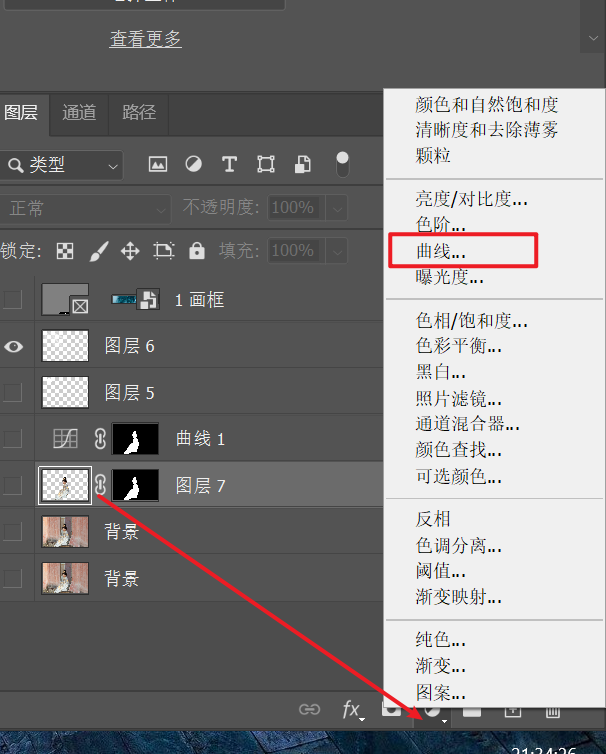
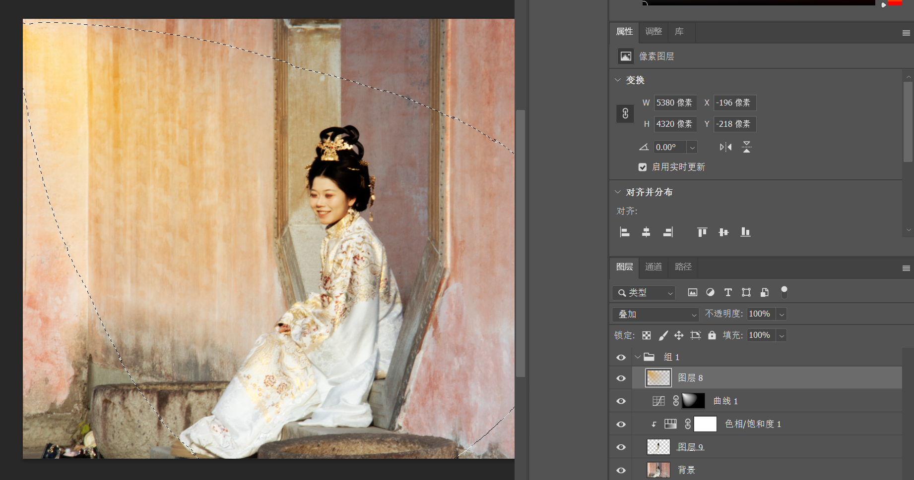
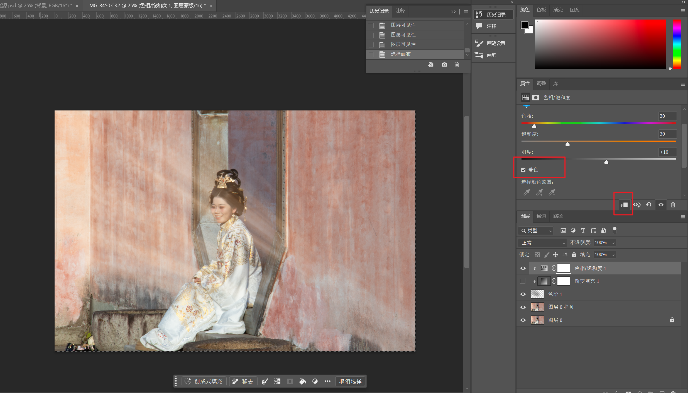

# 约拍

- 地点：景区开放时间，闭园时间，有哪些可以出片的景点
- 聊天话术：
  - 哪个角度好看
  - 拍摄类型
    - 自然/生命力
    - 简约
    - 网感
    - 复古
    - 电影
      - 武侠
- 道具

# 拍照

## 机位

- 仰拍：显高

  容易拍出双下巴

  - 拍侧面抬下巴
  - 拍正面倾斜身体

- 俯拍：轮廓更立体

  容易头大，人矮

  - 广角拍全身
  - 长焦拍半身

- 平拍：更能表现模特情绪

  容易呆板

  - 找前景
  - 拍纵深
  - 摆动作

## 构图

- 点
  - 中心点
  - 三分点
- 线
  - 对称
  - 对角
  - 曲线
  - 引导
- 面
  - 前景
  - 框架
  - 填充：主体占满画面
  - 留白：除去主体，其他都是空白
  - 重复和对比
  - 

## 光圈

大光圈：数字越小，光圈越大，孔洞越大，进入相机的光线越多，画面越亮，虚化越强

## 闪光灯

### 模式

- M手动模式
- ttl自动模式：过亮或者过暗，调整闪光灯曝光补偿

### 打光方式

- 直闪：闪光灯灯头直接打向主体
- 跳闪：灯头打向墙壁，天花板或者反光板，通过反射的光照亮主体

### 使用场景

- 补光：逆光，夜景，主体很暗，室内窗边
  - 用相机控制**背景曝光正常**
  - 使用闪光灯给主体补光
- 压光：背景变暗，突出主体
  - 压低背景（欠曝）  
  - 使用闪光灯给主体补光

## 摄影风格

### 日系

### 复古

### 电影

### 自然/生命力

- 破面：头部和身体不在一致
- 破线
- 找支点，就是找支撑的道具（不是自己带的道具  ）
- 道具

### 简约

# PS

## 知识

位图模式，只有黑白色，每一个像素只包含一位数据。

灰度模式，黑白图像。

rgb，三元色，一个像素有24位数据，每一个元色占8位，每一个元色可以表现出256种浓度的色调

### 格式

- TIFF用于应用程序和计算机平台进行图像数据的交换。

- JPG用于图像预览和超文本

### 蒙版

**“蒙版用来控制图层的显示与隐藏，且不破坏原图。”**

你可以把它理解为一种**“无损橡皮擦”**——擦掉的地方其实只是被隐藏了，随时可以擦回来。

Photoshop（PS）蒙版的核心作用是**非破坏性地隐藏或显示图层部分区域**，以黑白灰灰度图控制透明度（白色显示、黑色隐藏、灰色半透明）。它主要用于图像合成、精细抠图、局部调整和渐变融合，能有效保护原始像素，修改极其灵活，是PS高级编辑的核心技能。

**PS蒙版的主要作用及应用场景：**

- **非破坏性编辑 (No-destructive Editing)**：区别于橡皮擦，蒙版隐藏的图像随时可恢复，不会永久删除图像内容。
- **图像合成与融合**：利用黑色画笔或渐变在蒙版上涂抹，可使两个图层过渡自然，常用于风光摄影曝光合并。
- **精细抠图**：对复杂边缘（如发丝、透明物体）配合画笔进行细致涂抹，实现高质量抠图。
- **局部调整**：配合调整图层（如曲线、色阶），通过蒙版限制调整范围，仅修改图片特定区域
- **创建形状遮罩 (矢量蒙版/剪切蒙版)**：利用路径或形状显示图层内容，实现画框效果

**常用蒙版类型：**

1. **图层蒙版 (Layer Mask)**：直接在图层上创建灰度板。
2. **剪切蒙版 (Clipping Mask)**：以底层形状限制上层内容。
3. **快速蒙版 (Quick Mask)**：临时选区编辑

| 蒙版类型     | 核心原理                                                  | 典型用途                                                     |
| :----------- | :-------------------------------------------------------- | :----------------------------------------------------------- |
| **图层蒙版** | 用灰度控制图层透明度：白=完全显示，黑=完全隐藏，灰=半透明 | 无破坏性抠图、合成、渐变过渡、局部调整                       |
| **剪贴蒙版** | 用下方图层的像素范围限制上方图层的显示区域                | 图案填充文字/形状、局部调色不溢出、相框效果                  |
| **矢量蒙版** | 用路径/形状的矢量边界控制显示区域                         | 需要清晰锐利边缘的抠图、UI 设计、Logo 合成（可无限缩放不失真） |

#### 剪切蒙版

剪切蒙版（Clipping Mask）是Photoshop中一个非常强大且常用的工具，它允许你用一个图层的内容来“剪切”或限制另一个图层的显示范围。简单来说，剪切蒙版可以让上层图层的内容只在下层图层的形状范围内显示，而超出下层图层的部分则会被隐藏。

### 前景色和背景色

Photoshop中的前景色和背景色是两组常用颜色配置。**前景色**主要用于绘图、填充、描边和字体颜色（快捷键 Alt+Delete），是主要绘制颜色；**背景色**主要用于辅助填充、背景擦除、渐变工具默认颜色（快捷键 Ctrl+Delete）。二者配合用于实现快速上色和蒙版操作。

以下是详细作用：

1. 前景色 (Foreground Color) - 上方颜色 

   前景色通常用于主动绘制和填充操作，是用户最常使用的颜色。

   - **绘图工具：** 画笔、铅笔、形状工具、文字工具默认使用前景色。
   - **填充选区：** 使用 `Alt + Delete` (Windows) / `Option + Delete` (Mac) 快速填充前景色。
   - **描边操作：** 对选区进行描边时，默认为前景色。
   - **渐变工具：** 默认的线性或径向渐变通常以“前景色到背景色”开始。 [[1](https://www.zhihu.com/question/526314187), [2](https://m.yutu.cn/question/tiwen_183346.html), [3](https://www.shenyecg.com/Article/618246), [4](https://www.hxsd.tv/wenda/9565/)]

1. 背景色 (Background Color) - 下方颜色

   背景色主要起辅助、底色填充作用。

   - **填充底色：** 使用 `Ctrl + Delete` (Windows) / `Command + Delete` (Mac) 快速填充背景色。
   - **橡皮擦工具：** 在背景图层上使用橡皮擦工具时，擦除的内容会显示为背景色。
   - **渐变工具：** 作为渐变填充的终点颜色。 [[1](https://www.zhihu.com/question/526314187), [2](https://www.hxsd.tv/wenda/9565/), [3](https://m.yutu.cn/question/tiwen_183346.html)]

常用操作快捷键

- **切换前背景色：** 按 `X` 键。

- **恢复默认黑白：** 按 `D` 键（前景黑，背景白）。

- **填充前景色：** `Alt + Delete` (Win) / `Option + Delete` (Mac)。

- **填充背景色：** `Ctrl + Delete` (Win) / `Command + Delete` (Mac)

### 通道

### 锁定图层

锁定图层的作用是**防止误操作**，四种锁定模式：

| 锁定类型 | 图标 | 效果 |
| :------- | :--- | :--- |
|          |      |      |

| **锁定透明像素** | 棋盘格图标   | 只能在已有像素上绘制，透明区域不受影响——给车上描边/涂装不会溢出到车身之外 |
| ---------------- | ------------ | ------------------------------------------------------------ |
| **锁定图像像素** | 画笔图标     | 禁止任何绘制/涂抹/减淡加深，但仍可移动图层                   |
| **锁定位置**     | 十字箭头图标 | 禁止移动图层，但仍可绘制                                     |
| **锁定全部**     | 锁图标       | 上述三项全部锁定，图层完全不可编辑                           |

**实际场景**：抠好车身后锁定透明像素，用画笔给车身加高光时随便涂都不会溢出到车窗和背景，比选区+画笔高效得多。

## 快捷方式

- ctrl alt shift 求交集

### 画笔

| 操作系统    | 快捷键                                                       |
| :---------- | :----------------------------------------------------------- |
| **macOS**   | [ 缩小 / ] 放大，或按住 Control + Option 同时水平拖拽鼠标（Mac 2020 及之后版本） |
| **Windows** | [ 缩小 / ] 放大，或按住 Alt + 右键 同时水平拖拽鼠标          |

按住 Shift 再按 [ / ] 可以调节画笔硬度（边缘软硬程度）。

### **吸管工具取样**

按住 Alt（macOS 是 Option）切换到吸管临时取样颜色。在其他工具（画笔/修复画笔）状态下，Alt 可直接从图像中取样设为前景色。

### 前/后景色

ctrl加delete填充背景色

alt加delete填充前景色 

### 组

选中多个图层生成组 ctrl+g

### 色彩

- 去色 ctrl shift u
- 

### 图层

- ctrl t 自由变换，调整图层位置和大小
- ctrl加j，拷贝，选区转换成图层 
- ctrl e 合并图层
- **如何对空白图层添加的颜色更改** 使用“填充”工具 按快捷键 `Shift + F5`
- 复制图层蒙版到曲线图层中 按住 Alt/Option 键，将蒙版缩略图从一个图层拖到曲线图层上，松开即可复制。
- 反转涂抹的图层蒙版 cmd+i

### 选区

- 图层选区
  - 按住 **Ctrl键 (Mac: Command键)**，同时用鼠标左键单击图层面板中的 **图层缩略图**
- 反选的快捷键是 **Ctrl + Shift + I** (Mac为 **Cmd + Shift + I**)
- 取消选区 ctrl d
- 高光阴影中间调选区
  - 高光通道
    - ctrl + 通道rgb
    - ctrl + alt + 2
  
  - 阴影通道
    - 反选高光
  
  - 中间调通道
    - 选中高光
    - ctrl+shift+alt按住，出现x号的时候
    - 点击阴影通道
  
  - 扩大和缩小选取
    - mac option+command+shift，出现加号和减号
  

### 曲线

在Photoshop中，通过“图层”面板下方的**[“创建新的填充或调整图层”](https://www.3d66.com/answers/question_113496.html)**按钮（圆形图标）选择**[“曲线”](https://jingyan.baidu.com/article/e6c8503cb2e67ae54e1a1866.html)**可新建非破坏性曲线调整图层。通过点击[“曲线”](https://zhuanlan.zhihu.com/p/61873746)图层属性中的对角线、[添加节点并拖动](https://thomaskksj.tuchong.com/t/13162843/)，可灵活调节图像亮度和色彩。

## 工具

### 画笔工具  

密度（羽化）：画笔周边的效果实现程度

压力：调整的强度 

速率：扭曲的快慢

### 吸管

shift加吸管工具等于颜色取样点工具  

#### 在图像中取样以设置白场

在 Photoshop 色阶（Ctrl+L / Cmd+L）或曲线（Ctrl+M / Cmd+M）调整中，使用白场吸管在图像中取样的核心作用是**重新定义"白色"基准，实现一键白平衡校正和色偏修复**。

工作原理

| 操作                                         | 效果                                                         |
| :------------------------------------------- | :----------------------------------------------------------- |
| 用**白场吸管**点击图像中**本应是纯白**的区域 | Photoshop 将该像素的 RGB 值强制映射为纯白（R=255, G=255, B=255），同时按比例重新映射整个图像的色调范围 |
| 用**灰场吸管**点击中性灰区域                 | 消除色偏，让中性灰真正呈现中性（R=G=B）                      |
| 用**黑场吸管**点击本应纯黑的区域             | 将其映射为纯黑（R=G=B=0），拉伸暗部层次                      |
|                                              |                                                              |

典型使用场景

- **校正白平衡**：拍摄时光源偏黄/偏蓝，用白场吸管点击画面中原本为白色的衬衫、纸张、云朵等，整张照片色调自动恢复
- **增强对比度**：同时设置黑场和白场，可最大化图像的动态范围
- **消除色偏**：灰场吸管点击水泥地面、沥青、白墙等中性物体，快速去除整体色偏

## 液化

左边工具栏

- 向前变形：瘦脸
- 重建（橡皮擦）
- 平滑：中和调整前后，防止过度

- 顺时针：眼角角度
- 褶皱：防止走光 ，缩小眼睛/鼻孔
- 膨胀：放大
- 左推：不推荐
- 冻结蒙版：不受其他工具影响
- 解冻蒙版
- 脸部：快捷脸部调整
- 抓手工具：移动图层

右边工具栏

- 固定边缘：对图层边缘向左推，会漏出透明图层
- 人脸识别液化（和脸部工具一样一个是手动，一个是调参数，这个更精确）
  - 复位：其中一张脸进行还原 
  - 全部：全部脸
- 蒙版选项：解决左边工具栏手动涂抹的劣势
  - 选区：对选区的内容和冻结的区域进行取交集和取反
- 视图选项
  - 显示参考线
  - 显示脸部工具的线
- 显示背景：多用于合成图像 
- 画笔重建：类似于重建按钮，只是能控制重建的还原程度

## 案例

### 去掉图层的某块区域

| 方法                | 操作                                                      | 性质           |
| :------------------ | :-------------------------------------------------------- | :------------- |
| **蒙版 + 黑色画笔** | 给图层添加蒙版，选黑色画笔（B），在蒙版上涂抹要去掉的区域 | 非破坏性，最好 |
| **选区 + 蒙版**     | 用套索/钢笔圈出要去掉的区域 → 填充黑色到蒙版              | 非破坏性       |
| **选区 + Delete**   | 框选区域直接按 Delete 键                                  | 破坏性，不推荐 |
|                     |                                                           |                |

蒙版上黑色=隐藏、白色=显示，涂错了按 X 切白色画笔就能恢复。建议始终走蒙版路线。

### 变形

- 自由变换ctrl+t
-  操作变形
- 透视变形

| 功能         | 入口            | 控制方式                                         | 适用场景                                         |
| :----------- | :-------------- | :----------------------------------------------- | :----------------------------------------------- |
| **自由变换** | Ctrl/Cmd + T    | 8 个锚点，缩放/旋转/斜切/扭曲，右键切换子模式    | 日常缩放旋转、基本透视调整                       |
| **透视变形** | 编辑 → 透视变形 | 先绘制四边形网格定义平面，再拖拽角点改变透视关系 | 修正建筑畸变、改变物体观看角度、不同透视平面合成 |
| **操控变形** | 编辑 → 操控变形 | 在物体上打图钉固定关键点，拖拽图钉局部弯曲变形   | 调整人物姿态、弯曲四肢、让直线变曲线             |

**核心区别**：

- **自由变换**：整体变换，所有像素受统一矩阵映射，变形规则、可预测
- **透视变形**：专攻透视关系，改变的是"近大远小"的灭点方向，不是随意拉扯
- **操控变形**：局部自由弯曲，想弯哪里打图钉拖哪里，适合有机形态调整

### 柔焦

添加柔焦效果，以增强照片的唯美氛围。

首先，在图层面板中选择背景图层上的高光区域，通过通道操作（按住Control键并点击RGB通道）来选中这些最亮的部分。然后，复制选区包裹的像素到一个新的图层，并对该图层执行高斯模糊滤镜以达到柔焦效果。通过调节半径滑块控制模糊程度，从而影响发丝轮廓光的亮度和通透感。

要增强通透感，可将复制出来的图层混合模式改为“强光”，这将提升发丝轮廓光的亮度；如果效果不够强烈，可以复制图层并叠加效果。若需减弱整体通透感或对比度，可将混合模式改为“绿色”。对于局部柔焦效果，可以按住Control键选择相关图层后组，并创建蒙版，用黑色画笔涂抹不需要柔焦或需减弱柔焦效果的部分，以达到自然过渡的效果。

### 光源

#### 光 

- 夕阳光的色相 以及饱和度怎么给

  假设你有一张夕阳光的照片，但整体色调偏冷，缺乏温暖感。你可以按照以下步骤进行调整：

  1. 打开“色相/饱和度”调整，将色相值增加到 +20 左右，让颜色偏向橙色和黄色。
  2. 将饱和度值增加到 +30，增强颜色的鲜艳度。
  3. 打开“亮度/对比度”调整，将亮度增加到 +10，对比度增加到 +20。
  4. 使用“曲线”调整，增加红色通道的亮度，进一步强化暖色调。
  5. 添加一个渐变滤镜，从画面上方添加一个从深色到浅色的渐变，模拟夕阳的光线效果。
  6. 最后，添加轻微的颗粒感，让画面更具质感。

#### 添加光源

##### 方式一

首先打开图片，点击“添加曲线”工具，调整高光部分至合适亮度。然后新建图层绘制光束，选择渐变工具，设置颜色为白色到透明，并应用镜像渐变效果。使用自由变换工具调整渐变形状，接着删除下半部分，用矩形选框工具delete填充背景色至黑色。最后，通过点击图层蒙版并恢复默认黑白，再按control+D取消选区，将光束图层混合模式改为叠加效果，完成提升氛围感的处理。接着，利用曲线工具压暗图片的高光部分以达到理想的效果。

##### 方式二

#### 丁达尔

##### 有光

- 高光选区，并新建图层
- 滤镜->径向模糊->数量100->模糊方式改为缩放->中心点移动到左上角后确认

##### 添加丁达尔光效

- 通过新建图层

  - 使用椭圆工具，画个圆，并用白色填充，执行滤镜渲染云彩

  - 创建一个色阶图层，调整两边的滑块往中间挤压
  - control加E合并图层

- 执行滤镜模糊，径向模糊。把数量拉满，模糊方法改为缩放，品质选择最佳。把中心点选择图片的光源位置。

- 更改混合模式为滤色。Control加T自由变换，调整位置与大小。

- 添加色相饱和度图层
  - 着色
  - 剪切蒙版

#### 问题

##### ps添加的丁达尔在人像上太过生硬

- **改变混合模式：** 将制作好的丁达尔光线图层混合模式设置为**“滤色” (Screen)** 或 **“柔光” (Soft Light)**，通常比“线性减淡”或“正常”模式更自然。
- **降低透明度：** 适当降低光线图层的透明度 (Opacity)，让光线隐约透出人像纹理，而非完全覆盖。
- **使用蒙版擦除：** 给光线图层添加白色蒙版，使用低不透明度（如 \(20\%-30\%\)）的黑色画笔，轻轻擦除人物脸上、身上过亮的部分，确保光线主要在背景和人物边缘，而不是死死地贴在人物脸上。 [[1](https://jingyan.baidu.com/article/b907e627860a8607e6891c63.html), [2](https://www.bilibili.com/read/cv1295063/), [3](https://www.16xx8.com/photoshop/jiaocheng/2017/145491_all.html)]
- 添加灰层

### 磨皮