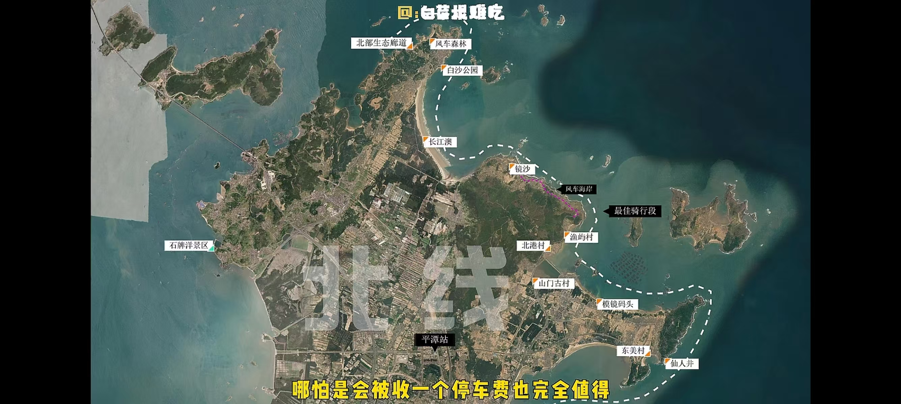
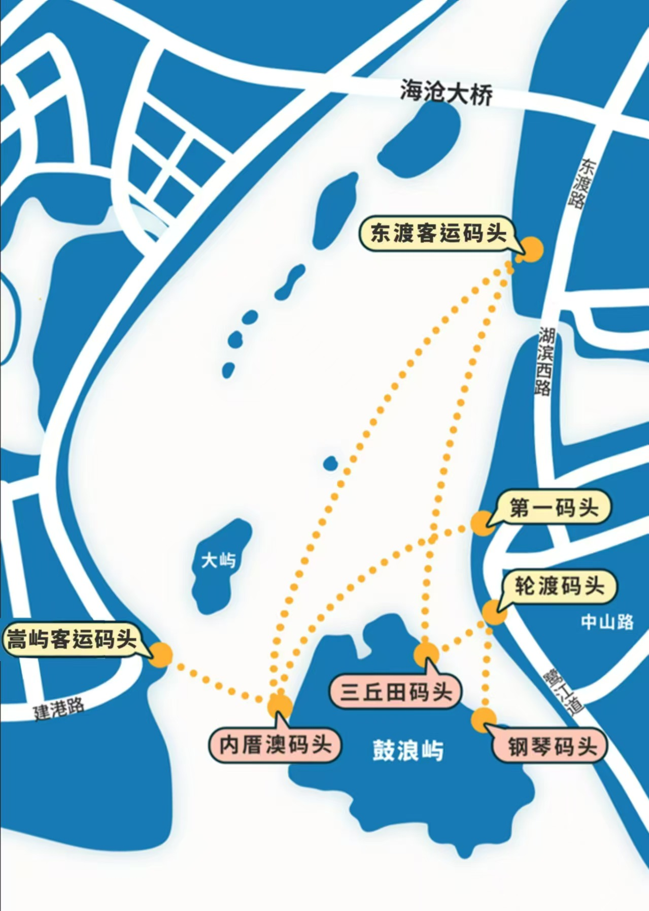

# 福建

## day1：平潭岛

### 住宿

龙王头

### 交通

交通指南：县城住，福州南站乘高铁 1 小时到平潭站，打车 30 元到县城。租电动车 80 元 / 天（推荐续航 100 公里以上的车型）。

### 白天

龙王头沙滩 - 》东美村-》仙人景-》北港村（**吃饭，靠海边**）-》风车海岸-》镜沙（游艇）-》长江澳（跳过）-》生态廊道（风车田 + 玻璃栈道）

回走：长江澳（落日）

### 日落：龙王头沙滩

龙王头沙滩的烤鱿鱼须现烤现撒辣粉，10 元 3 串。

### 晚上：长江澳沙滩 （蓝眼泪）

游玩路线：4-6 月追蓝眼泪首选长江澳沙滩（20:00 后南风天易出现）

### 美食

县城的时来运转（咸米糕）要配虾油吃，推荐老船长餐厅；

渔厝海鲜大排档

沙茶锅

## 福州

### 三坊七巷（福州）

交通指南：地铁 1 号线东街口站 A 口出，步行 5 分钟到南后街入口。自驾停东百中心地下停车场（15 元 / 小时）。

游玩路线：从南后街主街进入，先吃同利肉燕（81 号老店，现包现煮），左转进文儒坊看林则徐出生地，右转到衣锦坊水榭戏台（10:00/15:00 有闽剧表演），傍晚在光禄坊看灯笼亮起。

隐藏玩法：郎官巷的二梅书屋藏着福州最早的图书馆，后院天井拍古风绝佳；叶家花生汤加芋泥的 “甜双拼” 是本地人吃法。

### 烟台山

### 西禅古寺

### 鼓山

## 莆田

### 湄洲岛（莆田）

交通指南：莆田站乘 363 路公交到文甲码头（50 分钟，5 元），再乘船 15 分钟到湄洲岛，船票 + 上岛费 95 元。岛上租电动车 60 元 / 天，码头出口就有租赁点。

游玩路线：上午妈祖祖庙（从天后广场登顶，看 14 米高妈祖像），午后骑电动车 15 分钟到黄金沙滩（带帐篷可免费露营），傍晚去鹅尾神石园看海蚀地貌。

海鲜攻略：码头旁阿明大排档的椒盐皮皮虾要选母虾（腹部有籽），推荐搭配本地青岛啤酒，人均 80 元能吃撑。

## 厦门

### 住宿

中山路附近

### 厦门园林植物园

提前一天“厦门旅游集散中心”公众
号预约可以免门票30/人（推荐多肉区热带雨林区
ps:14:30-16:30）进去后可以买票坐公交不要头铁走
路注意驱蚊措施

### 钟鼓索道 

钟鼓索道70/人（40分钟来回）17:30下班

### 鼓浪屿

交通指南：从厦门东渡邮轮中心厦鼓码头乘船，推荐早 8:00 前的航班（7:10/7:30 班次）直达三丘田码头，航程 20 分钟，旺季需提前 3 天在 “厦门轮渡” 公众号购票，单程 35 元。返程末班船 21:40，错过需从嵩屿码头返程。

1.鼓浪屿 一整天 (最美转角,晴天墙,日光岩等)“厦门轮渡+”公众号**提前**买船票 35/人(往返)厦门邮轮中心-厦鼓码头(住宿过去40分钟左右)->三丘田码头

游玩路线：下船后沿龙头路步行街直行 10 分钟到日光岩（建议 8:30 前登顶避人流），俯瞰全岛红屋顶后，步行 15 分钟到菽庄花园（海藏钢琴馆必看），午后逛漳州路老别墅群，16:00 后去皓月园看日落。

隐藏贴士：林记鱼丸在泉州路 54 号，推荐加沙茶酱 + 辣油的双拼吃法；傍晚从笔山路小巷穿行，能拍到无人的鼓浪屿全景。

### 厦门大学

1.逛逛厦门大学(住宿过去 25分钟左右)，公众号预约，提前3天

2.白城沙滩 (就在厦大外面)

3.环岛路骑行 白城沙滩 ->-国两制沙滩 ps:9km 半天(约3小时)途径 音乐广场、曾厝垵、黄厝沙滩等

4.沙坡尾（骑行结束公交或打车50分钟）ps:相当于沿骑行路线返回又回到住宿附近

5.演武大桥观景平台ps:沙坡尾附近

### 集美学村

一号线 中山公园 ->集美学村(**其中高崎至集美学村为海上地铁**)3.十里长提（日落）4.石鼓路夜市

### 南普陀寺

### 美食

- 乌糖沙茶面
- 四里沙茶面
- 大中
- 草莓夫妇
- 思明西路步行街美食推荐（阿雅四果汤，林记老思
  西鸡蛋汉堡）

## 南平

武夷山（南平）

交通指南：高铁至南平市站后，换乘 K1 路公交（首班 8:20，末班 23:00），9 站到 “景区南入口”，车程 40 分钟，票价 10 元。

景区内必购观光车通票（1 日 90 元），所有景点需乘接驳车抵达。

游玩路线：Day1 上午乘观光车到九曲溪竹筏码头（提前 3 天在 “武夷山旅游” 公众号订 7:30 早班筏），漂流 1.5 小时后直奔武夷宫；

下午登天游峰（全程 2 小时，半山亭休息点有免费茶水）。Day2 上午走大红袍景区徒步道（看 600 年母树），下午乘观光车到水帘洞。

实用贴士：竹筏小费可给 20 元 / 筏，筏工会讲解并停在最佳拍照点；三姑街的岚谷熏鹅选现切现拌款，配武夷岩茶解辣。

永定土楼（龙岩）

交通指南：厦门枋湖客运中心每天 7:30-17:30 每小时一班大巴直达永定湖坑镇，票价 65 元，车程 3 小时。到湖坑后打车 10 元到承启楼。

游玩路线：承启楼登楼参观四环结构（建议请本地导游 20 元，讲家族故事），步行 10 分钟到世泽楼看 “一门两帝师” 匾额，午后去振成楼看中西合璧的圆形天井。

美食推荐：土楼内客家阿婆卖的酿豆腐（5 元 / 块），用山茶油煎制，配糙米饭绝佳；晚上可体验土楼民宿的客家宴，推荐酒糟焖肉。

